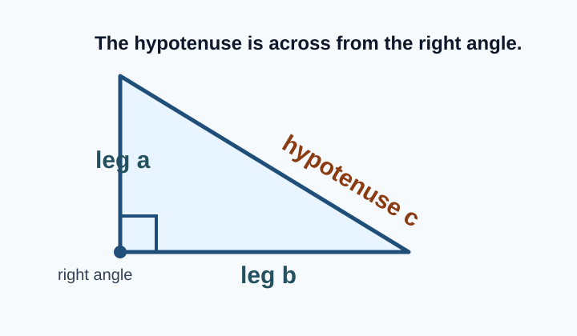
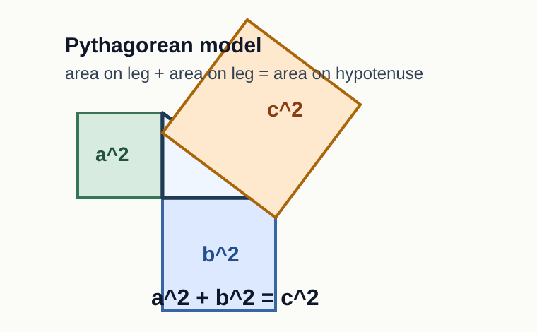
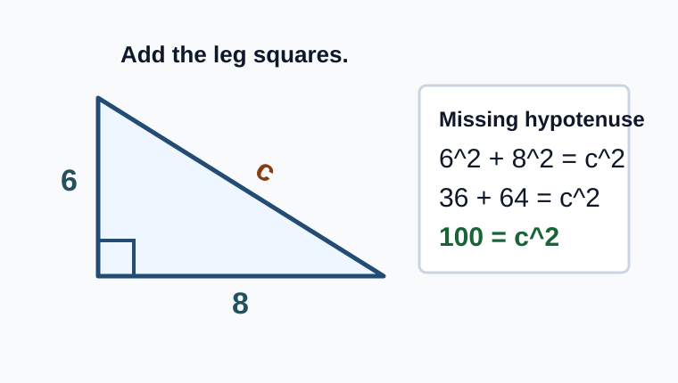
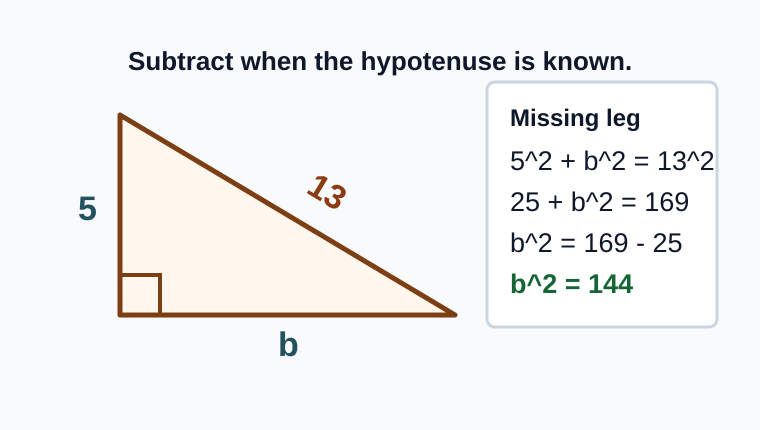
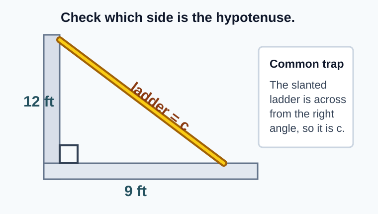

# Geometry - Lesson 7: Pythagorean Theorem

> [!GOAL]
> Find missing sides of right triangles by setting up the squared-side equation first. The main target is knowing when to add squares and when to subtract squares.

## Study Roadmap

| Step | Skill | What to check |
|---|---|---|
| 1 | Identify the triangle | Confirm the triangle has a right angle |
| 2 | Label the sides | Find the legs and the hypotenuse |
| 3 | Set up the equation | Use `a^2 + b^2 = c^2` |
| 4 | Choose the operation | Add for a missing hypotenuse, subtract for a missing leg |
| 5 | Solve and interpret | Take the square root and use the correct unit |

## Warm-Up: Squares and Square Roots

Answer these before reading the examples.

1. What is `6^2`?
2. What is `10^2`?
3. What number has square `81`?
4. What number has square `144`?

Answers: `36`, `100`, `9`, and `12`.

## Right Triangle Parts

A right triangle has one `90 degree` angle.

- The two sides that meet at the right angle are the `legs`.
- The side across from the right angle is the `hypotenuse`.
- The hypotenuse is always the longest side.
- In the Pythagorean Theorem, the hypotenuse is represented by `c`.

> [!IMPORTANT]
> Do not label the longest-looking side as `c` until you check that it is across from the right angle. The hypotenuse is defined by its position, not by how the diagram is rotated.

## The Pythagorean Theorem

For any right triangle:

`a^2 + b^2 = c^2`

where:

- `a` and `b` are the legs
- `c` is the hypotenuse
- `a^2`, `b^2`, and `c^2` mean squares built on the side lengths

The theorem compares squared side lengths first. After setting up the equation, use a square root to return to a side length.

> [!TIP]
> The theorem does not say `a + b = c`. It says the squares of the legs add to the square of the hypotenuse.

## Worked Example 1: Missing Hypotenuse

A right triangle has legs `6 cm` and `8 cm`. Find the hypotenuse.

Step 1: Write the theorem.

`a^2 + b^2 = c^2`

Step 2: Substitute the legs.

`6^2 + 8^2 = c^2`

Step 3: Square the known sides.

`36 + 64 = c^2`

Step 4: Add.

`100 = c^2`

Step 5: Take the square root.

`c = 10`

The hypotenuse is `10 cm`.

> [!CHECK]
> When the missing side is the hypotenuse, the setup has the two known squares added together.

## Worked Example 2: Missing Leg

A right triangle has hypotenuse `13 m` and one leg `5 m`. Find the missing leg.

Step 1: Write the theorem.

`a^2 + b^2 = c^2`

Step 2: Put the hypotenuse in the `c` position.

`5^2 + b^2 = 13^2`

Step 3: Square the known sides.

`25 + b^2 = 169`

Step 4: Subtract the known leg square.

`b^2 = 169 - 25`

`b^2 = 144`

Step 5: Take the square root.

`b = 12`

The missing leg is `12 m`.

> [!WARNING]
> If the hypotenuse is already known, do not add the two numbers you see. One leg square must be subtracted from the hypotenuse square.

## Word Problems: Decide What Is Missing

A ladder leans against a wall. The base is `9 ft` from the wall, and the top reaches `12 ft` up the wall. How long is the ladder?

The wall and ground form the legs. The ladder is across from the right angle, so it is the hypotenuse.

Setup:

`9^2 + 12^2 = c^2`

`81 + 144 = c^2`

`225 = c^2`

`c = 15`

The ladder is `15 ft` long.

> [!TIP]
> In ladder, ramp, and diagonal-path problems, the slanted object is often the hypotenuse. Still check the right angle before deciding.

## Setup Patterns

| Missing side | Equation pattern | First operation |
|---|---|---|
| Hypotenuse | `leg^2 + leg^2 = c^2` | Add the two squares |
| Leg | `leg^2 + missing^2 = hypotenuse^2` | Subtract the known leg square |

Use this question before solving: "Is the missing side across from the right angle?"

- If yes, find the hypotenuse by adding squares.
- If no, find a leg by subtracting squares.

## Guided Practice

Try each item before checking the answers.

1. Legs are `3` and `4`. Set up the equation and find `c`.
2. Legs are `5` and `12`. Set up the equation and find `c`.
3. Hypotenuse is `10`, and one leg is `6`. Set up the equation and find the missing leg.
4. Hypotenuse is `17`, and one leg is `8`. Set up the equation and find the missing leg.
5. A ramp rises `7 ft` over a horizontal run of `24 ft`. Is the ramp a leg or the hypotenuse?

Answers:

1. `3^2 + 4^2 = c^2`, so `c = 5`
2. `5^2 + 12^2 = c^2`, so `c = 13`
3. `6^2 + b^2 = 10^2`, so `b = 8`
4. `8^2 + b^2 = 17^2`, so `b = 15`
5. The ramp is the hypotenuse because it is the slanted side across from the right angle.

## Problem-Solving Routine

Use this routine for every Pythagorean Theorem problem:

1. Confirm the triangle is a right triangle.
2. Locate the right angle.
3. Label the hypotenuse as `c`.
4. Put the two legs in the `a` and `b` positions.
5. Write the squared-side equation before calculating.
6. Add squares if `c` is missing.
7. Subtract squares if a leg is missing.
8. Take the square root and include units.

## Final Checklist

Before taking the practice exam, make sure you can:

- identify the hypotenuse in any right triangle orientation
- write `a^2 + b^2 = c^2`
- set up a missing hypotenuse equation
- set up a missing leg equation
- explain why a known hypotenuse belongs alone on one side of the equation
- take the square root after finding the missing side's square

> [!PRACTICE]
> Use the practice exam for quick setup checks. Use the assessment when you can decide independently whether a problem needs a missing hypotenuse setup or a missing leg setup.
