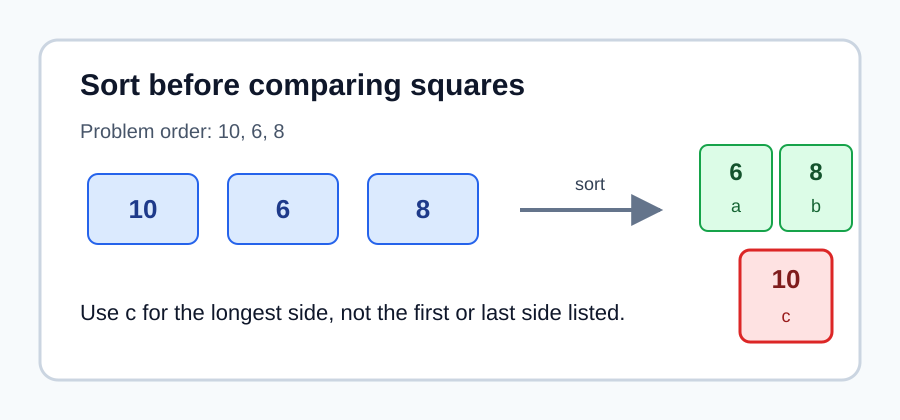
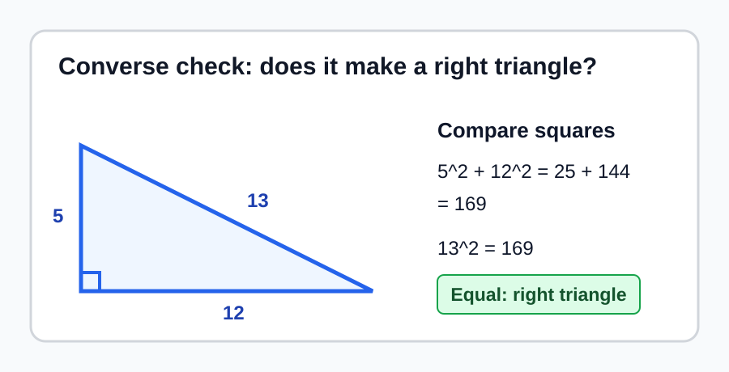
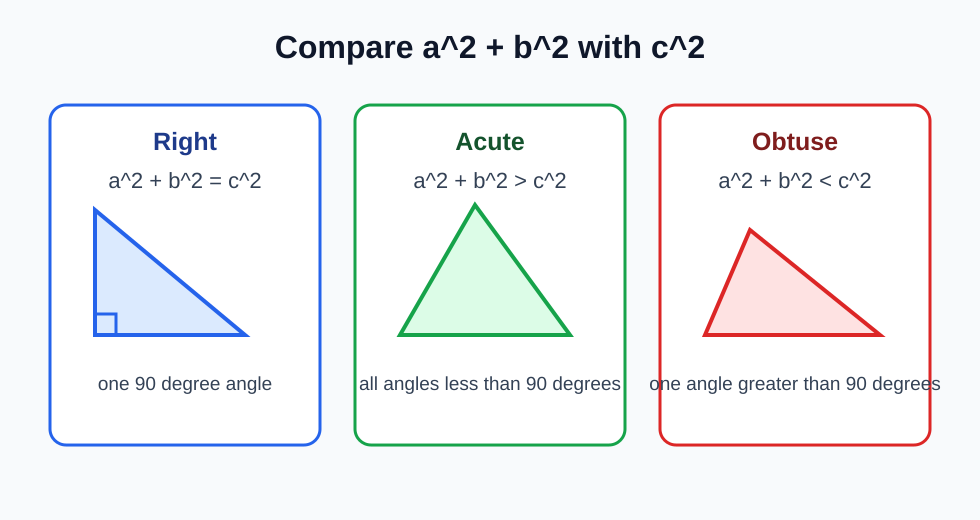
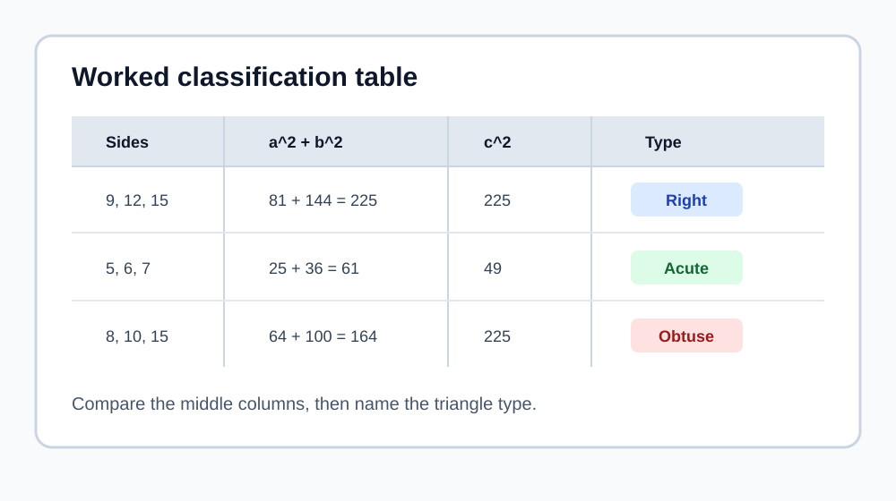
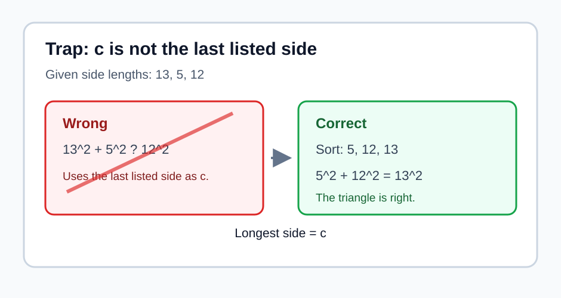

# Geometry - Lesson 8: Converse of Pythagorean Theorem

> [!GOAL]
> Classify a triangle using its side lengths. Decide whether it is right, acute, or obtuse when the side lengths form a triangle.

## Study Roadmap

| Step | Skill | What to check |
|---|---|---|
| 1 | Sort the sides | Put the three side lengths from least to greatest |
| 2 | Name the longest side | Call the longest side `c` |
| 3 | Square and compare | Compare `a^2 + b^2` with `c^2` |
| 4 | Classify | Right, acute, or obtuse |
| 5 | Check reasonableness | Make sure the side lengths can form a triangle |

## Warm-Up: Quick Recall

Answer these before reading the examples.

1. What is `6^2`?
2. What is `10^2`?
3. Which side is longest in `8, 15, 17`?
4. For a triangle with sides `3, 4, 8`, does `3 + 4` exceed `8`?

Answers: `36`, `100`, `17`, and no. Since `3 + 4` is not greater than `8`, those lengths do not form a triangle.

## First Move: Sort the Side Lengths

For triangle classification, always sort the side lengths first.

If the sides are `10, 6, 8`, rewrite them as:

`6, 8, 10`

Then label:

- `a = 6`
- `b = 8`
- `c = 10`

The letter `c` is not chosen by position in the problem. It is always the longest side.

> [!IMPORTANT]
> The classification test only works when `c` is the longest side. Sort first, then compare.

## The Converse of the Pythagorean Theorem

The Pythagorean Theorem says that a right triangle has:

`a^2 + b^2 = c^2`

The converse turns that statement around:

If three side lengths of a triangle satisfy `a^2 + b^2 = c^2`, then the triangle is a right triangle.

Example:

Sides: `5, 12, 13`

`a^2 + b^2 = 5^2 + 12^2 = 25 + 144 = 169`

`c^2 = 13^2 = 169`

Since the two values are equal, the triangle is right.

## Classifying Right, Acute, and Obtuse Triangles

After sorting the sides and identifying `c`, compare `a^2 + b^2` with `c^2`.

| Comparison | Triangle type | Meaning |
|---|---|---|
| `a^2 + b^2 = c^2` | Right | The triangle has one `90 degree` angle |
| `a^2 + b^2 > c^2` | Acute | All angles are less than `90 degrees` |
| `a^2 + b^2 < c^2` | Obtuse | One angle is greater than `90 degrees` |

> [!TIP]
> A larger `c^2` means the longest side is stretching the triangle open. That creates an obtuse triangle.

## Worked Example 1: Right Triangle

Classify a triangle with side lengths `7, 24, 25`.

Step 1: Sort the sides.

They are already sorted: `7, 24, 25`.

Step 2: Identify `c`.

`c = 25`

Step 3: Compare.

`a^2 + b^2 = 7^2 + 24^2 = 49 + 576 = 625`

`c^2 = 25^2 = 625`

Step 4: Classify.

Since `a^2 + b^2 = c^2`, the triangle is right.

## Worked Example 2: Acute Triangle

Classify a triangle with side lengths `6, 7, 8`.

`a = 6`, `b = 7`, and `c = 8`

`a^2 + b^2 = 6^2 + 7^2 = 36 + 49 = 85`

`c^2 = 8^2 = 64`

Since `85 > 64`, the triangle is acute.

## Worked Example 3: Obtuse Triangle

Classify a triangle with side lengths `4, 6, 9`.

`a = 4`, `b = 6`, and `c = 9`

`a^2 + b^2 = 4^2 + 6^2 = 16 + 36 = 52`

`c^2 = 9^2 = 81`

Since `52 < 81`, the triangle is obtuse.

## Worked Classification Table

Use a table when several problems appear together.

| Side lengths | Sorted | Compare | Classification |
|---|---|---|---|
| `9, 12, 15` | `9, 12, 15` | `81 + 144 = 225`, and `15^2 = 225` | Right |
| `5, 6, 7` | `5, 6, 7` | `25 + 36 = 61`, and `7^2 = 49` | Acute |
| `8, 10, 15` | `8, 10, 15` | `64 + 100 = 164`, and `15^2 = 225` | Obtuse |

## Common Trap: The Longest Side Is c

Suppose the side lengths are listed as `13, 5, 12`.

Wrong setup:

`13^2 + 5^2 = 12^2`

Correct setup:

Sort first: `5, 12, 13`

Then compare:

`5^2 + 12^2 = 13^2`

The triangle is right.

> [!WARNING]
> Do not let the order in the problem choose `c`. The longest side chooses `c`.

## Do the Lengths Form a Triangle?

Before classifying, the two shorter sides must add to more than the longest side.

Example: `3, 4, 8`

`3 + 4 = 7`

Since `7` is not greater than `8`, these lengths do not form a triangle. Do not classify it as right, acute, or obtuse.

> [!CHECK]
> If `a + b <= c`, stop. The side lengths do not form a triangle.

## Guided Practice

Classify each set as right, acute, obtuse, or not a triangle.

1. `8, 15, 17`
2. `4, 5, 6`
3. `5, 7, 11`
4. `10, 6, 8`
5. `2, 3, 6`

Answers:

1. Right, because `8^2 + 15^2 = 17^2`
2. Acute, because `4^2 + 5^2 > 6^2`
3. Obtuse, because `5^2 + 7^2 < 11^2`
4. Right, after sorting as `6, 8, 10`
5. Not a triangle, because `2 + 3` is not greater than `6`

## Problem-Solving Routine

Use this routine for every side-length classification problem:

1. Sort the three side lengths from least to greatest.
2. Check whether the two shorter sides add to more than the longest side.
3. Label the shorter sides `a` and `b`, and the longest side `c`.
4. Find `a^2 + b^2`.
5. Find `c^2`.
6. Compare the two values.
7. Write right, acute, obtuse, or not a triangle.

## Final Checklist

Before taking the practice exam, make sure you can:

- identify the longest side as `c`
- compare `a^2 + b^2` with `c^2`
- recognize right triangles when the values are equal
- recognize acute triangles when `a^2 + b^2` is greater than `c^2`
- recognize obtuse triangles when `a^2 + b^2` is less than `c^2`
- stop when side lengths do not form a triangle

> [!PRACTICE]
> Use the practice exam for quick classification checks. Use the assessment when you can sort side lengths, compare squares, and explain the classification without relying on the order of the numbers in the question.
