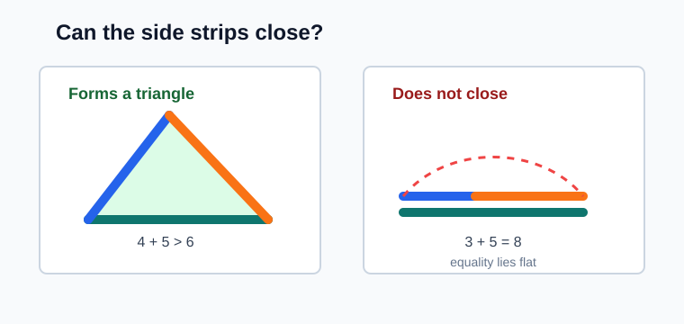
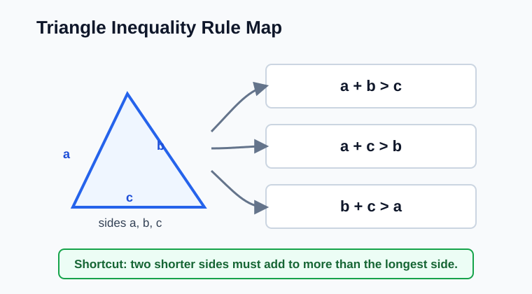
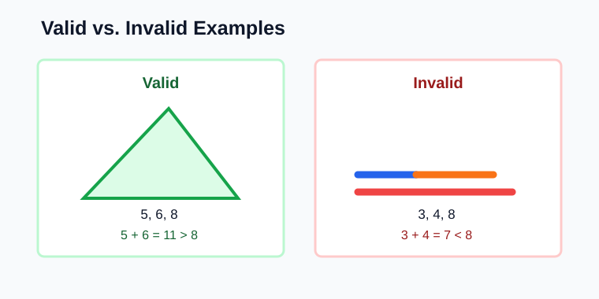
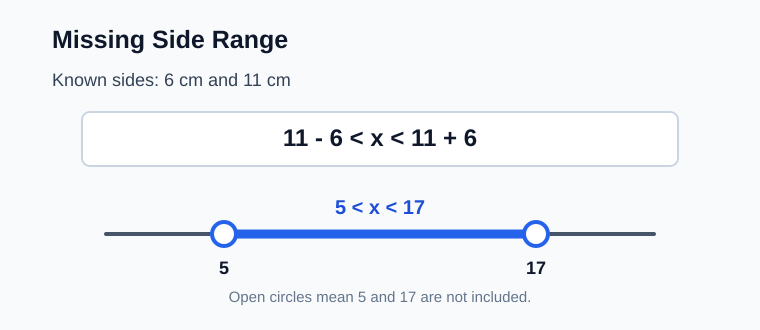
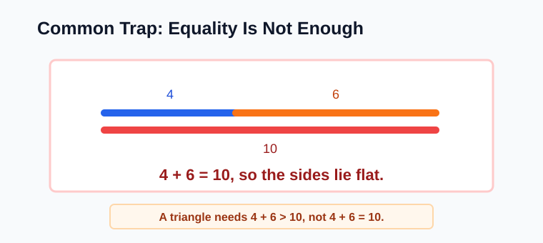

# Geometry - Lesson 9: Triangle Inequality

> [!GOAL]
> Determine whether side lengths form a triangle. Then find all possible values for a missing side length.

## Study Roadmap

| Step | Skill | What to check |
|---|---|---|
| 1 | Test three sides | The two shorter sides must add to more than the longest side |
| 2 | Avoid equality traps | If the sum equals the longest side, the strips lie flat and do not close |
| 3 | Find a missing side range | Use `difference < missing side < sum` |
| 4 | Write the answer | Use strict inequalities because endpoints are not included |

## Warm-Up: Can the Strips Close?

Before using a formula, think about three strips of fixed lengths. They form a triangle only if the shorter strips are long enough to meet above the longest strip.

Quick check:

1. Could lengths `4`, `5`, and `6` close into a triangle?
2. Could lengths `2`, `3`, and `5` close into a triangle?
3. What goes wrong if the two shorter lengths add exactly to the longest length?

Answers: yes; no; the sides lie in a straight line instead of forming a closed triangle.

## The Triangle Inequality Rule

For three side lengths `a`, `b`, and `c`, a triangle forms only when each pair of sides adds to more than the third side:

- `a + b > c`
- `a + c > b`
- `b + c > a`

When all side lengths are positive, a faster check is:

> Add the two shorter sides. The sum must be greater than the longest side.

> [!IMPORTANT]
> The word greater matters. If the sum is equal to the longest side, the figure is not a triangle.

## Worked Example 1: Decide if the Sides Work

Do side lengths `7 cm`, `10 cm`, and `12 cm` form a triangle?

Step 1: Identify the longest side.

Longest side: `12 cm`

Step 2: Add the two shorter sides.

`7 + 10 = 17`

Step 3: Compare.

`17 > 12`

Yes. The lengths `7 cm`, `10 cm`, and `12 cm` can form a triangle.

## Worked Example 2: A Set That Fails

Do side lengths `3 m`, `4 m`, and `8 m` form a triangle?

Longest side: `8 m`

Add the two shorter sides:

`3 + 4 = 7`

Compare:

`7 < 8`

No. The two shorter sides are not long enough to reach each other, so the lengths cannot form a triangle.

> [!TIP]
> If the two shorter sides fail the longest-side test, you do not need to check the other two sums.

## Missing Side Range

Suppose two sides are known and the missing side is `x`.

If the known sides are `a` and `b`, then:

`|a - b| < x < a + b`

This means:

- The missing side must be greater than the difference of the two known sides.
- The missing side must be less than the sum of the two known sides.
- The endpoints are not included.

## Worked Example 3: Find the Range

Two sides of a triangle are `6 cm` and `11 cm`. What are the possible lengths of the third side, `x`?

Step 1: Find the difference.

`11 - 6 = 5`

Step 2: Find the sum.

`11 + 6 = 17`

Step 3: Write the strict range.

`5 < x < 17`

The third side must be greater than `5 cm` and less than `17 cm`.

> [!CHECK]
> Test a value inside the range. If `x = 10`, then the sides are `6`, `10`, and `11`. Since `6 + 10 > 11`, the triangle can close.

## Common Trap: Equality Is Not Enough

Do side lengths `4`, `6`, and `10` form a triangle?

The two shorter sides add to:

`4 + 6 = 10`

This equals the longest side. It is not greater than the longest side.

So `4`, `6`, and `10` do not form a triangle. They make a straight line.

> [!WARNING]
> The endpoints in a missing-side range are always excluded. For sides `4` and `6`, the third side must satisfy `2 < x < 10`, not `2 <= x <= 10`.

## Worked Example 4: Integer Side Lengths

Two sides are `8 in` and `13 in`. The third side is a whole number `x`. What values are possible?

Difference:

`13 - 8 = 5`

Sum:

`13 + 8 = 21`

Range:

`5 < x < 21`

Whole-number values:

`6, 7, 8, 9, 10, 11, 12, 13, 14, 15, 16, 17, 18, 19, 20`

## Guided Practice

Try each item before checking the answers.

1. Can `5`, `7`, and `9` form a triangle?
2. Can `2`, `8`, and `10` form a triangle?
3. Two sides are `9` and `14`. Write the range for the third side `x`.
4. Two sides are `3.5` and `6`. Write the range for the third side `x`.
5. Two sides are `10` and `12`. If `x` is a whole number, what is the smallest possible value of `x`?

Answers:

1. Yes, because `5 + 7 = 12`, and `12 > 9`.
2. No, because `2 + 8 = 10`, and equality is not enough.
3. `5 < x < 23`
4. `2.5 < x < 9.5`
5. `3`, because the range is `2 < x < 22`.

## Problem-Solving Routine

Use this routine for triangle inequality problems:

1. Order the side lengths from least to greatest when all three are known.
2. Add the two shorter sides.
3. Compare the sum with the longest side.
4. If the sum is greater, the sides form a triangle.
5. If the sum is equal to or less than the longest side, the sides do not form a triangle.
6. For a missing side, subtract the known sides for the lower limit and add them for the upper limit.
7. Use strict inequality symbols: `<`, not `<=`.

## Final Checklist

Before taking the practice exam, make sure you can:

- use the longest-side shortcut for three known side lengths
- explain why equality does not make a triangle
- find the missing-side range using `difference < x < sum`
- identify open endpoints on a number line
- list possible whole-number values inside a range

> [!PRACTICE]
> Use the practice exam for a quick skill check. Use the assessment when you can test side lengths and find missing-side ranges without including the endpoints.
