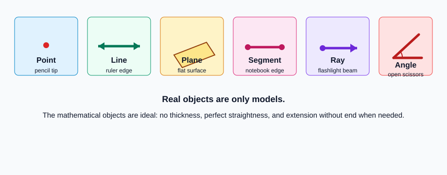
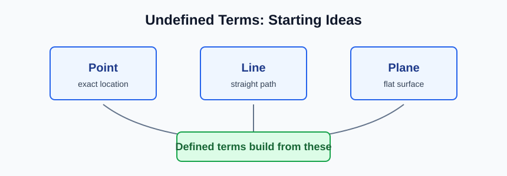
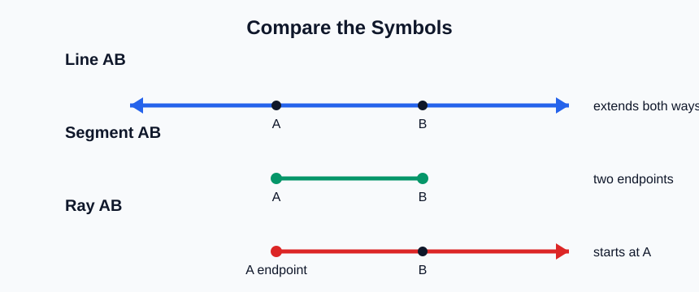
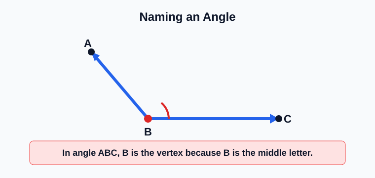
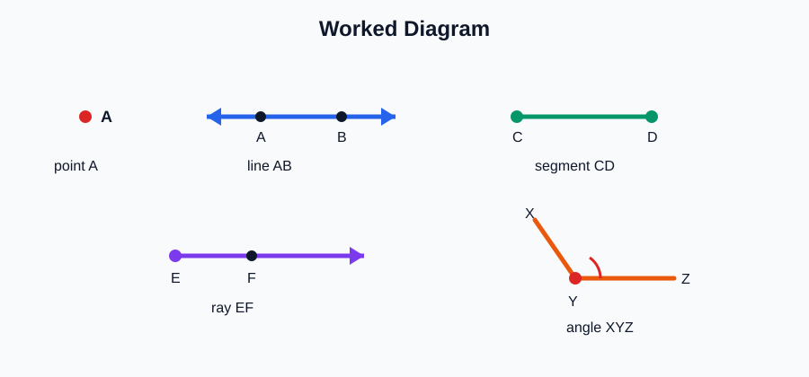
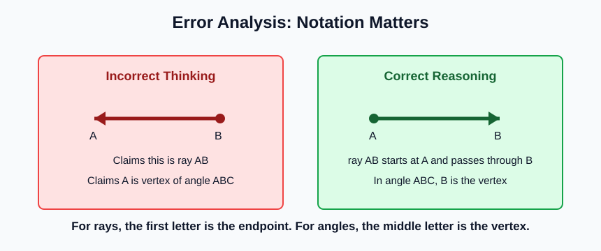

# Geometry - Lesson 1: Undefined and Defined Terms

> [!GOAL] Learning Goal
>
> By the end of this lesson, you should be able to model and name **points, lines, planes, rays, segments, and angles** using accurate geometric notation.

**Content domain:** Measurement and Geometry  
**Estimated time:** 45 minutes  
**Difficulty:** Beginner  
**Target competency:** Model points, lines, planes, rays, segments, and angles.

---

## What You Should Already Know

Geometry begins with a few simple ideas that are easier to see than to formally define.

Before reading, check that you can:

- label a dot with a capital letter
- recognize a straight path
- tell the difference between a flat surface and a curved surface
- read symbols such as $AB$, $\angle ABC$, and $90^\circ$

> [!CHECK] Pre-Check
>
> Answer these quickly in your notebook.
>
> 1. What letter could you use to name a point?
> 2. Which object better models a straight line: a ruler edge or a ball?
> 3. What do you call the corner made by two rays with the same endpoint?
>
> If question 3 feels unfamiliar, slow down in the angle section. That is the main new idea for many students.

## Try Before You Read

Look around your study area. Find one object that could model each idea.

| Geometry idea | Possible real-life model |
| --- | --- |
| Point | Tip of a pencil |
| Line | Straight edge of a ruler, extended in both directions in your imagination |
| Plane | Flat tabletop or sheet of paper |
| Segment | One measured edge of a notebook |
| Ray | A flashlight beam starting at the bulb and going outward |
| Angle | Open scissors, a clock hand opening, or two roads meeting |

> [!TIP] Thinking Guide
>
> A model is not perfect. A pencil tip has size, but a geometric point has no size. A tabletop has edges, but a geometric plane extends without end. Models help you picture the idea.

---

## Key Vocabulary

| Term | Meaning | How to picture it |
| --- | --- | --- |
| Point | An exact location with no size | A labeled dot, such as point $A$ |
| Line | A straight path with no thickness that extends forever in both directions | Arrows on both ends |
| Plane | A flat surface with no thickness that extends forever | A sheet of paper extended in every direction |
| Segment | Part of a line with two endpoints | $\overline{AB}$ |
| Ray | Part of a line with one endpoint and one direction | $\overrightarrow{AB}$ starts at $A$ and passes through $B$ |
| Angle | Two rays with a common endpoint | $\angle ABC$, where $B$ is the vertex |

## Visual Introduction

The first three ideas are called **undefined terms**: point, line, and plane. They are the starting ideas of geometry. We describe them with models instead of building formal definitions from earlier terms.

The next ideas are **defined terms** because we can build them from points and lines.

- A **segment** is part of a line with two endpoints.
- A **ray** is part of a line with one endpoint and one direction.
- An **angle** is formed by two rays with the same endpoint.

> [!IMPORTANT] Core Distinction
>
> Undefined terms are the starting objects: **point, line, plane**.  
> Defined terms are built from those starting objects: **segment, ray, angle**.

---

## Main Concept Explanation

### 1. Points

A **point** names an exact location. It has no length, width, or height.

Write a point with a capital letter:

- point $A$
- point $B$
- point $P$

In a diagram, the dot helps your eyes find the location. The letter is the name.

### 2. Lines

A **line** is straight and extends forever in both directions. A drawn line segment on paper only models the line. Arrows show that the line continues.

You can name a line using two points on it:

- line $AB$
- $\overleftrightarrow{AB}$

The order does not matter for a line: $\overleftrightarrow{AB}$ and $\overleftrightarrow{BA}$ name the same line.

### 3. Planes

A **plane** is a flat surface that extends forever in all directions. A sheet of paper, whiteboard, or tabletop can model a plane.

Planes are often named by one capital script letter, such as plane $M$, or by three non-collinear points, such as plane $ABC$.

> [!WARNING] Common Plane Trap
>
> Three points name a plane only when they are **not all on the same line**. Points on one straight line are called collinear.

### 4. Segments and Rays

A **segment** has two endpoints. It is measurable.

Example: $\overline{AB}$ starts at $A$ and ends at $B$.

A **ray** has one endpoint and continues forever in one direction.

Example: $\overrightarrow{AB}$ starts at $A$ and goes through $B$. The order matters. $\overrightarrow{AB}$ and $\overrightarrow{BA}$ usually point in opposite directions.

### 5. Angles

An **angle** is formed by two rays with the same endpoint. The common endpoint is the **vertex**.

For $\angle ABC$, point $B$ is the vertex. The middle letter names the vertex.

> [!IMPORTANT] Angle Naming Rule
>
> In a three-letter angle name, the **vertex must be the middle letter**.
>
> $\angle ABC$ means the rays are $\overrightarrow{BA}$ and $\overrightarrow{BC}$.

---

## Rule Box / Notation Box

| Object | Notation | What the notation means |
| --- | --- | --- |
| Point | $A$ | exact location named $A$ |
| Line | $\overleftrightarrow{AB}$ | line through $A$ and $B$, extending both ways |
| Segment | $\overline{AB}$ | part of a line from $A$ to $B$ |
| Ray | $\overrightarrow{AB}$ | ray that starts at $A$ and passes through $B$ |
| Angle | $\angle ABC$ | angle with vertex $B$ |

## Worked Example

In the diagram:

1. Point $A$ is an exact location.
2. $\overleftrightarrow{AB}$ names the full line through $A$ and $B$.
3. $\overline{CD}$ names the segment with endpoints $C$ and $D$.
4. $\overrightarrow{EF}$ names a ray that starts at $E$ and passes through $F$.
5. $\angle XYZ$ names the angle with vertex $Y$.

> [!CHECK] Check Your Reasoning
>
> Why is $\overrightarrow{EF}$ not the same as $\overrightarrow{FE}$?
>
> Reveal after thinking: the first letter names the endpoint. $\overrightarrow{EF}$ starts at $E$, while $\overrightarrow{FE}$ starts at $F$.

---

## Guided Practice

Try these in order. Use the hint only if you get stuck.

### Problem 1

Name the object: a straight path with arrows on both ends.

**Hint 1:** Both arrows mean it continues in two directions.  
**Hint 2:** It is one of the three undefined terms.  
**Answer:** line

### Problem 2

In $\angle PQR$, which point is the vertex?

**Hint 1:** Look at the middle letter.  
**Hint 2:** The vertex is where the two rays meet.  
**Answer:** $Q$

### Problem 3

Which notation means "the ray that starts at $M$ and passes through $N$"?

**Hint 1:** A ray symbol has one arrow.  
**Hint 2:** The endpoint comes first.  
**Answer:** $\overrightarrow{MN}$

## Mini-Quiz

Use these as a quick self-check before moving to the exams.

1. Which are the three undefined terms in geometry?
2. What is the difference between $\overline{AB}$ and $\overleftrightarrow{AB}$?
3. In $\angle DEF$, which point is the vertex?
4. Does $\overrightarrow{AB}$ mean the same ray as $\overrightarrow{BA}$? Explain.

**Mini-Quiz Answers**

1. Point, line, and plane.
2. $\overline{AB}$ is a segment with endpoints; $\overleftrightarrow{AB}$ is a full line extending both ways.
3. $E$.
4. Usually no. The first letter names the endpoint, so the rays start from different points.

---

## Independent Practice

Solve these on paper.

1. Draw and label points $A$, $B$, and $C$.
2. Draw $\overline{AB}$.
3. Draw $\overrightarrow{BC}$.
4. Draw a line through $A$ and $C$.
5. Draw an angle named $\angle XYZ$ and circle its vertex.
6. Write one real-life model for a plane.
7. Explain why a segment can be measured but a line cannot be measured as a whole.

## Answer Key with Explanations

1. Any three labeled dots are acceptable.
2. The drawing should show a straight part with endpoints $A$ and $B$.
3. The drawing should start at $B$, pass through $C$, and continue beyond $C$.
4. The line through $A$ and $C$ should have arrows on both ends.
5. $Y$ must be the vertex because it is the middle letter.
6. Examples include a tabletop, sheet of paper, wall, or whiteboard.
7. A segment has two endpoints, so it has a fixed length. A line extends forever in both directions.

---

## Misconception Alerts

> [!WARNING] Mistake 1: Treating a drawn line as finite
>
> The drawing is finite because paper is finite. The geometric line extends forever.

> [!WARNING] Mistake 2: Reversing ray notation
>
> $\overrightarrow{AB}$ starts at $A$. Do not read it as "from $B$ to $A$."

> [!WARNING] Mistake 3: Naming an angle with the wrong middle letter
>
> In $\angle ABC$, the vertex is $B$, not $A$ or $C$.

## Error Analysis

A student writes:

> "Ray $AB$ and ray $BA$ are the same because they use the same two letters. Also, in $\angle ABC$, point $A$ is the vertex because it is written first."

Find the mistakes.

**Corrected reasoning:**

- Rays depend on direction. $\overrightarrow{AB}$ starts at $A$; $\overrightarrow{BA}$ starts at $B$.
- In a three-letter angle name, the vertex is the middle letter. In $\angle ABC$, the vertex is $B$.

## Self-Explanation Prompts

Answer these in complete thoughts.

1. Why are points, lines, and planes called undefined terms?
2. How can a real object model a geometric idea without being exactly the same as it?
3. How do you decide whether a diagram shows a line, segment, or ray?
4. Why does the order of letters matter for a ray?

**Sample responses**

- Points, lines, and planes are undefined because geometry uses them as starting ideas.
- A real object can help us picture the idea, even though the mathematical object is more perfect.
- I check endpoints and arrows: two endpoints means segment, two arrows means line, one endpoint and one arrow means ray.
- The first letter of a ray names its endpoint, so reversing the letters changes where the ray begins.

## Extension Challenge

Draw four points $A$, $B$, $C$, and $D$ so that:

- $A$, $B$, and $C$ are collinear
- $D$ is not on the same line
- $\overrightarrow{BD}$ and $\overline{AC}$ are both visible
- $\angle DBC$ is clearly shown

Then explain why points $A$, $B$, and $D$ can name a plane.

**Solution idea:** Points $A$, $B$, and $D$ can name a plane because they are not all on the same line.

## Mastery Checklist

Check each statement when it is true for you.

- I can identify point, line, and plane as undefined terms.
- I can model a point, line, and plane using real-life objects.
- I can tell the difference between a line, segment, and ray.
- I can name a ray using the endpoint first.
- I can identify the vertex of an angle from its name.
- I can use notation such as $\overline{AB}$, $\overrightarrow{AB}$, and $\angle ABC$ correctly.
- I can explain common notation mistakes.

> [!PRACTICE] What To Do Next
>
> Use the practice exam as a notation check. Then use the assessment when you can explain the difference between undefined and defined terms without looking back.

## Final Summary

Geometry starts with **point, line, and plane**. These are undefined terms because they are the basic building blocks. From them, we build defined terms such as **segments, rays, and angles**. Accurate diagrams and notation matter because a small symbol change can change the meaning.
