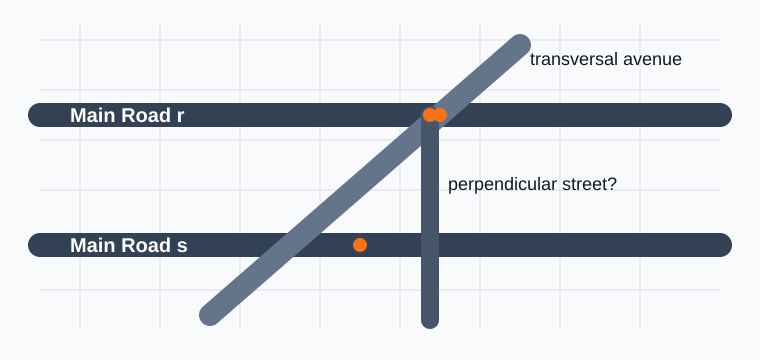
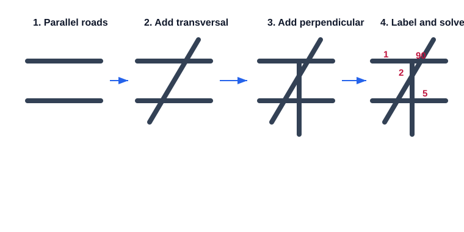
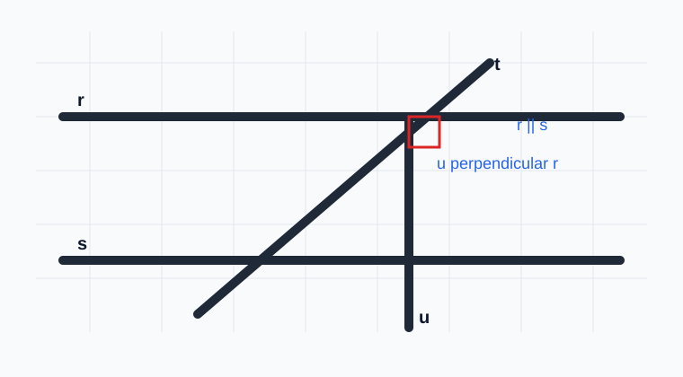
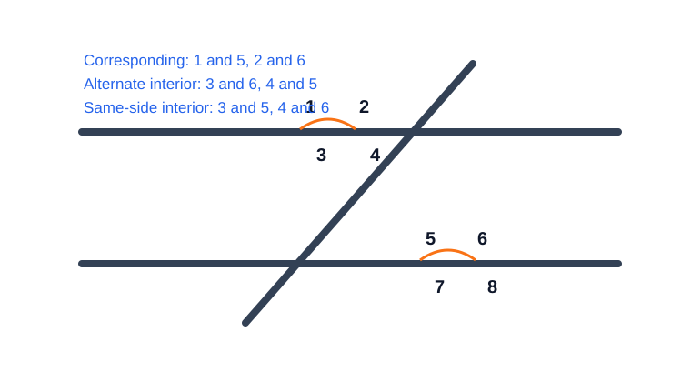
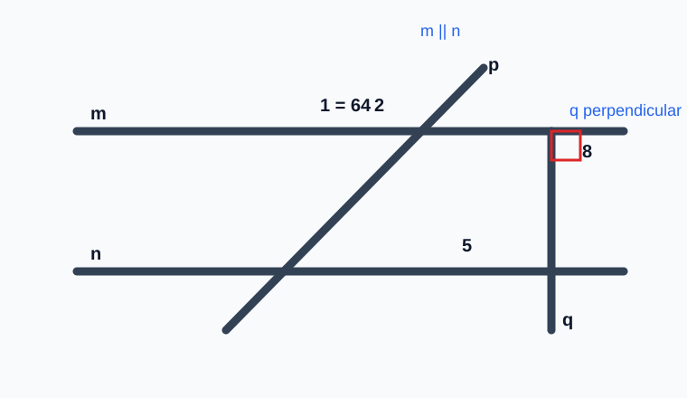
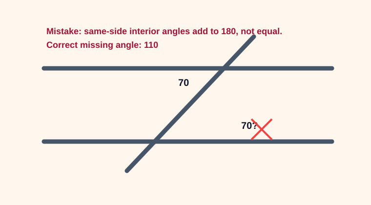

# Geometry - Lesson 10: Quarter Construction Task

> [!GOAL] Learning Goal
>
> By the end of this lesson, you should be able to create a geometric map with **parallel and perpendicular roads**, label important angle relationships, solve missing measures, and explain your reasoning clearly.

**Content domain:** Measurement and Geometry  
**Estimated time:** 55 minutes  
**Difficulty:** Intermediate  
**Target competency:** Create a geometric map using parallel and perpendicular roads.

---

## What You Should Already Know

This task brings together the main construction and angle ideas from the quarter. You do not need a perfect drawing style. You do need a careful plan, accurate labels, and reasons for your angle measures.

Before starting, check that you can:

- construct or draw a line through two points
- construct a perpendicular line and recognize a right angle
- construct a parallel line through a given point
- name angles using three letters, such as $\angle ABC$
- identify vertical angles, linear pairs, corresponding angles, alternate interior angles, and same-side interior angles
- solve simple equations such as $x + 65 = 180$

> [!CHECK] Pre-Check
>
> Answer these without looking back first.
>
> 1. If two roads are perpendicular, what angle measure is formed at their intersection?
> 2. If two parallel roads are cut by a transversal, what is true about corresponding angles?
> 3. If two angles form a linear pair and one angle is $118^\circ$, what is the other angle?
>
> If question 2 or 3 feels shaky, pause and review Lessons 6 to 8 before finishing the construction task.

## Try Before You Read

Imagine a town map drawn on graph paper. Two main roads are parallel. One avenue crosses both roads. Another road must be perpendicular to the first main road.

What geometric ideas do you already see?

> [!TIP] Thinking Guide
>
> A map can be a geometry diagram. Roads become lines or segments. Intersections become points. Corners become angles. Parallel and perpendicular relationships help you prove that your map is organized, not just sketched.

---

## Key Vocabulary

| Term | Meaning in this task | Map connection |
| --- | --- | --- |
| Parallel lines | Lines in the same plane that never meet | Two roads running in the same direction |
| Perpendicular lines | Lines that intersect to form right angles | A road crossing another at $90^\circ$ |
| Transversal | A line that intersects two or more lines | A road crossing two parallel roads |
| Corresponding angles | Angles in matching positions at different intersections | Same corner position on two crossings |
| Alternate interior angles | Interior angles on opposite sides of the transversal | Inside the parallel roads, opposite sides |
| Same-side interior angles | Interior angles on the same side of the transversal | Inside the parallel roads, same side |
| Linear pair | Adjacent angles whose noncommon sides form a line | Two neighboring road-corner angles summing to $180^\circ$ |
| Vertical angles | Opposite angles formed by intersecting lines | Opposite corners at one road crossing |

## Visual Introduction

Your final map should look intentional. One useful structure is:

1. Draw two parallel roads.
2. Add one transversal that crosses both.
3. Add a perpendicular road.
4. Label intersection points and important angles.
5. Solve angle measures and write reasons.

The goal is not decoration. The goal is to show geometry with enough precision that another student can check your work.

---

## Main Concept Explanation

### 1. Build the Map From Relationships

Start with relationships, not random lines.

For example:

- Road $r$ is parallel to road $s$: $r \parallel s$.
- Road $t$ crosses both roads, so $t$ is a transversal.
- Road $u$ is perpendicular to road $r$: $u \perp r$.

Once these are set, many angle facts follow.

> [!IMPORTANT] Construction Rule
>
> A good geometric map is built from rules: parallel, perpendicular, measured, or copied angles. Do not rely on "it looks right" as your only evidence.

### 2. Label Before You Solve

Use points to make your reasoning readable.

Example labels:

- Let $A$ and $B$ be intersections on road $r$.
- Let $C$ and $D$ be intersections on road $s$.
- Name an angle with the vertex in the middle, such as $\angle EAB$.

If your labels are unclear, your reasoning becomes hard to check. Geometry is picky here, and honestly it has a point.

### 3. Use Angle Relationships

When parallel lines are cut by a transversal:

| Relationship | What happens |
| --- | --- |
| Corresponding angles | Congruent |
| Alternate interior angles | Congruent |
| Alternate exterior angles | Congruent |
| Same-side interior angles | Supplementary |

At any intersection:

| Relationship | What happens |
| --- | --- |
| Vertical angles | Congruent |
| Linear pair | Supplementary |
| Perpendicular lines | Each angle is $90^\circ$ |

---

## Rule Box / Formula Box

> [!IMPORTANT] Angle Facts You May Use
>
> - If $m \parallel n$, corresponding angles are congruent.
> - If $m \parallel n$, alternate interior angles are congruent.
> - If $m \parallel n$, same-side interior angles are supplementary.
> - Vertical angles are congruent.
> - A linear pair sums to $180^\circ$.
> - Perpendicular lines form four right angles.

When you write reasons, use full statements:

- "$\angle 1$ and $\angle 5$ are corresponding angles, so they are congruent."
- "$\angle 2$ and $\angle 3$ form a linear pair, so their measures sum to $180^\circ$."
- "$u \perp r$, so the angle at their intersection measures $90^\circ$."

## Worked Example

In the map below, roads $m$ and $n$ are parallel. Avenue $p$ is a transversal. Road $q$ is perpendicular to road $m$.

Given: $m\angle 1 = 64^\circ$

Find $m\angle 2$, $m\angle 5$, and $m\angle 8$.

**Step 1: Find $m\angle 2$.**  
$\angle 1$ and $\angle 2$ form a linear pair.

$64 + m\angle 2 = 180$

$m\angle 2 = 116^\circ$

**Step 2: Find $m\angle 5$.**  
$\angle 1$ and $\angle 5$ are corresponding angles formed by parallel lines and a transversal.

$m\angle 5 = 64^\circ$

**Step 3: Find $m\angle 8$.**  
Road $q$ is perpendicular to road $m$, so the angles at that intersection are right angles.

$m\angle 8 = 90^\circ$

> [!EXAMPLE] Organized Reasoning
>
> Because $m \parallel n$, corresponding angles are congruent. Since $\angle 1$ corresponds to $\angle 5$, $m\angle 5 = 64^\circ$. Since $\angle 1$ and $\angle 2$ form a linear pair, $m\angle 2 = 180^\circ - 64^\circ = 116^\circ$. Because $q \perp m$, $m\angle 8 = 90^\circ$.

---

## Guided Practice

Try these one at a time. Use the hints only when you need them.

### Problem 1: Map Setup

Draw two horizontal roads, $r$ and $s$, so that $r \parallel s$. Draw a slanted road $t$ crossing both.

**Hint 1:** The slanted road is the transversal.  
**Hint 2:** Mark the two intersections with point labels, such as $A$ and $B$.  
**Check:** You should have two parallel lines and one transversal.

### Problem 2: Label Angle Pairs

At the upper intersection, label the top-right angle $\angle 1$. At the lower intersection, label the top-right angle $\angle 5$.

What relationship connects $\angle 1$ and $\angle 5$?

**Hint 1:** They are in the same relative position.  
**Hint 2:** The lines are parallel.  
**Answer:** Corresponding angles; they are congruent.

### Problem 3: Solve a Missing Angle

Suppose $m\angle 1 = 72^\circ$. Find the angle that forms a linear pair with $\angle 1$.

**Hint 1:** A linear pair sums to $180^\circ$.  
**Hint 2:** Compute $180 - 72$.  
**Answer:** $108^\circ$

### Problem 4: Add the Perpendicular Road

Draw road $u$ so that $u \perp r$. What angle measure must appear at the crossing of $u$ and $r$?

**Hint 1:** Perpendicular lines form right angles.  
**Hint 2:** A right angle measures $90^\circ$.  
**Answer:** $90^\circ$

## Mini-Quiz

Use this as a quick self-check.

1. What does $r \parallel s$ mean?
2. What does $u \perp r$ mean?
3. If corresponding angles are formed by parallel lines, are they congruent or supplementary?
4. If one angle in a linear pair is $135^\circ$, what is the other angle?
5. Why is labeling the vertex important when naming an angle?

**Mini-Quiz Answers**

1. Lines $r$ and $s$ are parallel.
2. Lines $u$ and $r$ are perpendicular.
3. Congruent.
4. $45^\circ$.
5. The middle letter names the vertex, so it tells exactly which angle is being discussed.

---

## Independent Practice: Your Quarter Construction Task

Create your own geometric map on paper or graph paper.

Your map must include:

- at least two parallel roads
- at least one perpendicular road
- at least one transversal crossing the parallel roads
- at least four labeled points
- at least six labeled angles
- at least three missing angle measures solved with reasons
- one short paragraph explaining how you know the map satisfies the requirements

Suggested layout:

1. Draw road $a$.
2. Construct road $b$ parallel to road $a$.
3. Draw road $c$ crossing both as a transversal.
4. Construct road $d$ perpendicular to road $a$.
5. Label intersections and angles.
6. Give one angle measure, then solve at least three related measures.

> [!PRACTICE] Construction Check
>
> Use a ruler or straightedge for roads. Use a protractor or right-angle corner to check perpendicular lines. If you are working digitally, use the line, parallel, perpendicular, and angle measurement tools.

## Answer Key With Explanations

Your exact map may differ, but a correct solution should include reasoning like this:

| Requirement | What a correct response shows |
| --- | --- |
| Parallel roads | A statement such as $a \parallel b$ and a drawing where the roads do not intersect |
| Perpendicular road | A statement such as $d \perp a$ and a marked $90^\circ$ angle |
| Transversal | A road crossing both parallel roads |
| Angle labels | Clear labels such as $\angle ABC$ or numbered angles |
| Angle solving | Equations or statements using vertical angles, linear pairs, or parallel-line angle theorems |
| Reasoning | Each solved measure has a relationship named as the reason |

Example answer:

- Given $m\angle 1 = 68^\circ$
- $m\angle 2 = 112^\circ$ because $\angle 1$ and $\angle 2$ form a linear pair.
- $m\angle 5 = 68^\circ$ because $\angle 1$ and $\angle 5$ are corresponding angles.
- $m\angle 6 = 112^\circ$ because it forms a linear pair with $\angle 5$.
- Any angle formed by a perpendicular road and its crossed road is $90^\circ$.

## Misconception Alerts

> [!WARNING] Looks Parallel Is Not Enough
>
> If you only sketch two roads that seem parallel, your map may be close but not justified. Use construction marks, equal angle relationships, or a clear statement that the roads were constructed parallel.

> [!WARNING] Same-Side Interior Angles Are Not Equal
>
> Same-side interior angles formed by parallel lines are supplementary, not congruent. They add to $180^\circ$.

> [!WARNING] Perpendicular Does Not Mean Vertical on the Page
>
> Perpendicular means the lines meet at $90^\circ$. A perpendicular road can be slanted depending on the direction of the other road.

## Error Analysis

A student creates a map with roads $m \parallel n$ and transversal $t$. The student writes:

> "$m\angle 3 = 70^\circ$, so the same-side interior angle next to it is also $70^\circ$ because the lines are parallel."

What is the mistake?

**Reveal after thinking:** Same-side interior angles are supplementary, not congruent. If one same-side interior angle is $70^\circ$, the other is $110^\circ$ because $180 - 70 = 110$.

Corrected statement:

> Since the angles are same-side interior angles formed by parallel lines, their measures add to $180^\circ$. Therefore the missing angle is $110^\circ$.

## Self-Explanation Prompts

Use these to check whether your thinking is organized.

1. How did you decide which roads should be parallel?
2. How did you verify that one road is perpendicular to another?
3. Which angle relationship did you use first, and why?
4. Which solved angle measure depends on parallel lines?
5. How would another student know your labels are clear?

**Sample response:**  
"I drew roads $a$ and $b$ parallel, then used road $c$ as a transversal. Because $a \parallel b$, I used corresponding angles to copy one angle measure to the lower intersection. Then I used linear pairs to find the adjacent angles."

## Extension Challenge

Design a map with **two pairs of parallel roads** and one diagonal transversal. Include a perpendicular side street that crosses one road from each pair.

Challenge requirements:

- Label at least eight angles.
- Give two starting angle measures.
- Solve five missing measures.
- Write one paragraph explaining how parallel and perpendicular relationships control the map.

**Hint:** Start with a grid-like layout, then add one diagonal road. The diagonal road creates the most interesting angle relationships.

## Mastery Checklist

Check each statement when it is true for your work.

- I can construct or draw two parallel roads.
- I can construct or draw a perpendicular road.
- I can label intersections and angles clearly.
- I can identify a transversal in my map.
- I can use linear pairs to find supplementary angles.
- I can use corresponding or alternate interior angles to transfer measures across parallel roads.
- I can explain why perpendicular roads form $90^\circ$ angles.
- I can write organized reasoning for each missing measure.

> [!CHECK] Check My Readiness
>
> If you checked 6 to 8 statements, move to the practice and assessment. If you checked fewer than 6, revise your map and review the angle relationship table before taking the assessment.

## Final Summary

This quarter task turns geometry into a map. Parallel roads create predictable angle relationships when a transversal crosses them. Perpendicular roads create right angles. Linear pairs and vertical angles help you solve measures at a single intersection. A strong final answer includes a neat construction, accurate labels, correct angle measures, and reasons that name the relationship used.

> [!PRACTICE] Next Step
>
> Use the practice exam for a quick check of construction and angle facts. Use the assessment when you are ready to show complete reasoning for a cumulative map task.
