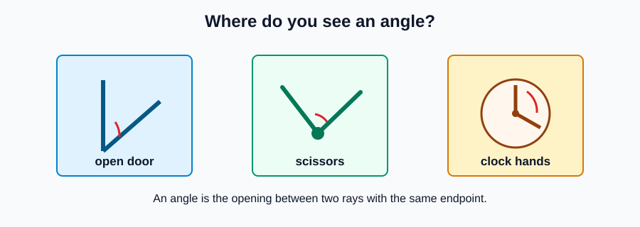
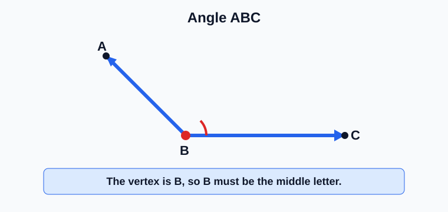
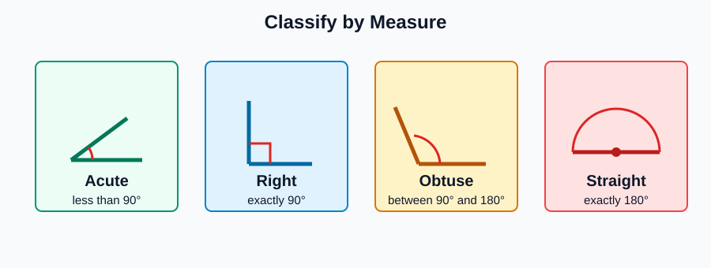
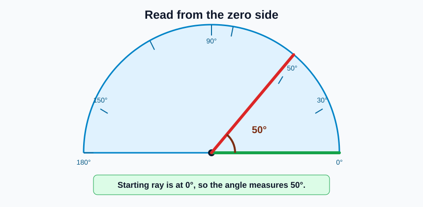
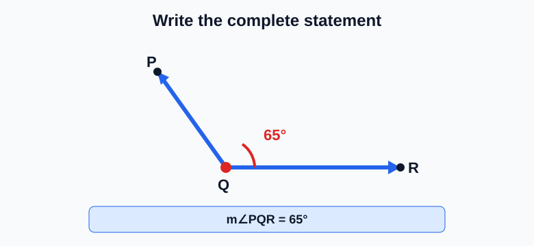
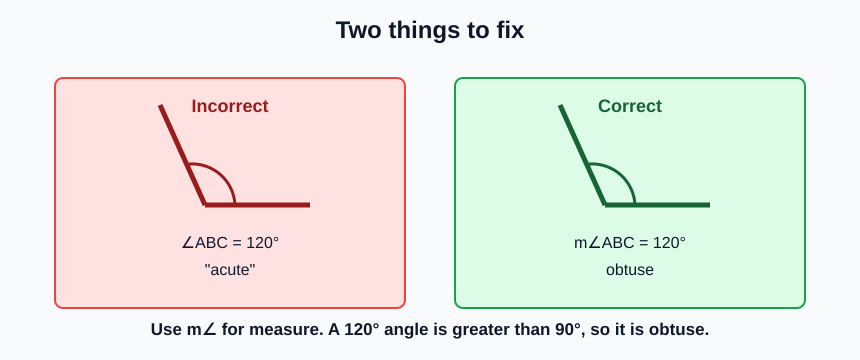

# Geometry - Lesson 2: Angle Notation and Measurement

> [!GOAL] Learning Goal
>
> By the end of this lesson, you should be able to **name angles from diagrams**, **measure angles in degrees**, and **write complete angle statements** such as $m\angle ABC = 60^\circ$.

**Content domain:** Measurement and Geometry  
**Estimated time:** 45 minutes  
**Difficulty:** Beginner  
**Target competency:** Name and measure angles from diagrams.

---

## What You Should Already Know

This lesson builds from Lesson 1.

Before reading, check that you can:

- identify a ray
- find the vertex of an angle
- read $\angle ABC$ as "angle ABC"
- remember that the middle letter in $\angle ABC$ is the vertex

> [!CHECK] Pre-Check
>
> 1. In $\angle KLM$, which point is the vertex?
> 2. What does the symbol $^\circ$ mean?
> 3. Is $90^\circ$ an acute, right, or obtuse angle?
>
> Answers: $L$; degrees; right angle.

## Try Before You Read

Look at a partly open door, a pair of scissors, or the hands of a clock. What geometric idea do you notice?

The opening between two rays is an **angle**. In geometry, you need two skills at once:

1. name the angle correctly
2. state its measure correctly

---

## Key Vocabulary

| Term | Meaning |
| --- | --- |
| Angle | A figure formed by two rays with a common endpoint |
| Vertex | The common endpoint of the rays |
| Sides of an angle | The two rays that form the angle |
| Degree | A unit for measuring angles, written with $^\circ$ |
| Angle measure | The size of an angle, written as $m\angle ABC$ |
| Acute angle | Greater than $0^\circ$ and less than $90^\circ$ |
| Right angle | Exactly $90^\circ$ |
| Obtuse angle | Greater than $90^\circ$ and less than $180^\circ$ |
| Straight angle | Exactly $180^\circ$ |

## Visual Introduction

An angle can be named by three letters when points are labeled on both rays.

For $\angle ABC$:

- $B$ is the vertex
- the sides are $\overrightarrow{BA}$ and $\overrightarrow{BC}$
- the middle letter must be the vertex

> [!IMPORTANT] Naming Rule
>
> Use three-letter notation when several angles share the same vertex. The middle letter tells the reader exactly which angle you mean.

---

## Main Concept Explanation

### 1. Naming Angles

You can name an angle in two common ways.

| Diagram situation | Good notation |
| --- | --- |
| Only one angle is at the vertex | $\angle B$ may be clear |
| More than one angle shares the vertex | Use three letters, such as $\angle ABC$ |

If a diagram has several rays from the same point, avoid one-letter names. They become too vague.

### 2. Measuring Angles

Angle measure is written with the letter $m$ before the angle symbol.

Examples:

- $m\angle ABC = 45^\circ$
- $m\angle DEF = 90^\circ$
- $m\angle PQR = 125^\circ$

Read $m\angle ABC$ as "the measure of angle ABC."

> [!WARNING] Symbol Trap
>
> $\angle ABC$ names the angle.  
> $m\angle ABC = 60^\circ$ states the angle's measure.

### 3. Angle Types

| Type | Measure |
| --- | --- |
| Acute | $0^\circ < m < 90^\circ$ |
| Right | $m = 90^\circ$ |
| Obtuse | $90^\circ < m < 180^\circ$ |
| Straight | $m = 180^\circ$ |

### 4. Reading a Protractor Diagram

When reading a protractor:

1. Put the center point on the vertex.
2. Align one ray with $0^\circ$.
3. Choose the scale that starts at that $0^\circ$.
4. Read where the other ray crosses the scale.

> [!TIP] Scale Check
>
> Many wrong answers come from reading the wrong protractor scale. Ask: "Which side starts at zero?"

---

## Rule Box / Formula Box

There is no formula to memorize here. The main rules are notation rules.

| Goal | Correct form | Example |
| --- | --- | --- |
| Name an angle | $\angle$ plus letters | $\angle ABC$ |
| State a measure | $m\angle$ plus letters equals degrees | $m\angle ABC = 50^\circ$ |
| Identify vertex | middle letter in a three-letter angle name | vertex of $\angle ABC$ is $B$ |
| Classify angle | compare its measure to $90^\circ$ and $180^\circ$ | $120^\circ$ is obtuse |

## Worked Example

The diagram shows rays $\overrightarrow{QP}$ and $\overrightarrow{QR}$. The angle opening is $65^\circ$.

**Step 1: Find the vertex.**  
Both rays start at $Q$, so the vertex is $Q$.

**Step 2: Name the angle.**  
The angle can be named $\angle PQR$ or $\angle RQP$. The vertex $Q$ stays in the middle.

**Step 3: Write the complete angle statement.**

$$m\angle PQR = 65^\circ$$

> [!CHECK] Try It
>
> If the same angle is named $\angle RQP$, what is the complete measure statement?
>
> Answer: $m\angle RQP = 65^\circ$.

---

## Guided Practice

### Problem 1

In $\angle DEF$, identify the vertex.

**Hint 1:** The vertex is where the rays meet.  
**Hint 2:** In a three-letter angle name, the vertex is the middle letter.  
**Answer:** $E$

### Problem 2

Classify an angle that measures $38^\circ$.

**Hint 1:** Compare it with $90^\circ$.  
**Hint 2:** An angle less than $90^\circ$ is acute.  
**Answer:** acute

### Problem 3

Write a complete angle statement for angle $ABC$ if its measure is $112^\circ$.

**Hint 1:** Start with $m\angle$.  
**Hint 2:** Include the degree symbol.  
**Answer:** $m\angle ABC = 112^\circ$

## Mini-Quiz

1. In $\angle XYZ$, which point is the vertex?
2. What type of angle measures $90^\circ$?
3. What type of angle measures $145^\circ$?
4. Write a complete angle statement for angle $LMN$ with measure $40^\circ$.

**Mini-Quiz Answers**

1. $Y$
2. Right angle
3. Obtuse angle
4. $m\angle LMN = 40^\circ$

---

## Independent Practice

Solve these on paper.

1. Draw $\angle ABC$ so that $B$ is the vertex.
2. Draw an acute angle and label it $\angle PQR$.
3. Draw a right angle and write its complete angle statement.
4. Classify $27^\circ$, $90^\circ$, $118^\circ$, and $180^\circ$.
5. Write two valid names for an angle formed by rays $\overrightarrow{ST}$ and $\overrightarrow{SU}$.
6. A protractor diagram shows one ray at $0^\circ$ and the other ray at $75^\circ$. Write the complete measure statement for $\angle HJK$ if $J$ is the vertex.

## Answer Key with Explanations

1. The point $B$ should be where the two rays meet.
2. The angle should be less than $90^\circ$, with $Q$ as the vertex.
3. A correct statement could be $m\angle ABC = 90^\circ$ if $B$ is the vertex.
4. $27^\circ$ acute, $90^\circ$ right, $118^\circ$ obtuse, $180^\circ$ straight.
5. $\angle TSU$ and $\angle UST$ are both valid. The vertex $S$ must stay in the middle.
6. $m\angle HJK = 75^\circ$.

---

## Misconception Alerts

> [!WARNING] Mistake 1: Putting the vertex first
>
> In $\angle ABC$, the vertex is $B$, not $A$.

> [!WARNING] Mistake 2: Writing only the number
>
> A complete angle statement should include the angle name and degree unit, such as $m\angle ABC = 80^\circ$.

> [!WARNING] Mistake 3: Reading the wrong protractor scale
>
> If the ray starts at the right-side zero, read the scale that begins at the right-side zero.

## Error Analysis

A student writes:

> "$\angle ABC = 120^\circ$, so it is acute."

Find both mistakes.

**Corrected reasoning:**

- The measure statement should be written as $m\angle ABC = 120^\circ$.
- $120^\circ$ is greater than $90^\circ$ and less than $180^\circ$, so it is obtuse.

## Self-Explanation Prompts

Answer these without looking back first.

1. Why must the vertex be the middle letter in a three-letter angle name?
2. How do you decide which protractor scale to read?
3. What is the difference between $\angle ABC$ and $m\angle ABC$?
4. Why is $91^\circ$ obtuse even though it is close to $90^\circ$?

**Sample responses**

- The middle letter tells where the two rays meet.
- I read the scale that begins at the ray aligned with $0^\circ$.
- $\angle ABC$ names the angle; $m\angle ABC$ means the measure of that angle.
- Any angle greater than $90^\circ$ and less than $180^\circ$ is obtuse.

## Extension Challenge

Draw three rays from point $O$: $\overrightarrow{OA}$, $\overrightarrow{OB}$, and $\overrightarrow{OC}$. Suppose:

- $m\angle AOB = 35^\circ$
- $m\angle BOC = 55^\circ$
- ray $\overrightarrow{OB}$ lies inside $\angle AOC$

Find $m\angle AOC$ and classify it.

**Solution:**  
$m\angle AOC = 35^\circ + 55^\circ = 90^\circ$, so $\angle AOC$ is a right angle.

## Mastery Checklist

Check each statement when it is true for you.

- I can find the vertex of an angle.
- I can name an angle using three letters.
- I can explain why the middle letter matters.
- I can classify acute, right, obtuse, and straight angles.
- I can read a simple protractor diagram.
- I can write a complete statement such as $m\angle ABC = 45^\circ$.
- I can spot common notation and measurement mistakes.

> [!PRACTICE] What To Do Next
>
> Use the practice exam to check naming and classification. Use the assessment when you can write complete angle statements without reminders.

## Final Summary

Angle work has two parts: **notation** and **measurement**. The notation tells which angle you mean; the measure tells how wide it opens. A complete statement like $m\angle ABC = 60^\circ$ gives both pieces clearly.
