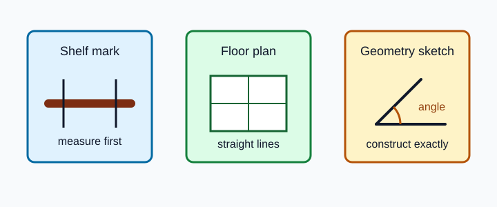
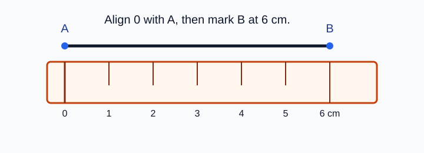
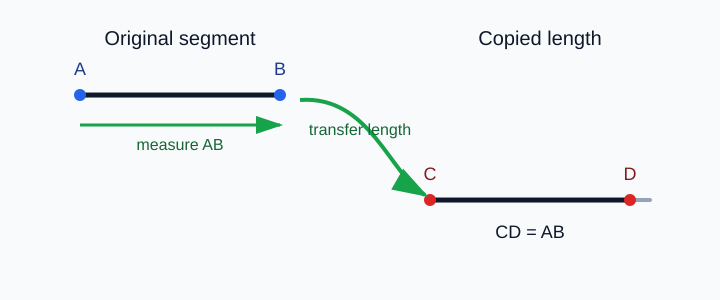
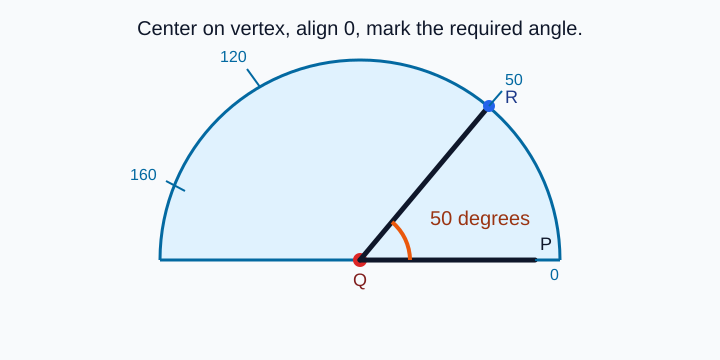
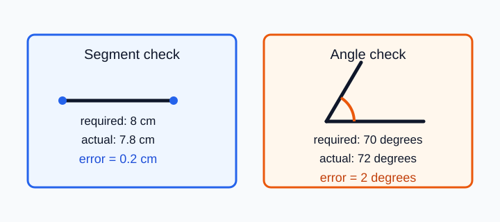
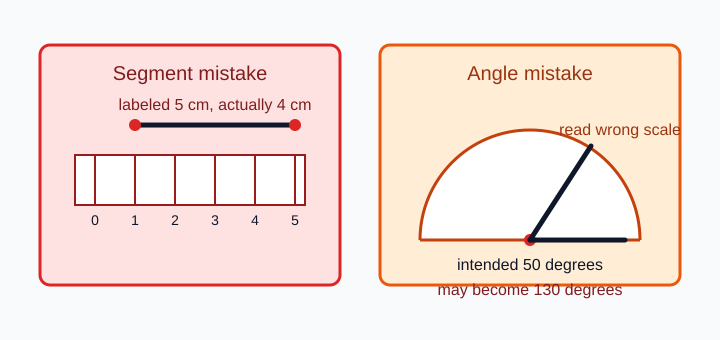

# Geometry - Lesson 3: Constructing Segments and Angles

> [!GOAL] Learning Goal
>
> By the end of this lesson, you should be able to **construct segments and angles accurately** using a straightedge, ruler, and protractor, then **check whether your drawing matches the required measurement**.

**Content domain:** Measurement and Geometry  
**Estimated time:** 50 minutes  
**Difficulty:** Beginner  
**Target competency:** Use straightedge, ruler, and protractor for accurate drawings.

---

## What You Should Already Know

This lesson builds from Lessons 1 and 2.

Before reading, check that you can:

- identify a segment, ray, and angle
- name an angle using three letters
- recognize the vertex of an angle
- read centimeter markings on a ruler
- read degree markings on a protractor

> [!CHECK] Pre-Check
>
> 1. What tool measures the length of a segment?
> 2. In $\angle ABC$, which point is the vertex?
> 3. What unit is used to measure angles?
> 4. If a segment begins at 0 cm and ends at 5.5 cm, how long is it?
>
> Answers: ruler; $B$; degrees; 5.5 cm.

## Try Before You Read

Think about a carpenter marking a shelf, an architect drawing a floor plan, or a student making a clean geometric diagram. In each case, the drawing has to be more than "close enough by eye."

The geometric idea is **construction**: making a figure that follows exact measurements and relationships.

In this lesson, you will focus on two construction skills:

1. drawing a segment with a given length
2. drawing an angle with a given measure

---

## Key Vocabulary

| Term | Meaning |
| --- | --- |
| Construction | A careful geometric drawing made using tools and stated rules |
| Straightedge | A tool used to draw straight lines or segments |
| Ruler | A straightedge with measurement marks for length |
| Protractor | A tool used to measure or construct angles in degrees |
| Segment length | The distance between the endpoints of a segment |
| Vertex | The common endpoint of the rays that form an angle |
| Precision | How close a drawing is to the required measurement |
| Measurement error | The difference between the required measure and the actual measured result |

## Visual Introduction

A construction is not just a sketch. A sketch shows the rough idea. A construction follows a measurement.

For a segment:

- mark the first endpoint clearly
- align the ruler's 0 mark with that endpoint
- mark the second endpoint at the required length
- draw the segment with a straightedge

> [!IMPORTANT] Accuracy Rule
>
> Start measuring from 0 unless you are deliberately subtracting two ruler readings. Starting from the physical edge of a ruler can create an error if the edge is not the 0 mark.

---

## Main Concept Explanation

### 1. Constructing a Segment of a Given Length

Suppose you need to construct $\overline{AB}$ with length 6 cm.

1. Mark point $A$.
2. Place the ruler so the 0 cm mark is exactly at $A$.
3. Make a small mark at 6 cm and label it $B$.
4. Use the ruler edge to draw $\overline{AB}$.
5. Check that the segment measures 6 cm.

This gives the complete statement:

$$AB = 6\text{ cm}$$

### 2. Copying or Marking a Segment

To copy a segment, transfer its length to a new starting point.

If $\overline{AB}$ is 4 cm and the new ray starts at $C$, mark point $D$ so that:

$$CD = AB = 4\text{ cm}$$

> [!TIP] Clean Endpoint Marks
>
> Use small endpoint dots or short tick marks. Thick marks make it harder to decide exactly where the segment starts and ends.

### 3. Constructing an Angle of a Given Measure

Suppose you need to construct $m\angle PQR = 50^\circ$.

1. Draw a base ray, such as $\overrightarrow{QP}$.
2. Place the protractor center on $Q$, the vertex.
3. Align the 0 degree line with the base ray.
4. Read the scale that begins at that 0 degree mark.
5. Make a small mark at $50^\circ$.
6. Draw a ray from $Q$ through the mark and label a point $R$.
7. Check the angle measure.

> [!WARNING] Protractor Scale Trap
>
> Many protractors have two scales. If your base ray starts at the right-side 0 degree mark, read the scale that begins at the right-side 0. If it starts at the left-side 0, read the left-starting scale.

### 4. Checking Construction Precision

After constructing, measure your result.

Use this idea:

$$\text{error} = |\text{required measure} - \text{actual measure}|$$

Examples:

- Required segment: 8 cm. Actual segment: 7.8 cm. Error: 0.2 cm.
- Required angle: $70^\circ$. Actual angle: $72^\circ$. Error: $2^\circ$.

Small error can happen because of pencil thickness, tool placement, or reading marks. Large error usually means one construction step needs correction.

---

## Rule Box / Formula Box

| Construction goal | Tool | Key rule |
| --- | --- | --- |
| Draw a straight segment | Straightedge or ruler | Connect the endpoints with one straight edge |
| Make a segment with a given length | Ruler | Align 0 with the first endpoint |
| Copy a segment length | Ruler | Measure the original length, then mark the same length from the new start |
| Make an angle with a given measure | Protractor and straightedge | Center on vertex, align 0, read the correct scale |
| Check precision | Ruler or protractor | Compare the actual measurement with the required measurement |

## Worked Example

Construct $\overline{MN}$ with length 5.5 cm. Then construct $m\angle ABC = 65^\circ$.

**Segment construction**

1. Mark point $M$.
2. Align the ruler's 0 cm mark with $M$.
3. Mark point $N$ at 5.5 cm.
4. Draw $\overline{MN}$.
5. Check: $MN = 5.5\text{ cm}$.

**Angle construction**

1. Draw ray $\overrightarrow{BA}$.
2. Put the protractor center on $B$.
3. Align 0 degrees with ray $\overrightarrow{BA}$.
4. Mark $65^\circ$ on the correct scale.
5. Draw ray $\overrightarrow{BC}$ through the mark.
6. Check: $m\angle ABC = 65^\circ$.

> [!CHECK] Try It
>
> If your angle check reads $67^\circ$ instead of $65^\circ$, what is the error?
>
> Answer: $2^\circ$.

---

## Guided Practice

### Problem 1

Construct a segment $\overline{RS}$ with length 7 cm.

**Hint 1:** Put $R$ at the starting point.  
**Hint 2:** Align the ruler's 0 cm mark with $R$, then mark $S$ at 7 cm.  
**Check:** Your segment should measure 7 cm from endpoint to endpoint.

### Problem 2

Copy a segment that is 3.8 cm long onto a new ray starting at point $T$.

**Hint 1:** The new segment must start at $T$.  
**Hint 2:** Mark the second endpoint 3.8 cm away from $T$.  
**Check:** The copied segment should have length 3.8 cm.

### Problem 3

Construct $m\angle DEF = 110^\circ$.

**Hint 1:** $E$ is the vertex because it is the middle letter.  
**Hint 2:** Place the protractor center on $E$, align 0 degrees with one ray, then mark $110^\circ$ on the correct scale.  
**Check:** Your angle should be obtuse and measure $110^\circ$.

## Mini-Quiz

1. Which tool measures angle size?
2. Where should the protractor center be placed when constructing $\angle KLM$?
3. If a required segment is 9 cm and the actual drawing is 8.6 cm, what is the error?
4. Why should endpoint marks be small?

**Mini-Quiz Answers**

1. Protractor
2. On point $L$, the vertex
3. 0.4 cm
4. Small marks make the exact start and end of the segment easier to measure.

---

## Independent Practice

Complete these on paper with a ruler, straightedge, and protractor.

1. Construct $\overline{AB}$ with length 4 cm.
2. Construct $\overline{CD}$ with length 6.5 cm.
3. Draw a ray $\overrightarrow{EF}$, then construct $m\angle FEG = 40^\circ$.
4. Draw a ray $\overrightarrow{HJ}$, then construct $m\angle JHK = 125^\circ$.
5. Copy a 5 cm segment onto a new ray starting at $P$.
6. A segment should be 7 cm, but it measures 7.3 cm. Find the error.
7. An angle should be $90^\circ$, but it measures $86^\circ$. Find the error.
8. Write one sentence explaining how to avoid reading the wrong protractor scale.

## Answer Key with Explanations

1. $\overline{AB}$ should measure 4 cm from endpoint to endpoint.
2. $\overline{CD}$ should measure 6.5 cm from endpoint to endpoint.
3. $E$ should be the vertex, and the angle should measure $40^\circ$.
4. $H$ should be the vertex, and the angle should measure $125^\circ$.
5. The new segment from $P$ should match the original 5 cm length.
6. Error: 0.3 cm.
7. Error: $4^\circ$.
8. A good answer: "Read the scale that begins at the 0 degree mark aligned with the base ray."

---

## Misconception Alerts

> [!WARNING] Mistake 1: Starting at the ruler edge
>
> Some rulers have space before the 0 mark. Always start at 0 unless you are subtracting readings.

> [!WARNING] Mistake 2: Thick endpoint marks
>
> A thick dot can make a segment look longer or shorter. Use small, precise marks.

> [!WARNING] Mistake 3: Wrong protractor scale
>
> Reading the opposite scale often gives the supplement, such as $130^\circ$ instead of $50^\circ$.

> [!WARNING] Mistake 4: Vertex not centered
>
> If the protractor center is not on the vertex, the angle measure is not reliable.

## Error Analysis

A student is asked to construct a 6 cm segment and a $50^\circ$ angle.

They:

- put the segment's first endpoint at the ruler's 1 cm mark and the second endpoint at 6 cm
- align the angle's base ray with right-side 0 degrees but read the left-starting scale

Find the mistakes.

**Corrected reasoning:**

- The segment from 1 cm to 6 cm is only 5 cm long. To make 6 cm, either start at 0 and mark 6 cm, or start at 1 and mark 7 cm.
- The angle scale must begin at the base ray's 0 degree mark. If the ray starts at right-side 0, use the right-starting scale.

## Self-Explanation Prompts

Answer these without looking back first.

1. Why is a construction different from a rough sketch?
2. Why does the protractor center need to sit exactly on the vertex?
3. How can you check whether a segment construction is accurate?
4. What does measurement error tell you?
5. Why can reading the wrong protractor scale create a large error?

**Sample responses**

- A construction follows exact measurements; a sketch only shows the rough shape.
- The vertex is where the angle opens from, so the protractor must measure from that point.
- I measure from one endpoint to the other and compare with the required length.
- It tells how far the actual drawing is from the required measure.
- The wrong scale can give the supplement instead of the intended angle.

## Extension Challenge

Construct a small geometric sign design:

1. Draw $\overline{AB}$ with length 8 cm.
2. At point $A$, construct a $60^\circ$ angle above the segment.
3. On the new ray, mark point $C$ so that $AC = 5$ cm.
4. Draw $\overline{BC}$.
5. Measure $BC$ and write the length you get.

**Hint:** Keep all endpoint marks small, and check both constructed measurements before drawing $\overline{BC}$.

**Solution guide:**  
There is not one printed value to copy because your measured $BC$ depends on your construction accuracy. A precise drawing should have $AB = 8$ cm, $AC = 5$ cm, and $m\angle BAC = 60^\circ$ before you measure $BC$.

## Mastery Checklist

Check each statement when it is true for you.

- I can choose the correct tool for measuring length or angle size.
- I can construct a segment with a given length.
- I can copy a segment length onto a new ray.
- I can construct an angle with a given measure.
- I can identify the vertex before placing a protractor.
- I can read the correct protractor scale.
- I can check the precision of my construction.
- I can explain and correct common ruler or protractor errors.

> [!PRACTICE] What To Do Next
>
> Use the practice exam to check construction steps and tool choices. Use the assessment when you can explain how to check precision without reminders.

## Final Summary

Accurate constructions depend on careful tool placement. For segments, align the ruler's 0 mark with the starting endpoint. For angles, place the protractor center on the vertex and read the scale that begins at the aligned 0 degree mark. After drawing, always check the result against the required measurement.
