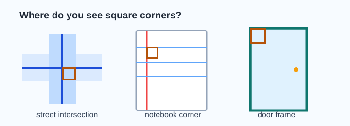
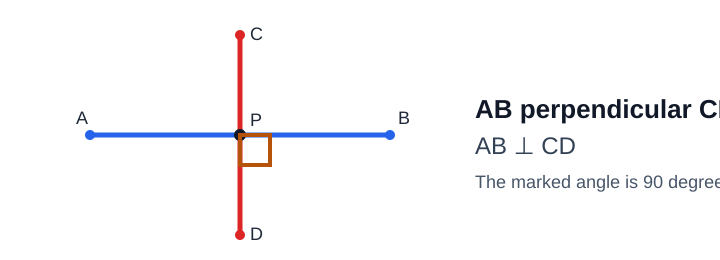
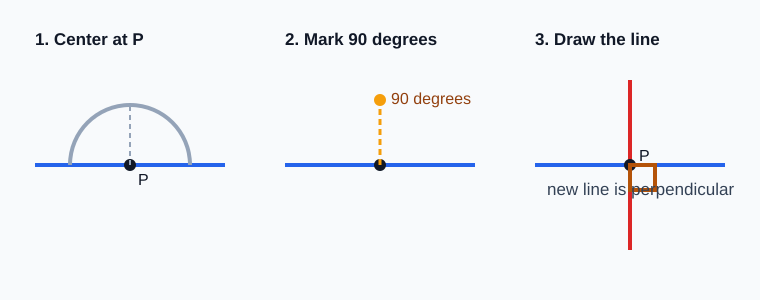
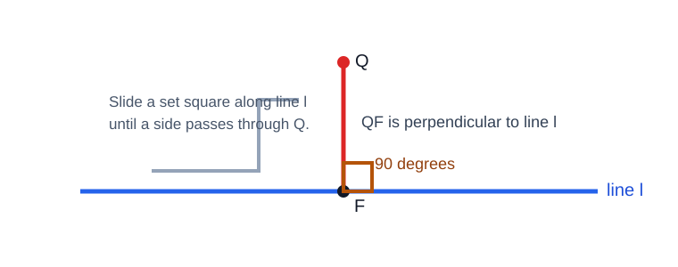
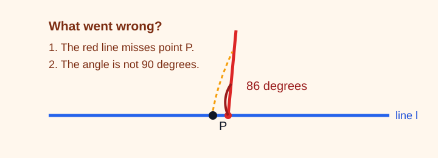

# Geometry - Lesson 4: Constructing Perpendicular Lines

> [!GOAL] Learning Goal
>
> By the end of this lesson, you should be able to **construct perpendicular lines** using geometry tools and **explain why the result forms right angles**.

**Content domain:** Measurement and Geometry  
**Estimated time:** 50 minutes  
**Difficulty:** Beginner  
**Target competency:** Build perpendicular lines using tools.

---

## What You Should Already Know

This lesson builds from angle notation, angle measurement, and basic geometric figures.

Before reading, check that you can:

- identify a line and a point
- recognize a right angle
- measure an angle with a protractor
- draw a straight line through two points
- use notation such as $\angle ABC$ and $m\angle ABC = 90^\circ$

> [!CHECK] Pre-Check
>
> 1. What is the measure of a right angle?
> 2. If two lines meet to form a right angle, what word describes the lines?
> 3. Which tool can help you draw or check a $90^\circ$ angle: ruler only, protractor, or calculator?
>
> Answers: $90^\circ$; perpendicular; protractor.

## Try Before You Read

Look at a street intersection, the corner of a notebook page, or the edge of a door frame.

What do these examples have in common? They show lines or segments meeting in a square corner. In geometry, a square corner means a **right angle**.

---

## Key Vocabulary

| Term | Meaning |
| --- | --- |
| Perpendicular lines | Lines that intersect to form right angles |
| Right angle | An angle that measures exactly $90^\circ$ |
| Construction | An accurate drawing made using geometry tools |
| Straightedge | A tool used to draw straight lines; it does not measure |
| Ruler | A straight tool with measurement marks |
| Protractor | A tool used to measure and draw angles |
| Set square | A triangular tool with a built-in right angle |
| Foot of the perpendicular | The point where a perpendicular line meets the original line |

## Visual Introduction

Two lines are perpendicular if they meet at a right angle.

You may see this written as:

$$\overleftrightarrow{AB} \perp \overleftrightarrow{CD}$$

Read this as "line AB is perpendicular to line CD."

> [!IMPORTANT] Core Idea
>
> To prove or explain that two lines are perpendicular, show that they meet to form a $90^\circ$ angle.

---

## Main Concept Explanation

### 1. Perpendicular Means Right Angles

If two lines intersect and one of the angles is $90^\circ$, then all four angles around the intersection are right angles.

That is why perpendicular lines often look like a plus sign or a capital T. The shape can be rotated; it does not have to be vertical and horizontal on the page.

> [!WARNING] Common Trap
>
> A line can be perpendicular even if it is slanted. Perpendicular is about the angle between the lines, not whether one line looks "up and down."

### 2. Constructing Through a Point on a Line

Suppose point $P$ is already on line $\ell$. You need to draw a line through $P$ that is perpendicular to $\ell$.

With a protractor:

1. Place the protractor center on point $P$.
2. Align the baseline with line $\ell$.
3. Mark the $90^\circ$ point.
4. Use a straightedge to draw a line through $P$ and the mark.
5. Label the new line and write the perpendicular statement.

With a set square:

1. Place one side of the set square along line $\ell$.
2. Slide the set square until its right-angle corner reaches $P$.
3. Draw along the side that passes through $P$.
4. Check that the new line forms a right angle with $\ell$.

### 3. Constructing From a Point Off a Line

Suppose point $Q$ is not on line $\ell$. You need to draw the perpendicular from $Q$ to $\ell$.

With a set square:

1. Place one side of the set square along line $\ell$.
2. Slide it along $\ell$ until another side passes through point $Q$.
3. Draw the line through $Q$ down to $\ell$.
4. Label the meeting point $F$. This is the foot of the perpendicular.
5. Write $QF \perp \ell$.

With a protractor:

1. Estimate the point $F$ on line $\ell$ where the perpendicular should meet.
2. Place the protractor center at $F$ and align its baseline with $\ell$.
3. Adjust $F$ until the $90^\circ$ ray passes through $Q$.
4. Draw $\overline{QF}$ and check the angle.

> [!TIP] Tool Choice
>
> A set square is often faster for construction. A protractor is useful for checking that the angle is exactly $90^\circ$.

---

## Rule Box / Formula Box

There is no numerical formula to memorize. The key test is:

| If you know... | Then you can conclude... |
| --- | --- |
| Two lines meet at $90^\circ$ | The lines are perpendicular |
| $\overleftrightarrow{AB} \perp \overleftrightarrow{CD}$ | The lines form right angles |
| A constructed line forms a $90^\circ$ angle with the original line | The construction is perpendicular |

## Worked Example

**Task:** Construct a line through point $P$ that is perpendicular to line $\ell$.

**Step 1: Align the tool.**  
Place the protractor center at $P$ and align the baseline with line $\ell$.

**Step 2: Mark $90^\circ$.**  
Make a small mark at $90^\circ$ above point $P$.

**Step 3: Draw the new line.**  
Use a straightedge to draw a line through $P$ and the $90^\circ$ mark.

**Step 4: Explain the result.**  
The new line forms a $90^\circ$ angle with line $\ell$, so the new line is perpendicular to $\ell$.

> [!EXAMPLE] Complete Explanation
>
> "The constructed line passes through $P$ and forms a $90^\circ$ angle with line $\ell$. Lines that meet at $90^\circ$ are perpendicular, so the constructed line is perpendicular to $\ell$."

---

## Guided Practice

### Problem 1

Line $m$ and line $n$ intersect at point $A$. One angle at $A$ is marked $90^\circ$. Are the lines perpendicular?

**Hint 1:** Use the definition of perpendicular lines.  
**Hint 2:** Perpendicular lines form right angles.  
**Answer:** Yes. Since they meet at $90^\circ$, $m \perp n$.

### Problem 2

You need to construct a perpendicular through point $R$ on line $k$. What should the protractor center be placed on?

**Hint 1:** The new line must pass through $R$.  
**Hint 2:** The $90^\circ$ angle starts at the point of intersection.  
**Answer:** Place the protractor center on point $R$.

### Problem 3

Point $S$ is above line $\ell$. You slide a set square along $\ell$ until one side passes through $S$. What point should you label where the new segment meets line $\ell$?

**Hint 1:** This point is where the perpendicular reaches the original line.  
**Hint 2:** It is called the foot of the perpendicular.  
**Answer:** Label the meeting point as the foot of the perpendicular, such as point $F$.

---

## Mini-Quiz

1. What angle measure proves two intersecting lines are perpendicular?
2. Write the symbol used for "is perpendicular to."
3. A student draws a line through point $P$ but the angle measures $88^\circ$. Is the construction precise enough?
4. If $\overline{QF} \perp \ell$, what should $m\angle QF\ell$ be?

**Mini-Quiz Answers**

1. $90^\circ$
2. $\perp$
3. No. A perpendicular construction should form $90^\circ$.
4. $90^\circ$

---

## Independent Practice

Complete these on paper with a ruler, straightedge, protractor, or set square.

1. Draw line $\ell$ and mark point $P$ on it. Construct a perpendicular through $P$.
2. Draw line $m$ and mark point $Q$ not on it. Construct the perpendicular from $Q$ to $m$.
3. Label the foot of the perpendicular in Problem 2 as $F$.
4. Write a perpendicular statement for your drawing in Problem 1.
5. Measure one angle formed in Problem 1. Record the measure.
6. Draw two slanted lines that are perpendicular. Mark the right angle.
7. Explain why your line in Problem 2 is perpendicular to $m$.
8. Create a simple map with one road perpendicular to another road. Label the intersection and one $90^\circ$ angle.

## Answer Key with Explanations

1. The new line should pass through $P$ and form a right angle with $\ell$.
2. The segment from $Q$ should meet $m$ at a $90^\circ$ angle.
3. $F$ should be the point where the new perpendicular segment touches $m$.
4. A correct statement could be $r \perp \ell$ if $r$ is the constructed line.
5. The angle should measure $90^\circ$.
6. The lines may be rotated or slanted, but the angle between them must be $90^\circ$.
7. A good explanation says that the constructed segment forms a $90^\circ$ angle with $m$.
8. The map should show two roads meeting in a square corner, labeled with a $90^\circ$ angle.

---

## Misconception Alerts

> [!WARNING] Mistake 1: Trusting appearance only
>
> A drawing that looks square may not be accurate. Check it with a protractor or set square.

> [!WARNING] Mistake 2: Thinking perpendicular means vertical
>
> Perpendicular lines can be tilted. They only need to meet at $90^\circ$.

> [!WARNING] Mistake 3: Forgetting the point condition
>
> If the task says "through point $P$," your perpendicular line must pass through $P$ exactly.

> [!WARNING] Mistake 4: Using the ruler marks as an angle tool
>
> A ruler measures length. It does not measure right angles unless it is paired with another tool or used as a straightedge after marking $90^\circ$.

## Error Analysis

A student was asked to construct a perpendicular through point $P$ on line $\ell$. The student drew a line near $P$, and the angle measured $86^\circ$.

Find two mistakes.

**Corrected reasoning:**

- The line must pass through point $P$ exactly.
- The angle must measure $90^\circ$, not $86^\circ$.
- Since the drawn line does not meet both conditions, it is not a correct perpendicular construction.

## Self-Explanation Prompts

Answer these without looking back first.

1. How do you know two lines are perpendicular?
2. Why is a protractor useful when constructing perpendicular lines?
3. What is the difference between constructing a perpendicular through a point on a line and from a point off a line?
4. Why should a final construction be checked?
5. Can two slanted lines be perpendicular? Explain.

**Sample responses**

- Two lines are perpendicular if they intersect to form a $90^\circ$ angle.
- A protractor helps mark or verify the $90^\circ$ angle.
- Through a point on a line, the intersection point is already given. From a point off a line, I must find the foot of the perpendicular on the line.
- A small tool placement error can make the angle less or more than $90^\circ$.
- Yes. Perpendicular depends on the angle between the lines, not their position on the page.

## Extension Challenge

Draw line $\ell$ and choose point $P$ on it. Construct a perpendicular line $r$ through $P$. Then construct a second line $s$ perpendicular to $r$ through the same point $P$.

What relationship should line $s$ have with line $\ell$?

**Hint:** If a line is perpendicular to a perpendicular line at the same point, compare the direction of the first and third lines.

**Solution:**  
Line $s$ should lie on the same direction as line $\ell$, so $s$ and $\ell$ are the same line if both pass through $P$. If drawn as separate lines through different points, they would be parallel.

## Mastery Checklist

Check each statement when it is true for you.

- I can recognize perpendicular lines in a diagram or real-life object.
- I can explain that perpendicular lines form $90^\circ$ angles.
- I can use the symbol $\perp$ correctly.
- I can construct a perpendicular through a point on a line.
- I can construct a perpendicular from a point off a line.
- I can label the foot of a perpendicular.
- I can check construction precision with a protractor or set square.
- I can explain why my construction is perpendicular.

> [!PRACTICE] What To Do Next
>
> Use the practice exam to check vocabulary, notation, and basic construction steps. Use the assessment when you can explain why your drawing forms right angles.

## Final Summary

Constructing perpendicular lines is about drawing with precision and explaining with evidence. A correct perpendicular construction meets the required point condition and forms a $90^\circ$ angle with the original line.
