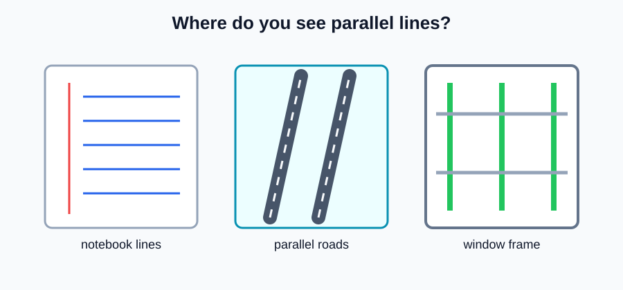
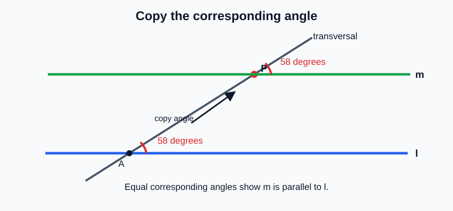
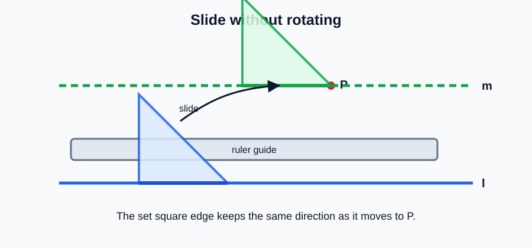
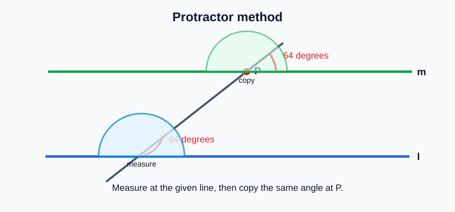
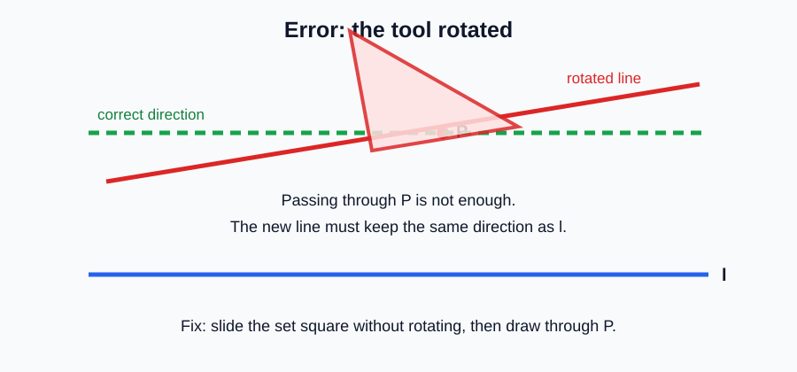
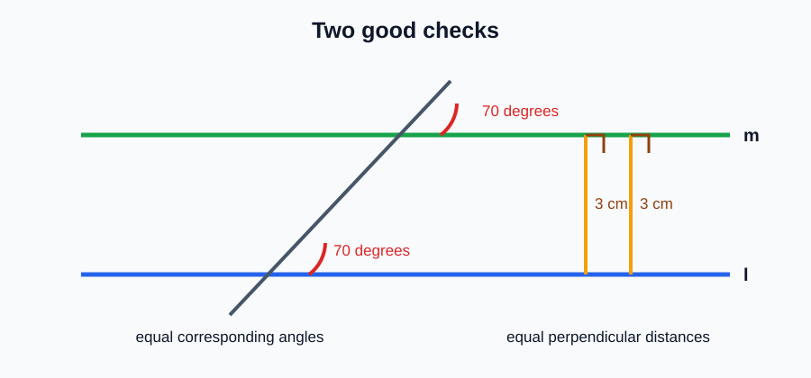

# Geometry - Lesson 5: Constructing Parallel Lines

> [!GOAL] Learning Goal
>
> By the end of this lesson, you should be able to **construct a line parallel to a given line through a point** and **verify your construction** using equal angle or equal distance relationships.

**Content domain:** Measurement and Geometry  
**Estimated time:** 50 minutes  
**Difficulty:** Intermediate  
**Target competency:** Construct parallel lines through a point.

---

## What You Should Already Know

This lesson builds from angle notation, measuring angles, constructing angles, and perpendicular lines.

Before reading, check that you can:

- draw and label a line, point, ray, and segment
- measure an angle with a protractor
- copy an angle with construction tools
- identify a right angle
- recognize that parallel lines never meet in the same plane

> [!CHECK] Pre-Check
>
> 1. What symbol means "is parallel to"?
> 2. If two lines have equal corresponding angles with the same transversal, what relationship can you suspect?
> 3. What tool can help you draw a straight line through two marked points?
>
> Answers: $\parallel$; the lines are parallel; a ruler or straightedge.

## Try Before You Read

Look at roads on a map, notebook ruled lines, window blinds, or the edges of a table. What do you notice about lines that stay the same distance apart?

Parallel construction is about precision. You are not just drawing a line that "looks about right." You are using a reason that proves the new line should stay parallel.

---

## Key Vocabulary

| Term | Meaning |
| --- | --- |
| Parallel lines | Lines in the same plane that do not intersect |
| Transversal | A line that crosses two or more lines |
| Corresponding angles | Angles in matching positions when a transversal crosses two lines |
| Construct | To draw accurately using geometric tools and steps |
| Set square | A triangular tool with fixed right-angle edges, useful for drawing parallel or perpendicular lines |
| Perpendicular distance | The shortest distance between parallel lines, measured at a right angle |
| Verification | A check that confirms your construction is accurate |

## Visual Introduction

If a transversal crosses two lines and makes equal corresponding angles, the lines are parallel.

The construction idea is:

1. Start with a given line $\ell$ and a point $P$ not on the line.
2. Draw a transversal through $P$ that crosses $\ell$.
3. Copy the angle made at $\ell$ onto point $P$.
4. Draw the new line through $P$ along the copied angle.

> [!IMPORTANT] Core Rule
>
> If corresponding angles are congruent, then the two lines are parallel. This is why copying an angle can construct a parallel line.

---

## Main Concept Explanation

### 1. What You Are Constructing

You are usually given:

- a line, such as $\ell$
- a point $P$ not on that line

Your goal is to draw exactly one line through $P$ that is parallel to $\ell$.

In notation, if the new line is $m$, you want:

$$m \parallel \ell$$

### 2. Method A: Copy a Corresponding Angle

Use this when you have a protractor or compass-straightedge method for copying an angle.

1. Draw a transversal from $P$ to the given line $\ell$.
2. Measure the angle where the transversal meets $\ell$.
3. At point $P$, copy that same angle in the corresponding position.
4. Draw line $m$ through $P$ along the new ray.
5. State that $m \parallel \ell$ because corresponding angles are equal.

### 3. Method B: Use a Set Square and Ruler

1. Place one edge of the set square along the given line.
2. Hold a ruler firmly against another edge of the set square.
3. Slide the set square along the ruler until its edge passes through point $P$.
4. Draw the new line through $P$.

This works because the edge keeps the same direction while it slides.

### 4. Method C: Use a Protractor

1. Draw a transversal crossing $\ell$ and passing through $P$.
2. Measure the angle formed with $\ell$.
3. At $P$, mark the same angle on the corresponding side of the transversal.
4. Draw through $P$ and the marked point.

> [!TIP] Accuracy Habit
>
> Mark lightly first. Check the angle before darkening the final line. Construction work rewards small careful moves.

---

## Rule Box / Formula Box

| Situation | What to check | Parallel conclusion |
| --- | --- | --- |
| Corresponding angles are equal | Matching angles have the same measure | Lines are parallel |
| Alternate interior angles are equal | Interior angles on opposite sides match | Lines are parallel |
| Same perpendicular distance | Distance between lines is constant at right angles | Lines are parallel |
| Same direction using set square | Tool edge was slid without rotating | Lines are parallel |

## Worked Example

Construct a line through point $P$ parallel to line $\ell$.

**Step 1: Draw a transversal.**  
Draw a line from $P$ to a point $A$ on $\ell$.

**Step 2: Measure the angle at $A$.**  
Suppose the angle between the transversal and $\ell$ is $58^\circ$.

**Step 3: Copy the angle at $P$.**  
At $P$, make a $58^\circ$ angle in the corresponding position.

**Step 4: Draw the new line.**  
Draw line $m$ through $P$ along that copied angle.

**Step 5: Verify.**  
Because the corresponding angles are both $58^\circ$, $m \parallel \ell$.

> [!CHECK] Try It
>
> A transversal makes a $72^\circ$ angle with the given line. What angle should you copy at point $P$ to construct the parallel line?
>
> Answer: Copy a $72^\circ$ corresponding angle.

---

## Guided Practice

### Problem 1

Line $\ell$ is horizontal. Point $P$ is above it. Which tool method can quickly draw a parallel line through $P$?

**Hint 1:** Keep the direction of the line unchanged.  
**Hint 2:** A set square can slide without rotating.  
**Answer:** Use the set-square and ruler method, then draw the line through $P$.

### Problem 2

A transversal forms a $64^\circ$ corresponding angle with line $\ell$. What angle should be constructed at $P$?

**Hint 1:** Parallel lines have equal corresponding angles.  
**Hint 2:** Copy the same angle measure.  
**Answer:** $64^\circ$

### Problem 3

You measured the perpendicular distance between two drawn lines at the left side and at the right side. Both measurements are $3$ cm. What does this support?

**Hint 1:** Parallel lines stay the same distance apart.  
**Hint 2:** The distance should be measured at right angles.  
**Answer:** It supports that the lines are parallel.

## Mini-Quiz

1. What symbol is used for "parallel to"?
2. If two corresponding angles are $80^\circ$ and $80^\circ$, what can you conclude about the two lines?
3. Why should you avoid rotating the set square while sliding it?
4. What is one way to verify a constructed parallel line?

**Mini-Quiz Answers**

1. $\parallel$
2. The lines are parallel.
3. Rotating changes the direction, so the new line may not be parallel.
4. Check equal corresponding angles or equal perpendicular distances.

---

## Independent Practice

Solve these on paper with construction tools.

1. Draw a line $\ell$ and a point $P$ not on it. Construct a line through $P$ parallel to $\ell$ using a set square.
2. Draw a transversal from $P$ to $\ell$. If the angle at $\ell$ is $45^\circ$, copy the corresponding angle at $P$ and draw the parallel line.
3. Construct a line through $P$ parallel to a slanted line $\ell$ using a protractor.
4. Draw two parallel lines and measure the perpendicular distance between them in two places.
5. Explain why equal corresponding angles prove your new line is parallel.
6. Create a simple road map with one road parallel to another road through a marked point.

## Answer Key with Explanations

1. The new line should pass through $P$ and have the same direction as $\ell$.
2. The copied angle should also measure $45^\circ$ in the corresponding position.
3. The protractor marks the same angle at $P$, then the straightedge draws through the marked point.
4. The two perpendicular distances should be equal or very close if the lines are parallel.
5. Equal corresponding angles are a parallel-line test.
6. The map should show two roads that do not meet and remain the same distance apart.

---

## Misconception Alerts

> [!WARNING] Mistake 1: Eyeballing the line
>
> A line can look parallel but still be slightly tilted. Use a tool and verify with a measurement.

> [!WARNING] Mistake 2: Copying the angle on the wrong side
>
> Corresponding angles must be in matching positions. Copying to the wrong side may construct a crossing line.

> [!WARNING] Mistake 3: Measuring distance diagonally
>
> Distance between parallel lines is measured along a perpendicular segment, not a slanted segment.

## Error Analysis

A student says:

> "I slid the set square near point $P$, but I turned it a little so the edge touched the point. The new line is still parallel because it passes through $P$."

Find the mistake.

**Corrected reasoning:**  
Passing through $P$ is required, but it is not enough. The set square must slide without rotating. If the tool rotates, the direction changes, and the new line may not be parallel to the original line.

## Verification

After constructing a parallel line, check one of these:

- corresponding angles are equal
- alternate interior angles are equal
- perpendicular distances between the lines match in two places
- a set square edge was slid without rotation

## Self-Explanation Prompts

Answer these without looking back first.

1. Why does copying a corresponding angle create a parallel line?
2. Why is a set square useful for constructing parallel lines?
3. What is the difference between constructing a parallel line and sketching one?
4. Why must distance between parallel lines be measured perpendicularly?

**Sample responses**

- Equal corresponding angles mean the lines have the same direction, so they are parallel.
- A set square keeps the same edge direction when it slides along a ruler.
- A construction uses tools and a reason; a sketch may only be approximate.
- A perpendicular distance is the shortest and consistent distance between parallel lines.

## Extension Challenge

Draw a simple city map.

- Road $r$ is a straight road.
- Point $P$ is a school not on road $r$.
- Construct road $s$ through $P$ so that $s \parallel r$.
- Add a transversal road $t$ crossing both roads.
- Label one pair of corresponding angles and give both measures if one is $68^\circ$.

**Solution:**  
Road $s$ should pass through $P$ and be parallel to road $r$. If one corresponding angle is $68^\circ$, the matching corresponding angle is also $68^\circ$.

## Mastery Checklist

Check each statement when it is true for you.

- I can explain what parallel lines are.
- I can use the symbol $\parallel$ correctly.
- I can construct a parallel line through a point using copied corresponding angles.
- I can use a set square and ruler to draw a parallel line.
- I can use a protractor method when angle measures are given.
- I can verify parallel lines using equal corresponding angles.
- I can verify parallel lines using equal perpendicular distances.
- I can explain why eyeballing is not enough for construction.

> [!PRACTICE] What To Do Next
>
> Use the practice exam to check vocabulary, construction steps, and verification ideas. Use the assessment when you can explain why your construction is parallel, not just draw it.

## Final Summary

To construct a parallel line through a point, keep the new line in the same direction as the original line. You can do this by copying a corresponding angle, sliding a set square without rotation, or using a protractor carefully. A strong construction ends with verification: equal corresponding angles or equal perpendicular distances show that the lines are parallel.
