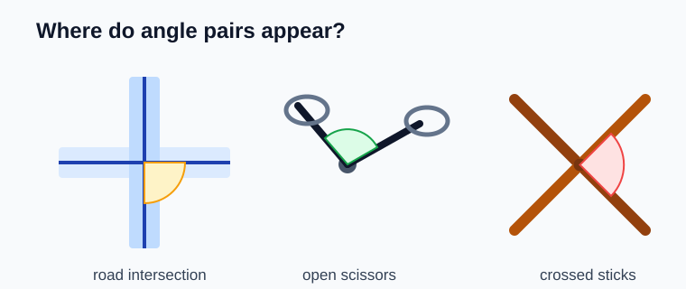
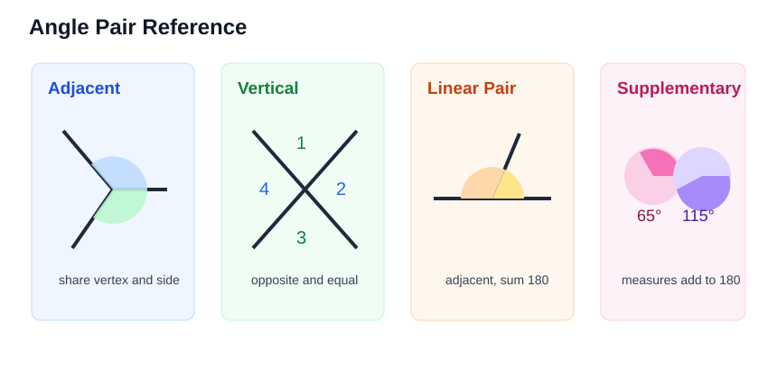
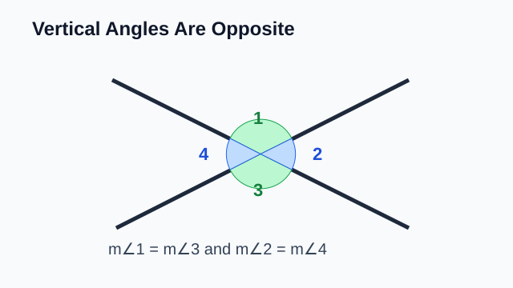
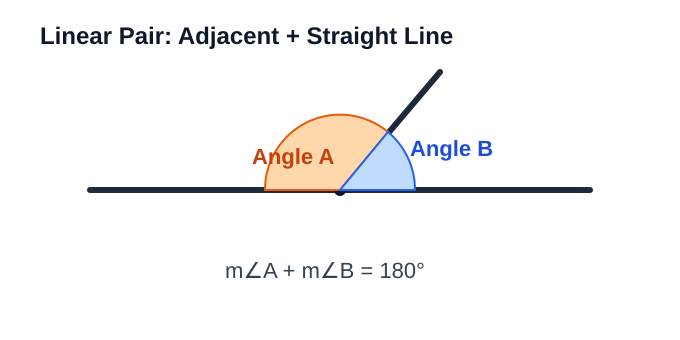
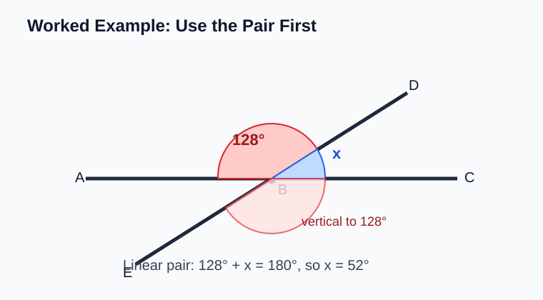
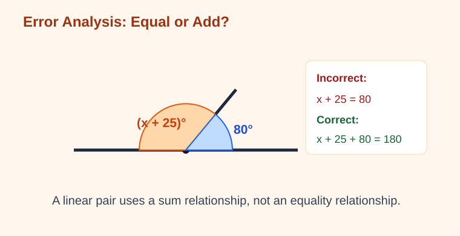

# Geometry - Lesson 6: Angle Pairs

> [!GOAL] Learning Goal
>
> By the end of this lesson, you should be able to **identify vertical, adjacent, linear pair, and supplementary angles**, then use those relationships to **solve missing-angle equations**.

**Content domain:** Measurement and Geometry  
**Estimated time:** 50 minutes  
**Difficulty:** Intermediate  
**Target competency:** Identify vertical, adjacent, linear pair, and supplementary angles.

---

## What You Should Already Know

This lesson builds from angle notation and angle measurement.

Before reading, check that you can:

- name an angle using three letters
- recognize that a straight angle measures $180^\circ$
- write a complete statement such as $m\angle ABC = 70^\circ$
- solve simple equations like $x + 35 = 180$

> [!CHECK] Pre-Check
>
> 1. What is the measure of a straight angle?
> 2. If $x + 40 = 180$, what is $x$?
> 3. In $\angle PQR$, which point is the vertex?
>
> Answers: $180^\circ$; $140$; $Q$.

## Try Before You Read

Look at a pair of scissors, an open road intersection, or two sticks crossing. Several angles appear at once.

Ask yourself:

- Which angles touch each other?
- Which angles face each other?
- Which two angles together make a straight line?

Those questions lead to **angle pairs**.

---

## Key Vocabulary

| Term | Meaning |
| --- | --- |
| Adjacent angles | Two angles that share a vertex and one common side, but do not overlap |
| Vertical angles | Opposite angles formed by two intersecting lines |
| Linear pair | Two adjacent angles whose non-common sides form a straight line |
| Supplementary angles | Two angles whose measures add to $180^\circ$ |
| Congruent angles | Angles with equal measures |
| Missing-angle equation | An equation used to find an unknown angle measure |

## Visual Introduction

Angle-pair names describe a relationship between two angles. The same diagram may contain more than one relationship, so read the labels carefully.

> [!IMPORTANT] Big Distinction
>
> **Adjacent** describes angles that touch.  
> **Vertical** describes angles that are opposite.  
> **Supplementary** describes angles whose measures add to $180^\circ$.

---

## Main Concept Explanation

### 1. Adjacent Angles

Adjacent angles sit next to each other.

To be adjacent, two angles must:

1. share a vertex
2. share one side
3. not overlap

Example: If rays $\overrightarrow{BA}$, $\overrightarrow{BC}$, and $\overrightarrow{BD}$ start at $B$, then $\angle ABC$ and $\angle CBD$ are adjacent because they share vertex $B$ and side $\overrightarrow{BC}$.

> [!WARNING] Common Trap
>
> Sharing only a vertex is not enough. Adjacent angles must also share a side.

### 2. Vertical Angles

Vertical angles are opposite angles made by intersecting lines.

In the diagram:

- $\angle 1$ and $\angle 3$ are vertical angles
- $\angle 2$ and $\angle 4$ are vertical angles
- vertical angles are congruent, so their measures are equal

If $m\angle 1 = 72^\circ$, then $m\angle 3 = 72^\circ$.

### 3. Linear Pairs

A linear pair is a special kind of adjacent pair.

Two angles form a linear pair when:

1. they are adjacent
2. their non-common sides form a straight line

Because a straight line measures $180^\circ$, a linear pair is always supplementary.

If $m\angle AOB = 115^\circ$ and $\angle AOB$ forms a linear pair with $\angle BOC$, then:

$$115^\circ + m\angle BOC = 180^\circ$$

So:

$$m\angle BOC = 65^\circ$$

### 4. Supplementary Angles

Supplementary angles add to $180^\circ$.

They may be adjacent, but they do not have to be adjacent.

Examples:

- $40^\circ$ and $140^\circ$ are supplementary.
- $75^\circ$ and $105^\circ$ are supplementary.
- $90^\circ$ and $90^\circ$ are supplementary.

> [!TIP] Quick Supplement Check
>
> Add the measures. If the sum is $180^\circ$, the angles are supplementary.

---

## Rule Box / Formula Box

| Relationship | How to recognize it | Measure rule |
| --- | --- | --- |
| Adjacent angles | Share vertex and side; do not overlap | No automatic equal or sum rule |
| Vertical angles | Opposite angles from intersecting lines | Measures are equal |
| Linear pair | Adjacent angles making a straight line | Measures add to $180^\circ$ |
| Supplementary angles | Any two angles with sum $180^\circ$ | $a + b = 180^\circ$ |

## Worked Example

Lines $AC$ and $DE$ intersect at $B$. Suppose $m\angle ABD = 128^\circ$. Find $m\angle DBC$ and $m\angle CBE$.

**Step 1: Find the linear pair.**  
$\angle ABD$ and $\angle DBC$ form a linear pair because they are adjacent and make a straight line.

**Step 2: Use the supplementary relationship.**

$$128^\circ + m\angle DBC = 180^\circ$$

$$m\angle DBC = 52^\circ$$

**Step 3: Use vertical angles.**  
$\angle ABD$ and $\angle CBE$ are vertical angles, so they are equal.

$$m\angle CBE = 128^\circ$$

> [!CHECK] Try It
>
> In the same diagram, which angle is vertical to $\angle DBC$?
>
> Answer: $\angle ABE$.

---

## Guided Practice

### Problem 1

Two angles share a vertex and one side, and their interiors do not overlap. What kind of angle pair are they?

**Hint 1:** Focus on whether the angles touch.  
**Hint 2:** The definition requires a shared vertex and shared side.  
**Answer:** adjacent angles

### Problem 2

Two lines intersect. If one angle measures $64^\circ$, what is the measure of its vertical angle?

**Hint 1:** Vertical angles are opposite angles.  
**Hint 2:** Vertical angles are congruent.  
**Answer:** $64^\circ$

### Problem 3

Angles $A$ and $B$ form a linear pair. If $m\angle A = 37^\circ$, find $m\angle B$.

**Hint 1:** A linear pair adds to $180^\circ$.  
**Hint 2:** Solve $37 + x = 180$.  
**Answer:** $143^\circ$

### Problem 4

Are $112^\circ$ and $68^\circ$ supplementary?

**Hint 1:** Add the two measures.  
**Hint 2:** Supplementary angles add to $180^\circ$.  
**Answer:** Yes, because $112^\circ + 68^\circ = 180^\circ$.

## Mini-Quiz

1. What relationship makes opposite angles equal when two lines intersect?
2. Do adjacent angles always add to $180^\circ$?
3. Find $x$ if $x$ and $124^\circ$ are supplementary.
4. A linear pair contains angles measuring $3x^\circ$ and $60^\circ$. Find $x$.

**Mini-Quiz Answers**

1. Vertical angles
2. No. Only adjacent angles that form a linear pair must add to $180^\circ$.
3. $x = 56$
4. $3x + 60 = 180$, so $3x = 120$ and $x = 40$.

---

## Independent Practice

Solve these on paper.

1. Name the angle-pair relationship: two opposite angles formed by intersecting lines.
2. Name the angle-pair relationship: two angles share a side and vertex but do not overlap.
3. Are $47^\circ$ and $133^\circ$ supplementary? Explain.
4. Find $x$ if $x^\circ$ and $83^\circ$ form a linear pair.
5. Find $x$ if vertical angles are labeled $(2x + 10)^\circ$ and $70^\circ$.
6. A straight road and a diagonal road intersect. One angle is $118^\circ$. Find the three other angle measures.
7. Draw two intersecting lines. Label one angle $42^\circ$, then label all vertical and linear-pair angles.
8. Explain why every linear pair is supplementary, but not every pair of supplementary angles must be a linear pair.

## Answer Key with Explanations

1. Vertical angles. Opposite angles are formed when two lines intersect.
2. Adjacent angles. They share a vertex and a side without overlapping.
3. Yes. $47^\circ + 133^\circ = 180^\circ$.
4. $x = 97$, because $x + 83 = 180$.
5. $x = 30$, because vertical angles are equal: $2x + 10 = 70$.
6. The vertical angle is $118^\circ$. Each adjacent angle is $62^\circ$ because $118 + 62 = 180$.
7. The vertical angle to $42^\circ$ is also $42^\circ$. Each adjacent linear-pair angle is $138^\circ$.
8. A linear pair makes a straight angle, so its measures add to $180^\circ$. Supplementary angles only need a sum of $180^\circ$; they might be separate angles.

---

## Misconception Alerts

> [!WARNING] Mistake 1: Thinking all adjacent angles are supplementary
>
> Adjacent angles only have to touch. They add to $180^\circ$ only when they form a linear pair.

> [!WARNING] Mistake 2: Thinking vertical means up and down
>
> In angle pairs, vertical angles are opposite angles formed by intersecting lines. They do not have to be physically vertical on the page.

> [!WARNING] Mistake 3: Setting linear pair angles equal
>
> Linear pair angles add to $180^\circ$. They are equal only in the special case where both are $90^\circ$.

## Error Analysis

A student sees a linear pair with angles $(x + 25)^\circ$ and $80^\circ$ and writes:

> "$x + 25 = 80$, so $x = 55$."

Find the mistake.

**Corrected reasoning:**

The two angles form a linear pair, so their measures add to $180^\circ$:

$$x + 25 + 80 = 180$$

$$x + 105 = 180$$

$$x = 75$$

The student used an equality relationship, but a linear pair uses a sum relationship.

## Self-Explanation Prompts

Answer these without looking back first.

1. How can you tell whether two angles are adjacent?
2. Why are vertical angles equal?
3. Why does a linear pair add to $180^\circ$?
4. What is the difference between a linear pair and supplementary angles?
5. When solving an angle-pair equation, how do you decide whether to set measures equal or add them?

**Sample responses**

- Adjacent angles share a vertex and one side, and they do not overlap.
- Vertical angles are opposite angles made by the same two intersecting lines, so each is supplementary to the same neighboring angle.
- A linear pair forms a straight angle, and a straight angle measures $180^\circ$.
- A linear pair must be adjacent and form a straight line. Supplementary angles only need measures that add to $180^\circ$.
- I set measures equal for vertical angles and add measures for linear pairs or supplementary angles.

## Extension Challenge

Two lines intersect. One angle is labeled $(4x - 8)^\circ$. Its adjacent angle is labeled $(2x + 20)^\circ$.

Find $x$ and both angle measures.

**Hint:** Adjacent angles formed by intersecting lines make a linear pair.

**Solution:**  
The angles are a linear pair:

$$4x - 8 + 2x + 20 = 180$$

$$6x + 12 = 180$$

$$6x = 168$$

$$x = 28$$

The angle measures are:

- $4(28) - 8 = 104^\circ$
- $2(28) + 20 = 76^\circ$

Check: $104^\circ + 76^\circ = 180^\circ$.

## Mastery Checklist

Check each statement when it is true for you.

- I can identify adjacent angles from a diagram.
- I can identify vertical angles from intersecting lines.
- I can explain why a linear pair adds to $180^\circ$.
- I can recognize supplementary angles even when they are not adjacent.
- I can solve $x + a = 180$ angle equations.
- I can solve simple vertical-angle equations.
- I can explain the difference between equal-angle relationships and sum-angle relationships.
- I can write a clear reason for each missing-angle step.

> [!PRACTICE] What To Do Next
>
> Use the practice exam to check the basic relationships. Use the assessment when you can solve missing-angle equations and explain why each relationship applies.

## Final Summary

Angle pairs help you read a diagram like a set of clues. **Vertical angles are equal.** **Linear pairs and supplementary angles add to $180^\circ$.** **Adjacent angles share a vertex and side**, but they do not automatically have a measure rule. Choose the relationship first, then write the equation.
