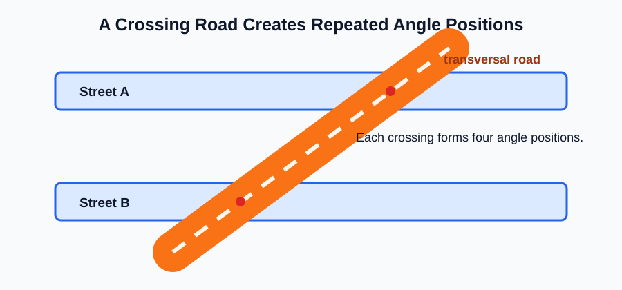
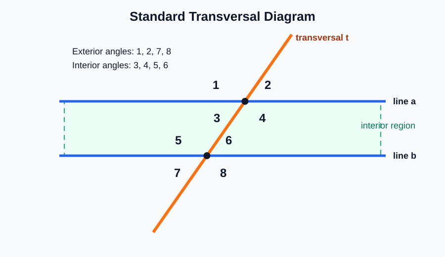
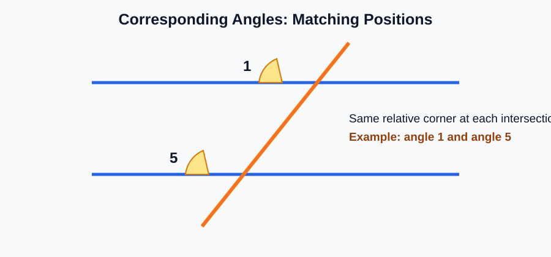
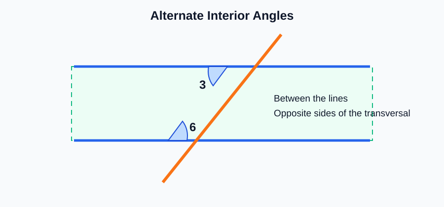
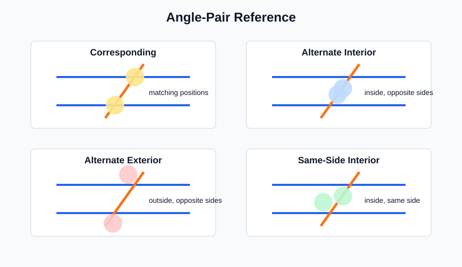
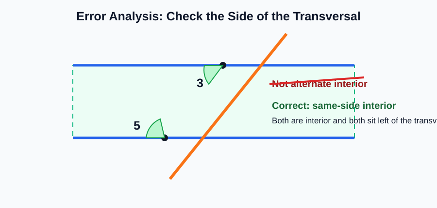

# Geometry - Lesson 7: Transversal Vocabulary

> [!GOAL] Learning Goal
>
> By the end of this lesson, you should be able to **identify and label angle pairs** formed when a transversal crosses two lines: corresponding, alternate interior, alternate exterior, and same-side interior angles.

**Content domain:** Measurement and Geometry  
**Estimated time:** 45 minutes  
**Difficulty:** Intermediate  
**Target competency:** Identify corresponding, alternate interior, alternate exterior, and same-side interior angles.

---

## What You Should Already Know

This lesson builds from angle notation and angle relationships.

Before reading, check that you can:

- recognize an angle from a diagram
- use labels such as $\angle 1$ and $\angle 2$
- tell whether a point or angle is above, below, inside, or outside two lines
- tell whether two objects are on the same side or opposite sides of another line

> [!CHECK] Pre-Check
>
> 1. In a diagram with two horizontal lines, what region is **between** the lines called?
> 2. If two angles are both above the same line, are they on the same side or opposite sides of that line?
> 3. What is a line that crosses another line called in everyday language?
>
> Answers: interior region; same side; a crossing line or intersecting line.

## Try Before You Read

Look at a road crossing two parallel streets, a ladder crossing two shelves, or a diagonal brace crossing fence rails. What geometric idea do you notice?

The crossing line creates angle positions that repeat. Geometry gives those positions names so you can talk about them precisely.

---

## Key Vocabulary

| Term | Meaning |
| --- | --- |
| Transversal | A line that intersects two or more lines at different points |
| Interior angles | Angles located between the two lines |
| Exterior angles | Angles located outside the two lines |
| Corresponding angles | Angles in matching positions at the two intersections |
| Alternate interior angles | Interior angles on opposite sides of the transversal |
| Alternate exterior angles | Exterior angles on opposite sides of the transversal |
| Same-side interior angles | Interior angles on the same side of the transversal |

> [!TIP] Vocabulary Shortcut
>
> Read the words in order. **Alternate** means opposite sides of the transversal. **Interior** means between the two lines. **Exterior** means outside the two lines.

## Visual Introduction

The diagram below is the basic map for transversal vocabulary.

In the diagram:

- line $t$ is the **transversal**
- angles $3$, $4$, $5$, and $6$ are **interior**
- angles $1$, $2$, $7$, and $8$ are **exterior**
- each angle has a position around one intersection

---

## Main Concept Explanation

### 1. Find the Transversal First

The transversal is the line that crosses the other two lines. Many mistakes happen because students label pairs before identifying the transversal.

Ask:

1. Which line crosses both other lines?
2. Which angles are between the two lines?
3. Are the angles on the same side or opposite sides of the transversal?

### 2. Corresponding Angles

Corresponding angles are in **matching positions** at different intersections.

Examples from the standard diagram:

| Pair | Why it is corresponding |
| --- | --- |
| $\angle 1$ and $\angle 5$ | both are upper-left positions |
| $\angle 2$ and $\angle 6$ | both are upper-right positions |
| $\angle 3$ and $\angle 7$ | both are lower-left positions |
| $\angle 4$ and $\angle 8$ | both are lower-right positions |

### 3. Alternate Interior Angles

Alternate interior angles are:

- between the two lines
- on opposite sides of the transversal

Examples:

- $\angle 3$ and $\angle 6$
- $\angle 4$ and $\angle 5$

### 4. Alternate Exterior Angles

Alternate exterior angles are:

- outside the two lines
- on opposite sides of the transversal

Examples:

- $\angle 1$ and $\angle 8$
- $\angle 2$ and $\angle 7$

### 5. Same-Side Interior Angles

Same-side interior angles are:

- between the two lines
- on the same side of the transversal

Examples:

- $\angle 3$ and $\angle 5$
- $\angle 4$ and $\angle 6$

---

## Rule Box

| Angle pair | Location clue | Side clue | Example |
| --- | --- | --- | --- |
| Corresponding | one interior or exterior at each intersection | matching position | $\angle 1$ and $\angle 5$ |
| Alternate interior | both interior | opposite sides | $\angle 3$ and $\angle 6$ |
| Alternate exterior | both exterior | opposite sides | $\angle 1$ and $\angle 8$ |
| Same-side interior | both interior | same side | $\angle 3$ and $\angle 5$ |

> [!IMPORTANT] Labeling Routine
>
> Do not guess from how the pair "looks." First decide **interior or exterior**, then decide **same side or opposite sides**.

## Worked Example

Use the standard diagram. Identify the relationship between $\angle 4$ and $\angle 5$.

**Step 1: Check the region.**  
$\angle 4$ and $\angle 5$ are between the two lines, so they are interior angles.

**Step 2: Check the side of the transversal.**  
$\angle 4$ is on the right side of the transversal. $\angle 5$ is on the left side.

**Step 3: Name the pair.**  
They are interior and on opposite sides, so they are **alternate interior angles**.

> [!CHECK] Try It
>
> Identify the relationship between $\angle 2$ and $\angle 7$.
>
> Answer: They are **alternate exterior angles** because they are outside the two lines and on opposite sides of the transversal.

---

## Guided Practice

### Problem 1

Identify the relationship between $\angle 1$ and $\angle 5$.

**Hint 1:** Look at their positions around each intersection.  
**Hint 2:** Both are in the upper-left position.  
**Answer:** Corresponding angles.

### Problem 2

Identify the relationship between $\angle 3$ and $\angle 6$.

**Hint 1:** Are both angles between the two lines?  
**Hint 2:** Are they on opposite sides of the transversal?  
**Answer:** Alternate interior angles.

### Problem 3

Identify the relationship between $\angle 3$ and $\angle 5$.

**Hint 1:** Both angles are between the two lines.  
**Hint 2:** Both are on the same side of the transversal.  
**Answer:** Same-side interior angles.

### Problem 4

Identify the relationship between $\angle 1$ and $\angle 8$.

**Hint 1:** Both angles are outside the two lines.  
**Hint 2:** They are on opposite sides of the transversal.  
**Answer:** Alternate exterior angles.

## Mini-Quiz

1. What is a transversal?
2. Which angles are interior in the standard diagram: $1, 2, 3, 4, 5, 6, 7, 8$?
3. What pair type describes $\angle 2$ and $\angle 6$?
4. What pair type describes $\angle 4$ and $\angle 6$?
5. What pair type describes $\angle 2$ and $\angle 7$?

**Mini-Quiz Answers**

1. A line that intersects two or more lines at different points.
2. $\angle 3$, $\angle 4$, $\angle 5$, and $\angle 6$.
3. Corresponding angles.
4. Same-side interior angles.
5. Alternate exterior angles.

---

## Independent Practice

Use the standard numbered diagram from the Visual Introduction.

1. List all four corresponding angle pairs.
2. List both alternate interior angle pairs.
3. List both alternate exterior angle pairs.
4. List both same-side interior angle pairs.
5. Explain why $\angle 3$ and $\angle 6$ are not corresponding angles.
6. Explain why $\angle 1$ and $\angle 8$ are not same-side interior angles.
7. Create your own diagram with two lines and a transversal. Number the eight angles.
8. In your diagram, circle one pair of alternate interior angles and box one pair of corresponding angles.

## Answer Key with Explanations

1. Corresponding pairs: $\angle 1$ and $\angle 5$, $\angle 2$ and $\angle 6$, $\angle 3$ and $\angle 7$, $\angle 4$ and $\angle 8$. They occupy matching positions.
2. Alternate interior pairs: $\angle 3$ and $\angle 6$, $\angle 4$ and $\angle 5$. They are between the lines and on opposite sides of the transversal.
3. Alternate exterior pairs: $\angle 1$ and $\angle 8$, $\angle 2$ and $\angle 7$. They are outside the lines and on opposite sides of the transversal.
4. Same-side interior pairs: $\angle 3$ and $\angle 5$, $\angle 4$ and $\angle 6$. They are between the lines and on the same side of the transversal.
5. They are not corresponding because they do not occupy matching positions at the two intersections. They are alternate interior.
6. They are not same-side interior because both angles are exterior. They are alternate exterior.
7. The diagram should show one line crossing two other lines at two different points.
8. Correct answers depend on your numbering, but the circled pair must be interior and opposite sides, while the boxed pair must be in matching positions.

---

## Misconception Alerts

> [!WARNING] Mistake 1: Calling every opposite-side pair "alternate"
>
> Alternate pairs must also match the region: both interior or both exterior.

> [!WARNING] Mistake 2: Treating corresponding as "same side"
>
> Corresponding angles are in matching positions at the two intersections. Some corresponding pairs are on the same side of the transversal, but the key idea is matching position.

> [!WARNING] Mistake 3: Forgetting to identify the interior region
>
> The interior region is between the two lines, not inside an angle.

## Error Analysis

A student writes:

> "$\angle 3$ and $\angle 5$ are alternate interior angles because both are inside the two lines."

Find the mistake.

**Corrected reasoning:**  
$\angle 3$ and $\angle 5$ are both interior, but they are on the **same side** of the transversal. They are **same-side interior angles**, not alternate interior angles.

## Self-Explanation Prompts

Answer these without looking back first.

1. How do you find the transversal in a diagram?
2. What does "interior" mean in transversal vocabulary?
3. What is the difference between alternate interior and same-side interior angles?
4. Why are $\angle 1$ and $\angle 5$ corresponding instead of alternate exterior?
5. What two checks should you make before naming an angle pair?

**Sample responses**

- The transversal is the line that crosses the other two lines.
- Interior angles are between the two lines.
- Alternate interior angles are on opposite sides of the transversal; same-side interior angles are on the same side.
- They are in matching positions, and $\angle 5$ is interior, so the pair is not alternate exterior.
- I check the region and then the side of the transversal.

## Extension Challenge

In the standard diagram, choose one angle from the top intersection and one angle from the bottom intersection so that the pair is **not** one of the four special pair types in this lesson.

**Hint:** Try pairing one interior angle with one exterior angle that is not in a matching position.

**One possible solution:**  
$\angle 1$ and $\angle 6$ are not corresponding, alternate interior, alternate exterior, or same-side interior. One is exterior, one is interior, and they are not in matching positions.

## Mastery Checklist

Check each statement when it is true for you.

- I can identify the transversal in a diagram.
- I can locate the interior and exterior regions.
- I can identify corresponding angles by matching position.
- I can identify alternate interior angles.
- I can identify alternate exterior angles.
- I can identify same-side interior angles.
- I can explain my classification using region and side clues.
- I can avoid common vocabulary mistakes.

> [!PRACTICE] What To Do Next
>
> Use the practice exam to check the four vocabulary categories. Use the assessment when you can explain each label without looking at the reference chart.

## Final Summary

Transversal vocabulary is about **position**. First find the transversal. Then decide whether the angles are interior or exterior. Finally decide whether they are in matching positions, on opposite sides, or on the same side. That routine makes the four angle-pair names much easier to use.
