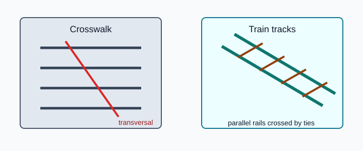
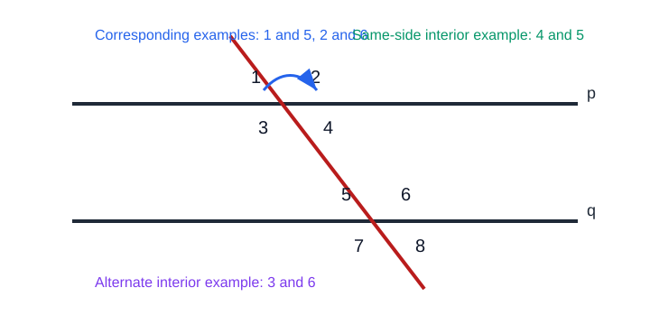
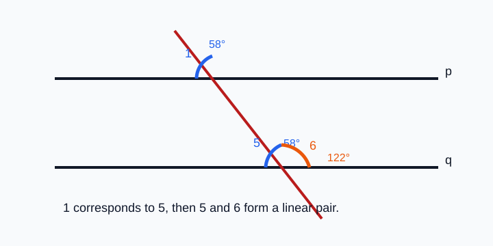
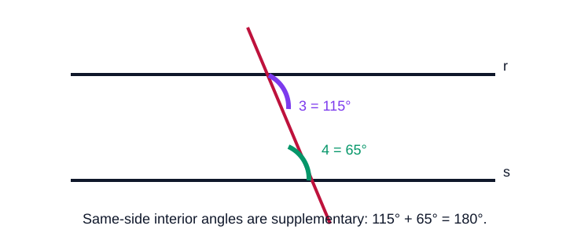
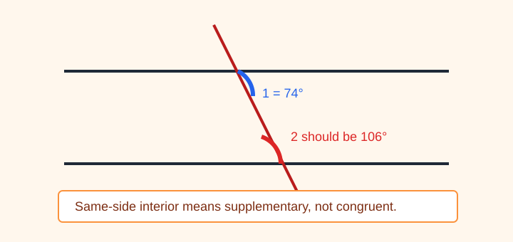
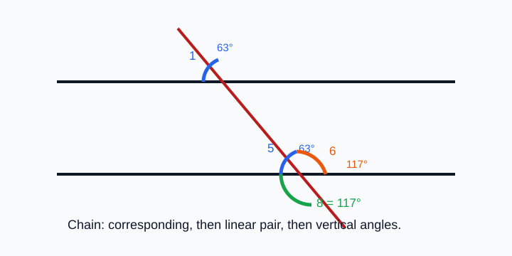

# Geometry - Lesson 8: Parallel Line Angle Theorems

> [!GOAL] Learning Goal
>
> By the end of this lesson, you should be able to **use angle relationships formed by parallel lines and a transversal to find missing angle measures**, then **justify each step with the correct relationship**.

**Content domain:** Measurement and Geometry  
**Estimated time:** 50 minutes  
**Difficulty:** Intermediate  
**Target competency:** Use angle relationships to find measures.

---

## What You Should Already Know

This lesson builds from Lessons 6 and 7.

Before reading, check that you can:

- identify vertical angles and linear pairs
- identify corresponding, alternate interior, alternate exterior, and same-side interior angle pairs
- remember that supplementary angles add to $180^\circ$
- solve simple equations such as $x + 64 = 180$

> [!CHECK] Pre-Check
>
> 1. What is the measure of the supplement of $75^\circ$?
> 2. If two vertical angles are formed and one is $48^\circ$, what is the other?
> 3. Which angle-pair name means "between the parallel lines and on opposite sides of the transversal"?
>
> Answers: $105^\circ$; $48^\circ$; alternate interior angles.

## Try Before You Read

Look at a crosswalk, train tracks, floor tiles, or notebook lines. Parallel lines often appear with another line crossing them.

If one angle is measured, many other angles can be found without measuring again. The key is to know whether a relationship means **congruent** or **supplementary**.

---

## Key Vocabulary

| Term | Meaning |
| --- | --- |
| Parallel lines | Lines in the same plane that never intersect |
| Transversal | A line that intersects two or more lines |
| Congruent angles | Angles with equal measures |
| Supplementary angles | Two angles whose measures add to $180^\circ$ |
| Corresponding angles | Angles in matching positions at the two intersections |
| Alternate interior angles | Angles between the parallel lines on opposite sides of the transversal |
| Alternate exterior angles | Angles outside the parallel lines on opposite sides of the transversal |
| Same-side interior angles | Angles between the parallel lines on the same side of the transversal |
| Vertical angles | Opposite angles formed by intersecting lines |
| Linear pair | Adjacent angles whose noncommon sides form a straight line |

## Visual Introduction

When two parallel lines are cut by a transversal, angle pairs follow predictable rules.

| Relationship | What happens to the measures? |
| --- | --- |
| Corresponding angles | Congruent |
| Alternate interior angles | Congruent |
| Alternate exterior angles | Congruent |
| Same-side interior angles | Supplementary |
| Vertical angles | Congruent |
| Linear pair | Supplementary |

> [!IMPORTANT] Main Decision
>
> Before calculating, ask: **Should I copy the measure, or should I subtract from $180^\circ$?**

---

## Main Concept Explanation

### 1. Relationships That Copy the Measure

Use the same measure when angles are congruent.

These relationships are congruent:

- corresponding angles
- alternate interior angles
- alternate exterior angles
- vertical angles

If one angle is $62^\circ$, a congruent partner is also $62^\circ$.

### 2. Relationships That Add to 180 Degrees

Use subtraction from $180^\circ$ when angles are supplementary.

These relationships are supplementary:

- same-side interior angles
- linear pairs

If one angle is $62^\circ$, a supplementary partner is:

$$180^\circ - 62^\circ = 118^\circ$$

> [!WARNING] Common Trap
>
> Do not treat every angle pair as equal. Same-side interior angles and linear pairs usually require subtraction from $180^\circ$.

## Rule Box

| If the relationship is... | Then write... | Reason |
| --- | --- | --- |
| Corresponding | $m\angle A = m\angle B$ | Corresponding angles are congruent |
| Alternate interior | $m\angle A = m\angle B$ | Alternate interior angles are congruent |
| Alternate exterior | $m\angle A = m\angle B$ | Alternate exterior angles are congruent |
| Vertical | $m\angle A = m\angle B$ | Vertical angles are congruent |
| Same-side interior | $m\angle A + m\angle B = 180^\circ$ | Same-side interior angles are supplementary |
| Linear pair | $m\angle A + m\angle B = 180^\circ$ | A linear pair is supplementary |

---

## Worked Example

In the diagram, lines $p$ and $q$ are parallel. Angle 1 measures $58^\circ$. Find $m\angle 6$.

**Step 1: Use corresponding angles.**  
$\angle 1$ and $\angle 5$ are corresponding angles, so they are congruent.

$$m\angle 5 = 58^\circ$$

**Step 2: Use a linear pair.**  
$\angle 5$ and $\angle 6$ form a linear pair, so they are supplementary.

$$m\angle 6 = 180^\circ - 58^\circ = 122^\circ$$

**Answer:** $m\angle 6 = 122^\circ$

**Justification:** Corresponding angles are congruent; a linear pair is supplementary.

> [!CHECK] Try It
>
> If $m\angle 1 = 72^\circ$ in the same diagram, what is $m\angle 6$?
>
> Answer: $108^\circ$, because $\angle 5$ corresponds to $\angle 1$, then $\angle 5$ and $\angle 6$ form a linear pair.

---

## Guided Practice

### Problem 1

Parallel lines are cut by a transversal. $m\angle A = 83^\circ$. Angle B is corresponding to angle A. Find $m\angle B$.

**Hint 1:** Corresponding angles are matching-position angles.  
**Hint 2:** Corresponding angles are congruent.  
**Answer:** $m\angle B = 83^\circ$

### Problem 2

In the diagram, $r \parallel s$. If $m\angle 3 = 115^\circ$, find $m\angle 4$.

**Hint 1:** The angles are inside the parallel lines on the same side of the transversal.  
**Hint 2:** Same-side interior angles are supplementary.  
**Answer:** $m\angle 4 = 65^\circ$ because $180 - 115 = 65$.

### Problem 3

Parallel lines are cut by a transversal. $m\angle X = 41^\circ$. Angle Y is alternate exterior to X. Angle Z is vertical to Y. Find $m\angle Z$.

**Hint 1:** Alternate exterior angles are congruent.  
**Hint 2:** Vertical angles are also congruent.  
**Answer:** $m\angle Z = 41^\circ$

---

## Mini-Quiz

1. Corresponding angles are congruent or supplementary?
2. Same-side interior angles are congruent or supplementary?
3. If one angle in a linear pair is $137^\circ$, what is the other angle?
4. If $m\angle 1 = 69^\circ$ and $\angle 2$ is alternate interior to $\angle 1$, what is $m\angle 2$?

**Mini-Quiz Answers**

1. Congruent
2. Supplementary
3. $43^\circ$
4. $69^\circ$

---

## Independent Practice

Solve these on paper. Write both the measure and the relationship you used.

1. A corresponding angle to $54^\circ$
2. An alternate interior angle to $121^\circ$
3. A same-side interior angle paired with $88^\circ$
4. A linear-pair partner of $143^\circ$
5. A vertical angle to $36^\circ$
6. An alternate exterior angle to $109^\circ$
7. Angle A is $67^\circ$. Angle B corresponds to A. Angle C forms a linear pair with B. Find $m\angle C$.
8. Angle D is $128^\circ$. Angle E is same-side interior with D. Angle F is vertical to E. Find $m\angle F$.

## Answer Key with Explanations

1. $54^\circ$; corresponding angles are congruent.
2. $121^\circ$; alternate interior angles are congruent.
3. $92^\circ$; same-side interior angles are supplementary.
4. $37^\circ$; a linear pair is supplementary.
5. $36^\circ$; vertical angles are congruent.
6. $109^\circ$; alternate exterior angles are congruent.
7. $m\angle C = 113^\circ$; corresponding angles copy $67^\circ$, then a linear pair adds to $180^\circ$.
8. $m\angle F = 52^\circ$; same-side interior gives $180 - 128 = 52$, then vertical angles are congruent.

---

## Misconception Alerts

> [!WARNING] Mistake 1: Mixing up alternate interior and same-side interior
>
> Alternate interior angles are on opposite sides of the transversal and are congruent. Same-side interior angles are on the same side and are supplementary.

> [!WARNING] Mistake 2: Forgetting the lines must be parallel
>
> Corresponding, alternate interior, alternate exterior, and same-side interior theorems require parallel lines.

> [!WARNING] Mistake 3: Naming the relationship but using the wrong operation
>
> If the relationship is congruent, copy the measure. If it is supplementary, subtract from $180^\circ$.

## Error Analysis

A student writes:

> "$m\angle 1 = 74^\circ$. Angle 2 is same-side interior with angle 1, so $m\angle 2 = 74^\circ$."

Find the mistake.

**Corrected reasoning:**  
Same-side interior angles are supplementary, not congruent.

$$m\angle 2 = 180^\circ - 74^\circ = 106^\circ$$

So $m\angle 2 = 106^\circ$.

---

## Multi-Step Reasoning

Some problems require more than one relationship. Work one step at a time.

Example:

- $m\angle 1 = 63^\circ$
- $\angle 1$ corresponds to $\angle 5$
- $\angle 5$ and $\angle 6$ form a linear pair
- $\angle 6$ is vertical to $\angle 8$

Then:

1. $m\angle 5 = 63^\circ$ because corresponding angles are congruent.
2. $m\angle 6 = 117^\circ$ because a linear pair is supplementary.
3. $m\angle 8 = 117^\circ$ because vertical angles are congruent.

## Self-Explanation Prompts

Answer these without looking back first.

1. How do you decide whether to copy a measure or subtract from $180^\circ$?
2. Why does the statement "parallel lines" matter in this lesson?
3. What is the difference between alternate interior and same-side interior angles?
4. In a two-step problem, why should you name the relationship at each step?

**Sample responses**

- I copy the measure for congruent relationships and subtract from $180^\circ$ for supplementary relationships.
- The parallel-line theorems only work when the lines are parallel.
- Alternate interior angles are inside on opposite sides of the transversal; same-side interior angles are inside on the same side.
- Naming each relationship keeps the reasoning organized and prevents using the wrong operation.

## Extension Challenge

Parallel lines $m$ and $n$ are cut by a transversal. $m\angle A = (2x + 15)^\circ$ and $m\angle B = (5x - 30)^\circ$. Angles A and B are alternate interior angles.

Find $x$ and the measure of each angle.

**Hint:** Alternate interior angles are congruent.

**Solution:**  
Set the expressions equal:

$$2x + 15 = 5x - 30$$

Add $30$ to both sides:

$$2x + 45 = 5x$$

Subtract $2x$ from both sides:

$$45 = 3x$$

So $x = 15$.

Then:

$$2(15) + 15 = 45$$

and

$$5(15) - 30 = 45$$

Both angles measure $45^\circ$.

## Mastery Checklist

Check each statement when it is true for you.

- I can identify whether an angle relationship is congruent or supplementary.
- I can use corresponding angles to find a missing measure.
- I can use alternate interior angles to find a missing measure.
- I can use alternate exterior angles to find a missing measure.
- I can use same-side interior angles to find a missing measure.
- I can combine vertical angles, linear pairs, and parallel-line theorems in one problem.
- I can justify each step with a named relationship.

> [!PRACTICE] What To Do Next
>
> Use the practice exam to check the core theorems. Use the assessment when you can write the measure and the reason for each step without guessing.

## Final Summary

Parallel-line angle problems are less about measuring and more about recognizing relationships. If the relationship is **corresponding**, **alternate interior**, **alternate exterior**, or **vertical**, copy the measure. If it is **same-side interior** or a **linear pair**, subtract from $180^\circ$. Strong solutions name the relationship for every step.
