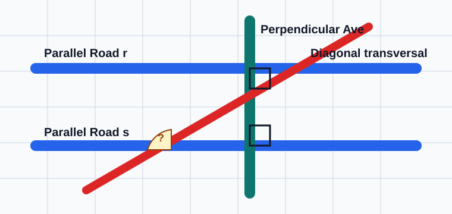
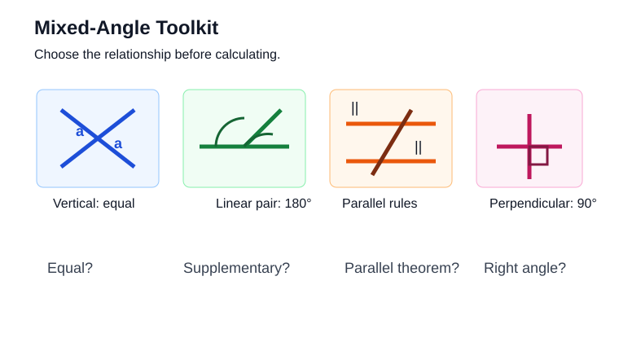
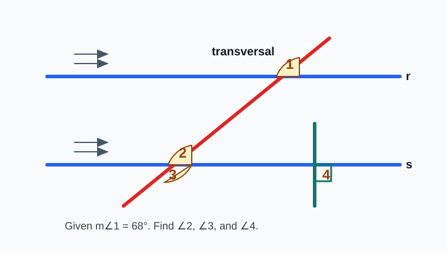
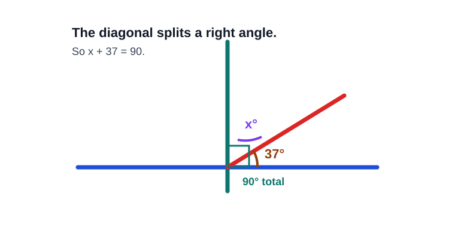
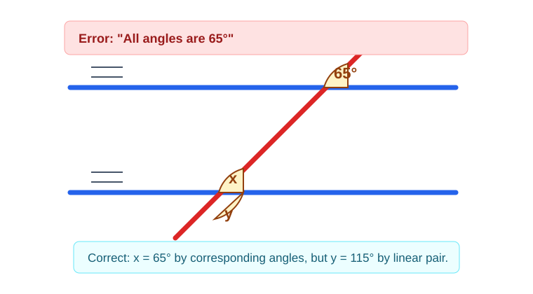
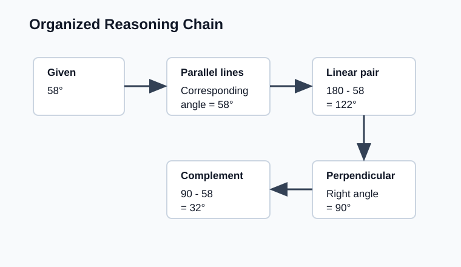

# Geometry - Lesson 9: Mixed Parallel and Perpendicular Problems

> [!GOAL] Learning Goal
>
> By the end of this lesson, you should be able to solve **multi-step missing-angle problems** that combine parallel lines, perpendicular lines, and transversals. You should also be able to write the reason for each step.

**Content domain:** Measurement and Geometry  
**Estimated time:** 55 minutes  
**Difficulty:** Intermediate  
**Target competency:** Solve multi-step diagrams involving transversals.

---

## What You Should Already Know

This lesson combines ideas from Lessons 3 to 8. Before starting, check that you can:

- recognize that perpendicular lines form $90^\circ$ angles
- use a linear pair to make $180^\circ$
- use vertical angles as equal angles
- identify corresponding, alternate interior, alternate exterior, and same-side interior angles
- use parallel-line theorems to transfer an angle measure across a transversal

> [!CHECK] Pre-Check
>
> 1. If two lines are perpendicular, what is the measure of each angle they form?
> 2. If two angles form a linear pair and one is $118^\circ$, what is the other?
> 3. When parallel lines are cut by a transversal, are corresponding angles equal or supplementary?
> 4. If same-side interior angles are formed by parallel lines, what is their sum?
>
> Answers: $90^\circ$; $62^\circ$; equal; $180^\circ$.

## Try Before You Read

Road maps often mix parallel streets, perpendicular intersections, and diagonal roads. A single marked angle can help you find many other angles.

Look at the map. If one diagonal-road angle is known, what other angles might be forced by the street layout?

**Thinking guide:** Search in this order:

1. right angles from perpendicular roads
2. equal angles from vertical angles
3. equal or supplementary angles from parallel lines
4. linear pairs that total $180^\circ$

---

## Key Vocabulary

| Term | Meaning |
| --- | --- |
| Parallel lines | Lines in the same plane that never meet |
| Perpendicular lines | Lines that intersect to form right angles |
| Transversal | A line that intersects two or more lines |
| Vertical angles | Opposite angles formed by intersecting lines; they are congruent |
| Linear pair | Adjacent angles whose non-common sides form a straight line; they sum to $180^\circ$ |
| Corresponding angles | Matching-position angles formed by a transversal across two lines |
| Alternate interior angles | Interior angles on opposite sides of the transversal |
| Same-side interior angles | Interior angles on the same side of the transversal; supplementary when lines are parallel |
| Organized reasoning | A step-by-step explanation that states both a measure and the relationship used |

## Visual Introduction

Mixed diagrams feel hard because several rules are available at once. Your job is not to guess the rule. Your job is to choose the rule that connects the angle you know to the angle you need.

> [!IMPORTANT] Strategy
>
> Work from facts that are certain. Mark right angles first, then copy equal angles, then use $180^\circ$ relationships.

---

## Main Concept Explanation

### 1. Start with the strongest clue

Perpendicular markings and parallel markings are not decoration. They tell you which theorem is available.

| Diagram clue | What it gives you |
| --- | --- |
| Small square corner | A $90^\circ$ angle |
| Arrow marks on two lines | Parallel-line angle relationships |
| One line crossing two others | A transversal |
| Opposite angles at an intersection | Vertical angles are equal |
| Adjacent angles on a straight line | Measures add to $180^\circ$ |

### 2. Use a chain of reasons

A multi-step problem usually needs a chain like this:

1. Use a parallel-line relationship to find one angle.
2. Use a vertical angle or linear pair at the same intersection.
3. Use perpendicular lines if a right angle is involved.
4. Write each reason, not only the final number.

### 3. Keep notation clear

When you write a solution, use complete statements:

- $m\angle 1 = 72^\circ$ because corresponding angles are congruent.
- $m\angle 2 = 108^\circ$ because it forms a linear pair with $\angle 1$.
- $m\angle 3 = 90^\circ$ because the lines are perpendicular.

---

## Rule Box / Formula Box

| Relationship | Rule |
| --- | --- |
| Vertical angles | Equal |
| Linear pair | Sum is $180^\circ$ |
| Supplementary angles | Sum is $180^\circ$ |
| Corresponding angles with parallel lines | Equal |
| Alternate interior angles with parallel lines | Equal |
| Alternate exterior angles with parallel lines | Equal |
| Same-side interior angles with parallel lines | Sum is $180^\circ$ |
| Perpendicular lines | Form $90^\circ$ angles |

> [!TIP] Reason First
>
> Before calculating, say the relationship out loud: "This is a linear pair," or "These are alternate interior angles." The arithmetic is usually easier than choosing the relationship.

## Worked Example

In the diagram, lines $r$ and $s$ are parallel. A transversal crosses both. A separate line is perpendicular to $s$. Given $m\angle 1 = 68^\circ$, find $m\angle 2$, $m\angle 3$, and $m\angle 4$.

**Step 1: Transfer across the parallel lines.**  
$\angle 1$ and $\angle 2$ are corresponding angles, so they are equal.

$$m\angle 2 = 68^\circ$$

**Step 2: Use a linear pair at the lower intersection.**  
$\angle 2$ and $\angle 3$ form a straight line.

$$m\angle 3 = 180^\circ - 68^\circ = 112^\circ$$

**Step 3: Use the perpendicular clue.**  
The marked perpendicular line forms right angles.

$$m\angle 4 = 90^\circ$$

**Organized answer:**  
$m\angle 2 = 68^\circ$ by corresponding angles.  
$m\angle 3 = 112^\circ$ by linear pair.  
$m\angle 4 = 90^\circ$ by perpendicular lines.

---

## Guided Practice

### Problem 1

Two parallel lines are cut by a transversal. $\angle A$ and $\angle B$ are alternate interior angles. If $m\angle A = 74^\circ$, find $m\angle B$.

**Hint 1:** Alternate interior angles are congruent when the lines are parallel.  
**Hint 2:** Congruent means equal measure.  
**Answer:** $m\angle B = 74^\circ$

### Problem 2

At the same intersection, $\angle B$ and $\angle C$ form a linear pair. If $m\angle B = 74^\circ$, find $m\angle C$.

**Hint 1:** A linear pair totals $180^\circ$.  
**Hint 2:** Compute $180 - 74$.  
**Answer:** $m\angle C = 106^\circ$

### Problem 3

A horizontal line is perpendicular to a vertical line. A diagonal transversal crosses the horizontal line and forms a $37^\circ$ angle with it. What angle does the diagonal make with the vertical line on the same side?

**Hint 1:** The horizontal and vertical lines make $90^\circ$.  
**Hint 2:** The two smaller angles split the right angle.  
**Answer:** $90^\circ - 37^\circ = 53^\circ$

---

## Mini-Quiz

1. Lines $m$ and $n$ are parallel. A transversal creates corresponding angles $\angle 1$ and $\angle 5$. If $m\angle 1 = 82^\circ$, what is $m\angle 5$?
2. If $\angle 5$ and $\angle 6$ form a linear pair, and $m\angle 5 = 82^\circ$, what is $m\angle 6$?
3. If two lines are perpendicular, what measure should you mark at their intersection?
4. Same-side interior angles formed by parallel lines have measures $x^\circ$ and $121^\circ$. Find $x$.

**Mini-Quiz Answers**

1. $82^\circ$
2. $98^\circ$
3. $90^\circ$
4. $59^\circ$

---

## Independent Practice

Solve these on paper. For each item, write at least one reason.

1. Parallel lines are cut by a transversal. Corresponding angles $\angle 1$ and $\angle 2$ are shown. If $m\angle 1 = 63^\circ$, find $m\angle 2$.
2. $\angle 2$ and $\angle 3$ form a linear pair. If $m\angle 2 = 63^\circ$, find $m\angle 3$.
3. Vertical angles $\angle 4$ and $\angle 5$ are formed by intersecting lines. If $m\angle 4 = 117^\circ$, find $m\angle 5$.
4. Same-side interior angles have measures $4x^\circ$ and $100^\circ$. Find $x$.
5. A perpendicular intersection is split by a ray into angles of $2x^\circ$ and $34^\circ$. Find $x$.
6. In a diagram with parallel lines, an alternate interior angle measures $71^\circ$. Its adjacent linear-pair angle at the other intersection is labeled $y^\circ$. Find $y$.
7. A city map has two parallel roads crossed by a diagonal road. One acute angle is $48^\circ$. A perpendicular road intersects one parallel road nearby. Name one angle that must be $90^\circ$ and one angle that must be $48^\circ$.
8. Write a two-step explanation for finding an angle that is supplementary to an angle corresponding to $76^\circ$.

## Answer Key with Explanations

1. $m\angle 2 = 63^\circ$ because corresponding angles are congruent.
2. $m\angle 3 = 117^\circ$ because a linear pair sums to $180^\circ$.
3. $m\angle 5 = 117^\circ$ because vertical angles are congruent.
4. Same-side interior angles are supplementary, so $4x + 100 = 180$. Then $4x = 80$, so $x = 20$.
5. The two angles split a right angle, so $2x + 34 = 90$. Then $2x = 56$, so $x = 28$.
6. The alternate interior angle is $71^\circ$, so the matching angle is $71^\circ$. Its adjacent linear-pair angle is $180 - 71 = 109^\circ$, so $y = 109$.
7. Any angle at the perpendicular intersection is $90^\circ$. The corresponding or vertical acute angle matching the given acute angle is $48^\circ$.
8. First, the corresponding angle is $76^\circ$ because the lines are parallel. Then the supplementary angle is $180 - 76 = 104^\circ$.

---

## Misconception Alerts

> [!WARNING] Mistake 1: Treating every pair as equal
>
> Some angle pairs are equal, but same-side interior angles and linear pairs are supplementary. Check whether the relationship means "equal" or "adds to $180^\circ$."

> [!WARNING] Mistake 2: Ignoring the perpendicular mark
>
> A small square corner gives you $90^\circ$ immediately. Use that fact before trying more complicated rules.

> [!WARNING] Mistake 3: Skipping the reason
>
> A correct number without a reason is not complete reasoning. In mixed diagrams, the reason is what proves your answer.

## Error Analysis

A student writes:

> "Since the lines are parallel, all angles in the diagram are $65^\circ$. Therefore $x = 65$ and $y = 65$."

Find the mistake.

**Corrected reasoning:**  
Only certain angle pairs are congruent. If $x$ corresponds to the $65^\circ$ angle, then $x = 65^\circ$. But if $y$ forms a linear pair with $x$, then:

$$y = 180^\circ - 65^\circ = 115^\circ$$

The relationship decides whether you copy the measure or subtract from $180^\circ$.

---

## Self-Explanation Prompts

Use these to check whether your reasoning is organized.

1. Which lines are parallel or perpendicular?
2. What angle measure is given first?
3. Which angle relationship connects the given angle to the next angle?
4. Does the relationship mean equal, $90^\circ$, or supplementary?
5. How can I write the solution as a chain of reasons?

Sample response

Lines $r$ and $s$ are parallel, and line $t$ is a transversal. The given angle is $72^\circ$. The angle I need first is corresponding to it, so it is also $72^\circ$. The final angle forms a linear pair with that angle, so it is $180^\circ - 72^\circ = 108^\circ$.

## Extension Challenge

Two parallel lines are cut by a transversal. A second line is perpendicular to the lower parallel line. One acute angle formed by the transversal and the upper parallel line is $58^\circ$.

1. Find the corresponding acute angle at the lower parallel line.
2. Find its adjacent obtuse angle.
3. Find the angle between the transversal and the perpendicular line on the same side as the acute angle.

Hint

The transversal makes $58^\circ$ with a parallel line. The perpendicular line makes $90^\circ$ with that same parallel direction.

Full solution

The corresponding acute angle is $58^\circ$. Its adjacent linear-pair angle is $180^\circ - 58^\circ = 122^\circ$. The angle between the transversal and the perpendicular line is $90^\circ - 58^\circ = 32^\circ$.

## Mastery Checklist

Check each statement when you can do it without guessing.

- [ ] I can identify parallel, perpendicular, and transversal lines in a diagram.
- [ ] I can decide whether an angle relationship gives equal angles, supplementary angles, or right angles.
- [ ] I can use corresponding and alternate interior angles to transfer measures.
- [ ] I can use linear pairs and same-side interior angles to subtract from $180^\circ$.
- [ ] I can use perpendicular lines to mark $90^\circ$ angles.
- [ ] I can solve at least two-step missing-angle problems.
- [ ] I can write a reason for each angle measure I find.

> [!PRACTICE] What To Do Next
>
> Use the practice quiz for quick recall of mixed angle relationships. Then use the assessment when you can explain each step without looking back at the rule table.

## Final Summary

Mixed parallel and perpendicular problems are solved by building a chain. First mark certain facts such as $90^\circ$ angles and given measures. Then use the correct relationship: equal for vertical, corresponding, and alternate interior angles; supplementary for linear pairs and same-side interior angles; $90^\circ$ for perpendicular lines. The strongest solutions show both the measure and the reason.
