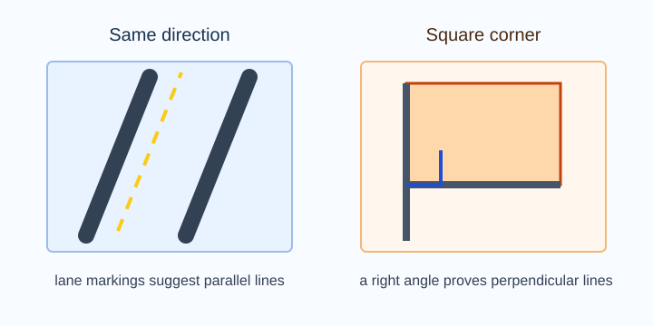
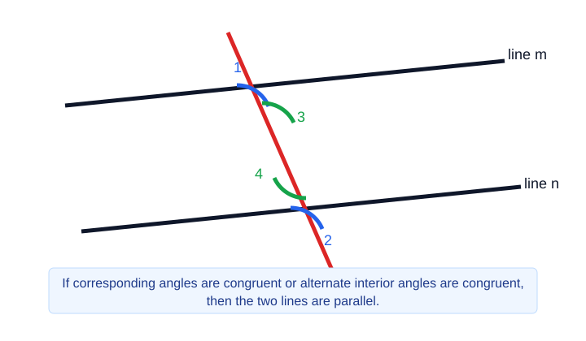
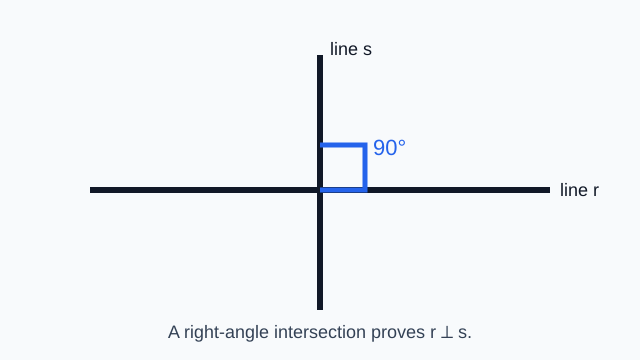
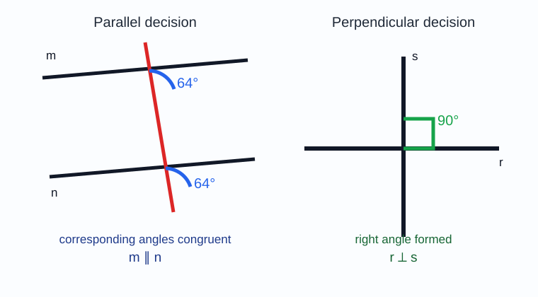
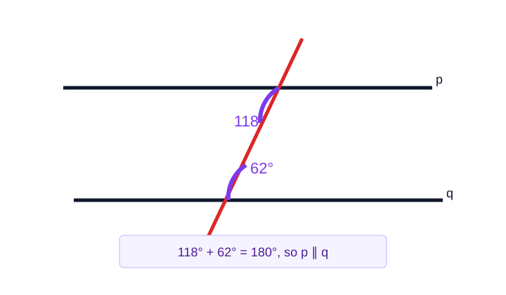
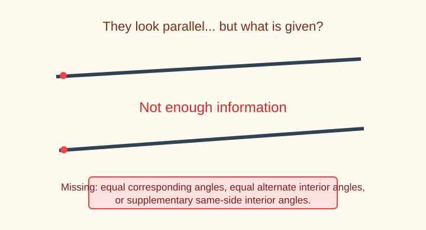

# Geometry - Lesson 1: Conditions for Parallel and Perpendicular Lines

> [!GOAL] Learning Goal
>
> By the end of this lesson, you should be able to **decide whether lines must be parallel or perpendicular** by using visual direction, angle relationships, and right-angle conditions.

**Content domain:** Measurement and Geometry  
**Estimated time:** 50 minutes  
**Difficulty:** Intermediate  
**Target competency:** Use slope-like visual conditions and angle relationships.

---

## What You Should Already Know

This lesson connects Quarter 1 angle relationships to a new question: **What information is strong enough to prove a line relationship?**

Before reading, check that you can:

- identify corresponding, alternate interior, and same-side interior angles
- remember that supplementary angles add to $180^\circ$
- recognize a right angle as $90^\circ$
- identify when two drawn paths have the same direction
- explain that perpendicular lines intersect to form right angles

> [!CHECK] Pre-Check
>
> 1. If two same-side interior angles measure $112^\circ$ and $68^\circ$, what is their sum?
> 2. If two lines meet and one angle is $90^\circ$, what kind of lines are they?
> 3. If corresponding angles formed by a transversal are congruent, what can you conclude about the two lines?
>
> Answers: $180^\circ$; perpendicular lines; the two lines are parallel.

## Try Before You Read

Look at a ladder leaning against a wall, road lanes, floor tiles, or notebook grid lines.

Some line pairs keep the same direction and never meet. Other line pairs cross at square corners. Geometry gives you tests for these ideas so you do not have to rely only on appearance.

> [!TIP] Thinking Guide
>
> Ask two questions: **Do the lines keep the same direction?** and **Do they meet at a right angle?** The first points toward parallelism. The second points toward perpendicularity.

---

## Key Vocabulary

| Term | Meaning |
| --- | --- |
| Parallel lines | Coplanar lines that never intersect |
| Perpendicular lines | Lines that intersect to form right angles |
| Transversal | A line that intersects two or more lines |
| Corresponding angles | Angles in matching positions at two intersections |
| Alternate interior angles | Interior angles on opposite sides of a transversal |
| Same-side interior angles | Interior angles on the same side of a transversal |
| Congruent angles | Angles with equal measures |
| Supplementary angles | Angles whose measures add to $180^\circ$ |
| Slope-like direction | A visual way to compare whether two lines rise, fall, or stay level in the same way |

## Visual Introduction

When a transversal crosses two lines, certain angle facts can force the lines to be parallel.

When two lines intersect at a right angle, the lines are perpendicular.

> [!IMPORTANT] Big Idea
>
> A diagram may look parallel or perpendicular, but a proof needs a condition: equal corresponding angles, equal alternate interior angles, supplementary same-side interior angles, or a right-angle intersection.

---

## Main Concept Explanation

### 1. Visual Direction Can Suggest Parallel Lines

Lines that rise the same way or stay the same distance apart may appear parallel. This is useful for estimating, but it is not always enough for proof unless the diagram gives matching angle or distance information.

Examples that support parallelism:

- two horizontal lines
- two vertical lines
- two slanted lines with the same rise-and-run direction
- two lines cut by a transversal with congruent corresponding angles

### 2. Angle Relationships Can Prove Parallel Lines

If two lines are cut by a transversal, these conditions prove the lines are parallel:

| Given condition | Conclusion |
| --- | --- |
| Corresponding angles are congruent | The lines are parallel |
| Alternate interior angles are congruent | The lines are parallel |
| Same-side interior angles are supplementary | The lines are parallel |

This is the reverse direction of many Quarter 1 angle rules. Instead of starting with parallel lines and finding angles, you start with angle facts and conclude the lines are parallel.

### 3. Right Angles Prove Perpendicular Lines

If two lines intersect and one of the angles is $90^\circ$, the lines are perpendicular. Once one right angle is formed, all four angles at the intersection are right angles because of vertical angles and linear pairs.

### 4. Not Enough Information Is a Real Answer

Sometimes you cannot conclude anything.

For example, if two angles are both inside the lines but not identified as alternate interior or same-side interior, equal measures may not prove parallel lines. If two lines look almost square but no right angle or $90^\circ$ measure is marked, you cannot conclude perpendicular.

---

## Rule Box

| To prove... | Look for... | Statement you can write |
| --- | --- | --- |
| Lines are parallel | Congruent corresponding angles | Since corresponding angles are congruent, the lines are parallel. |
| Lines are parallel | Congruent alternate interior angles | Since alternate interior angles are congruent, the lines are parallel. |
| Lines are parallel | Same-side interior angles that add to $180^\circ$ | Since same-side interior angles are supplementary, the lines are parallel. |
| Lines are perpendicular | An intersection with a $90^\circ$ angle | Since the lines form a right angle, the lines are perpendicular. |
| No forced conclusion | Only visual appearance or unrelated angle facts | More information is needed. |

---

## Worked Example

In the diagram, lines $m$ and $n$ are cut by transversal $t$. One corresponding angle is $64^\circ$, and its matching corresponding angle is also $64^\circ$. At another intersection, lines $r$ and $s$ form a marked right angle.

**Question 1:** Must $m$ and $n$ be parallel?  
**Answer:** Yes. Corresponding angles are congruent, so $m \parallel n$.

**Question 2:** Must $r$ and $s$ be perpendicular?  
**Answer:** Yes. The marked right angle shows that $r \perp s$.

**Complete angle statements:**

- $m\angle 1 = m\angle 2 = 64^\circ$, so $m \parallel n$.
- $m\angle 3 = 90^\circ$, so $r \perp s$.

---

## Guided Practice

### Problem 1

Two lines are cut by a transversal. A pair of alternate interior angles both measure $73^\circ$. Must the lines be parallel?

**Hint 1:** Alternate interior angles sit between the two lines on opposite sides of the transversal.  
**Hint 2:** Congruent alternate interior angles prove parallel lines.  
**Answer:** Yes. The lines must be parallel because alternate interior angles are congruent.

### Problem 2

Same-side interior angles measure $118^\circ$ and $62^\circ$. Must the lines be parallel?

**Hint 1:** Add the measures.  
**Hint 2:** Same-side interior angles prove parallel lines when they are supplementary.  
**Answer:** Yes. $118^\circ + 62^\circ = 180^\circ$, so the same-side interior angles are supplementary and the lines are parallel.

### Problem 3

Two lines intersect. One angle is labeled $89^\circ$. Must the lines be perpendicular?

**Hint 1:** Perpendicular lines form exactly $90^\circ$ angles.  
**Hint 2:** Close to $90^\circ$ is not the same as $90^\circ$.  
**Answer:** No. $89^\circ$ does not prove perpendicular lines.

---

## Mini-Quiz

1. If corresponding angles are congruent, what can you conclude about the two lines?
2. If two lines intersect and form a $90^\circ$ angle, what can you conclude?
3. Same-side interior angles measure $105^\circ$ and $75^\circ$. Must the lines be parallel?
4. Two slanted lines look like they have the same direction, but no angle measures are given. Is that enough for proof?

**Mini-Quiz Answers**

1. The two lines are parallel.
2. The two lines are perpendicular.
3. Yes, because $105 + 75 = 180$.
4. No. Appearance can suggest a relationship, but proof needs a stated condition.

---

## Independent Practice

Decide whether each situation proves **parallel**, **perpendicular**, or **not enough information**. Write a short reason.

1. Corresponding angles both measure $41^\circ$.
2. Lines meet at an angle marked $90^\circ$.
3. Alternate interior angles measure $82^\circ$ and $98^\circ$.
4. Same-side interior angles measure $117^\circ$ and $63^\circ$.
5. Two lines look vertical in a drawing, but no marks or measures are given.
6. Alternate interior angles both measure $56^\circ$.
7. Two lines intersect at $88^\circ$.
8. Same-side interior angles measure $x^\circ$ and $(180 - x)^\circ$.

## Answer Key with Explanations

1. Parallel; congruent corresponding angles prove parallel lines.
2. Perpendicular; intersecting lines that form a right angle are perpendicular.
3. Not enough information for parallel; alternate interior angles would need to be congruent, and $82 \ne 98$.
4. Parallel; $117 + 63 = 180$, so the same-side interior angles are supplementary.
5. Not enough information; visual appearance alone is not a proof.
6. Parallel; congruent alternate interior angles prove parallel lines.
7. Not perpendicular; perpendicular lines require a $90^\circ$ angle.
8. Parallel; the same-side interior angles add to $180^\circ$.

---

## Misconception Alerts

> [!WARNING] Misconception 1: "They look parallel, so they are parallel."
>
> A drawing can guide your thinking, but proof needs markings, measurements, or angle relationships.

> [!WARNING] Misconception 2: "Any equal angles prove parallel lines."
>
> The equal angles must be in a relationship that proves parallel lines, such as corresponding or alternate interior angles.

> [!WARNING] Misconception 3: "Almost $90^\circ$ means perpendicular."
>
> Perpendicular lines form exact right angles. $89^\circ$ or $91^\circ$ is close, but not perpendicular.

## Error Analysis

A student writes:

> "The two slanted lines look like they rise the same amount, so they must be parallel."

**Find the mistake:** The student relied only on appearance.  
**Correct reasoning:** The lines may be parallel, but the diagram must give a condition such as congruent corresponding angles, congruent alternate interior angles, supplementary same-side interior angles, or another valid parallel condition.

## Self-Explanation Prompts

Use complete sentences.

1. How can corresponding angles prove that two lines are parallel?
2. Why does one right-angle mark prove perpendicular lines?
3. What is the difference between a visual clue and a proof condition?
4. When should you answer "not enough information"?

**Sample Responses**

1. If corresponding angles formed by a transversal are congruent, then the two lines cut by the transversal are parallel.
2. Perpendicular lines are defined as lines that intersect to form right angles, so one $90^\circ$ mark is enough.
3. A visual clue helps me guess, but a proof condition gives a stated mathematical reason.
4. I should answer "not enough information" when the diagram does not give angle measures, marks, or relationships that force the conclusion.

## Extension Challenge

Two lines are cut by a transversal. Same-side interior angles are labeled $(4x + 10)^\circ$ and $(5x - 1)^\circ$. If the two lines are parallel, find $x$ and both angle measures.

**Hint:** Same-side interior angles are supplementary when the lines are parallel.

**Solution:**

$$(4x + 10) + (5x - 1) = 180$$

$$9x + 9 = 180$$

$$9x = 171$$

$$x = 19$$

The angles are:

- $4(19) + 10 = 86^\circ$
- $5(19) - 1 = 94^\circ$

Check: $86^\circ + 94^\circ = 180^\circ$.

## Mastery Checklist

Check each statement when it feels true for you.

- I can identify visual clues for parallel and perpendicular lines.
- I can use congruent corresponding angles to prove lines are parallel.
- I can use congruent alternate interior angles to prove lines are parallel.
- I can use supplementary same-side interior angles to prove lines are parallel.
- I can use a $90^\circ$ intersection to prove lines are perpendicular.
- I can explain why appearance alone is not enough for proof.
- I can decide when there is not enough information.

## Final Summary

To prove lines are **parallel**, look for valid transversal angle conditions: corresponding angles congruent, alternate interior angles congruent, or same-side interior angles supplementary. To prove lines are **perpendicular**, look for an intersection that forms a right angle. If the diagram only looks convincing but gives no condition, the mathematically careful answer is **not enough information**.
