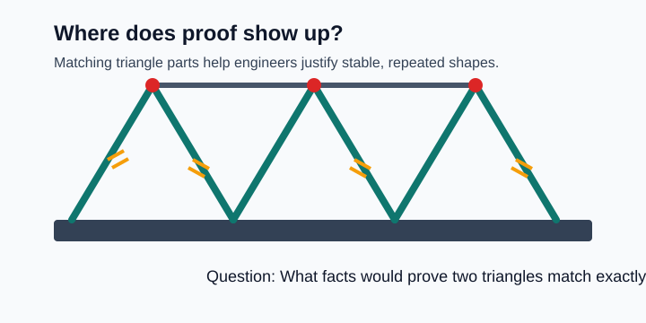
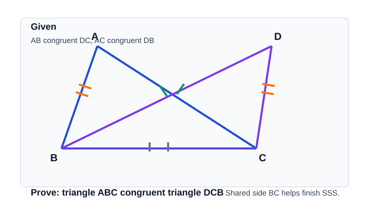
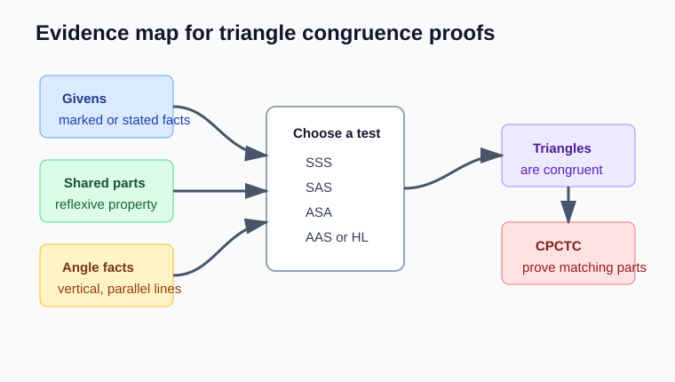
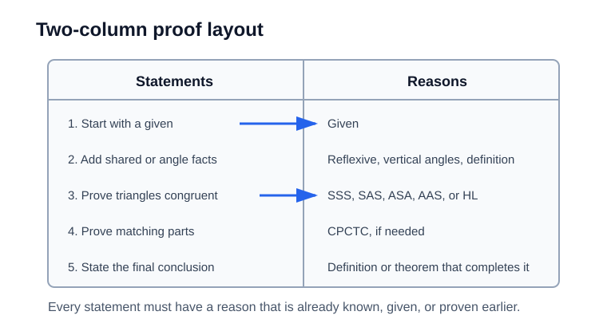
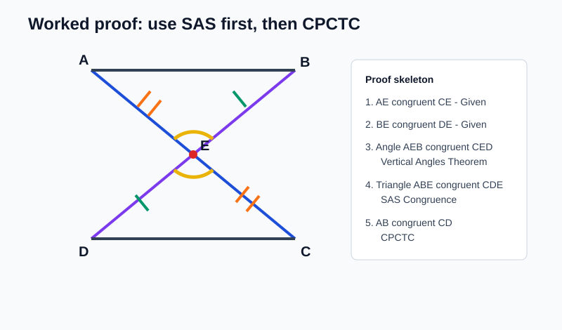
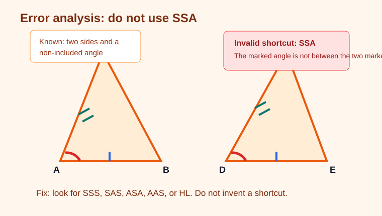

# Geometry - Lesson 10: Two-Column Congruence Proofs

> [!GOAL] Learning Goal
>
> By the end of this lesson, you should be able to **build a complete two-column proof** that proves triangles congruent and then uses corresponding parts correctly.

**Content domain:** Measurement and Geometry  
**Estimated time:** 60 minutes  
**Difficulty:** Advanced  
**Target competency:** Build full triangle congruence proofs.

---

## What You Should Already Know

This lesson brings together the proof skills from this quarter. You will use givens, diagram facts, congruence shortcuts, and CPCTC in one organized argument.

Before reading, check that you can:

- match corresponding vertices in congruent triangle statements
- identify shared sides and shared angles
- use the Vertical Angles Theorem
- choose among SSS, SAS, ASA, AAS, and HL
- explain why SSA and AAA are not triangle congruence shortcuts

> [!CHECK] Pre-Check
>
> 1. If two triangles share side $\overline{BC}$, what property can justify $\overline{BC} \cong \overline{BC}$?
> 2. If two lines intersect, what theorem can justify a pair of opposite angles being congruent?
> 3. Which congruence shortcut uses two sides and the included angle?
> 4. After proving $\triangle ABC \cong \triangle DEF$, what reason lets you conclude $\angle A \cong \angle D$?
>
> Answers: Reflexive Property; Vertical Angles Theorem; SAS; CPCTC.

## Try Before You Read

Look at the bridge frame below. Repeated triangles make the structure rigid because matching pieces force the same shape again and again.

Ask yourself:

- Which bars look like matching sides?
- Which angles would need to match?
- What facts would be strong enough to prove two triangle sections are congruent?

In proof, you cannot write "they look the same." You must build a chain of facts.

---

## Key Vocabulary

| Term | Meaning |
| --- | --- |
| Two-column proof | A proof format with statements on the left and reasons on the right |
| Given | Information stated in the problem or marked in the diagram |
| Prove | The final conclusion the proof must establish |
| Reflexive Property | A figure is congruent to itself, such as $\overline{BC} \cong \overline{BC}$ |
| Vertical Angles Theorem | Vertical angles are congruent |
| Congruence shortcut | A valid condition such as SSS, SAS, ASA, AAS, or HL |
| CPCTC | Corresponding Parts of Congruent Triangles are Congruent |
| Corresponding parts | Sides or angles that match in the same positions of congruent triangles |

## Visual Introduction

A proof is easier when you separate the **diagram evidence** from the **logical proof**.

In this diagram, some facts are given:

- $\overline{AB} \cong \overline{DC}$
- $\overline{AC} \cong \overline{DB}$

One fact is not written as a given, but it is true because the triangles share it:

- $\overline{BC} \cong \overline{CB}$ by the Reflexive Property

That gives three side pairs, so the triangles are congruent by **SSS**.

> [!IMPORTANT] Main Proof Move
>
> First prove the triangles congruent. Then use CPCTC only after the congruence statement is proven.

---

## Main Concept Explanation

### 1. Start With the End in Mind

Every proof has a destination.

If the problem says:

**Prove:** $\triangle ABC \cong \triangle DCB$

then your proof must collect enough evidence to use SSS, SAS, ASA, AAS, or HL.

If the problem says:

**Prove:** $\overline{AB} \cong \overline{CD}$

you may need to prove two triangles congruent first, then use CPCTC to reach that matching part.

### 2. Map the Evidence Before Writing

Use this order:

1. Mark the givens.
2. Look for shared sides or shared angles.
3. Look for vertical angles or angle relationships from parallel lines.
4. Choose the congruence shortcut.
5. Use CPCTC only if the final claim is about a corresponding part.

> [!TIP] Correspondence Check
>
> The order of triangle names matters. If $\triangle ABC \cong \triangle DEF$, then $A$ matches $D$, $B$ matches $E$, and $C$ matches $F$.

### 3. Use a Two-Column Structure

The left column says what is true.  
The right column says why it is allowed.

Strong proof reasons include:

- Given
- Reflexive Property
- Vertical Angles Theorem
- Definition of midpoint
- Definition of angle bisector
- SSS, SAS, ASA, AAS, or HL
- CPCTC

Weak reasons include:

- "It looks equal"
- "Measured with a ruler"
- "Same shape"
- "SSA"
- "Because the diagram shows it"

### 4. CPCTC Is a Finish Tool, Not a Shortcut

CPCTC means **Corresponding Parts of Congruent Triangles are Congruent**.

You can use CPCTC only after a line has already proven:

$$\triangle ABC \cong \triangle DEF$$

Then you can conclude corresponding side or angle facts such as:

$$\overline{AB} \cong \overline{DE}$$

or

$$\angle C \cong \angle F$$

> [!WARNING] Common Trap
>
> Do not use CPCTC to prove the triangles congruent. CPCTC comes after triangle congruence, not before it.

---

## Rule Box

| What you have | Valid shortcut | Reminder |
| --- | --- | --- |
| Three side pairs | SSS | All corresponding sides match |
| Two sides and the included angle | SAS | The angle must be between the two sides |
| Two angles and the included side | ASA | The side is between the angles |
| Two angles and a non-included side | AAS | Still enough to force congruence |
| Right triangles with hypotenuse and a leg | HL | Only for right triangles |
| Two sides and a non-included angle | Not valid | SSA is not a congruence shortcut |
| Three angle pairs | Not valid | AAA proves similarity, not congruence |

---

## Worked Example

Given:

- $\overline{AE} \cong \overline{CE}$
- $\overline{BE} \cong \overline{DE}$

Prove:

- $\overline{AB} \cong \overline{CD}$

The goal is a pair of sides, not a triangle congruence statement. That means we first prove triangles congruent, then use CPCTC.

| Statements | Reasons |
| --- | --- |
| 1. $\overline{AE} \cong \overline{CE}$ | Given |
| 2. $\overline{BE} \cong \overline{DE}$ | Given |
| 3. $\angle AEB \cong \angle CED$ | Vertical Angles Theorem |
| 4. $\triangle AEB \cong \triangle CED$ | SAS Congruence |
| 5. $\overline{AB} \cong \overline{CD}$ | CPCTC |

Why this works:

- Line 1 gives one side pair.
- Line 2 gives another side pair.
- Line 3 gives the included angle pair.
- Line 4 proves the triangles congruent by SAS.
- Line 5 uses the matching sides after congruence is known.

---

## Guided Practice

### Problem 1: Shared Side

Given $\overline{AB} \cong \overline{DC}$ and $\overline{AC} \cong \overline{DB}$ in the diagram from the visual introduction. What statement can you add using the Reflexive Property?

**Hint 1:** Which side belongs to both triangles?  
**Hint 2:** A segment is congruent to itself.  
**Answer:** $\overline{BC} \cong \overline{CB}$ by the Reflexive Property.

### Problem 2: Choose the Shortcut

You know $\overline{AB} \cong \overline{DE}$, $\angle B \cong \angle E$, and $\overline{BC} \cong \overline{EF}$. Which shortcut fits?

**Hint 1:** The angle is between the two marked sides.  
**Hint 2:** Side-angle-side is valid.  
**Answer:** SAS.

### Problem 3: Add the Vertical Angle Step

Two triangles cross at point $M$. You need to prove $\angle AMB \cong \angle DMC$. What reason should you use?

**Hint 1:** The angles are opposite each other where lines intersect.  
**Hint 2:** This is a theorem about vertical angles.  
**Answer:** Vertical Angles Theorem.

### Problem 4: Use CPCTC Correctly

You have already proven $\triangle PQR \cong \triangle XYZ$. What reason justifies $\overline{QR} \cong \overline{YZ}$?

**Hint 1:** The triangles are already proven congruent.  
**Hint 2:** Now you can compare corresponding parts.  
**Answer:** CPCTC.

---

## Mini-Quiz

1. Which reason proves $\overline{AB} \cong \overline{AB}$?
2. Is SSA a valid triangle congruence shortcut?
3. If two triangles are proven congruent, what reason proves their matching angles are congruent?
4. Which shortcut uses three corresponding side pairs?

**Answers:** Reflexive Property; no; CPCTC; SSS.

---

## Independent Practice

Try these on your own before checking the answer key.

1. Given $\overline{AB} \cong \overline{DE}$, $\overline{BC} \cong \overline{EF}$, and $\overline{AC} \cong \overline{DF}$, prove $\triangle ABC \cong \triangle DEF$. Which shortcut is used?
2. In a proof, the statement is $\angle 1 \cong \angle 2$, and the angles are vertical angles. Write the reason.
3. You have $\angle A \cong \angle D$, $\overline{AB} \cong \overline{DE}$, and $\angle B \cong \angle E$. Which shortcut is used?
4. You have right triangles with congruent hypotenuses and one pair of congruent legs. Which shortcut is used?
5. You proved $\triangle JKL \cong \triangle MNO$. What side corresponds to $\overline{KL}$?
6. Explain why "the triangles look congruent" is not a valid proof reason.
7. Write the first proof line if the problem states: Given $\overline{RS} \cong \overline{TV}$.
8. A proof tries to use CPCTC before proving triangles congruent. What is the mistake?

---

## Answer Key with Explanations

1. SSS, because all three pairs of corresponding sides are congruent.
2. Vertical Angles Theorem, because vertical angles are congruent.
3. ASA, because the side is included between the two angle pairs.
4. HL, because this applies to right triangles with hypotenuse and leg congruent.
5. $\overline{NO}$, because $J \leftrightarrow M$, $K \leftrightarrow N$, and $L \leftrightarrow O$.
6. Appearance is not proof. Use givens, markings, definitions, postulates, or theorems.
7. $\overline{RS} \cong \overline{TV}$, reason: Given.
8. CPCTC can only be used after triangle congruence has been proven.

---

## Misconception Alerts

| Misconception | Correction |
| --- | --- |
| "A diagram is enough proof." | A diagram helps, but proof needs stated or proven facts. |
| "SSA proves triangles congruent." | SSA is not a valid shortcut. Use SSS, SAS, ASA, AAS, or HL. |
| "CPCTC proves triangles congruent." | CPCTC proves corresponding parts after triangles are congruent. |
| "Triangle order does not matter." | Order shows which vertices correspond. |
| "A shared side needs no statement." | Write the shared side congruence and justify it with the Reflexive Property. |

## Error Analysis

Study the diagram below. The student writes: "Two sides and one angle are marked, so the triangles are congruent by SSA."

What is wrong?

The angle is not included between the two marked sides. That means the evidence is SSA, which is not a valid congruence shortcut.

Correct thinking:

- Look for another given or theorem.
- If a right angle is present, HL might work for right triangles.
- If another angle or side pair can be proven, then ASA, AAS, SAS, or SSS might work.

---

## Self-Explanation Prompts

Answer these in your own words.

1. Why is the Reflexive Property useful in triangle proofs?
2. Why must CPCTC come after the triangle congruence line?
3. How do you decide whether a proof uses ASA or AAS?
4. What makes SAS different from SSA?

Sample responses:

- The Reflexive Property lets me use a shared side or shared angle as matching evidence.
- CPCTC depends on triangles already being congruent.
- ASA has the side between the two angles; AAS has a side that is not between the two angles.
- SAS uses the included angle; SSA gives a non-included angle and is not a valid shortcut.

## Extension Challenge

Given: $M$ is the midpoint of $\overline{AB}$ and $\overline{CD}$. Lines $\overline{AB}$ and $\overline{CD}$ intersect at $M$.

Prove: $\overline{AC} \cong \overline{BD}$.

Hint:

- A midpoint creates two congruent segments.
- Intersecting lines create vertical angles.
- Prove $\triangle AMC \cong \triangle BMD$ first.

Solution outline:

1. $M$ is the midpoint of $\overline{AB}$ and $\overline{CD}$: Given.
2. $\overline{AM} \cong \overline{MB}$ and $\overline{CM} \cong \overline{MD}$: Definition of midpoint.
3. $\angle AMC \cong \angle BMD$: Vertical Angles Theorem.
4. $\triangle AMC \cong \triangle BMD$: SAS.
5. $\overline{AC} \cong \overline{BD}$: CPCTC.

## Mastery Checklist

Check yourself before moving to the practice exam:

- I can identify the given facts in a proof problem.
- I can write a shared side or angle using the Reflexive Property.
- I can use vertical angles as a valid reason.
- I can choose SSS, SAS, ASA, AAS, or HL from diagram evidence.
- I can avoid invalid shortcuts such as SSA and AAA.
- I can write a congruent triangle statement in the correct order.
- I can use CPCTC only after proving triangles congruent.
- I can complete a two-column proof with valid reasons.

> [!PRACTICE] Next Step
>
> Use the practice exam for quick proof-reason drills. Use the assessment when you are ready to complete longer congruence-proof decisions.

## Final Summary

Two-column congruence proofs are organized chains of evidence. Start with givens, add facts from the diagram such as reflexive shared parts or vertical angles, choose a valid triangle congruence shortcut, and use CPCTC only after the triangles are proven congruent.
