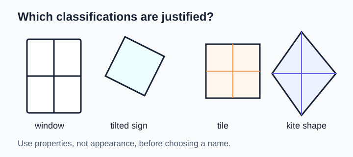
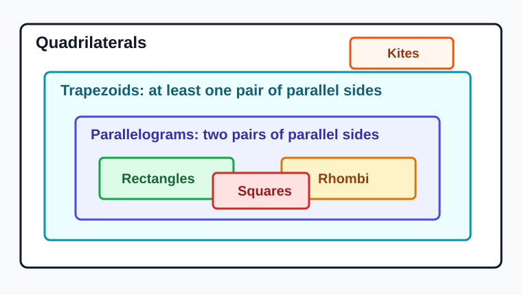
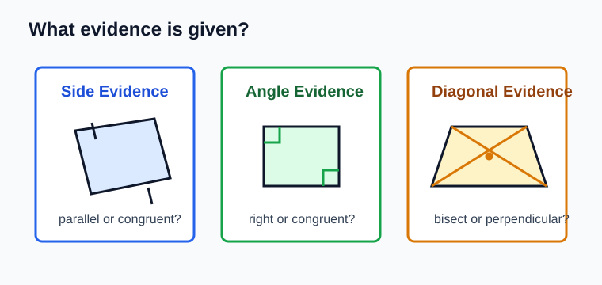
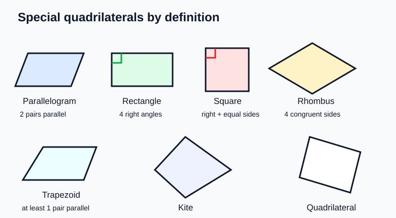
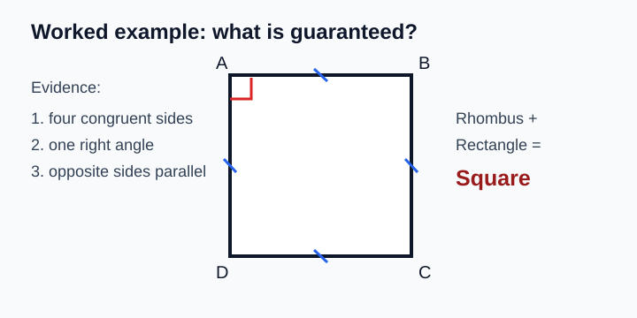
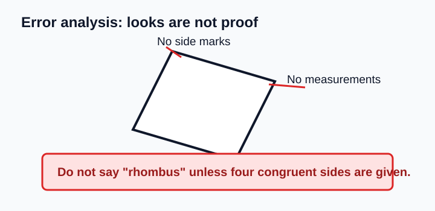

# Geometry - Lesson 2: Formal Quadrilateral Classification

> [!GOAL] Learning Goal
>
> By the end of this lesson, you should be able to **classify quadrilaterals using definitions**, not just how a drawing looks.

**Content domain:** Measurement and Geometry  
**Estimated time:** 50 minutes  
**Difficulty:** Intermediate  
**Target competency:** Classify parallelograms, rectangles, squares, rhombuses, trapezoids, and kites.

---

## What You Should Already Know

Before starting, check that you can:

- identify parallel sides
- identify perpendicular sides
- recognize congruent sides and congruent angles
- remember that a quadrilateral has exactly four sides

> [!CHECK] Pre-Check
>
> 1. How many sides does a quadrilateral have?
> 2. What does it mean for two sides to be parallel?
> 3. If all four angles of a quadrilateral are right angles, what special family might it belong to?
>
> Answers: 4; they never meet and stay the same distance apart; rectangle family.

## Try Before You Read

Look at the signs, tiles, window frames, and kite shape below. Which ones are rectangles? Which ones are squares? Which ones only look like a special quadrilateral because of the drawing angle?

A picture can suggest a classification, but a formal classification needs **evidence**. In geometry, "it looks like a rectangle" is not enough. You need a definition or a property that forces the classification.

---

## Key Vocabulary

| Term | Meaning |
| --- | --- |
| Quadrilateral | A polygon with four sides |
| Parallelogram | A quadrilateral with two pairs of parallel opposite sides |
| Rectangle | A parallelogram with four right angles |
| Rhombus | A parallelogram with four congruent sides |
| Square | A parallelogram with four right angles and four congruent sides |
| Trapezoid | A quadrilateral with at least one pair of parallel sides |
| Kite | A quadrilateral with two distinct pairs of adjacent congruent sides |
| Adjacent sides | Sides that share a vertex |
| Opposite sides | Sides that do not share a vertex |
| Diagonal | A segment that connects non-adjacent vertices |

> [!IMPORTANT] Definition First
>
> A quadrilateral can belong to more than one category. A square is also a rectangle, a rhombus, and a parallelogram because it satisfies all of those definitions.

## Visual Introduction: The Quadrilateral Hierarchy

The hierarchy helps you avoid a common mistake: treating categories as separate boxes. Some categories overlap.

- Every square is a rectangle.
- Every square is a rhombus.
- Every rectangle and every rhombus is a parallelogram.
- A trapezoid is classified by parallel sides.
- A kite is classified by adjacent congruent sides.

Different textbooks define trapezoid in slightly different ways. In this lesson, a trapezoid has **at least one pair of parallel sides**, so a parallelogram also satisfies that broad condition. When a problem says "exactly one pair of parallel sides," it means a non-parallelogram trapezoid.

---

## Main Concept Explanation

### 1. Classify by Evidence

Use the marks, measurements, or statements given in the diagram.

| Evidence given | Classification you can justify |
| --- | --- |
| Both pairs of opposite sides are parallel | Parallelogram |
| Four right angles | Rectangle, and also parallelogram |
| Four congruent sides | Rhombus, and also parallelogram |
| Four right angles and four congruent sides | Square, rectangle, rhombus, parallelogram |
| Exactly one pair of parallel sides | Trapezoid, but not parallelogram |
| Two distinct pairs of adjacent congruent sides | Kite |

### 2. Use the Most Specific Name When Asked

If a shape has four right angles and all sides congruent, the most specific name is **square**. But it is still correct to say it is also a rectangle, rhombus, parallelogram, quadrilateral, and trapezoid under the broad trapezoid definition.

> [!TIP] Classification Question Strategy
>
> Ask two questions:  
> 1. What properties are guaranteed?  
> 2. Which definitions do those properties satisfy?

### 3. Appearance Is Not Proof

A tilted rectangle is still a rectangle if it has four right angles. A diamond-looking shape is not always a rhombus. It must have four congruent sides.

---

## Rule Box

| Shape | Must have |
| --- | --- |
| Parallelogram | Two pairs of parallel opposite sides |
| Rectangle | Parallelogram plus four right angles |
| Rhombus | Parallelogram plus four congruent sides |
| Square | Rectangle and rhombus properties together |
| Trapezoid | At least one pair of parallel sides |
| Kite | Two distinct pairs of adjacent congruent sides |

> [!WARNING] Common Trap
>
> Do not classify from the way a diagram is tilted. A square turned 45 degrees is still a square. A slanted quadrilateral is not automatically a parallelogram.

## Worked Example

The diagram shows quadrilateral $ABCD$. All four sides are marked congruent, and one angle is marked as a right angle. Opposite sides are parallel.

**Step 1: Use the side evidence.**  
All four sides are congruent, so the quadrilateral is a rhombus.

**Step 2: Use the angle evidence.**  
It has a right angle and is a parallelogram. In a parallelogram, if one angle is right, all four angles are right. So it is a rectangle.

**Step 3: Combine the evidence.**  
A quadrilateral that is both a rectangle and a rhombus is a square.

**Most specific name:** square  
**Other correct names:** rectangle, rhombus, parallelogram, quadrilateral

> [!CHECK] Try It
>
> A quadrilateral has two pairs of opposite parallel sides and four congruent sides, but no right angles are given. What is the most specific classification?
>
> Answer: rhombus. It is also a parallelogram, but you cannot call it a square without right-angle evidence.

---

## Guided Practice

### Problem 1

A quadrilateral has two pairs of opposite parallel sides. What classification is guaranteed?

**Hint 1:** Look for the definition that uses two pairs of parallel sides.  
**Hint 2:** Right angles and equal side lengths are not mentioned.  
**Answer:** Parallelogram.

### Problem 2

A quadrilateral has four right angles. What special name is guaranteed?

**Hint 1:** Four right angles force opposite sides to be parallel.  
**Hint 2:** Equal side lengths are not given.  
**Answer:** Rectangle. It might be a square, but that is not guaranteed.

### Problem 3

A quadrilateral has two distinct pairs of adjacent congruent sides. What is it?

**Hint 1:** Adjacent means the equal sides touch at a vertex.  
**Hint 2:** Do not use rhombus unless all four sides are congruent.  
**Answer:** Kite.

### Problem 4

A quadrilateral has exactly one pair of parallel sides. What is the most specific family?

**Hint 1:** The word exactly rules out parallelogram.  
**Hint 2:** A trapezoid needs a pair of parallel sides.  
**Answer:** Trapezoid.

---

## Mini-Quiz

1. True or false: Every square is a rectangle.
2. True or false: Every rectangle is a square.
3. A quadrilateral has four congruent sides. Which classification is guaranteed?
4. A quadrilateral has four right angles and four congruent sides. What is the most specific name?

Answers: true; false; rhombus; square.

## Independent Practice

Classify each quadrilateral using the most specific name that is guaranteed.

1. Two pairs of opposite sides are parallel.
2. Four right angles, but side lengths are not marked equal.
3. Four congruent sides, but no right angles are marked.
4. Exactly one pair of parallel sides.
5. Two distinct pairs of adjacent congruent sides.
6. Four right angles and four congruent sides.
7. A figure looks like a rectangle, but the only given information is that it has four sides.
8. A quadrilateral has diagonals that bisect each other, but no angle or side marks are given.

## Answer Key with Explanations

1. Parallelogram. That is the definition.
2. Rectangle. A square is possible, but not guaranteed.
3. Rhombus. Four congruent sides are enough.
4. Trapezoid. Exactly one pair of parallel sides rules out parallelogram.
5. Kite. Adjacent congruent side pairs are the defining feature.
6. Square. It has both rectangle and rhombus properties.
7. Quadrilateral only. Appearance is not evidence.
8. Parallelogram. Diagonals that bisect each other are a parallelogram property.

---

## Misconception Alerts

> [!WARNING] Misconception 1: "A square is not a rectangle."
>
> A square has four right angles, so it satisfies the definition of rectangle. It is a special rectangle.

> [!WARNING] Misconception 2: "A diamond shape is always a rhombus."
>
> A tilted appearance does not prove equal side lengths. You need side marks or measurements.

> [!WARNING] Misconception 3: "The most specific name is the only correct name."
>
> The most specific name is useful, but broader names can still be correct. A square is also a quadrilateral.

## Error Analysis

A student says:

> "This figure is a rhombus because it looks like a diamond."

**What is the mistake?**  
The student used appearance instead of evidence. A rhombus must have four congruent sides. If no side lengths or congruence marks are given, the conclusion is not justified.

**Corrected reasoning:**  
"The figure appears tilted, but I can only classify it using the given information. If all four sides are congruent, then it is a rhombus. Without that evidence, I should not call it a rhombus."

## Self-Explanation Prompts

Try answering these out loud or in writing.

1. Why is every square a rectangle?
2. Why is every rectangle not necessarily a square?
3. What evidence would prove a quadrilateral is a kite?
4. Why is "it looks parallel" weaker than "the sides are marked parallel"?
5. How do you decide the most specific classification?

Sample responses

1. A square has four right angles, so it satisfies the definition of rectangle.
2. A rectangle does not need four congruent sides.
3. Two distinct pairs of adjacent congruent sides prove a kite.
4. A drawing may not be accurate; marks and given statements are the evidence.
5. Start with all guaranteed properties, then choose the narrowest definition those properties satisfy.

## Extension Challenge

A quadrilateral has diagonals that are congruent, perpendicular, and bisect each other. What is the most specific classification?

**Hint:** Diagonals that bisect each other suggest a parallelogram. Congruent diagonals suggest rectangle. Perpendicular diagonals suggest rhombus.

**Solution:** The quadrilateral is a square. A parallelogram with congruent diagonals is a rectangle, and a parallelogram with perpendicular diagonals is a rhombus. Being both a rectangle and a rhombus makes it a square.

## Mastery Checklist

Check each statement when it feels true.

- I can classify a quadrilateral from written properties.
- I can explain why a square is also a rectangle and a rhombus.
- I can distinguish a rhombus from a kite.
- I can classify a trapezoid using parallel sides.
- I can name the most specific classification that is guaranteed.
- I can avoid relying on appearance alone.
- I can write a short reason for a classification.

> [!PRACTICE] What To Do Next
>
> Use the practice exam for quick recall and classification drills. Use the assessment when you can justify each answer with a definition or property.
