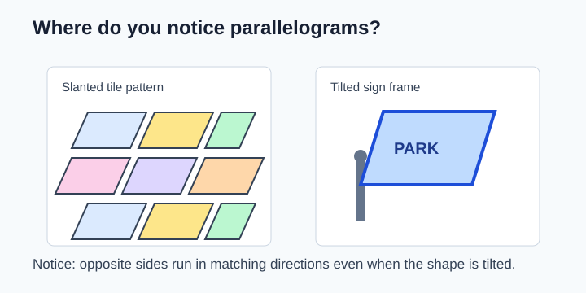
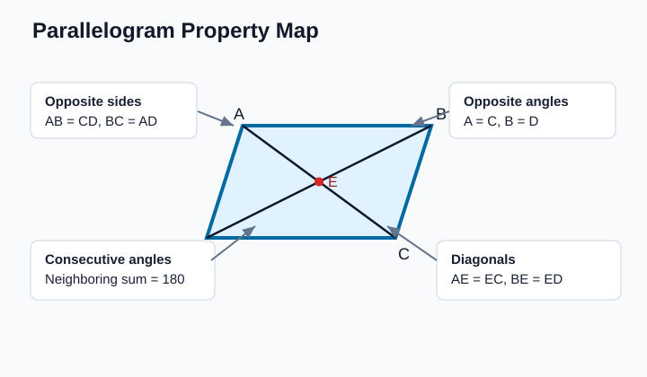
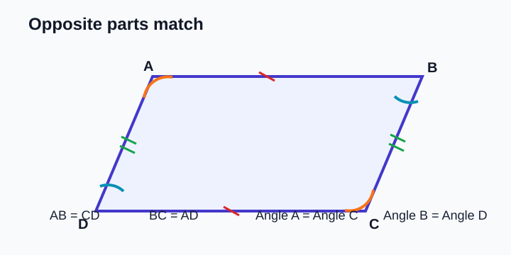
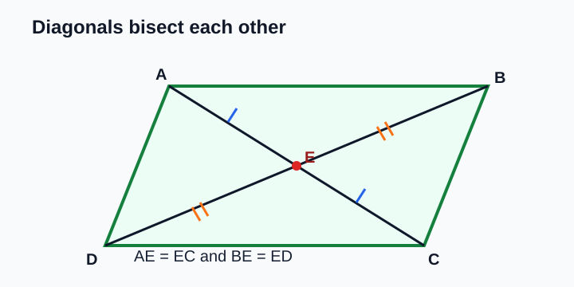
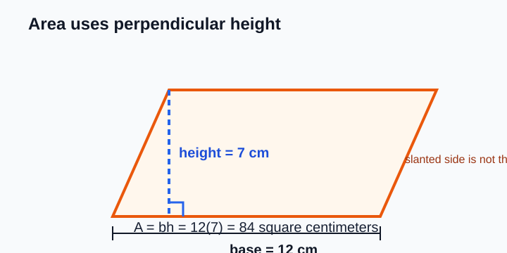
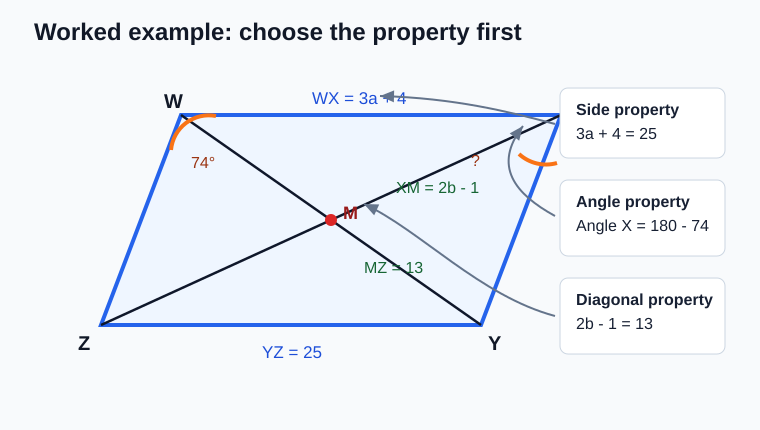
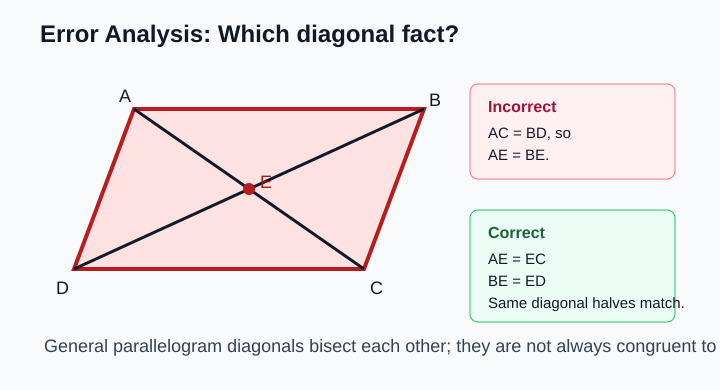

# Geometry - Lesson 3: Parallelogram Properties

> [!GOAL] Learning Goal
>
> By the end of this lesson, you should be able to **find missing side lengths, angle measures, heights, and diagonal parts in parallelograms** by choosing the correct property.

**Content domain:** Measurement and Geometry  
**Estimated time:** 50 minutes  
**Difficulty:** Intermediate  
**Target competency:** Find sides, angles, heights, and diagonals.

---

## What You Should Already Know

A parallelogram is a quadrilateral with both pairs of opposite sides parallel. This lesson uses facts from parallel lines and angle relationships.

Before reading, check that you can:

- identify opposite sides and opposite angles in a quadrilateral
- remember that supplementary angles add to $180^\circ$
- solve equations such as $2x + 8 = 20$
- find rectangle area using base times height

> [!CHECK] Pre-Check
>
> 1. What is the supplement of $65^\circ$?
> 2. If $2x + 4 = 18$, what is $x$?
> 3. In a quadrilateral named $ABCD$, which side is opposite $\overline{AB}$?
>
> Answers: $115^\circ$; $7$; $\overline{CD}$.

## Try Before You Read

Look at a tilted picture frame, a slanted tile pattern, or a road sign shaped like a pushed-over rectangle.

The shape may not have right angles, but opposite sides still move together. That is the main idea behind parallelogram problems: **opposite parts match, neighboring angles balance, and diagonals cut each other in half**.

---

## Key Vocabulary

| Term | Meaning |
| --- | --- |
| Parallelogram | A quadrilateral with both pairs of opposite sides parallel |
| Opposite sides | Sides that do not share a vertex |
| Opposite angles | Angles that do not share a side |
| Consecutive angles | Angles next to each other in the polygon |
| Congruent | Equal in measure or length |
| Supplementary | Two angle measures with a sum of $180^\circ$ |
| Diagonal | A segment connecting nonadjacent vertices |
| Bisect | To divide into two congruent parts |
| Base | The side chosen as the bottom or reference side |
| Height | The perpendicular distance from the base to the opposite side |

## Visual Introduction

A parallelogram gives you four high-value rules.

| Property | What it lets you write |
| --- | --- |
| Opposite sides are congruent | $AB = CD$ and $BC = AD$ |
| Opposite angles are congruent | $\angle A \cong \angle C$ and $\angle B \cong \angle D$ |
| Consecutive angles are supplementary | $m\angle A + m\angle B = 180^\circ$ |
| Diagonals bisect each other | Each diagonal is split into two equal parts |

> [!IMPORTANT] Main Decision
>
> First decide what kind of part you are solving: **side, angle, diagonal, or height**. Then choose the matching property.

---

## Main Concept Explanation

### 1. Opposite Sides Match

In parallelogram $ABCD$, side $\overline{AB}$ is opposite $\overline{CD}$, so they have the same length. Side $\overline{BC}$ is opposite $\overline{AD}$, so those lengths match too.

If $AB = 14$, then $CD = 14$.  
If $BC = 2x + 3$ and $AD = 17$, then:

$$2x + 3 = 17$$

$$2x = 14$$

$$x = 7$$

### 2. Opposite Angles Match, Consecutive Angles Add to 180

Opposite angles in a parallelogram are congruent. Consecutive angles are supplementary.

If $m\angle A = 68^\circ$, then $m\angle C = 68^\circ$.

Angles $A$ and $B$ are consecutive, so:

$$m\angle A + m\angle B = 180^\circ$$

$$68^\circ + m\angle B = 180^\circ$$

$$m\angle B = 112^\circ$$

> [!WARNING] Common Trap
>
> Do not make all four angles equal. In a general parallelogram, opposite angles are equal, but neighboring angles usually have different measures.

### 3. Diagonals Bisect Each Other

The diagonals of a parallelogram cross at their shared midpoint. Each diagonal is cut into two equal pieces.

If diagonals $\overline{AC}$ and $\overline{BD}$ intersect at $E$, then:

- $AE = EC$
- $BE = ED$

If $AE = 3x - 2$ and $EC = 16$, write:

$$3x - 2 = 16$$

$$3x = 18$$

$$x = 6$$

### 4. Base and Height Work Like Rectangle Area

The area of a parallelogram is:

$$A = bh$$

The height must be perpendicular to the base. A slanted side is not automatically the height.

If a parallelogram has base $12$ cm and height $7$ cm:

$$A = 12(7) = 84$$

The area is $84$ square centimeters.

---

## Rule Box

| To find... | Use this property |
| --- | --- |
| Missing opposite side | Opposite sides of a parallelogram are congruent |
| Missing opposite angle | Opposite angles of a parallelogram are congruent |
| Missing neighboring angle | Consecutive angles in a parallelogram are supplementary |
| Missing diagonal half | Diagonals of a parallelogram bisect each other |
| Missing height or area | $A = bh$, where height is perpendicular to the base |

---

## Worked Example

In parallelogram $WXYZ$, suppose:

- $WX = 3a + 4$
- $YZ = 25$
- $m\angle W = 74^\circ$
- diagonals intersect at $M$
- $XM = 2b - 1$ and $MZ = 13$

Find $a$, $m\angle X$, and $b$.

**Step 1: Use opposite sides.**  
$WX$ and $YZ$ are opposite sides, so they are congruent.

$$3a + 4 = 25$$

$$3a = 21$$

$$a = 7$$

**Step 2: Use consecutive angles.**  
$\angle W$ and $\angle X$ are consecutive angles, so they are supplementary.

$$m\angle X = 180^\circ - 74^\circ = 106^\circ$$

**Step 3: Use diagonal bisection.**  
The diagonals bisect each other, so $XM = MZ$.

$$2b - 1 = 13$$

$$2b = 14$$

$$b = 7$$

**Answer:** $a = 7$, $m\angle X = 106^\circ$, and $b = 7$.

> [!CHECK] Try It
>
> In parallelogram $ABCD$, $AB = 4x - 5$ and $CD = 27$. Also, $m\angle A = 119^\circ$. Find $x$ and $m\angle B$.
>
> Answer: $x = 8$ because $4x - 5 = 27$. Also, $m\angle B = 61^\circ$ because consecutive angles are supplementary.

---

## Guided Practice

### Problem 1: Opposite Sides

In parallelogram $JKLM$, $JK = 18$ and $LM = 5x - 2$. Find $x$.

**Hint 1:** $JK$ and $LM$ are opposite sides.  
**Hint 2:** Opposite sides in a parallelogram are congruent.  
**Answer:** $5x - 2 = 18$, so $5x = 20$ and $x = 4$.

### Problem 2: Consecutive Angles

In parallelogram $PQRS$, $m\angle P = 63^\circ$. Find $m\angle Q$ and $m\angle R$.

**Hint 1:** $\angle P$ and $\angle Q$ are consecutive.  
**Hint 2:** $\angle P$ and $\angle R$ are opposite.  
**Answer:** $m\angle Q = 117^\circ$ and $m\angle R = 63^\circ$.

### Problem 3: Diagonal Parts

Diagonals of parallelogram $ABCD$ intersect at $E$. If $AE = 2x + 1$ and $EC = 15$, find $x$.

**Hint 1:** $E$ is the midpoint of diagonal $\overline{AC}$.  
**Hint 2:** Set $AE = EC$.  
**Answer:** $2x + 1 = 15$, so $x = 7$.

---

## Mini-Quiz

Try these before checking the answers.

1. In parallelogram $ABCD$, if $AB = 11$, what is $CD$?
2. If one angle of a parallelogram is $80^\circ$, what is the measure of a consecutive angle?
3. If diagonals intersect at $E$ and $BE = 9$, what is $ED$?
4. A parallelogram has base $15$ m and height $6$ m. What is its area?

**Answers:** $11$; $100^\circ$; $9$; $90$ square meters.

---

## Independent Practice

1. In parallelogram $MNPQ$, $MN = 2x + 6$ and $PQ = 24$. Find $x$.
2. In parallelogram $DEFG$, $m\angle D = 128^\circ$. Find $m\angle E$ and $m\angle F$.
3. Diagonals of parallelogram $RSTU$ intersect at $V$. If $RV = 4y - 3$ and $VT = 21$, find $y$.
4. A parallelogram has area $96$ square units and base $12$ units. Find the height.
5. In parallelogram $ABCD$, $AB = 3x + 2$, $CD = 20$, and $BC = x + 9$. Find $x$ and then explain which side is equal to $BC$.
6. A learner says the slanted side of every parallelogram is its height. Explain the mistake.

## Answer Key with Explanations

1. $2x + 6 = 24$, so $x = 9$.
2. $m\angle E = 52^\circ$ because consecutive angles are supplementary. $m\angle F = 128^\circ$ because opposite angles are congruent.
3. $4y - 3 = 21$, so $y = 6$.
4. $96 = 12h$, so $h = 8$ units.
5. $3x + 2 = 20$, so $x = 6$. Side $AD$ is equal to $BC$ because they are opposite sides.
6. The height is the perpendicular distance to the base. A slanted side is only a height if it is perpendicular to the chosen base.

---

## Misconception Alerts

> [!WARNING] Misconception 1: "All parallelogram angles are equal."
>
> Only opposite angles are always congruent. Consecutive angles are supplementary.

> [!WARNING] Misconception 2: "Diagonals are always congruent."
>
> In a general parallelogram, diagonals bisect each other. They are not always the same length.

> [!WARNING] Misconception 3: "The slanted side is the height."
>
> Height must be perpendicular to the base. Look for a right-angle marker or a perpendicular segment.

## Error Analysis

A student sees parallelogram $ABCD$ with diagonals intersecting at $E$. The student writes:

> Since diagonals of a parallelogram are congruent, $AC = BD$. Therefore, if $AE = 8$, then $BE = 8$.

**What is the mistake?**

The student used the wrong diagonal property. A parallelogram's diagonals **bisect each other**, meaning $AE = EC$ and $BE = ED$. The halves on different diagonals are not necessarily equal.

**Correct reasoning:** If $AE = 8$, then $EC = 8$. You cannot conclude $BE = 8$ unless more information is given.

---

## Self-Explanation Prompts

Use these prompts to check your reasoning:

1. How do you decide whether to set two expressions equal or add them to $180$?
2. Why do diagonal problems usually compare two halves of the same diagonal?
3. How can you tell whether a given length is a height?
4. What property would you use first if a problem gives two opposite sides?

**Sample response:** I set expressions equal when the parts are congruent, such as opposite sides, opposite angles, or two halves of the same diagonal. I add to $180$ when the angles are consecutive.

## Extension Challenge

In parallelogram $ABCD$, $m\angle A = 3x + 12$ and $m\angle B = 5x - 8$. Find both angle measures.

**Hint:** $\angle A$ and $\angle B$ are consecutive angles.  
**Solution:** $(3x + 12) + (5x - 8) = 180$, so $8x + 4 = 180$, $8x = 176$, and $x = 22$. Then $m\angle A = 78^\circ$ and $m\angle B = 102^\circ$.

---

## Mastery Checklist

Check each statement when it feels true.

- I can identify opposite sides and opposite angles in a parallelogram.
- I can use opposite sides to solve for missing lengths.
- I can use opposite angles and consecutive angles to solve angle problems.
- I can use diagonal bisection to solve for missing diagonal parts.
- I can use $A = bh$ with the perpendicular height.
- I can explain why a common parallelogram mistake is incorrect.

> [!PRACTICE] Next Step
>
> Use the practice exam for quick skill checks. Use the assessment when you can choose the correct property without being told which one to use.
