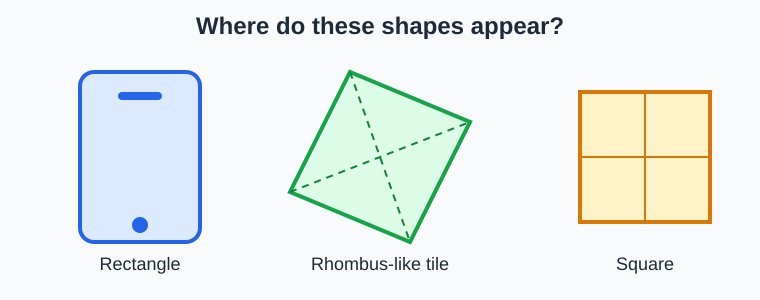
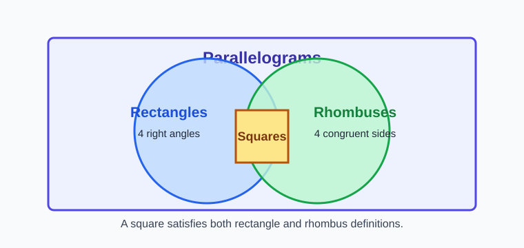
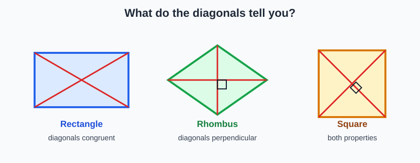
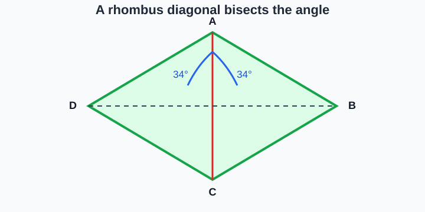
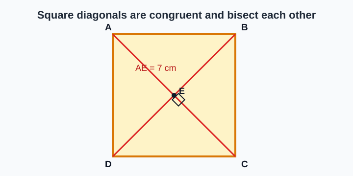
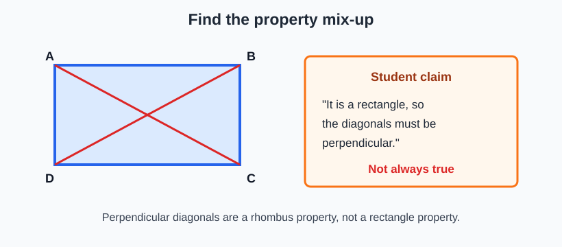

# Geometry - Lesson 4: Rectangle, Square, and Rhombus Problems

> [!GOAL] Learning Goal
>
> By the end of this lesson, you should be able to **apply special parallelogram properties** to compare rectangles, squares, and rhombuses and solve side, angle, and diagonal problems.

**Content domain:** Measurement and Geometry  
**Estimated time:** 55 minutes  
**Difficulty:** Intermediate  
**Target competency:** Apply special parallelogram properties.

---

## What You Should Already Know

This lesson builds on parallelogram properties.

Before reading, check that you can:

- identify opposite sides and opposite angles
- name diagonals of a quadrilateral
- use the fact that parallelogram diagonals bisect each other
- recognize right angles
- solve simple equations such as $2x + 3 = 17$

> [!CHECK] Pre-Check
>
> 1. What is a diagonal of a quadrilateral?
> 2. What does it mean for two segments to be congruent?
> 3. In any parallelogram, what do the diagonals do to each other?
>
> Answers: a segment joining opposite vertices; same length; they bisect each other.

## Try Before You Read

Look at these objects: a phone screen, a diamond-shaped floor tile, and a square chessboard space.

They all have two pairs of parallel sides, but they do not all have the same side, angle, and diagonal properties. In this lesson, the important question is:

> Which properties **always** hold, and which only sometimes hold?

---

## Key Vocabulary

| Term | Meaning |
| --- | --- |
| Rectangle | A parallelogram with four right angles |
| Rhombus | A parallelogram with four congruent sides |
| Square | A parallelogram with four right angles and four congruent sides |
| Diagonal | A segment connecting opposite vertices |
| Congruent | Same size or same measure |
| Perpendicular | Intersecting at $90^\circ$ |
| Bisect | To divide into two congruent parts |
| Angle bisector | A ray or segment that divides an angle into two congruent angles |

## Visual Introduction

Rectangles, rhombuses, and squares are all special parallelograms.

The square sits in the overlap because it satisfies both definitions:

- It is a rectangle because it has four right angles.
- It is a rhombus because it has four congruent sides.

> [!IMPORTANT] Core Idea
>
> Use definitions and properties, not appearance. A slanted shape can still be a square or rhombus if the measurements prove it.

---

## Main Concept Explanation

### 1. Properties That Always Hold

| Property | Rectangle | Rhombus | Square |
| --- | --- | --- | --- |
| Opposite sides parallel | Always | Always | Always |
| Opposite sides congruent | Always | Always | Always |
| Opposite angles congruent | Always | Always | Always |
| Consecutive angles supplementary | Always | Always | Always |
| All angles are right angles | Always | Not always | Always |
| All sides are congruent | Not always | Always | Always |
| Diagonals bisect each other | Always | Always | Always |
| Diagonals are congruent | Always | Not always | Always |
| Diagonals are perpendicular | Not always | Always | Always |
| Diagonals bisect opposite angles | Not always | Always | Always |

### 2. Diagonals Tell You a Lot

In a **rectangle**, diagonals are congruent and bisect each other.

In a **rhombus**, diagonals are perpendicular, bisect each other, and bisect the angles.

In a **square**, both sets of properties hold. The diagonals are congruent, perpendicular, bisect each other, and bisect the angles.

> [!WARNING] Common Trap
>
> Every square is a rectangle and every square is a rhombus. But not every rectangle is a square, and not every rhombus is a square.

### 3. Rhombus Angle Bisectors

Rhombus diagonals do more than cross. They split vertex angles into equal parts.

If diagonal $\overline{AC}$ bisects $\angle A$, then the two smaller angles at $A$ are congruent.

For example, if one half is $34^\circ$, the whole angle is:

$$34^\circ + 34^\circ = 68^\circ$$

---

## Rule Box / Formula Box

Use this quick decision table:

| If you know... | You can conclude... |
| --- | --- |
| A parallelogram has four right angles | It is a rectangle |
| A parallelogram has four congruent sides | It is a rhombus |
| A parallelogram has four right angles and four congruent sides | It is a square |
| A parallelogram has congruent diagonals | It may be a rectangle; if it is also a rhombus, it is a square |
| A parallelogram has perpendicular diagonals | It may be a rhombus; if it is also a rectangle, it is a square |

> [!TIP] Phrase To Remember
>
> Rectangle: right angles and congruent diagonals. Rhombus: equal sides and perpendicular angle-bisecting diagonals. Square: all of those.

---

## Worked Example

**Problem:** $ABCD$ is a square. Diagonals $\overline{AC}$ and $\overline{BD}$ intersect at $E$. If $AE = 7$ cm, find $AC$, $BD$, and $BE$.

**Step 1: Use diagonal bisection.**  
In every parallelogram, diagonals bisect each other. Since $E$ is the midpoint of $\overline{AC}$:

$$AC = 2(AE) = 2(7) = 14\text{ cm}$$

**Step 2: Use square diagonal congruence.**  
Squares have congruent diagonals, so:

$$BD = AC = 14\text{ cm}$$

**Step 3: Use bisection again.**  
Since $E$ is the midpoint of $\overline{BD}$:

$$BE = \frac{BD}{2} = \frac{14}{2} = 7\text{ cm}$$

> [!EXAMPLE] Complete Answer
>
> $AC = 14$ cm, $BD = 14$ cm, and $BE = 7$ cm because square diagonals are congruent and bisect each other.

---

## Guided Practice

### Problem 1

$WXYZ$ is a rectangle. If diagonal $WY = 18$ cm, what is diagonal $XZ$?

**Hint 1:** Which diagonal property always holds for rectangles?  
**Hint 2:** Rectangle diagonals are congruent.  
**Answer:** $XZ = 18$ cm.

### Problem 2

$PQRS$ is a rhombus. Diagonals intersect at $T$. If $PT = 5$ cm, what is $TR$?

**Hint 1:** Every parallelogram has diagonals that bisect each other.  
**Hint 2:** $T$ is the midpoint of $\overline{PR}$.  
**Answer:** $TR = 5$ cm.

### Problem 3

A quadrilateral is a parallelogram with four right angles and four congruent sides. Classify it as precisely as possible.

**Hint 1:** Four right angles make it a rectangle.  
**Hint 2:** Four congruent sides make it a rhombus.  
**Answer:** It is a square.

---

## Mini-Quiz

1. Which shape always has four right angles: rectangle, rhombus, or both?
2. Which shape always has four congruent sides: rectangle, rhombus, or both?
3. Which shape always has diagonals that are both congruent and perpendicular?
4. True or false: A square is always a rhombus.
5. In a rhombus, one half of a bisected angle is $41^\circ$. What is the full angle?

**Mini-Quiz Answers**

1. Rectangle
2. Rhombus
3. Square
4. True
5. $82^\circ$

---

## Independent Practice

Complete these on paper before checking the answer key.

1. A rectangle has one diagonal measuring 25 cm. Find the other diagonal.
2. A rhombus has side length 9 cm. Find the length of each side.
3. A square has diagonal halves of 6 cm. Find each full diagonal.
4. A rhombus has diagonals intersecting at $90^\circ$. Is that expected? Explain.
5. A rectangle has perpendicular diagonals. What special rectangle is it?
6. A rhombus has one angle split into $28^\circ$ and $28^\circ$ by a diagonal. Find the whole angle.
7. A parallelogram has congruent diagonals and all sides congruent. What is it?
8. Write two properties that are true for both rectangles and rhombuses.

## Answer Key with Explanations

1. 25 cm. Rectangle diagonals are congruent.
2. Each side is 9 cm. A rhombus has four congruent sides.
3. Each full diagonal is 12 cm. Diagonals are bisected, so double the half.
4. Yes. Rhombus diagonals are perpendicular.
5. A square. A rectangle with perpendicular diagonals has the rhombus-type diagonal property too.
6. $56^\circ$. Add the two congruent halves.
7. A square. Congruent diagonals suggest rectangle behavior, and all sides congruent gives rhombus behavior.
8. Sample: opposite sides are parallel, opposite sides are congruent, opposite angles are congruent, diagonals bisect each other.

---

## Misconception Alerts

> [!WARNING] Misconception 1: "A diamond shape is always a rhombus."
>
> Not necessarily. A rhombus needs four congruent sides. The tilt alone does not prove anything.

> [!WARNING] Misconception 2: "A square is not a rectangle."
>
> A square is a rectangle because it has four right angles. It is a special rectangle with all sides congruent.

> [!WARNING] Misconception 3: "All diagonals in special parallelograms are perpendicular."
>
> Rectangle diagonals are congruent, but they are not usually perpendicular. Rhombus diagonals are perpendicular, but they are not usually congruent.

## Error Analysis

A student writes:

> "Since $ABCD$ is a rectangle, its diagonals are perpendicular. Therefore the angle where the diagonals meet is $90^\circ$."

**Find the mistake:** The student used a rhombus property for a rectangle.

**Correct reasoning:** Rectangle diagonals are congruent and bisect each other. They are not always perpendicular. The angle between the diagonals is $90^\circ$ only if the rectangle is also a square.

---

## Self-Explanation Prompts

Answer these in your own words.

1. Why is every square a rectangle?
2. Why is every square a rhombus?
3. How can diagonals help you tell special parallelograms apart?
4. What does "always true" mean in geometry classification?

**Sample Responses**

1. Every square has four right angles, so it satisfies the definition of a rectangle.
2. Every square has four congruent sides, so it satisfies the definition of a rhombus.
3. Rectangle diagonals are congruent; rhombus diagonals are perpendicular and bisect angles; square diagonals do all of those.
4. It means the property must hold for every example of that shape, not just for a drawing that looks that way.

## Extension Challenge

A parallelogram has diagonals that are congruent and perpendicular. What is the most precise classification?

**Hint:** Congruent diagonals point to rectangle properties. Perpendicular diagonals point to rhombus properties.

**Solution:** It is a square. A parallelogram with rectangle-type diagonals and rhombus-type diagonals has both special property sets.

---

## Mastery Checklist

Check each statement when you can do it confidently.

- I can define rectangle, rhombus, and square.
- I can explain why a square belongs to both the rectangle and rhombus families.
- I can identify which diagonal properties always hold for rectangles.
- I can identify which diagonal properties always hold for rhombuses.
- I can solve measure problems using diagonal bisection.
- I can solve angle problems using rhombus angle bisectors.
- I can avoid classifying a shape only by how it looks.

> [!PRACTICE] What To Do Next
>
> Use the practice exam for quick property recall. Then use the assessment when you are ready to compare properties and explain your reasoning in complete geometry statements.

## Final Summary

Rectangles, rhombuses, and squares are all special parallelograms. Rectangles always have four right angles and congruent diagonals. Rhombuses always have four congruent sides, perpendicular diagonals, and diagonals that bisect angles. Squares have both sets of properties, so they are the most restrictive and most powerful special parallelogram in this group.
