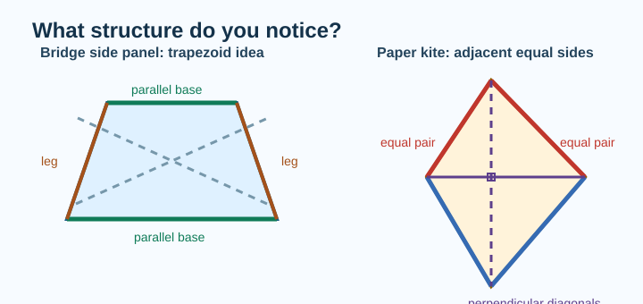
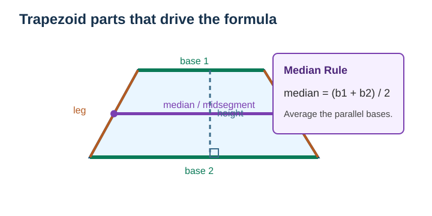
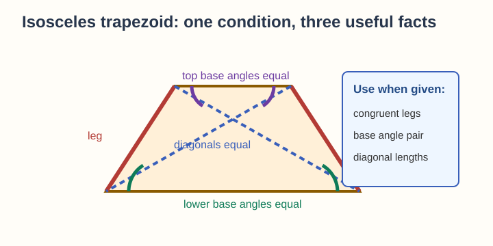
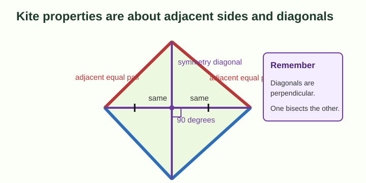
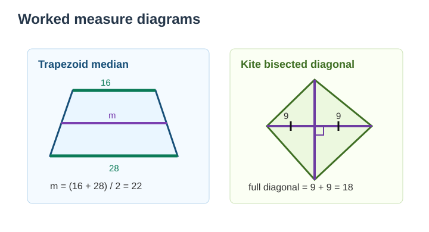
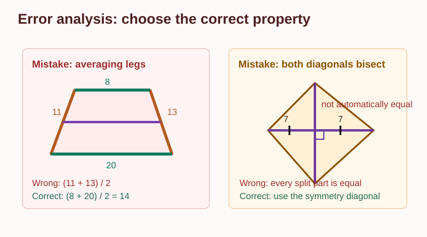

# Geometry - Lesson 5: Trapezoids and Kites

> [!GOAL] Learning Goal
>
> By the end of this lesson, you should be able to **derive and use properties of trapezoids and kites**, including medians, base angles, diagonals, symmetry, and missing-measure relationships.

**Content domain:** Measurement and Geometry  
**Estimated time:** 50 minutes  
**Difficulty:** Intermediate  
**Target competency:** Derive and use properties of parts and secondary parts.

---

## What You Should Already Know

This lesson builds on parallel lines, perpendicular lines, angle relationships, and quadrilateral classification.

Before reading, check that you can:

- identify parallel sides in a diagram
- use congruent markings on sides and angles
- solve equations such as $x + 8 = 21$ and $2x + 5 = 37$
- recognize that perpendicular lines form right angles

> [!CHECK] Pre-Check
>
> 1. What does it mean for two segments to be congruent?
> 2. If two parallel lines are cut by a transversal, what can be true about corresponding angles?
> 3. Solve: $2x + 6 = 30$.
>
> Answers: same length; corresponding angles are congruent when the lines are parallel; $x = 12$.

## Try Before You Read

Look at the side of a bridge, a lampshade, a school bag logo, or a paper kite. Some shapes have one pair of parallel sides. Others have two pairs of touching equal sides.

Ask yourself:

- Which sides appear parallel?
- Which sides appear equal?
- Which diagonal or center line could split the figure into matching parts?

Those observations lead to two important quadrilaterals: **trapezoids** and **kites**.

---

## Key Vocabulary

| Term | Meaning |
| --- | --- |
| Trapezoid | A quadrilateral with at least one pair of parallel sides |
| Bases | The parallel sides of a trapezoid |
| Legs | The non-parallel sides of a trapezoid |
| Median or midsegment | A segment joining the midpoints of the legs of a trapezoid |
| Isosceles trapezoid | A trapezoid whose legs are congruent |
| Kite | A quadrilateral with two distinct pairs of adjacent congruent sides |
| Diagonal | A segment joining non-adjacent vertices |
| Symmetry diagonal | In a kite, the diagonal through the vertices where the equal sides meet |

> [!IMPORTANT] Definition Note
>
> Some books define a trapezoid as having **exactly one** pair of parallel sides. This lesson uses the common inclusive definition: **at least one pair of parallel sides**. When solving from a diagram, use the markings and given information.

---

## Visual Introduction

The next diagram names the parts that matter most in trapezoid problems. Use it as a reference when a problem asks for a base, leg, median, or height.

The median is especially useful because it has a predictable length:

$$\text{median} = \frac{\text{base}_1 + \text{base}_2}{2}$$

This means the median is the average of the two bases.

---

## Main Concept Explanation

### 1. Trapezoids: Bases, Legs, and Median

In a trapezoid, the parallel sides are called **bases**. The other two sides are called **legs**.

If the bases measure $10$ cm and $18$ cm, then the median measures:

$$\frac{10 + 18}{2} = \frac{28}{2} = 14\text{ cm}$$

You can also work backward. If one base is $12$ cm and the median is $17$ cm, then:

$$17 = \frac{12 + b}{2}$$

$$34 = 12 + b$$

$$b = 22$$

> [!TIP] Median Shortcut
>
> The trapezoid median is halfway between the two base lengths. It is not found by adding the legs.

### 2. Isosceles Trapezoids

An isosceles trapezoid has congruent legs. That one condition creates several useful relationships.

In an isosceles trapezoid:

- the legs are congruent
- each pair of base angles is congruent
- the diagonals are congruent

For example, if the lower-left base angle is $68^\circ$, then the lower-right base angle is also $68^\circ$.

### 3. Kites: Adjacent Equal Sides and Perpendicular Diagonals

A kite has two pairs of adjacent congruent sides. The equal sides touch each other.

Important kite properties:

- one diagonal is a line of symmetry
- the symmetry diagonal bisects the other diagonal
- the diagonals are perpendicular
- one pair of opposite angles is congruent

> [!WARNING] Common Trap
>
> A kite does **not** usually have opposite sides parallel. Do not use trapezoid base rules on a kite unless the diagram gives parallel sides.

---

## Rule Box / Formula Box

| Shape | Property | How to use it |
| --- | --- | --- |
| Trapezoid | Bases are parallel | Identify the bases before using formulas |
| Trapezoid | Median joins midpoint of legs | $\text{median} = \dfrac{b_1 + b_2}{2}$ |
| Isosceles trapezoid | Legs are congruent | Set leg lengths equal |
| Isosceles trapezoid | Base angles are congruent | Set matching base angles equal |
| Isosceles trapezoid | Diagonals are congruent | Set diagonal expressions equal |
| Kite | Adjacent pairs of sides are congruent | Match touching equal sides |
| Kite | Diagonals are perpendicular | Use right angles or $90^\circ$ |
| Kite | Symmetry diagonal bisects the other diagonal | Set the two split parts equal |

## Worked Examples

The diagram below shows two common measure problems side by side: a trapezoid median problem and a kite diagonal problem.

### Example 1: Trapezoid Median

A trapezoid has bases $16$ cm and $28$ cm. Find the median.

$$m = \frac{16 + 28}{2}$$

$$m = \frac{44}{2} = 22$$

The median is **22 cm**.

### Example 2: Missing Kite Diagonal Part

In a kite, the symmetry diagonal bisects the other diagonal. If one half of the bisected diagonal is $9$ cm, then the other half is also $9$ cm.

So the full diagonal is:

$$9 + 9 = 18\text{ cm}$$

> [!CHECK] Quick Check
>
> In a kite, if the diagonals intersect, what angle is formed at the intersection?
>
> Answer: $90^\circ$.

---

## Guided Practice

### Problem 1

A trapezoid has bases $9$ m and $15$ m. Find the median.

**Hint 1:** The median is the average of the bases.  
**Hint 2:** Compute $(9 + 15) \div 2$.  
**Answer:** $12$ m

### Problem 2

An isosceles trapezoid has one lower base angle measuring $74^\circ$. What is the other lower base angle?

**Hint 1:** In an isosceles trapezoid, base angles are congruent.  
**Hint 2:** Congruent angles have equal measures.  
**Answer:** $74^\circ$

### Problem 3

In a kite, the symmetry diagonal cuts the other diagonal into pieces labeled $(x + 3)$ cm and $11$ cm. Find $x$.

**Hint 1:** The symmetry diagonal bisects the other diagonal.  
**Hint 2:** Set $x + 3 = 11$.  
**Answer:** $x = 8$

### Problem 4

A kite has perpendicular diagonals. One angle at the intersection is labeled $(3x)^\circ$. Find $x$.

**Hint 1:** Perpendicular lines form right angles.  
**Hint 2:** Set $3x = 90$.  
**Answer:** $x = 30$

## Mini-Quiz

1. What are the parallel sides of a trapezoid called?
2. A trapezoid has bases $12$ and $20$. What is its median?
3. In an isosceles trapezoid, what is true about the diagonals?
4. In a kite, what is the measure of the angle formed by the diagonals?
5. A kite has adjacent sides $AB$ and $BC$ congruent. If $AB = 13$, what is $BC$?

**Mini-Quiz Answers**

1. Bases
2. $16$
3. They are congruent.
4. $90^\circ$
5. $13$

---

## Independent Practice

Solve these on paper.

1. Name the bases and legs in a trapezoid diagram.
2. Find the median of a trapezoid with bases $7$ cm and $19$ cm.
3. A trapezoid has median $14$ cm and one base $10$ cm. Find the other base.
4. An isosceles trapezoid has one top base angle $112^\circ$. Find the other top base angle.
5. In an isosceles trapezoid, diagonals are labeled $(3x + 2)$ and $35$. Find $x$.
6. A kite has adjacent congruent sides labeled $(2x + 1)$ and $17$. Find $x$.
7. A kite diagonal is bisected into pieces of $6$ cm and $6$ cm. What is the full length of that diagonal?
8. Explain why a student should not assume every trapezoid is isosceles.

## Answer Key with Explanations

1. The bases are the parallel sides; the legs are the non-parallel sides.
2. $13$ cm, because $(7 + 19)/2 = 13$.
3. $18$ cm, because $14 = (10 + b)/2$, so $28 = 10 + b$.
4. $112^\circ$, because base angles in an isosceles trapezoid are congruent.
5. $x = 11$, because $3x + 2 = 35$.
6. $x = 8$, because adjacent congruent sides are equal: $2x + 1 = 17$.
7. $12$ cm, because $6 + 6 = 12$.
8. A trapezoid only needs a pair of parallel sides. It is isosceles only when its legs are congruent.

---

## Misconception Alerts

> [!WARNING] Mistake 1: Averaging the legs instead of the bases
>
> The trapezoid median formula uses the two **bases**, not the legs.

> [!WARNING] Mistake 2: Treating every trapezoid as isosceles
>
> Base angles and diagonals are congruent only in an **isosceles** trapezoid.

> [!WARNING] Mistake 3: Thinking all kite diagonals bisect each other
>
> In a kite, the symmetry diagonal bisects the other diagonal. The reverse is not always true.

> [!WARNING] Mistake 4: Matching opposite sides in a kite
>
> A kite has adjacent congruent sides. The equal sides touch.

## Error Analysis

Study this incorrect solution. The diagram marks a trapezoid and a kite problem in which the wrong property was used.

**Student claim:** "The trapezoid median is $(11 + 13)/2 = 12$ because 11 and 13 are the legs. In the kite, both diagonals bisect each other, so every split piece is equal."

**What went wrong?**

- For the trapezoid, the median uses the **bases**, not the legs.
- For the kite, only the symmetry diagonal is guaranteed to bisect the other diagonal.

**Correct reasoning:** If the trapezoid bases are $8$ and $20$, then the median is $(8 + 20)/2 = 14$. In the kite, use the markings to decide which diagonal is bisected.

---

## Self-Explanation Prompts

Use these to check whether the idea is yours, not just something you copied.

1. How can you identify the bases of a trapezoid before solving?
2. Why is the trapezoid median an average?
3. What extra information makes a trapezoid isosceles?
4. Which kite diagonal is the symmetry diagonal?
5. How can perpendicular diagonals help you solve a missing angle problem?

**Sample Responses**

1. The bases are the sides marked parallel.
2. The median sits halfway between the bases, so its length is halfway between their lengths.
3. Congruent legs make a trapezoid isosceles.
4. The symmetry diagonal connects the vertices where the congruent side pairs meet.
5. Perpendicular diagonals create right angles, so each intersection angle is $90^\circ$.

## Extension Challenge

An isosceles trapezoid has bases $14$ cm and $30$ cm. Its median is labeled $(2x + 4)$ cm. Its diagonals are labeled $(5y - 3)$ cm and $(3y + 17)$ cm.

Find $x$ and $y$.

**Hint:** Use the median formula for $x$. Use congruent diagonals for $y$.

**Solution:**  
Median: $(14 + 30)/2 = 22$, so $2x + 4 = 22$ and $x = 9$.  
Diagonals: $5y - 3 = 3y + 17$, so $2y = 20$ and $y = 10$.

## Mastery Checklist

Check each statement when you can do it confidently.

- I can identify the bases and legs of a trapezoid.
- I can use the trapezoid median formula.
- I can solve backward when the median and one base are given.
- I can use base-angle and diagonal properties of isosceles trapezoids.
- I can identify adjacent congruent sides in a kite.
- I can use perpendicular kite diagonals to find angle measures.
- I can tell which kite diagonal bisects the other diagonal.
- I can choose a property based on the diagram markings, not just the shape's appearance.

> [!PRACTICE] What To Do Next
>
> Use the practice exam for a quick check on vocabulary and direct measure problems. Use the assessment when you are ready to solve mixed trapezoid and kite problems with explanations.

## Final Summary

Trapezoids and kites are both quadrilaterals with special parts. For trapezoids, identify the bases first, then use the median formula when a midsegment appears. For isosceles trapezoids, use congruent legs, base angles, and diagonals. For kites, look for adjacent congruent sides, perpendicular diagonals, and the symmetry diagonal that bisects the other diagonal.
