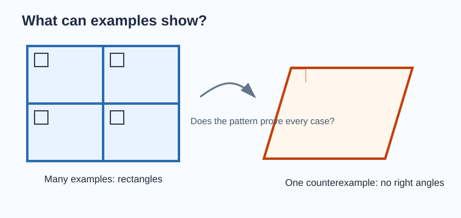
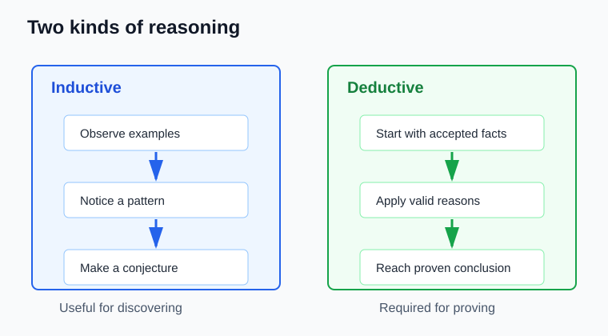
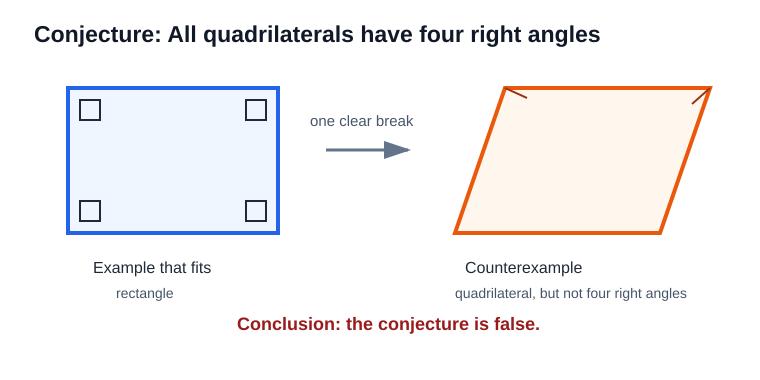
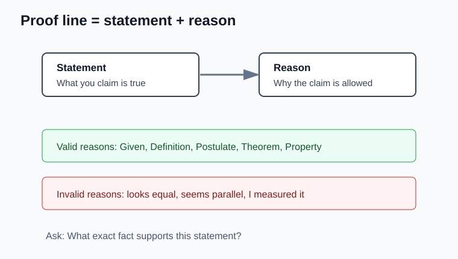
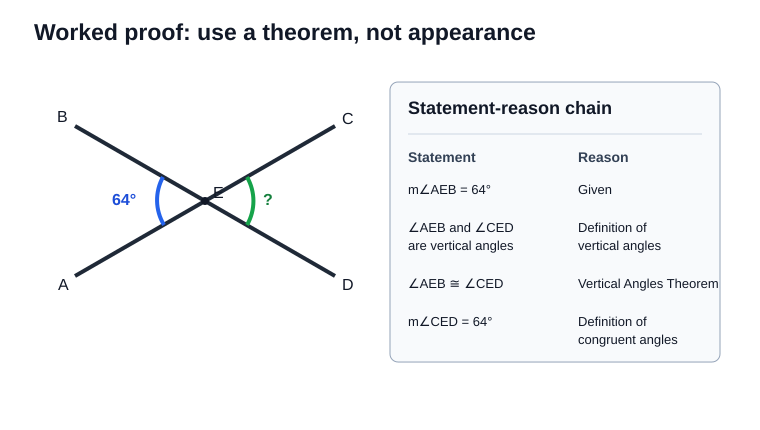
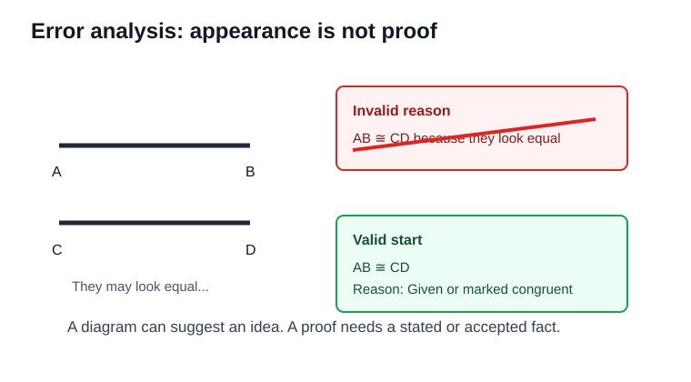

# Geometry - Lesson 6: Reasoning and Proof Foundations

> [!GOAL] Learning Goal
>
> By the end of this lesson, you should be able to **distinguish inductive reasoning from deductive reasoning**, test conjectures with counterexamples, and organize simple geometry arguments using **statements and reasons**.

**Content domain:** Measurement and Geometry  
**Estimated time:** 55 minutes  
**Difficulty:** Intermediate  
**Target competency:** Distinguish inductive from deductive reasoning.

---

## What You Should Already Know

This lesson begins the proof part of geometry. You do not need to write long proofs yet, but you do need to read diagrams carefully.

Before reading, check that you can:

- identify parallel and perpendicular markings in a diagram
- recognize congruent marks on segments or angles
- use facts such as vertical angles are congruent
- solve a simple equation such as $x + 68 = 180$

> [!CHECK] Pre-Check
>
> 1. If two angles form a linear pair and one is $125^\circ$, what is the other angle?
> 2. If two angles are vertical angles, what can you conclude about their measures?
> 3. If a diagram marks $\overline{AB} \cong \overline{CD}$, what does that mean?
>
> Answers: $55^\circ$; they are equal; the two segments have the same length.

## Try Before You Read

Look at the visual prompt below. A student notices several rectangular window panes and says, "Every four-sided shape must have four right angles."

Ask yourself:

- What evidence did the student use?
- Is the conclusion definitely true?
- What one example could prove the statement false?

This is the heart of the lesson: **examples can suggest an idea, but proof requires valid reasoning.**

---

## Key Vocabulary

| Term | Meaning |
| --- | --- |
| Inductive reasoning | Reasoning from patterns or examples to make a conjecture |
| Deductive reasoning | Reasoning from accepted facts, definitions, postulates, or theorems to reach a certain conclusion |
| Conjecture | A statement believed to be true based on evidence, but not yet proven |
| Counterexample | One example that shows a conjecture is false |
| Statement | A claim written in a proof or argument |
| Reason | The definition, postulate, theorem, or given fact that supports a statement |
| Postulate | A basic geometry fact accepted without proof |
| Theorem | A geometry fact that has been proven |

## Visual Introduction

Use this diagram as your anchor:

- **Inductive reasoning** moves from examples to a likely rule.
- **Deductive reasoning** moves from accepted facts to a guaranteed conclusion.

> [!IMPORTANT] Big Distinction
>
> Inductive reasoning can help you **discover** a pattern.  
> Deductive reasoning is what lets you **prove** a conclusion.

---

## Main Concept Explanation

### 1. Inductive Reasoning: Pattern First

Inductive reasoning starts with observations.

Example:

- A rectangle has diagonals that are congruent.
- A square has diagonals that are congruent.
- Another rectangle has diagonals that are congruent.

A reasonable conjecture is:

> The diagonals of every rectangle are congruent.

That conjecture may be true, but the examples alone do not prove it for every rectangle.

> [!WARNING] Common Trap
>
> Several examples can support a conjecture, but they do not prove it. One missed case can still break the rule.

### 2. Counterexamples: One Clear Break

A counterexample disproves a conjecture with one specific example.

Conjecture: "All quadrilaterals have four right angles."

Counterexample: A parallelogram can have four sides but no right angles.

The conjecture is false because one quadrilateral that does not have four right angles is enough to disprove it.

### 3. Deductive Reasoning: Facts First

Deductive reasoning begins with facts that are already accepted.

Example:

1. $\angle A$ and $\angle B$ are vertical angles.  
2. Vertical angles are congruent.  
3. Therefore, $\angle A \cong \angle B$.

The conclusion follows because the reason is a theorem, not just a pattern noticed in a few drawings.

### 4. Statements and Reasons

Geometry proofs are organized arguments. Each line has:

- a **statement**: what you claim
- a **reason**: why the claim is allowed

Good reasons include:

- Given
- Definition of congruent segments
- Definition of midpoint
- Linear Pair Postulate
- Vertical Angles Theorem
- Corresponding Angles Postulate
- Transitive Property
- Substitution Property

Weak reasons include:

- "It looks equal"
- "The diagram seems parallel"
- "I measured it"
- "Because I think so"

> [!TIP] Proof Habit
>
> If a statement appears in a proof, ask: **What exact fact allows me to write this?**

---

## Rule Box / Formula Box

| Situation | Reasoning Type | What to Watch |
| --- | --- | --- |
| You notice a pattern in several diagrams | Inductive | Write a conjecture, not a proof |
| You use a theorem to reach a conclusion | Deductive | The conclusion is supported by accepted facts |
| You find one example that breaks a claim | Counterexample | The original conjecture is false |
| You write a proof line | Statement-reason reasoning | Every statement needs a valid reason |

## Worked Example

Lines $AC$ and $BD$ intersect at $E$. Given $m\angle AEB = 64^\circ$. Prove $m\angle CED = 64^\circ$.

| Statement | Reason |
| --- | --- |
| $m\angle AEB = 64^\circ$ | Given |
| $\angle AEB$ and $\angle CED$ are vertical angles | Definition of vertical angles |
| $\angle AEB \cong \angle CED$ | Vertical Angles Theorem |
| $m\angle CED = 64^\circ$ | Definition of congruent angles |

Notice the structure:

1. Start with the given fact.
2. Name the relationship in the diagram.
3. Use a theorem.
4. Translate congruence into equal measures.

---

## Guided Practice

### Problem 1

A student measures three drawings of a kite and notices each has one pair of opposite angles congruent. The student says, "All kites have one pair of opposite angles congruent."

Is this inductive or deductive reasoning?

**Hint 1:** Did the student begin with examples or with a theorem?  
**Hint 2:** Examples suggest a conjecture.  
**Answer:** Inductive reasoning.

### Problem 2

Conjecture: "Every parallelogram is a rectangle." Give a counterexample.

**Hint 1:** You need one parallelogram that does not have four right angles.  
**Hint 2:** A slanted parallelogram can work.  
**Answer:** A non-rectangular parallelogram is a counterexample because it has opposite sides parallel but does not have four right angles.

### Problem 3

Complete the reason:  
Statement: $\angle 1 \cong \angle 3$  
Situation: $\angle 1$ and $\angle 3$ are vertical angles.

**Hint 1:** Which theorem says vertical angles are equal in measure?  
**Hint 2:** Use the theorem name, not "it looks equal."  
**Answer:** Vertical Angles Theorem.

### Problem 4

Given: $M$ is the midpoint of $\overline{AB}$.  
What statement can you write using the definition of midpoint?

**Hint 1:** A midpoint divides a segment into two congruent segments.  
**Hint 2:** The two smaller segments are $\overline{AM}$ and $\overline{MB}$.  
**Answer:** $\overline{AM} \cong \overline{MB}$.

## Mini-Quiz

1. Is a conjecture always proven true?  
2. What does a counterexample do to a conjecture?  
3. In a proof, why is "it looks parallel" not a valid reason?  
4. If two angles form a linear pair, what measure relationship can you write?

**Answers:** No; it disproves it; diagrams may be inaccurate and proof needs accepted facts; their measures add to $180^\circ$.

---

## Independent Practice

Try these before opening the practice exam.

1. Write a conjecture from this pattern: $3, 6, 9, 12, \ldots$
2. Give a counterexample to "All angles are acute."
3. Classify the reasoning: "Since opposite sides of a parallelogram are congruent, and $ABCD$ is a parallelogram, $\overline{AB} \cong \overline{CD}$."
4. Complete the reason: If $\angle A$ and $\angle B$ are supplementary, then $m\angle A + m\angle B = 180^\circ$.
5. Complete the statement: If $P$ is the midpoint of $\overline{XY}$, then ______.
6. Explain why measuring a printed diagram is not enough to prove two angles are congruent.

## Answer Key with Explanations

1. One possible conjecture: the pattern increases by 3 each time. This is based on observed terms, so it is inductive.
2. A right angle or obtuse angle is a counterexample because it is an angle but not acute.
3. Deductive reasoning, because the conclusion follows from a known property of parallelograms.
4. Definition of supplementary angles.
5. $\overline{XP} \cong \overline{PY}$, or $XP = PY$, by definition of midpoint.
6. A diagram can be drawn inaccurately. A proof must use givens, definitions, postulates, or theorems.

## Misconception Alerts

| Misconception | Correction |
| --- | --- |
| "If it happens in many examples, it is proven." | Many examples support a conjecture, but they do not prove every case. |
| "A counterexample needs to be complicated." | A simple, clear example is usually best. |
| "The diagram can be used as proof by itself." | Diagrams guide thinking, but proof needs accepted facts. |
| "The reason can just restate the statement." | A reason must explain why the statement is valid. |
| "Inductive reasoning is bad." | It is useful for discovering ideas; it just is not the same as proof. |

## Error Analysis

A student writes:

| Statement | Reason |
| --- | --- |
| $\overline{AB} \cong \overline{CD}$ | They look the same length |
| Therefore, $AB = CD$ | Definition of congruent segments |

What is wrong?

The first reason is not valid. A diagram may look equal even when no congruence marks or given facts support that claim.

Corrected start:

| Statement | Reason |
| --- | --- |
| $\overline{AB} \cong \overline{CD}$ | Given |
| $AB = CD$ | Definition of congruent segments |

> [!CHECK] Reasoning Check
>
> A proof can use information marked in the diagram, stated in the problem, or known from accepted definitions and theorems. It cannot use appearance alone.

## Self-Explanation Prompts

Answer in one or two sentences.

1. How are inductive and deductive reasoning different?
2. Why does one counterexample disprove a conjecture?
3. What makes a proof reason valid?
4. When should you use a theorem instead of measuring a diagram?

Sample responses:

- Inductive reasoning uses patterns to make a conjecture, while deductive reasoning uses accepted facts to prove a conclusion.
- A conjecture says something is always true, so one example where it fails is enough to make it false.
- A valid reason is a given, definition, postulate, theorem, or accepted property.
- Use a theorem when you need a conclusion that is guaranteed, not just estimated from a drawing.

## Extension Challenge

Conjecture: "If two angles are supplementary, then they form a linear pair."

Is the conjecture true? Explain.

**Hint:** Supplementary describes the sum of the measures. Linear pair describes a diagram relationship.

**Solution:** The conjecture is false. For example, a $40^\circ$ angle and a $140^\circ$ angle in separate parts of a diagram are supplementary because their measures add to $180^\circ$, but they do not form a linear pair unless they are adjacent and their non-common sides form a straight line.

## Mastery Checklist

Check each statement when it feels true for you.

- I can identify whether reasoning is inductive or deductive.
- I can write a conjecture from a pattern without calling it proven.
- I can use a counterexample to disprove a false conjecture.
- I can separate a proof line into a statement and a reason.
- I can choose valid reasons such as Given, Definition, Postulate, or Theorem.
- I can explain why "it looks true" is not a proof.
- I can complete a short geometry argument using accepted facts.

> [!PRACTICE] What To Do Next
>
> Use the practice exam for quick recall and feedback. Then use the assessment when you are ready to show that you can classify reasoning, test conjectures, and complete proof foundations without hints.
