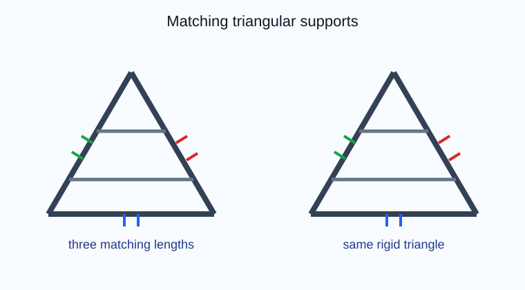
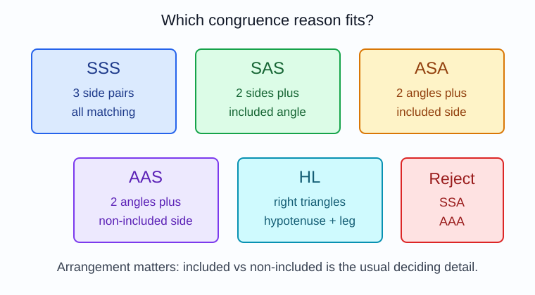
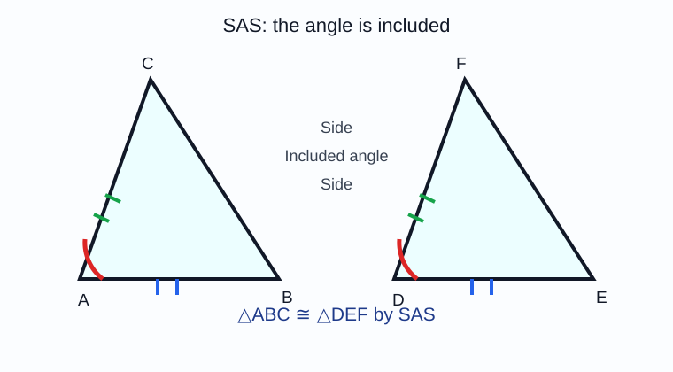
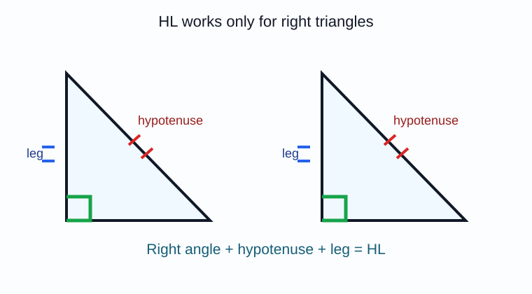
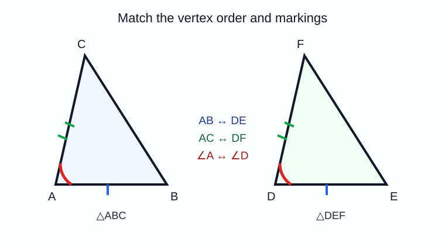
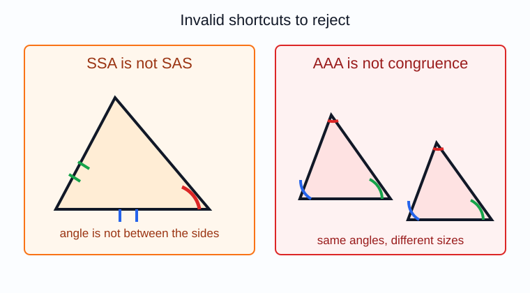

# Geometry - Lesson 7: Triangle Congruence Postulates

> [!GOAL] Learning Goal
>
> By the end of this lesson, you should be able to **decide whether two triangles must be congruent** using SSS, SAS, ASA, AAS, or HL, and reject invalid shortcuts such as SSA and AAA.

**Content domain:** Measurement and Geometry  
**Estimated time:** 50 minutes  
**Difficulty:** Intermediate  
**Target competency:** Apply SSS, SAS, ASA, AAS, and HL where appropriate.

---

## What You Should Already Know

Triangle congruence is about certainty. You are not asking whether two triangles look alike. You are asking whether the given markings **force** the triangles to have the same size and shape.

Before reading, check that you can:

- match corresponding vertices in a congruence statement
- identify congruent sides and angles from tick marks and arc marks
- recognize a right angle
- name the hypotenuse as the side opposite the right angle

> [!CHECK] Pre-Check
>
> 1. In $\\triangle ABC \\cong \\triangle DEF$, which vertex corresponds to $B$?
> 2. What does one tick mark on two different sides usually mean?
> 3. In a right triangle, what is the hypotenuse?
>
> Answers: $E$; the sides are congruent; the side opposite the right angle.

## Try Before You Read

Imagine two metal roof supports cut from the same plan. If three matching bars have the same lengths, the triangular frames cannot wiggle into different shapes.

That is the power of congruence postulates: a small amount of correct evidence can prove that the **whole triangle** matches another triangle.

---

## Key Vocabulary

| Term | Meaning |
| --- | --- |
| Congruent triangles | Triangles with all corresponding sides and angles equal |
| Corresponding parts | Matching sides or angles in the same relative position |
| Included angle | The angle formed between two named sides |
| Included side | The side between two named angles |
| Hypotenuse | The side opposite the right angle in a right triangle |
| Leg | Either side that forms the right angle in a right triangle |
| Postulate / theorem | A geometric rule accepted or proven as valid |
| SSS | Side-Side-Side congruence |
| SAS | Side-Angle-Side congruence, using the included angle |
| ASA | Angle-Side-Angle congruence, using the included side |
| AAS | Angle-Angle-Side congruence, using a non-included side |
| HL | Hypotenuse-Leg congruence for right triangles only |

## Visual Introduction

Use this decision chart whenever you inspect a marked diagram.

> [!IMPORTANT] Main Decision
>
> Count the given matching parts, then check their arrangement. Three letters are not enough by themselves. Their **order and position** matter.

---

## Main Concept Explanation

### 1. SSS: Three Matching Sides

If all three pairs of corresponding sides are congruent, then the triangles are congruent by SSS.

Example: If $AB \\cong DE$, $BC \\cong EF$, and $AC \\cong DF$, then:

$$\\triangle ABC \\cong \\triangle DEF \\text{ by SSS}$$

### 2. SAS: Two Sides and the Included Angle

SAS works when the angle is **between** the two marked sides.

In the diagram, the marked angle is squeezed between the marked sides. That locks the triangle.

> [!WARNING] Common Trap
>
> SSA is not a valid congruence shortcut. Two sides and a non-included angle can sometimes form different triangles.

### 3. ASA and AAS: Two Angles and One Side

ASA and AAS both use two pairs of congruent angles plus one pair of congruent sides.

| Pattern | What must be true |
| --- | --- |
| ASA | The marked side is between the two marked angles |
| AAS | The marked side is not between the two marked angles |

Both are valid because once two angles match, the third angle is forced to match.

### 4. HL: Right Triangles Only

HL works only when:

- both triangles are right triangles
- their hypotenuses are congruent
- one pair of corresponding legs is congruent

Do not use HL if you do not know both triangles are right triangles.

---

## Rule Box

| Evidence | Valid? | Reason |
| --- | --- | --- |
| SSS | Yes | Three side pairs fix the triangle |
| SAS | Yes | Two sides and their included angle fix the triangle |
| ASA | Yes | Two angles and the included side fix the triangle |
| AAS | Yes | Two angles and a non-included side fix the triangle |
| HL | Yes, for right triangles only | Hypotenuse and one leg fix a right triangle |
| SSA | No | The angle is not included, so two triangles may be possible |
| AAA | No | Same shape only; size may differ |

---

## Worked Example

Given $AB \\cong DE$, $AC \\cong DF$, and $\\angle A \\cong \\angle D$. Decide whether the triangles are congruent.

**Step 1: Count the evidence.**  
There are two side pairs and one angle pair.

**Step 2: Check the position.**  
$\\angle A$ is between $\\overline{AB}$ and $\\overline{AC}$. $\\angle D$ is between $\\overline{DE}$ and $\\overline{DF}$.

**Step 3: Choose the reason.**  
This is SAS.

**Answer:** $\\triangle ABC \\cong \\triangle DEF$ by SAS.

> [!CHECK] Try It
>
> If $\\angle G \\cong \\angle J$, $\\angle H \\cong \\angle K$, and $GI \\cong JL$, is the reason ASA or AAS?
>
> Answer: AAS, because the side is not between the two marked angles.

---

## Guided Practice

### Problem 1: Match the Reason

Two triangles have all three pairs of corresponding sides marked congruent. What reason proves the triangles congruent?

**Hint 1:** Count the side markings.  
**Hint 2:** No angle evidence is needed if all three side pairs match.  
**Answer:** SSS.

### Problem 2: Included or Not Included?

Two triangles have two sides and one angle marked. The angle is between the two marked sides. What reason applies?

**Hint 1:** "Between" means included.  
**Hint 2:** Side-Angle-Side requires the included angle.  
**Answer:** SAS.

### Problem 3: Right Triangle Check

Two right triangles have congruent hypotenuses and one congruent leg. What reason applies?

**Hint 1:** HL starts with right triangles.  
**Hint 2:** The H is hypotenuse and the L is leg.  
**Answer:** HL.

### Problem 4: Reject a Shortcut

Two triangles have the same three angle measures. Must they be congruent?

**Hint 1:** Same angles guarantee the same shape.  
**Hint 2:** Congruence also needs the same size.  
**Answer:** No. AAA is not a congruence shortcut.

---

## Misconception Alerts

> [!WARNING] SSA Is Not SAS
>
> SAS requires the marked angle to be between the two marked sides. If the angle is outside that position, the evidence is SSA and is not enough.

> [!WARNING] AAA Is Similarity, Not Congruence
>
> Three matching angles can create triangles of different sizes. AAA proves similarity, not congruence.

> [!WARNING] HL Needs Right Triangles
>
> Hypotenuse is a word reserved for right triangles. If no right angle is given or marked, do not use HL.

## Error Analysis

A student writes:

> "The triangles are congruent by SSA because two sides and one angle match."

The mistake is that SSA is not a valid congruence rule. The angle is not included between the two sides, so the information may not force one unique triangle.

**Correct response:** More information is needed, or the diagram must show a valid pattern such as SSS, SAS, ASA, AAS, or HL.

---

## Self-Explanation Prompts

Answer these in your own words before opening the practice exam.

1. How can you tell whether an angle is included between two sides?
2. Why does AAA fail to prove congruence?
3. What two facts must be checked before using HL?
4. Why is the vertex order important in $\\triangle ABC \\cong \\triangle DEF$?

**Sample responses:** The included angle touches both marked sides. AAA gives the same shape but not necessarily the same size. HL needs right triangles plus hypotenuse and leg evidence. Vertex order tells which parts correspond.

## Extension Challenge

Two triangles have $\\angle A \\cong \\angle D$, $\\angle B \\cong \\angle E$, and $AC \\cong DF$. A classmate says the triangles are congruent by ASA.

Is the classmate correct?

**Hint:** In $\\triangle ABC$, side $AC$ is not between $\\angle A$ and $\\angle B$.  
**Solution:** The triangles may be congruent, but the reason is AAS, not ASA.

## Mastery Checklist

Check yourself:

- I can match corresponding vertices in a congruence statement.
- I can identify SSS from side markings.
- I can tell SAS from SSA by checking whether the angle is included.
- I can tell ASA from AAS by locating the side.
- I can use HL only for right triangles.
- I can explain why AAA does not prove congruence.
- I can write a complete triangle congruence statement with a valid reason.

> [!PRACTICE] Next Step
>
> Use the practice exam for quick feedback on recognizing valid congruence evidence. Use the assessment when you can explain why each valid reason applies.
