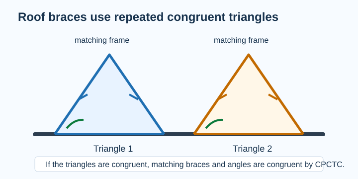
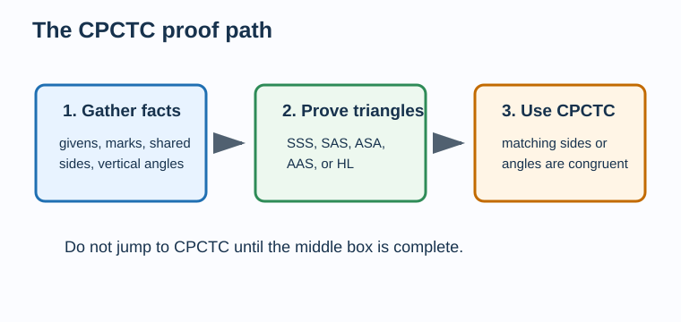
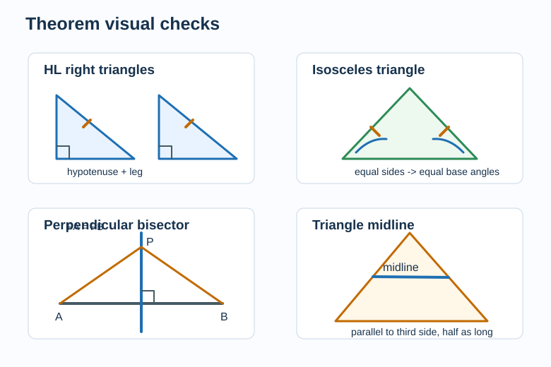
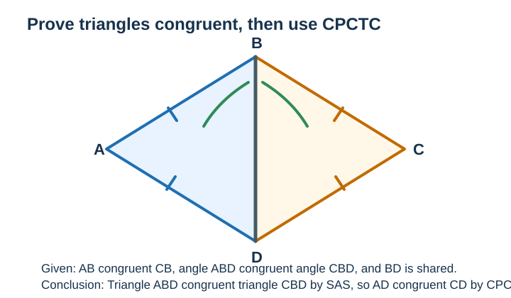
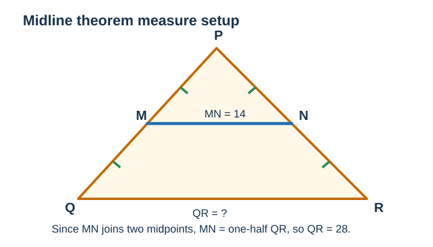
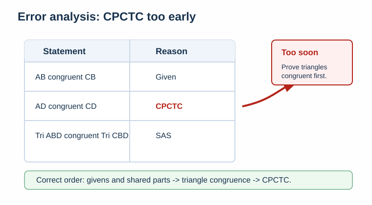

# Geometry - Lesson 8: CPCTC and Theorem Problems

> [!GOAL] Learning Goal
>
> By the end of this lesson, you should be able to use **congruent triangles** to prove corresponding parts congruent, then apply related triangle theorems to solve measure and proof problems.

**Content domain:** Measurement and Geometry  
**Estimated time:** 60 minutes  
**Difficulty:** Intermediate  
**Target competency:** Use congruent triangles to prove corresponding parts.

---

## What You Should Already Know

This lesson builds on triangle congruence. Before using CPCTC, check that you can:

- match corresponding vertices in a congruence statement
- identify SSS, SAS, ASA, AAS, and HL
- read tick marks, angle arcs, right-angle boxes, and midpoint marks
- write a reason for each statement in a short proof
- solve equations such as $2x + 5 = 31$

> [!CHECK] Pre-Check
>
> 1. If $\triangle ABC \cong \triangle DEF$, which side corresponds to $\overline{BC}$?
> 2. Which congruence condition can prove two right triangles congruent using a hypotenuse and one leg?
> 3. If two sides of a triangle are congruent, what can you conclude about the opposite angles?
>
> Answers: $\overline{EF}$; HL; the opposite angles are congruent.

## Try Before You Read

A roof truss often uses repeated triangular frames. If two triangular frames are congruent, builders can trust that matching braces and angles line up.

Think about this:

- What must be proven first before you can say the matching braces are congruent?
- Which parts are corresponding?
- Why is "they look the same" not enough in a proof?

The key idea is simple but strict: **prove the triangles congruent first; then use CPCTC for matching parts.**

---

## Key Vocabulary

| Term | Meaning |
| --- | --- |
| CPCTC | Corresponding Parts of Congruent Triangles are Congruent |
| Corresponding parts | Matching sides or angles in the same relative position in congruent figures |
| Hypotenuse-Leg (HL) | A right-triangle congruence theorem using a congruent hypotenuse and one congruent leg |
| Isosceles Triangle Theorem | If two sides of a triangle are congruent, then the angles opposite them are congruent |
| Perpendicular Bisector Theorem | Points on a perpendicular bisector are equidistant from the segment's endpoints |
| Midline Theorem | A segment joining midpoints of two sides of a triangle is parallel to the third side and half its length |

## Visual Introduction

Use this flow whenever a problem asks you to prove a side or angle congruent:

1. Find enough information to prove two triangles congruent.
2. Name the congruence reason: SSS, SAS, ASA, AAS, or HL.
3. Use CPCTC to prove the matching side or angle.

> [!IMPORTANT] CPCTC Rule
>
> CPCTC is not a triangle congruence shortcut. It is used **after** triangle congruence has already been proven.

---

## Main Concept Explanation

### 1. What CPCTC Allows

Suppose $\triangle ABC \cong \triangle DEF$.

The congruence statement matches vertices in order:

| Triangle 1 | Triangle 2 |
| --- | --- |
| $A$ | $D$ |
| $B$ | $E$ |
| $C$ | $F$ |

So CPCTC lets you conclude:

- $\overline{AB} \cong \overline{DE}$
- $\overline{BC} \cong \overline{EF}$
- $\overline{AC} \cong \overline{DF}$
- $\angle A \cong \angle D$
- $\angle B \cong \angle E$
- $\angle C \cong \angle F$

### 2. Why the Order Matters

You may see a target like "Prove $\overline{BD} \cong \overline{CD}$." That does not automatically mean the segments are congruent.

You need a proof path:

1. Prove two triangles congruent.
2. Check that $\overline{BD}$ and $\overline{CD}$ are corresponding parts.
3. Use CPCTC.

> [!WARNING] Common Trap
>
> Do not write "CPCTC" as the reason unless you have already written a triangle congruence statement before it.

### 3. Theorem Problems Connected to Congruent Triangles

Many triangle theorems are connected to congruent triangles. You may not always write the full proof, but the logic comes from congruence.

| Theorem or Tool | What It Gives You |
| --- | --- |
| HL | Proves right triangles congruent using hypotenuse and one leg |
| Isosceles Triangle Theorem | Congruent sides imply congruent base angles |
| Perpendicular Bisector Theorem | A point on the perpendicular bisector is equally far from both endpoints |
| Midline Theorem | The midline is parallel to the third side and half its length |

---

## Rule Box

| If you know... | You may conclude... | Reason |
| --- | --- | --- |
| $\triangle ABC \cong \triangle DEF$ | Matching sides and angles are congruent | CPCTC |
| Right triangles have congruent hypotenuses and one congruent leg | The triangles are congruent | HL |
| Two sides of one triangle are congruent | The opposite angles are congruent | Isosceles Triangle Theorem |
| A point lies on the perpendicular bisector of $\overline{AB}$ | Its distances to $A$ and $B$ are equal | Perpendicular Bisector Theorem |
| A segment joins midpoints of two sides of a triangle | It is parallel to the third side and half as long | Midline Theorem |

## Worked Example: Proving a Corresponding Part

Given: $\overline{AB} \cong \overline{CB}$, $\angle ABD \cong \angle CBD$, and $\overline{BD}$ is shared.  
Prove: $\overline{AD} \cong \overline{CD}$.

| Statement | Reason |
| --- | --- |
| $\overline{AB} \cong \overline{CB}$ | Given |
| $\angle ABD \cong \angle CBD$ | Given |
| $\overline{BD} \cong \overline{BD}$ | Reflexive Property |
| $\triangle ABD \cong \triangle CBD$ | SAS |
| $\overline{AD} \cong \overline{CD}$ | CPCTC |

Notice the exact moment CPCTC appears: only after the two triangles have been proven congruent.

## Worked Example: Midline Measure

In $\triangle PQR$, points $M$ and $N$ are midpoints of $\overline{PQ}$ and $\overline{PR}$. If $\overline{MN} = 14$, find $\overline{QR}$.

Since $\overline{MN}$ joins two midpoints, it is a midline.

By the Midline Theorem:

$$MN = \frac{1}{2}QR$$

Substitute:

$$14 = \frac{1}{2}QR$$

So:

$$QR = 28$$

Answer: $\overline{QR} = 28$ units.

---

## Guided Practice

### Problem 1

If $\triangle JKL \cong \triangle MNP$, which angle corresponds to $\angle K$?

**Hint 1:** Match vertices in order.  
**Hint 2:** $J \leftrightarrow M$, $K \leftrightarrow N$, $L \leftrightarrow P$.  
**Answer:** $\angle N$.

### Problem 2

Two right triangles have congruent hypotenuses and one pair of congruent legs. What theorem proves the triangles congruent?

**Hint 1:** This theorem is only for right triangles.  
**Hint 2:** It uses a hypotenuse and a leg.  
**Answer:** HL.

### Problem 3

In $\triangle ABC$, $\overline{AB} \cong \overline{AC}$. What can you conclude about $\angle B$ and $\angle C$?

**Hint 1:** The congruent sides are opposite the base angles.  
**Hint 2:** Use the isosceles triangle theorem.  
**Answer:** $\angle B \cong \angle C$.

### Problem 4

Point $P$ lies on the perpendicular bisector of $\overline{AB}$. If $PA = 3x + 2$ and $PB = 20$, find $x$.

**Hint 1:** A point on a perpendicular bisector is equidistant from the endpoints.  
**Hint 2:** Set $3x + 2 = 20$.  
**Answer:** $x = 6$.

---

## Mini-Quiz

1. Can CPCTC be used before triangle congruence is proven?
2. If $\triangle RST \cong \triangle XYZ$, which side corresponds to $\overline{ST}$?
3. A triangle has two congruent sides. What theorem helps prove its base angles are congruent?
4. A midline measures 9 units. How long is the third side parallel to it?

Answers: no; $\overline{YZ}$; Isosceles Triangle Theorem; 18 units.

## Independent Practice

Try these before opening the practice exam:

1. If $\triangle ABC \cong \triangle DEF$, list three pairs of corresponding congruent parts.
2. Write a proof reason for $\overline{AC} \cong \overline{AC}$.
3. In right triangles $ABC$ and $DEF$, the hypotenuses are congruent and one leg pair is congruent. What proves the triangles congruent?
4. Point $X$ is on the perpendicular bisector of $\overline{MN}$. If $XM = 4y - 1$ and $XN = 23$, find $y$.
5. A midline in a triangle is 11 cm. Find the length of the parallel third side.
6. Explain why "the two angles look equal" is not a valid proof reason.

## Answer Key with Explanations

1. Example: $\overline{AB} \cong \overline{DE}$, $\overline{BC} \cong \overline{EF}$, $\angle C \cong \angle F$. The congruence statement gives the matching order.
2. Reflexive Property. A segment is congruent to itself.
3. HL, because the triangles are right triangles with a congruent hypotenuse and a congruent leg.
4. $4y - 1 = 23$, so $4y = 24$ and $y = 6$.
5. $22$ cm. A midline is half the third side.
6. A proof needs givens, definitions, postulates, theorems, or already-proven statements, not visual guessing.

## Misconception Alerts

> [!WARNING] Misconception 1: CPCTC proves triangles congruent.
>
> CPCTC does not prove triangles congruent. It proves corresponding parts congruent **after** the triangles are congruent.

> [!WARNING] Misconception 2: Matching letters casually is fine.
>
> The order of a congruence statement matters. In $\triangle ABC \cong \triangle DEF$, $B$ matches $E$, not $F$.

> [!WARNING] Misconception 3: A midline equals the third side.
>
> A triangle midline is parallel to the third side and has **half** its length.

## Error Analysis

A student writes:

| Statement | Reason |
| --- | --- |
| $\overline{AB} \cong \overline{CB}$ | Given |
| $\overline{AD} \cong \overline{CD}$ | CPCTC |
| $\triangle ABD \cong \triangle CBD$ | SAS |

What is wrong?

The student used CPCTC too early. The congruent triangles must be proven before using CPCTC.

Correct order:

1. Use givens and shared parts to prove $\triangle ABD \cong \triangle CBD$.
2. Then use CPCTC to conclude $\overline{AD} \cong \overline{CD}$.

## Self-Explanation Prompts

Answer these in your own words:

1. Why does CPCTC depend on a triangle congruence statement?
2. How can the order of letters help you identify corresponding parts?
3. How is HL different from SSA?
4. Why does a perpendicular bisector create equal distances?
5. How does the midline theorem connect parallelism and length?

Sample response for Prompt 1: CPCTC works because congruent triangles have the same size and shape, so their matching sides and matching angles must be congruent.

## Extension Challenge

In $\triangle ABC$, $D$ and $E$ are midpoints of $\overline{AB}$ and $\overline{AC}$. Segment $\overline{DE}$ is parallel to $\overline{BC}$. If $DE = 2x + 3$ and $BC = 5x - 6$, find $x$ and both lengths.

**Hint:** Use $DE = \frac{1}{2}BC$.

Solution:

$$2x + 3 = \frac{1}{2}(5x - 6)$$

$$4x + 6 = 5x - 6$$

$$x = 12$$

Then $DE = 2(12) + 3 = 27$ and $BC = 5(12) - 6 = 54$.

## Mastery Checklist

Check each statement when it feels true:

- I can explain CPCTC in my own words.
- I can identify corresponding sides and angles from a congruence statement.
- I can avoid using CPCTC before proving triangles congruent.
- I can use HL for right triangle congruence problems.
- I can apply the isosceles triangle theorem.
- I can use the perpendicular bisector theorem to set equal distances.
- I can use the midline theorem to find missing lengths.
- I can write a short statement-reason argument.

> [!PRACTICE] What To Do Next
>
> Use the practice exam for low-stakes recall. Then use the assessment when you can explain why each theorem applies without guessing from the diagram.
