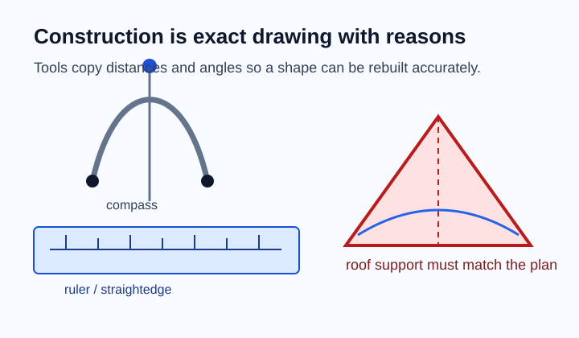
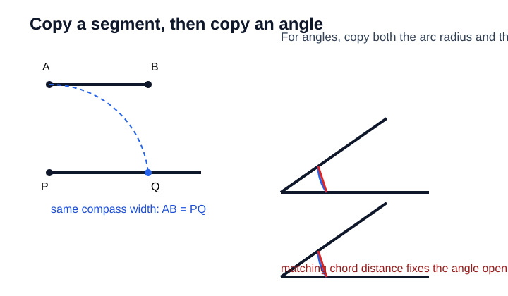
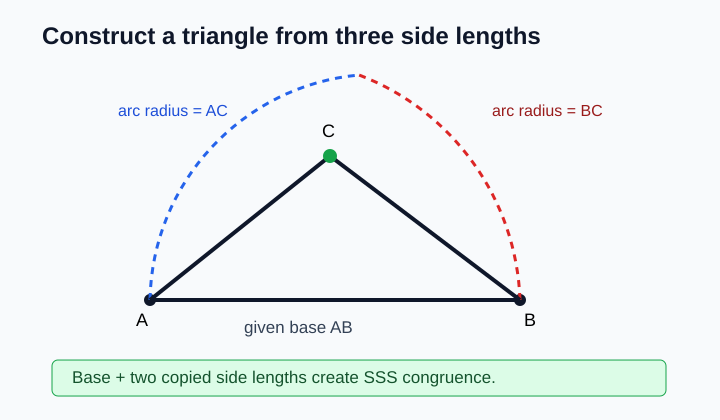
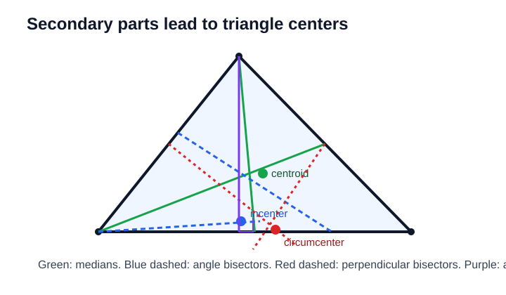
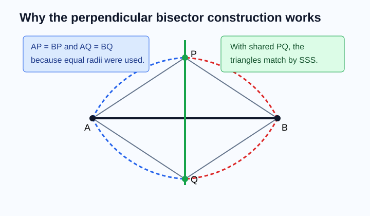
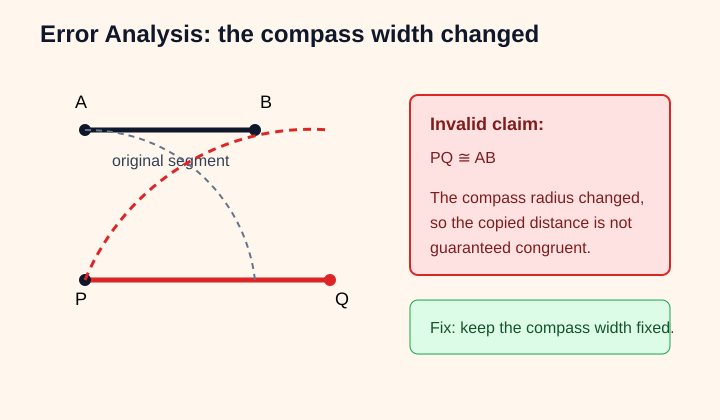

# Geometry - Lesson 9: Geometric Constructions

> [!GOAL] Learning Goal
>
> By the end of this lesson, you should be able to **construct segments, angles, triangles, secondary parts, and centers**, then explain why the construction works using **congruence ideas**.

**Content domain:** Measurement and Geometry  
**Estimated time:** 60 minutes  
**Difficulty:** Intermediate  
**Target competency:** Construct segments, angles, triangles, secondary parts, and centers.

---

## What You Should Already Know

Geometric construction is careful drawing with reasons behind each move. Before starting, check that you can:

- mark congruent segments with tick marks
- recognize a midpoint, perpendicular line, and angle bisector
- use a compass to copy a distance
- use a straightedge or ruler to draw clean lines
- connect construction steps to facts such as SSS, SAS, and perpendicular bisectors

> [!CHECK] Pre-Check
>
> 1. What tool copies a distance without measuring it numerically?
> 2. If a point is on the perpendicular bisector of a segment, what is true about its distance from the segment endpoints?
> 3. What does an angle bisector do to an angle?
>
> Answers: compass; it is equidistant from the endpoints; it divides the angle into two congruent angles.

## Try Before You Read

Architects, carpenters, and designers often need a shape to be copied exactly, not just "close enough."

Suppose you need to copy a triangular roof support from a plan onto graph paper.

- Which parts must match: side lengths, angles, or both?
- What could go wrong if you only copy the drawing by eye?
- What construction marks would help someone check your work?

The key idea is simple: **a construction is strongest when every visible mark has a geometric reason.**

---

## Key Vocabulary

| Term | Meaning |
| --- | --- |
| Construction | An accurate geometric drawing made using accepted tools and steps |
| Compass | A tool used to copy distances and draw arcs or circles |
| Straightedge | A tool used to draw a line through points; it does not measure |
| Perpendicular bisector | A line that cuts a segment at its midpoint and forms right angles |
| Angle bisector | A ray that divides an angle into two congruent angles |
| Median | A segment from a triangle vertex to the midpoint of the opposite side |
| Altitude | A perpendicular segment from a triangle vertex to the line containing the opposite side |
| Circumcenter | Intersection of the perpendicular bisectors of a triangle |
| Incenter | Intersection of the angle bisectors of a triangle |
| Centroid | Intersection of the medians of a triangle |

## Visual Introduction

A compass does not just make circles. In constructions, it transfers a distance.

- To copy a segment, open the compass to the original length and mark that same length on a new ray.
- To copy an angle, use equal-radius arcs from both vertices, then copy the chord distance between the arc intersections.

> [!IMPORTANT] Construction Habit
>
> Keep your light construction arcs visible. They are evidence. They show where congruent distances came from.

---

## Main Concept Explanation

### 1. Copying Segments and Angles

To copy $\overline{AB}$ onto a ray from point $P$:

1. Draw a ray starting at $P$.
2. Open the compass to the distance $AB$.
3. Without changing the compass width, mark point $Q$ on the ray.
4. Then $\overline{PQ} \cong \overline{AB}$.

To copy $\angle A$:

1. Draw a new ray with endpoint $P$.
2. Draw an arc centered at $A$ that crosses both sides of the angle.
3. With the same radius, draw an arc centered at $P$.
4. Copy the distance between the two original arc intersections.
5. Mark the matching point on the new arc and draw the second side of the angle.

The reason this works is that the same compass widths create congruent segments, which create matching triangles around the angle.

### 2. Constructing a Triangle

For an SSS triangle with sides $AB$, $AC$, and $BC$:

1. Draw the base $\overline{AB}$.
2. Set the compass to length $AC$ and draw an arc from $A$.
3. Set the compass to length $BC$ and draw an arc from $B$.
4. The arc intersection is point $C$.
5. Connect $A$ to $C$ and $B$ to $C$.

Because all three side lengths match the given lengths, the constructed triangle is congruent to the intended triangle by **SSS Congruence**.

> [!WARNING] Common Trap
>
> Do not change the compass width while transferring a distance. A tiny width change can destroy the congruence reason.

### 3. Constructing Secondary Parts and Centers

Triangle centers come from repeated construction of secondary parts:

| Center | Construct These | What the Center Means |
| --- | --- | --- |
| Circumcenter | Perpendicular bisectors of sides | Equidistant from the triangle vertices |
| Incenter | Angle bisectors | Equidistant from the triangle sides |
| Centroid | Medians | Balancing point of the triangle |
| Orthocenter | Altitudes | Intersection of perpendiculars from vertices |

You usually only need two of the same type of secondary part to locate a center. The third should pass through the same point if the construction is accurate.

### 4. Justifying Constructions with Congruence

A construction is not just a set of drawing steps. It also has a proof idea.

For example, when constructing a perpendicular bisector of $\overline{AB}$:

- Use the same compass radius from $A$ and from $B$.
- Arc intersections $P$ and $Q$ are each the same distance from $A$ and $B$.
- So $AP = BP$ and $AQ = BQ$.
- Triangles $\triangle APQ$ and $\triangle BPQ$ are congruent by SSS.
- Therefore, line $PQ$ crosses $\overline{AB}$ at a right angle and at its midpoint.

> [!TIP] Good Explanation Frame
>
> "I used the same compass radius, so these segments are congruent. That gives congruent triangles, which proves the constructed line or angle has the required property."

---

## Rule Box / Formula Box

| Task | Main Tool Move | Reason It Works |
| --- | --- | --- |
| Copy a segment | Transfer one compass width | Equal compass widths create congruent segments |
| Copy an angle | Copy an arc radius and chord distance | Matching triangles create congruent angles |
| Construct SSS triangle | Intersect arcs from base endpoints | Three matching sides give SSS congruence |
| Perpendicular bisector | Equal arcs from both endpoints | Points on the line are equidistant from endpoints |
| Angle bisector | Equal arcs from angle sides | Matching distances form congruent triangles |
| Median | Find midpoint, then connect to opposite vertex | Median joins a vertex to midpoint |
| Altitude | Draw perpendicular from vertex to opposite side | Altitude must form a right angle |

## Worked Example

Construct the perpendicular bisector of $\overline{AB}$ and explain why it works.

1. Open the compass to a radius greater than half of $AB$.
2. From $A$, draw arcs above and below $\overline{AB}$.
3. Without changing the radius, draw arcs from $B$ that intersect the first arcs at $P$ and $Q$.
4. Draw line $PQ$.
5. Let $M$ be the point where $PQ$ crosses $\overline{AB}$.

**Justification:** Since the same radius was used from $A$ and $B$, $AP = BP$ and $AQ = BQ$. With $PQ$ shared, $\triangle APQ \cong \triangle BPQ$ by SSS. The symmetry forces $PQ$ to meet $\overline{AB}$ at its midpoint and at right angles, so $PQ$ is the perpendicular bisector of $\overline{AB}$.

---

## Guided Practice

### Problem 1

You copy $\overline{CD}$ onto a ray starting at $R$. What must stay unchanged on the compass?

**Hint 1:** You are transferring one distance.  
**Hint 2:** The compass width should match the original segment.  
**Answer:** The compass width must stay equal to $CD$ until the copied endpoint is marked.

### Problem 2

You construct a triangle by drawing a base and then intersecting two arcs from the base endpoints. Which congruence idea usually justifies the construction?

**Hint 1:** The arcs set two side lengths.  
**Hint 2:** The base is the third side.  
**Answer:** SSS Congruence.

### Problem 3

Which center is found by constructing the perpendicular bisectors of a triangle's sides?

**Hint 1:** Perpendicular bisectors are connected to equal distances from vertices.  
**Hint 2:** This center is the center of a circle through all vertices.  
**Answer:** The circumcenter.

### Problem 4

A student draws a segment from a triangle vertex to the midpoint of the opposite side. What secondary part did the student construct?

**Hint 1:** It uses a midpoint, not a right angle.  
**Hint 2:** It connects a vertex to the opposite side's midpoint.  
**Answer:** A median.

---

## Mini-Quiz

1. Why should construction arcs be left visible?
2. What does an angle bisector create?
3. What center comes from angle bisectors?
4. What must be true for a segment from a vertex to be an altitude?

**Answers:** They show the equal-distance evidence; two congruent angles; incenter; it must be perpendicular to the opposite side or its extension.

## Independent Practice

Try these before opening the practice exam.

1. Describe how to copy a segment using a compass and ray.
2. Explain why two equal arcs from segment endpoints help form a perpendicular bisector.
3. Construct an angle bisector for a drawn angle and label the two congruent angles.
4. Draw a triangle and construct one median.
5. Draw a triangle and construct one altitude.
6. State which center is found from medians, angle bisectors, and perpendicular bisectors.
7. Explain why an SSS triangle construction produces a congruent triangle.

## Answer Key with Explanations

1. Draw a ray, set the compass to the original segment length, and mark that distance from the ray endpoint.
2. Equal arcs create points equidistant from both endpoints; the line through those points is the perpendicular bisector.
3. The two smaller angles should be marked congruent because the ray divides the original angle equally.
4. A median connects a vertex to the midpoint of the opposite side.
5. An altitude must form a right angle with the opposite side or its extension.
6. Medians: centroid; angle bisectors: incenter; perpendicular bisectors: circumcenter.
7. The base and two arc distances match the three required side lengths, so the triangles are congruent by SSS.

## Misconception Alerts

| Misconception | Correction |
| --- | --- |
| "A construction is accurate if it looks close." | Accuracy depends on tool steps and geometric reasons, not appearance. |
| "A ruler measurement is always better than compass transfer." | Compass transfer preserves exact distance relationships in constructions. |
| "All triangle centers are the same point." | Different secondary parts usually create different centers. |
| "An altitude must stay inside the triangle." | In obtuse triangles, an altitude may meet an extension of a side. |
| "The third constructed secondary part does not matter." | It is a useful accuracy check because it should pass through the same center. |

## Error Analysis

A student tries to copy $\overline{AB}$. The student opens the compass to $AB$, starts drawing, then adjusts the compass slightly before marking the copied endpoint.

**What is wrong?**  
The copied segment no longer has a guaranteed congruent length.

**Correct reasoning:**  
The compass width must remain fixed while transferring the distance. If the width changes, the statement "the copied segment is congruent to $\overline{AB}$" has no valid construction reason.

## Self-Explanation Prompts

Use these to check your reasoning:

1. Which compass widths did I keep equal?
2. Which segments or angles are congruent because of the construction?
3. Which theorem or congruence idea justifies the final result?
4. How can I check whether my construction is precise?

Sample response:

> I used the same compass radius from both endpoints, so the arc intersection points are equally distant from the endpoints. That creates congruent triangles, so the line through the arc intersections is the perpendicular bisector.

## Extension Challenge

Construct a triangle from three given side lengths. Then construct its perpendicular bisectors to locate the circumcenter.

**Hint:** You only need two perpendicular bisectors to locate the circumcenter, but the third is a precision check.  
**Solution idea:** Build the SSS triangle with intersecting arcs. Construct perpendicular bisectors of two sides. Their intersection is the circumcenter because it is equidistant from all three vertices.

## Mastery Checklist

Check each statement when it feels true:

- I can copy a segment with a compass.
- I can copy an angle using arcs and chord distance.
- I can construct a triangle from side or angle information.
- I can construct a perpendicular bisector and explain why it works.
- I can distinguish medians, altitudes, angle bisectors, and perpendicular bisectors.
- I can identify circumcenter, incenter, centroid, and orthocenter from their construction lines.
- I can justify construction steps using congruent segments, congruent angles, or triangle congruence.

> [!PRACTICE] What To Do Next
>
> Use the practice exam for quick construction vocabulary and reasoning checks. Use the assessment when you can explain both **how to construct** and **why the construction works**.
