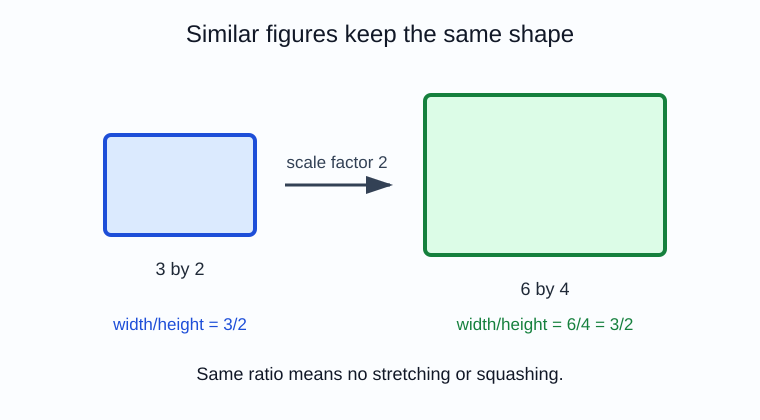
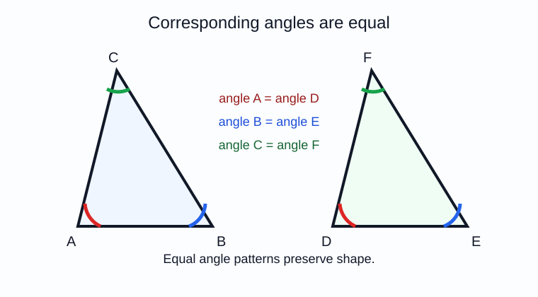
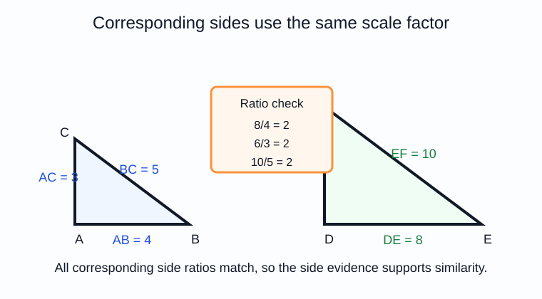
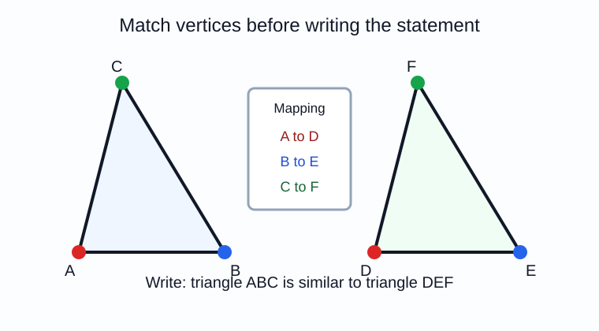
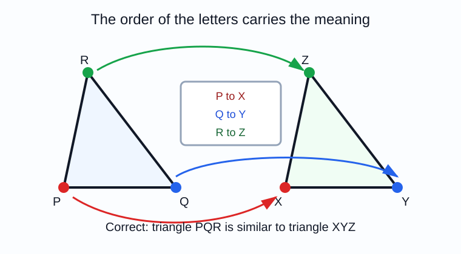
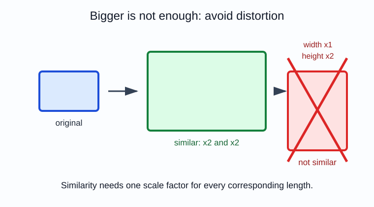

# Geometry - Lesson 1: Similar Figures

> [!GOAL] Learning Goal
>
> By the end of this lesson, you should be able to **identify similar figures** by checking same shape, equal corresponding angles, and proportional corresponding sides. You should also be able to write similarity statements in the correct vertex order.

**Content domain:** Measurement and Geometry  
**Estimated time:** 50 minutes  
**Difficulty:** Intermediate  
**Target competency:** Identify similarity through shape, angle equality, and proportional sides.  
**Assessment focus:** Write similarity statements.

---

## What You Should Already Know

Similarity is connected to matching parts. Before reading, check that you can:

- name a polygon by listing its vertices in order
- match vertices in the same relative position
- simplify ratios such as $6:9$ to $2:3$
- read angle marks and side lengths from a diagram
- tell the difference between "same size" and "same shape"

> [!CHECK] Pre-Check
>
> 1. In $\\triangle ABC$, which side is opposite vertex $A$?
> 2. Simplify the ratio $8:12$.
> 3. If $A$ matches $D$, $B$ matches $E$, and $C$ matches $F$, which angle matches $\\angle B$?
>
> Answers: $\\overline{BC}$; $2:3$; $\\angle E$.

## Try Before You Read

A phone photo can be enlarged for a poster. The poster is bigger, but the face should not look stretched. That is the idea behind similar figures: **same shape, possibly different size**.

If the larger figure is made by multiplying every length by the same number, the figures are similar.

---

## Key Vocabulary

| Term | Meaning |
| --- | --- |
| Similar figures | Figures with the same shape; corresponding angles are equal and corresponding sides are proportional |
| Corresponding parts | Matching vertices, sides, or angles in the same relative position |
| Similarity statement | A statement that names similar figures in matching vertex order |
| Proportional sides | Side lengths whose ratios are equal |
| Scale factor | The multiplier from one figure's side length to the matching side length of another figure |
| Non-example | A case that looks related but fails one or more similarity conditions |

## Main Concept

### 1. Same Shape, Different Size

Similar figures do not need to be congruent. They may be larger or smaller.

The important idea is this:

$$
\\text{same shape} + \\text{matching parts in order} = \\text{possible similarity}
$$

Congruent figures are always similar because their scale factor is $1$. But similar figures do not have to be congruent.

> [!IMPORTANT] Similarity Test
>
> To identify similarity, check both kinds of evidence: corresponding angles match, and corresponding side lengths form equal ratios.

### 2. Equal Corresponding Angles

The first visual clue is angle equality. Matching angles must have equal measures.

In the diagram:

| Triangle 1 | Triangle 2 |
| --- | --- |
| $\\angle A$ | $\\angle D$ |
| $\\angle B$ | $\\angle E$ |
| $\\angle C$ | $\\angle F$ |

If the angle pairs match, the shapes have the same corner pattern. For triangles, three matching angles are enough to prove similarity.

### 3. Proportional Corresponding Sides

Sides must grow or shrink by the same multiplier.

For the triangles in the diagram:

$$
\\frac{DE}{AB}=\\frac{6}{3}=2
$$

$$
\\frac{EF}{BC}=\\frac{8}{4}=2
$$

$$
\\frac{DF}{AC}=\\frac{10}{5}=2
$$

All three ratios are equal, so the scale factor from $\\triangle ABC$ to $\\triangle DEF$ is $2$.

> [!TIP] Ratio Direction
>
> Choose one direction and keep it. If you compare large to small for one side pair, compare large to small for every side pair.

### 4. Corresponding Vertices Control the Statement

A similarity statement is not just a list of letters. The order tells which parts match.

If $A$ matches $D$, $B$ matches $E$, and $C$ matches $F$, then write:

$$
\\triangle ABC \\sim \\triangle DEF
$$

This means:

- $A \\leftrightarrow D$
- $B \\leftrightarrow E$
- $C \\leftrightarrow F$
- $AB \\leftrightarrow DE$
- $BC \\leftrightarrow EF$
- $AC \\leftrightarrow DF$

The statement $\\triangle ABC \\sim \\triangle DFE$ would be wrong because it would match $B$ with $F$ and $C$ with $E$.

---

## Worked Example 1: Decide Whether Figures Are Similar

Two triangles have side lengths:

| Small triangle | Large triangle |
| --- | --- |
| $AB=4$ | $DE=10$ |
| $BC=6$ | $EF=15$ |
| $AC=8$ | $DF=20$ |

**Step 1: Match side pairs.**  
$AB$ with $DE$, $BC$ with $EF$, and $AC$ with $DF$.

**Step 2: Compare ratios in one direction.**

$$
\\frac{DE}{AB}=\\frac{10}{4}=2.5
$$

$$
\\frac{EF}{BC}=\\frac{15}{6}=2.5
$$

$$
\\frac{DF}{AC}=\\frac{20}{8}=2.5
$$

**Step 3: Conclude.**  
The ratios are equal. If the corresponding angles also match, then:

$$
\\triangle ABC \\sim \\triangle DEF
$$

## Worked Example 2: Write the Similarity Statement

The marks show:

- $P$ matches $X$
- $Q$ matches $Y$
- $R$ matches $Z$

So the correct statement is:

$$
\\triangle PQR \\sim \\triangle XYZ
$$

> [!CHECK] Try It
>
> If $M$ matches $T$, $N$ matches $U$, and $O$ matches $V$, write the similarity statement.
>
> Answer: $\\triangle MNO \\sim \\triangle TUV$.

---

## Common Non-Example: Distortion

Not every resized-looking figure is similar. If one direction is stretched more than another, the shape changes.

In the non-example, the width doubled but the height did not double. The side ratios do not match:

$$
\\frac{\\text{new width}}{\\text{old width}} \\ne \\frac{\\text{new height}}{\\text{old height}}
$$

That means the figures are not similar.

> [!WARNING] Common Trap
>
> "Bigger" does not automatically mean similar. Every corresponding length must use the same scale factor.

---

## Rule Box

| Evidence | What to Check | Similar? |
| --- | --- | --- |
| Same shape and same size | Angles match and side ratios are all $1$ | Yes, also congruent |
| Same shape, different size | Angles match and side ratios are equal | Yes |
| Same angles only in triangles | Three angle pairs match | Yes for triangles |
| One dimension stretched | Side ratios are not equal | No |
| Wrong vertex order | Parts are matched incorrectly | Statement is wrong even if figures are similar |

## Guided Practice

### Problem 1: Find the Scale Factor

$AB=5$ and $DE=15$. If $AB$ corresponds to $DE$, what is the scale factor from $\\triangle ABC$ to $\\triangle DEF$?

**Hint 1:** Compare new length to original length.  
**Hint 2:** $15 \\div 5 = 3$.  
**Answer:** The scale factor is $3$.

### Problem 2: Check Proportional Sides

One rectangle is $4$ by $7$. Another rectangle is $8$ by $14$. Are the rectangles similar?

**Hint 1:** Compare width ratios and height ratios.  
**Hint 2:** $8/4=2$ and $14/7=2$.  
**Answer:** Yes. Both dimensions were multiplied by $2$.

### Problem 3: Reject Distortion

One rectangle is $3$ by $5$. Another rectangle is $6$ by $8$. Are the rectangles similar?

**Hint 1:** $6/3=2$.  
**Hint 2:** $8/5=1.6$.  
**Answer:** No. The ratios are not equal.

### Problem 4: Write the Statement

If $A$ matches $L$, $B$ matches $M$, and $C$ matches $N$, write the similarity statement.

**Hint:** Put matching vertices in the same positions.  
**Answer:** $\\triangle ABC \\sim \\triangle LMN$.

---

## Self-Explanation Prompts

Answer these before opening the practice exam.

1. What two checks show that figures are similar?
2. Why does vertex order matter in a similarity statement?
3. How can a figure be larger but not similar?
4. What does the scale factor describe?

**Sample responses:** Similar figures have equal corresponding angles and proportional corresponding sides. Vertex order tells which parts correspond. A figure can be stretched unevenly, so side ratios are not equal. Scale factor is the multiplier from one figure to a matching figure.

## Mastery Checklist

Check yourself:

- I can tell whether two figures have the same shape.
- I can match corresponding vertices in order.
- I can identify equal corresponding angles.
- I can compare corresponding side ratios.
- I can spot a distortion that is not similar.
- I can write a correct similarity statement.
- I can explain why an incorrect vertex order changes the meaning.

> [!PRACTICE] Next Step
>
> Use the practice exam for quick feedback on angle matches, side ratios, and vertex order. Use the assessment when you can write similarity statements without guessing.
