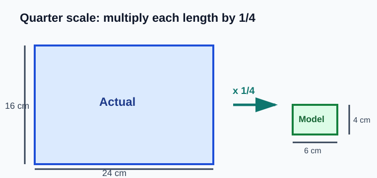
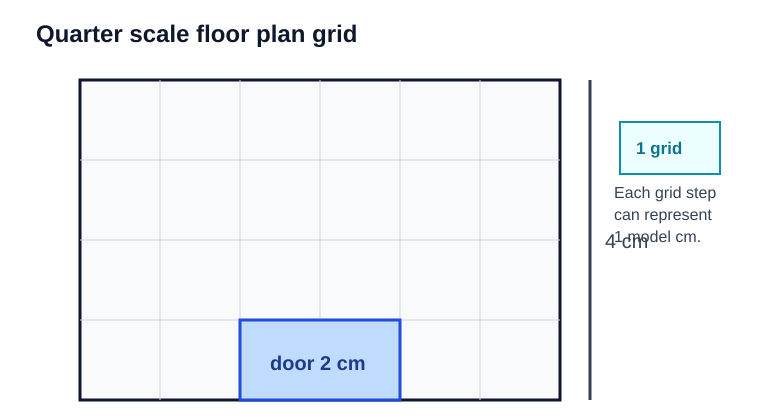
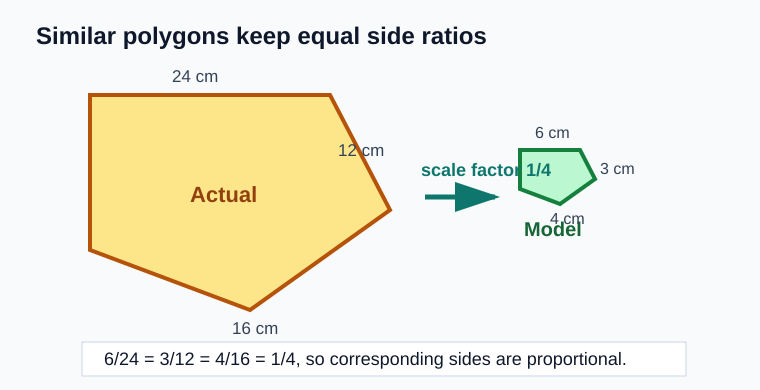
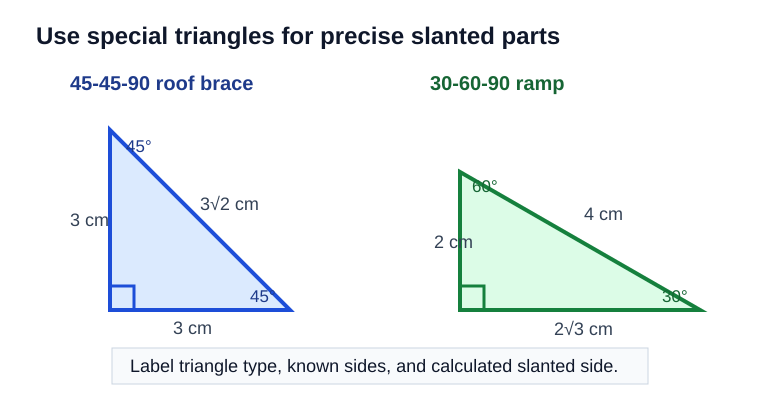
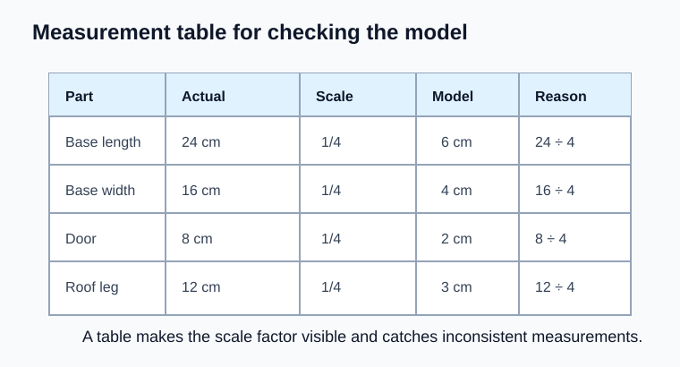
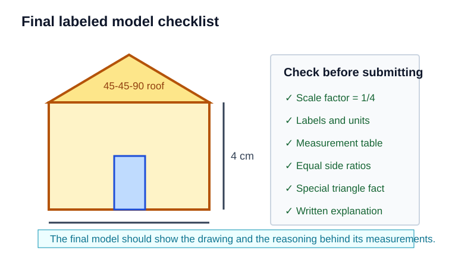

# Quarter Scale Model Task

> [!GOAL] Learning Goal
>
> Create a clear quarter scale drawing or model using similar polygons, special triangles, and accurate measurement explanations.

**Content domain:** Measurement and Geometry  
**Estimated time:** 60 minutes  
**Difficulty:** Advanced  
**Target competency:** Create a scale drawing or model using similar polygons and special triangles.  
**Assessment focus:** Explain scale factor and measurements.

## Lesson Roadmap

| Part | Focus | You should be able to |
| --- | --- | --- |
| 1 | Quarter scale | Convert actual lengths to model lengths |
| 2 | Site plan | Place measurements on a grid |
| 3 | Similar polygons | Keep matching side ratios and angles |
| 4 | Special triangles | Use 45-45-90 and 30-60-90 relationships |
| 5 | Measurement table | Document every important length |
| 6 | Final check | Explain and label the model accurately |

## Quick Recall

Answer these before starting.

1. What does a scale factor multiply?
2. If a rectangle is scaled by $\frac{1}{4}$, what happens to each side length?
3. Which angle measures stay the same when polygons are similar?
4. In a 45-45-90 triangle, how are the two legs related?

> [!TARGET] Target Skill
>
> Use the same scale factor for every corresponding length, then explain how your model measurements prove the drawing or model is similar to the actual object.

## 1. Understand the Quarter Scale Task

A **quarter scale model** uses a scale factor of $\frac{1}{4}$ from the actual object to the model.

$$
\text{model length}=\text{actual length}\times \frac{1}{4}
$$

Example:

| Actual measurement | Quarter scale model measurement |
| --- | --- |
| 16 cm | 4 cm |
| 12 cm | 3 cm |
| 8 cm | 2 cm |

The model is smaller, but the shape should match. Every corresponding length is one-fourth of the actual length.

> [!IMPORTANT] Main Rule
>
> Quarter scale means every linear measurement is multiplied by $\frac{1}{4}$. Do not divide some sides by 4 and estimate other sides by appearance.

## 2. Build the Floor or Site Plan First

Start with a top view. A grid helps you place points, count lengths, and check right angles.

Suppose the actual base is a 24 cm by 16 cm rectangle.

$$
24 \times \frac{1}{4}=6
$$

$$
16 \times \frac{1}{4}=4
$$

The model base should be **6 cm by 4 cm**.

### Mini Check

An actual platform is 20 cm long and 12 cm wide.

- Model length: $20 \times \frac{1}{4}=5$ cm
- Model width: $12 \times \frac{1}{4}=3$ cm

The quarter scale plan is **5 cm by 3 cm**.

## 3. Use Similar Polygons

The actual shape and model shape should be similar polygons. This means:

- corresponding angles are congruent
- corresponding side lengths have the same ratio
- the same scale factor is used throughout

For the rectangles above:

$$
\frac{6}{24}=\frac{4}{16}=\frac{1}{4}
$$

Both pairs of corresponding sides have the same scale factor, so the model rectangle is similar to the actual rectangle.

> [!WARNING] Common Trap
>
> A model that is 6 cm by 5 cm is not similar to a 24 cm by 16 cm rectangle. The length used scale factor $\frac{1}{4}$, but the width did not.

## 4. Add a Special Triangle Feature

Many models include triangular parts: a roof, ramp, brace, or support. Special right triangles help you calculate missing measurements accurately.

### 45-45-90 Triangle

In a 45-45-90 triangle:

$$
\text{leg}:\text{leg}:\text{hypotenuse}=1:1:\sqrt{2}
$$

If a model roof support has legs of 3 cm and 3 cm, then the slanted side is:

$$
3\sqrt{2}\text{ cm}
$$

### 30-60-90 Triangle

In a 30-60-90 triangle:

$$
\text{short leg}:\text{long leg}:\text{hypotenuse}=1:\sqrt{3}:2
$$

If a model ramp has short leg 2 cm, then:

- long leg: $2\sqrt{3}$ cm
- hypotenuse: 4 cm

> [!TIP] Project Choice
>
> Use at least one special triangle part when the shape needs a precise slanted measurement. Label the triangle type and the side relationship you used.

## 5. Record Measurements in a Table

Your model is easier to check when every important measurement appears in one table.

| Part | Actual length | Scale factor | Model length | Reason |
| --- | ---: | ---: | ---: | --- |
| Base length | 24 cm | $\frac{1}{4}$ | 6 cm | $24 \div 4$ |
| Base width | 16 cm | $\frac{1}{4}$ | 4 cm | $16 \div 4$ |
| Door width | 8 cm | $\frac{1}{4}$ | 2 cm | $8 \div 4$ |
| Roof leg | 12 cm | $\frac{1}{4}$ | 3 cm | $12 \div 4$ |

Use the table to catch mistakes before drawing the final model.

## 6. Explain the Final Model

The final answer is not only a drawing. It also needs a measurement explanation.

A strong explanation includes:

1. the scale factor
2. at least three actual-to-model measurement pairs
3. a statement that corresponding side ratios are equal
4. one special triangle relationship, if used
5. labels and units on the final drawing or model

### Model Explanation Template

Use this structure:

> My model uses a scale factor of $\frac{1}{4}$. The actual base is 24 cm by 16 cm, so the model base is 6 cm by 4 cm. The actual roof leg is 12 cm, so the model roof leg is 3 cm. Since $\frac{6}{24}=\frac{4}{16}=\frac{3}{12}=\frac{1}{4}$, the corresponding lengths use the same scale factor. The roof support is a 45-45-90 triangle, so equal legs create a slanted side of $3\sqrt{2}$ cm.

## Final Checklist

Before using the practice or assessment, check that you can do each item.

- I can state that quarter scale means scale factor $\frac{1}{4}$.
- I can multiply actual measurements by $\frac{1}{4}$.
- I can verify similar polygons using equal side ratios.
- I can use a 45-45-90 or 30-60-90 relationship for a triangular part.
- I can organize actual and model measurements in a table.
- I can explain my scale factor and measurement choices in complete sentences.

> [!PRACTICE] Practice Plan
>
> Use the practice set to check scale-factor calculations and short explanations. Use the assessment when you can justify the final model with measurements, ratios, and special triangle facts without looking back at the examples.
