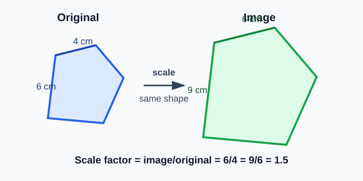
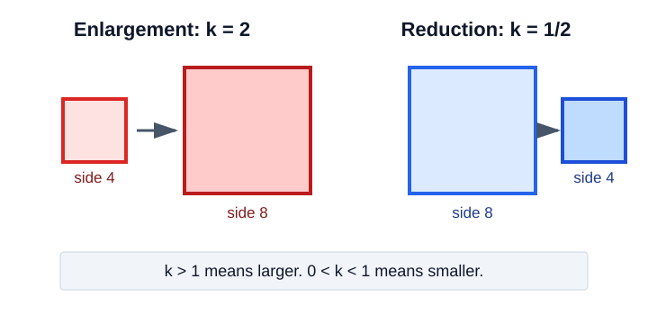
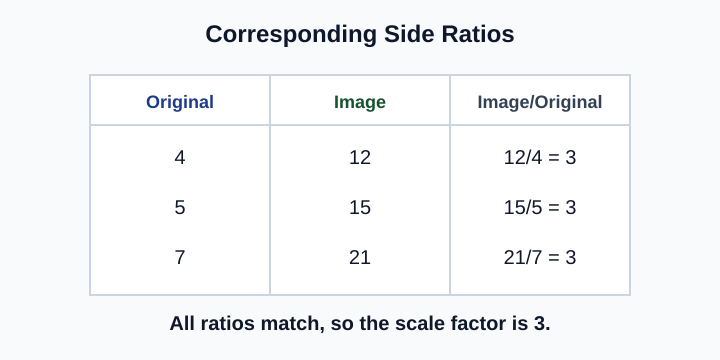
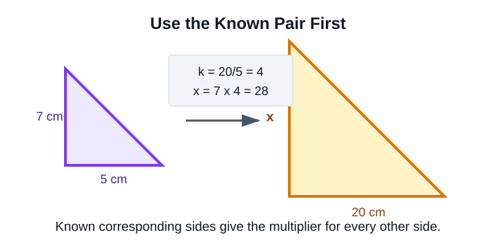
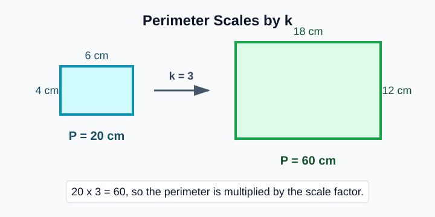
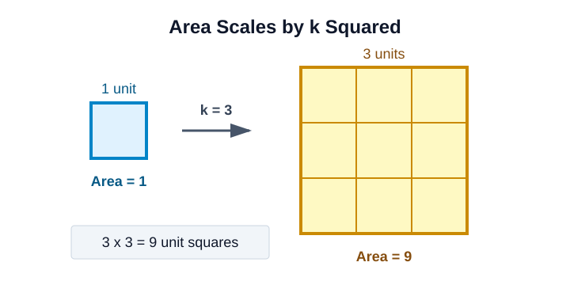

# Geometry - Lesson 2: Scale Factor

> [!GOAL] Learning Goal
>
> By the end of this lesson, you should be able to **find and use scale factors between polygons** to solve missing-side problems.

**Content domain:** Measurement and Geometry  
**Estimated time:** 50 minutes  
**Difficulty:** Intermediate  
**Target competency:** Find and use scale factors between polygons.  
**Assessment focus:** Solve missing-side problems.

---

## What You Should Already Know

Before starting, check that you can:

- match corresponding vertices in similar polygons
- write a ratio as a fraction
- multiply and divide fractions or decimals
- solve equations like $x = 3(5)$ and $x/4 = 6$

> [!CHECK] Pre-Check
>
> 1. In similar figures, what is true about corresponding angles?
> 2. What ratio compares 12 cm to 4 cm?
> 3. If every side of a shape is doubled, what happens to a 7 cm side?
>
> Answers: corresponding angles are equal; $12:4 = 3:1$; it becomes 14 cm.

## Try Before You Read

Look at the two similar pentagons. The smaller polygon is the **original**. The larger polygon is the **image**.

Each side in the image is made by multiplying the matching original side by the same number. That number is the **scale factor**.

---

## Key Vocabulary

| Term | Meaning |
| --- | --- |
| Similar polygons | Polygons with equal corresponding angles and proportional corresponding side lengths |
| Corresponding sides | Sides in the same matching positions |
| Original | The starting figure |
| Image | The new figure after scaling |
| Scale factor | The multiplier from one figure to the other |
| Enlargement | A scale factor greater than 1 |
| Reduction | A scale factor between 0 and 1 |

> [!IMPORTANT] Direction Matters
>
> The scale factor from original to image is $\frac{\text{image side}}{\text{original side}}$. Reversing the direction gives the reciprocal scale factor.

## Main Idea: One Multiplier Controls All Sides

If two polygons are similar, then every pair of corresponding sides has the same ratio.

$$
\text{scale factor}=\frac{\text{new length}}{\text{starting length}}
$$

| Scale factor | Effect |
| --- | --- |
| $k > 1$ | Enlargement |
| $0 < k < 1$ | Reduction |
| $k = 1$ | Same size |

### Example 1: Find the Scale Factor

A side of the original polygon is 6 cm. The corresponding side of the image is 15 cm.

$$
k=\frac{\text{image}}{\text{original}}=\frac{15}{6}=\frac{5}{2}=2.5
$$

The scale factor from original to image is $\frac{5}{2}$ or 2.5.

> [!TIP] Quick Check
>
> If the image side is longer than the original side, the scale factor should be greater than 1.

## Use a Ratio Table

A ratio table keeps corresponding sides organized.

In the diagram, each image length is $3$ times the matching original length.

| Original side | Image side | Ratio |
| --- | --- | --- |
| 4 | 12 | $12/4=3$ |
| 5 | 15 | $15/5=3$ |
| 7 | 21 | $21/7=3$ |

So the scale factor is $3$.

## Solve Missing-Side Problems

Use the same scale factor on every corresponding side.

### Example 2: Find $x$

The polygons are similar. A 5 cm side becomes 20 cm, and a 7 cm side becomes $x$.

**Step 1: Find the scale factor.**

$$
k=\frac{20}{5}=4
$$

**Step 2: Multiply the matching original side by the scale factor.**

$$
x=7(4)=28
$$

**Answer:** $x=28$ cm.

> [!WARNING] Common Trap
>
> Do not add the difference between side lengths. Scaling uses multiplication. If 5 becomes 20, the multiplier is 4; it is not a rule of "add 15" to every side.

## When the Missing Side Is in the Original

Sometimes the image side is known and the original side is missing.

Example: The scale factor from original to image is $3$. A side in the image is 24 cm. Let the original side be $x$.

$$
3x=24
$$

$$
x=8
$$

The original side is 8 cm.

## Perimeter Effect

When a polygon is scaled by factor $k$, its perimeter is also multiplied by $k$.

If every side is tripled, the total perimeter is tripled too.

### Example 3: Scale a Perimeter

A triangle has perimeter 18 cm. A similar triangle has scale factor $2.5$ from the first triangle.

$$
\text{new perimeter}=18(2.5)=45
$$

The image perimeter is 45 cm.

## Area Intuition

Area does not scale by $k$. It scales by $k^2$ because both length and width directions are scaled.

If the scale factor is $3$, then the area factor is:

$$
3^2=9
$$

This lesson focuses on missing sides, but remembering the area pattern helps prevent a common mistake.

> [!NOTE] Side, Perimeter, Area
>
> Side lengths multiply by $k$. Perimeters multiply by $k$. Areas multiply by $k^2$.

---

## Guided Practice

### Problem 1

A rectangle is enlarged. A 4 cm side becomes 10 cm. What is the scale factor?

**Work:** $k=\frac{10}{4}=\frac{5}{2}=2.5$  
**Answer:** 2.5

### Problem 2

Two similar triangles have scale factor $3$ from Triangle A to Triangle B. A side of Triangle A is 9 cm. What is the corresponding side of Triangle B?

**Work:** $9(3)=27$  
**Answer:** 27 cm

### Problem 3

The scale factor from a large polygon to a small polygon is $\frac{1}{4}$. A large side is 32 cm. What is the matching small side?

**Work:** $32\left(\frac{1}{4}\right)=8$  
**Answer:** 8 cm

### Problem 4

A polygon is scaled by factor $5$. Its perimeter was 14 cm. What is the new perimeter?

**Work:** $14(5)=70$  
**Answer:** 70 cm

---

## Independent Practice

Solve each problem before checking the answer key.

1. A side 8 cm becomes 12 cm. Find the scale factor.
2. A side 6 cm is scaled by factor $4$. Find the image side.
3. A side 30 cm is reduced by factor $\frac{2}{5}$. Find the image side.
4. The scale factor from original to image is $3$. The image side is 36 cm. Find the original side.
5. A similar polygon has perimeter 64 cm after a scale factor of $2$. What was the original perimeter?
6. A square is scaled by factor $4$. By what factor does its area change?

## Answer Key with Explanations

1. $\frac{12}{8}=\frac{3}{2}=1.5$. The image length goes on top when finding original-to-image scale factor.
2. $6(4)=24$ cm. Multiply by the scale factor.
3. $30\left(\frac{2}{5}\right)=12$ cm. A fractional scale factor makes a reduction.
4. $3x=36$, so $x=12$ cm. Divide by the scale factor when the original side is missing.
5. $2p=64$, so $p=32$ cm. Perimeter scales by the same factor as side length.
6. $4^2=16$. Area scales by the square of the scale factor.

> [!PRACTICE] Exam Plan
>
> Use the practice exam for quick feedback on scale factors and missing sides. Then use the assessment when you can set up the ratio or multiplier without hints.
