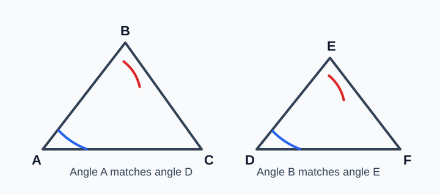
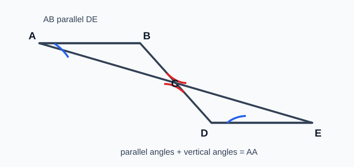
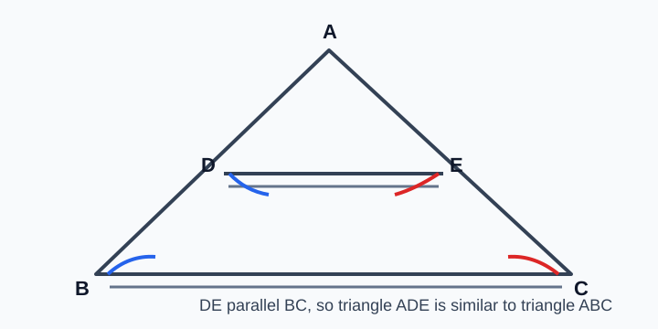
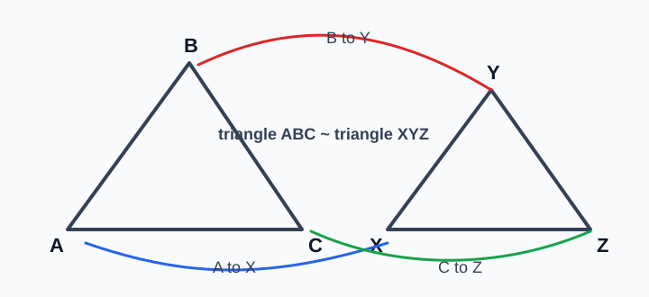
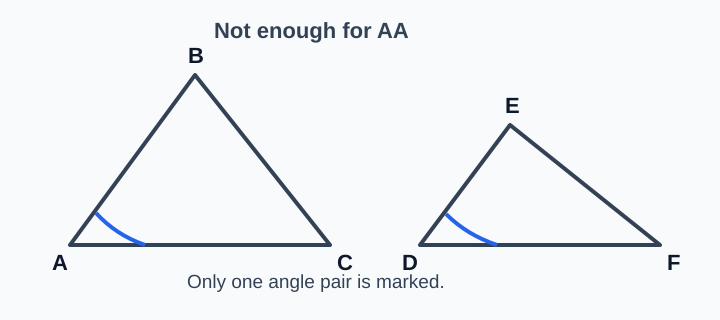
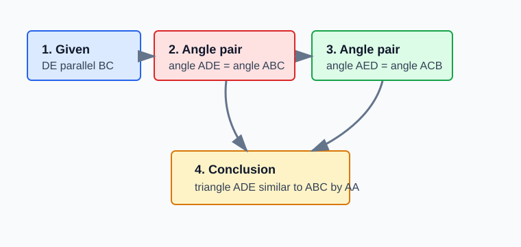

# Geometry - Lesson 3: Triangle Similarity: AA

> [!GOAL] Learning Goal
>
> By the end of this lesson, you should be able to **apply AA similarity in diagrams** and **justify similarity from angle information**.

**Content domain:** Measurement and Geometry  
**Estimated time:** 50 minutes  
**Difficulty:** Intermediate  
**Target competency:** Apply AA similarity in diagrams.  
**Assessment focus:** Justify similarity from angle information.

---

## What You Should Already Know

AA similarity depends on angle evidence. Before starting, check that you can:

- read congruent angle marks in a diagram
- identify corresponding and alternate interior angles formed by parallel lines
- name a triangle in an order that matches another triangle
- remember that similar triangles have the same shape, not always the same size

> [!CHECK] Pre-Check
>
> 1. If two lines are parallel, what can be true about corresponding angles?
> 2. If two angles in one triangle match two angles in another triangle, what similarity shortcut might apply?
> 3. In a similarity statement, why does vertex order matter?
>
> Answers: corresponding angles are congruent; AA similarity; the order shows which angles and sides correspond.

---

## The AA Similarity Idea

Two triangles are similar if **two angles of one triangle are congruent to two angles of another triangle**.

In the diagram, $\angle A \cong \angle D$ and $\angle B \cong \angle E$. That is enough to write:

$$\triangle ABC \sim \triangle DEF$$

The third angle also matches because the angles in each triangle add to $180^\circ$.

> [!IMPORTANT] Main Test
>
> To use AA similarity, find **two angle matches** and make sure the triangle names follow the same vertex order.

---

## Vocabulary and Symbols

| Term | Meaning |
| --- | --- |
| Similar triangles | Triangles with equal corresponding angles and proportional corresponding sides |
| AA similarity | A shortcut proving similarity from two pairs of congruent angles |
| Corresponding vertices | Vertices that match in the same position in two similar figures |
| Included evidence | The angle facts used to justify the conclusion |
| Similarity statement | A statement such as $\triangle ABC \sim \triangle DEF$ |

---

## Angle Evidence from Parallel Lines

Many AA problems do not give angle marks directly. Instead, they give parallel lines. Use the angle relationships from parallel lines to create the two angle matches.

If $\overline{AB} \parallel \overline{DE}$, then corresponding or alternate interior angles may be congruent. In the diagram:

- $\angle A \cong \angle D$ because the lines are parallel
- $\angle BCA \cong \angle ECD$ because they are vertical angles

So $\triangle ABC \sim \triangle DEC$ by AA similarity.

> [!TIP] Write the Reason
>
> A strong justification does not only say "the angles are equal." It also says **why**: parallel lines, vertical angles, or marked congruent angles.

---

## Nested Triangles

Nested triangles often show one small triangle inside a larger triangle. A segment parallel to one side can create a smaller triangle similar to the larger triangle.

In $\triangle ABC$, suppose $\overline{DE} \parallel \overline{BC}$.

- $\angle ADE \cong \angle ABC$ because corresponding angles are formed by parallel lines
- $\angle AED \cong \angle ACB$ because corresponding angles are formed by parallel lines

Therefore:

$$\triangle ADE \sim \triangle ABC$$

Notice that vertex $A$ matches itself, $D$ matches $B$, and $E$ matches $C$.

---

## Match Vertices Before You Write the Statement

AA similarity is not only about proving the triangles are similar. You also need the order of the triangle names to show the correct correspondence.

Use angle evidence to build the order:

| Angle match | Vertex match |
| --- | --- |
| $\angle A \cong \angle X$ | $A \leftrightarrow X$ |
| $\angle B \cong \angle Y$ | $B \leftrightarrow Y$ |
| $\angle C \cong \angle Z$ | $C \leftrightarrow Z$ |

The correct statement is:

$$\triangle ABC \sim \triangle XYZ$$

Writing $\triangle ABC \sim \triangle XZY$ would give the wrong vertex matches.

> [!WARNING] Common Trap
>
> Do not match vertices by where they appear on the page. Match them by angle evidence.

---

## Non-Example: One Angle Is Not Enough

One matching angle proves only that the triangles share one angle measure. It does not prove the whole shape is the same.

In the diagram, $\angle A \cong \angle D$, but no second angle pair is given or implied. You cannot conclude the triangles are similar by AA.

To fix the proof, you would need one more valid angle match, such as:

- $\angle B \cong \angle E$
- $\angle C \cong \angle F$
- a parallel-line relationship that creates a second angle pair

---

## Short Proof Chain

A proof chain is a short sequence of statements and reasons. For AA similarity, it usually looks like this:

**Given:** $\overline{DE} \parallel \overline{BC}$ in $\triangle ABC$  
**Prove:** $\triangle ADE \sim \triangle ABC$

| Statement | Reason |
| --- | --- |
| $\overline{DE} \parallel \overline{BC}$ | Given |
| $\angle ADE \cong \angle ABC$ | Corresponding angles from parallel lines |
| $\angle AED \cong \angle ACB$ | Corresponding angles from parallel lines |
| $\triangle ADE \sim \triangle ABC$ | AA similarity |

> [!CHECK] Try It
>
> In the same diagram, explain why $D$ corresponds to $B$ and $E$ corresponds to $C$.
>
> Answer: $D$ corresponds to $B$ because $\angle ADE$ matches $\angle ABC$. $E$ corresponds to $C$ because $\angle AED$ matches $\angle ACB$.

---

## Guided Practice

### Problem 1: Direct Angle Marks

In two triangles, $\angle M \cong \angle R$ and $\angle N \cong \angle S$.

**Question:** What can you conclude?

**Answer:** $\triangle MNP \sim \triangle RST$ by AA similarity, as long as the vertices are ordered so $M \leftrightarrow R$, $N \leftrightarrow S$, and $P \leftrightarrow T$.

### Problem 2: Parallel-Line Evidence

In $\triangle JKL$, point $M$ lies on $\overline{JK}$ and point $N$ lies on $\overline{JL}$. If $\overline{MN} \parallel \overline{KL}$, prove the smaller triangle is similar to the larger triangle.

**Answer:** $\angle JMN \cong \angle JKL$ and $\angle JNM \cong \angle JLK$ by corresponding angles from parallel lines. Therefore $\triangle JMN \sim \triangle JKL$ by AA similarity.

### Problem 3: Check the Evidence

A diagram shows $\angle P \cong \angle X$, but no other angle information. Can you prove $\triangle PQR \sim \triangle XYZ$?

**Answer:** No. One angle pair is not enough. AA requires two angle pairs.

---

## Final Checklist

Before using AA similarity, ask:

- Do I have two pairs of congruent angles?
- Did I name the reason for each angle pair?
- Did I match the vertices in the correct order?
- Did I write the similarity statement using $\sim$, not $\cong$?
- If the diagram uses parallel lines, did I use corresponding or alternate interior angles correctly?

> [!PRACTICE] Practice and Assessment
>
> Use the practice set to check basic AA similarity decisions and vertex matching. Use the assessment when you are ready to justify similarity from angle information in complete short explanations.
