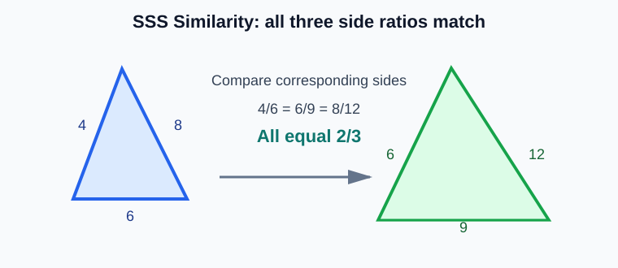
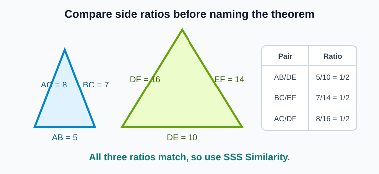
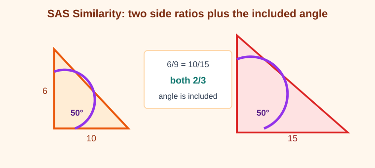
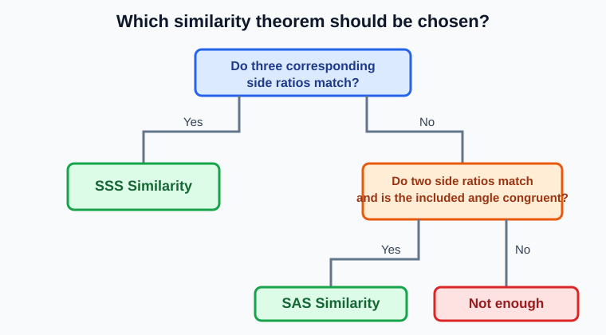
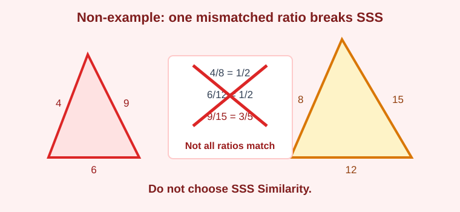
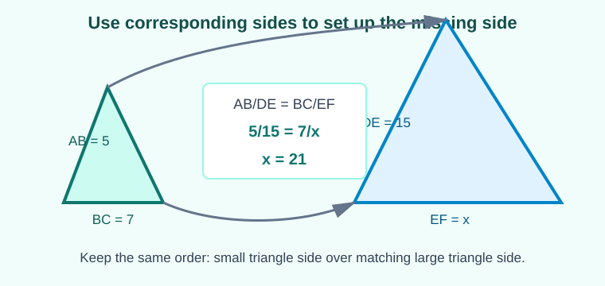

# Geometry - Lesson 4: Triangle Similarity: SSS and SAS

> [!GOAL] Learning Goal
>
> By the end of this lesson, you should be able to **use proportional side evidence for triangle similarity** and choose whether **SSS Similarity** or **SAS Similarity** is the correct theorem.

**Content domain:** Measurement and Geometry  
**Estimated time:** 55 minutes  
**Difficulty:** Intermediate  
**Target competency:** Use proportional side evidence for similarity.  
**Assessment focus:** Choose the correct theorem.

---

## What You Should Already Know

This lesson uses ratios, proportions, and corresponding triangle parts.

Before reading, check that you can:

- simplify ratios such as $6:9$ to $2:3$
- compare fractions such as $\frac{4}{6}$ and $\frac{6}{9}$
- solve a proportion such as $\frac{5}{8} = \frac{x}{24}$
- name the angle included between two sides
- match corresponding sides in two triangles

> [!CHECK] Pre-Check
>
> 1. Simplify $\frac{12}{18}$.
> 2. In $\triangle ABC$, which angle is included between $\overline{AB}$ and $\overline{AC}$?
> 3. Are $\frac{4}{10}$ and $\frac{6}{15}$ equal ratios?
>
> Answers: $\frac{2}{3}$; $\angle A$; yes, both simplify to $\frac{2}{5}$.

## Try Before You Read

Two triangles can look similar, but this lesson does not rely on appearance. The evidence must fit one of the similarity theorems.

The side lengths above give three matching ratios:

$$\frac{4}{6} = \frac{6}{9} = \frac{8}{12} = \frac{2}{3}$$

That is enough to prove the triangles are similar by **SSS Similarity**.

---

## Key Vocabulary

| Term | Meaning |
| --- | --- |
| Similar triangles | Triangles with equal corresponding angles and proportional corresponding sides |
| Corresponding sides | Sides that match position from one triangle to the other |
| Scale factor | The multiplier that changes one triangle's side lengths into the other triangle's side lengths |
| Included angle | The angle formed by two given sides |
| SSS Similarity | Three pairs of corresponding sides are proportional |
| SAS Similarity | Two pairs of corresponding sides are proportional and the included angles are congruent |

> [!IMPORTANT] Core Idea
>
> Similarity is about **same shape**, not necessarily same size. For SSS and SAS, the side ratios must match in corresponding order.

---

## Main Concept Explanation

### 1. SSS Similarity

Use **SSS Similarity** when all three pairs of corresponding side lengths are proportional.

For the triangles in the diagram:

$$\frac{AB}{DE} = \frac{BC}{EF} = \frac{AC}{DF}$$

$$\frac{5}{10} = \frac{7}{14} = \frac{8}{16} = \frac{1}{2}$$

Because all three side ratios match, the triangles are similar by **SSS Similarity**.

> [!TIP] SSS Test
>
> Match the smallest side with the smallest side, the middle side with the middle side, and the largest side with the largest side unless the correspondence is already named.

### 2. SAS Similarity

Use **SAS Similarity** when:

- two pairs of corresponding sides are proportional
- the angle between those two sides is congruent

In the diagram:

$$\frac{AB}{DE} = \frac{AC}{DF}$$

$$\frac{6}{9} = \frac{10}{15} = \frac{2}{3}$$

The marked angle is between those two sides in both triangles. Since $\angle A \cong \angle D$, the triangles are similar by **SAS Similarity**.

> [!WARNING] Common Trap
>
> For SAS Similarity, the congruent angle must be the **included angle**. If the angle is not between the two proportional sides, the evidence is not SAS.

### 3. Choosing the Correct Theorem

Use the evidence first. Then name the theorem.

| Given evidence | Theorem to choose |
| --- | --- |
| Three pairs of proportional sides | SSS Similarity |
| Two pairs of proportional sides and the included angle congruent | SAS Similarity |
| Two pairs of proportional sides and a non-included angle | Not enough for SSS or SAS |
| Three side pairs but one ratio is different | Not similar by SSS |

---

## Non-Example: Ratios Must All Match

Sometimes two ratios match but the third does not. That is not SSS Similarity.

Compare the ratios:

$$\frac{4}{8} = \frac{1}{2}$$

$$\frac{6}{12} = \frac{1}{2}$$

$$\frac{9}{15} = \frac{3}{5}$$

Since $\frac{3}{5} \ne \frac{1}{2}$, the three side pairs are not all proportional. You cannot choose SSS Similarity.

> [!CHECK] Quick Check
>
> If two pairs of sides have ratio $\frac{3}{4}$ and the third pair has ratio $\frac{6}{8}$, does SSS Similarity work?
>
> Yes. $\frac{6}{8}$ simplifies to $\frac{3}{4}$, so all three ratios match.

---

## Worked Example: Missing Side Setup

**Problem:** $\triangle ABC \sim \triangle DEF$. The corresponding sides are $AB \leftrightarrow DE$, $BC \leftrightarrow EF$, and $AC \leftrightarrow DF$. If $AB = 5$, $DE = 15$, $BC = 7$, and $EF = x$, find $x$.

**Step 1: Write a proportion using corresponding sides.**

$$\frac{AB}{DE} = \frac{BC}{EF}$$

**Step 2: Substitute.**

$$\frac{5}{15} = \frac{7}{x}$$

**Step 3: Solve.**

$$5x = 15(7)$$

$$5x = 105$$

$$x = 21$$

> [!EXAMPLE] Complete Answer
>
> $EF = 21$. The scale factor from $\triangle ABC$ to $\triangle DEF$ is $3$, so the corresponding side to $7$ is $21$.

---

## Guided Practice

### Problem 1

Two triangles have corresponding side lengths $3, 4, 5$ and $9, 12, 15$. Which theorem proves similarity?

**Hint 1:** Compare all three side ratios.  
**Hint 2:** $\frac{3}{9} = \frac{4}{12} = \frac{5}{15} = \frac{1}{3}$.  
**Answer:** SSS Similarity.

### Problem 2

Two triangles have side pairs $8$ and $12$, $10$ and $15$, and the included angles between those sides are both $50^\circ$. Which theorem proves similarity?

**Hint 1:** Only two side pairs are being used.  
**Hint 2:** Check whether the angle is between those sides.  
**Answer:** SAS Similarity because $\frac{8}{12} = \frac{10}{15} = \frac{2}{3}$ and the included angles are congruent.

### Problem 3

Two triangles have side pairs $5$ and $10$, $6$ and $12$, $8$ and $18$. Can SSS Similarity be used?

**Hint 1:** Compare all three ratios.  
**Hint 2:** One ratio does not match.  
**Answer:** No. $\frac{5}{10} = \frac{1}{2}$ and $\frac{6}{12} = \frac{1}{2}$, but $\frac{8}{18} = \frac{4}{9}$.

---

## Theorem Selection Checklist

Use this checklist before choosing an answer:

- Did you match corresponding sides correctly?
- Did you simplify every ratio?
- For SSS, do all three ratios match?
- For SAS, do exactly two side ratios match?
- For SAS, is the angle congruent and included between those two sides?
- If any required evidence is missing, did you avoid choosing a theorem too quickly?

> [!PRACTICE] Next Step
>
> Use the practice exam to drill theorem selection. Then use the assessment to check whether you can choose SSS, SAS, or "not enough evidence" from new triangle evidence.
