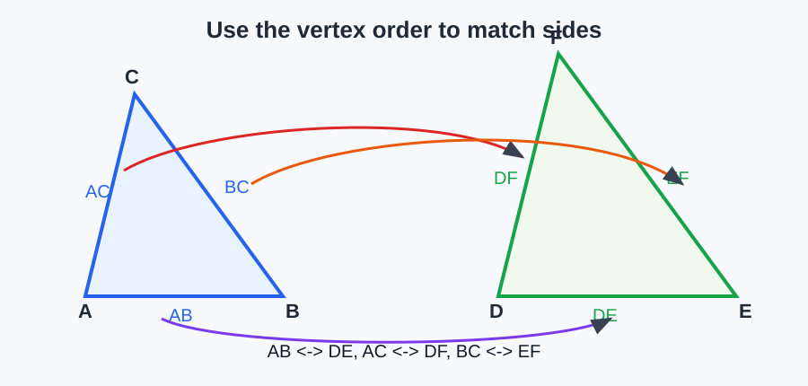
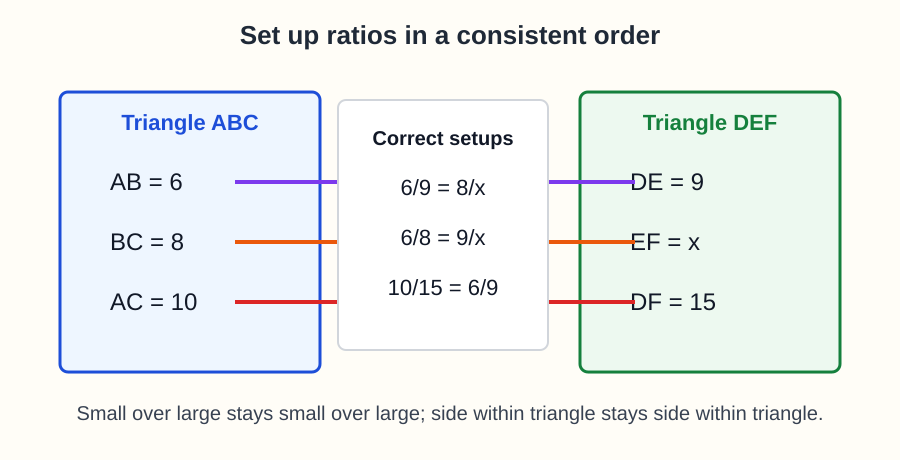
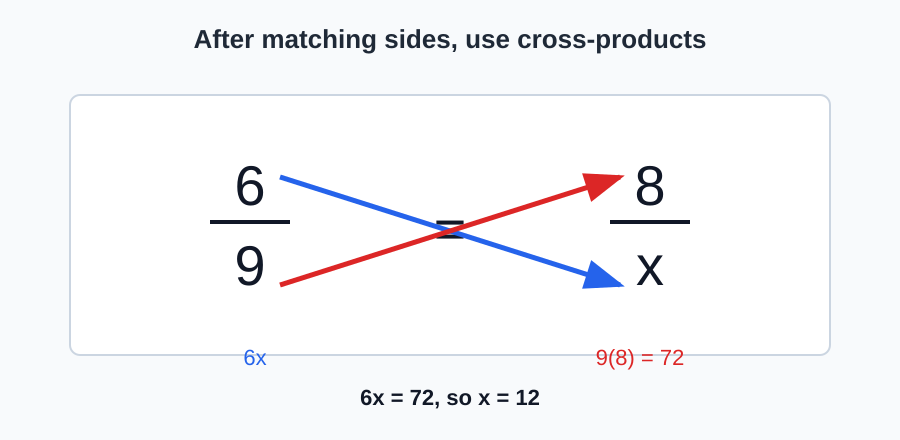
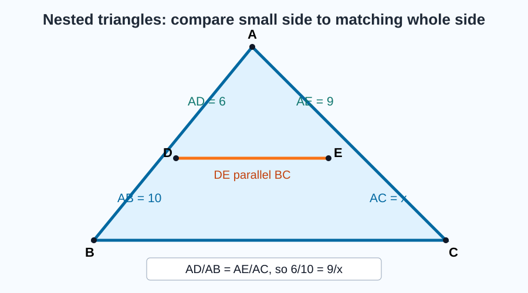
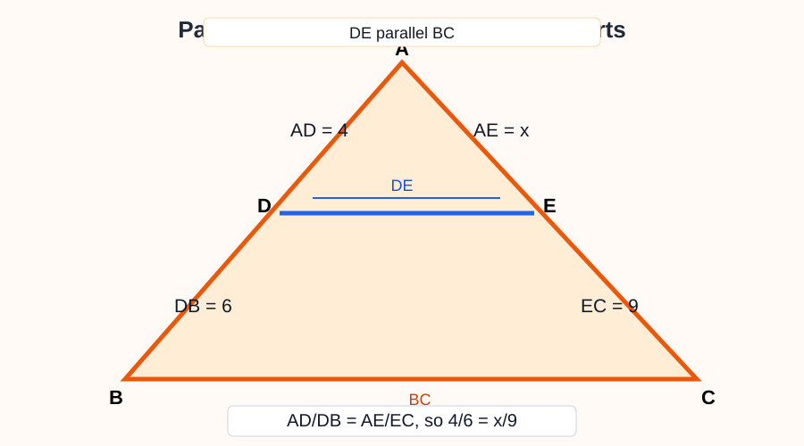
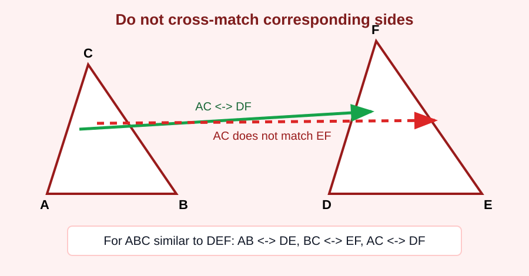

# Geometry - Lesson 5: Proportional Parts

> [!GOAL] Learning Goal
>
> By the end of this lesson, you should be able to **set up and solve proportions from similar triangles**. The main skill is labeling corresponding sides accurately before doing any calculation.

**Content domain:** Measurement and Geometry  
**Estimated time:** 55 minutes  
**Difficulty:** Intermediate  
**Target competency:** Set up and solve proportions from similar triangles.  
**Assessment focus:** Label corresponding sides accurately.

---

## What You Should Already Know

This lesson builds on similar triangles and ratio solving.

Before reading, check that you can:

- match equal angles in two triangles
- read a similarity statement such as $\triangle ABC \sim \triangle DEF$
- solve proportions such as $\dfrac{x}{12} = \dfrac{5}{8}$
- use cross-products to solve equations

> [!CHECK] Pre-Check
>
> 1. In $\triangle ABC \sim \triangle DEF$, which vertex corresponds to $B$?
> 2. Which side corresponds to $AC$?
> 3. Solve: $\dfrac{x}{15} = \dfrac{2}{3}$.
>
> Answers: $E$; $DF$; $x = 10$.

## The Big Idea

Similar triangles have the same shape. Their matching angles are congruent, and their matching side lengths are proportional.

If $\triangle ABC \sim \triangle DEF$, then the vertex order tells you:

| First triangle | Corresponds to | Second triangle |
| --- | --- | --- |
| $A$ | matches | $D$ |
| $B$ | matches | $E$ |
| $C$ | matches | $F$ |
| $AB$ | matches | $DE$ |
| $BC$ | matches | $EF$ |
| $AC$ | matches | $DF$ |

> [!IMPORTANT] Core Rule
>
> Match sides by position in the triangle name or by angle markings. Do not match sides just because they look close together in the drawing.

---

## Setting Up a Proportion

A proportion compares corresponding sides in the same order.

For $\triangle ABC \sim \triangle DEF$, these are valid:

$$\frac{AB}{DE} = \frac{BC}{EF}$$

$$\frac{AB}{BC} = \frac{DE}{EF}$$

$$\frac{AC}{DF} = \frac{AB}{DE}$$

The ratios can be written in different ways, but each numerator and denominator must keep the same correspondence pattern.

> [!TIP] Ratio Order Check
>
> Choose one order and keep it. If the first ratio is small triangle over large triangle, the second ratio should also be small triangle over large triangle.

### Worked Example 1: Direct Similar Triangles

Suppose $\triangle ABC \sim \triangle DEF$, $AB = 6$, $DE = 9$, $BC = 8$, and $EF = x$.

Use corresponding sides:

$$\frac{AB}{DE} = \frac{BC}{EF}$$

Substitute:

$$\frac{6}{9} = \frac{8}{x}$$

Cross-multiply:

$$6x = 72$$

$$x = 12$$

So $EF = 12$.

---

## Cross-Products

Once the proportion is correct, cross-products solve the missing length.

For a proportion:

$$\frac{a}{b} = \frac{c}{d}$$

the cross-products are equal:

$$ad = bc$$

> [!WARNING] Common Trap
>
> Cross-products only help after the proportion is set up correctly. A wrong correspondence can still produce a neat equation, but the answer will be wrong.

### Worked Example 2: Solve by Cross-Products

Two similar triangles have corresponding sides $10$ and $15$, and another corresponding pair $14$ and $x$.

Set up:

$$\frac{10}{15} = \frac{14}{x}$$

Cross-multiply:

$$10x = 15(14)$$

$$10x = 210$$

$$x = 21$$

---

## Embedded and Nested Triangles

Sometimes one smaller triangle is inside a larger triangle. The triangles can still be similar when they share an angle and have parallel sides or matching angle markings.

In the diagram pattern above:

- the small triangle uses sides $AD$, $AE$, and $DE$
- the large triangle uses sides $AB$, $AC$, and $BC$
- $AD$ corresponds to $AB$
- $AE$ corresponds to $AC$
- $DE$ corresponds to $BC$

If $AD = 6$, $AB = 10$, $AE = 9$, and $AC = x$, then:

$$\frac{AD}{AB} = \frac{AE}{AC}$$

$$\frac{6}{10} = \frac{9}{x}$$

$$6x = 90$$

$$x = 15$$

> [!CHECK] Embedded Triangle Check
>
> In nested diagrams, compare the small side to the whole matching large side unless the problem specifically asks for a leftover segment.

---

## Parallel Side Splitter

When a line inside a triangle is parallel to one side, it forms a smaller triangle similar to the whole triangle. It also divides the other two sides proportionally.

If $DE \parallel BC$, then:

$$\triangle ADE \sim \triangle ABC$$

You may use whole-side ratios:

$$\frac{AD}{AB} = \frac{AE}{AC}$$

You may also use split-side ratios:

$$\frac{AD}{DB} = \frac{AE}{EC}$$

### Worked Example 3: Split Sides

In a triangle, $DE \parallel BC$. Suppose $AD = 4$, $DB = 6$, $AE = x$, and $EC = 9$.

Use the split-side proportion:

$$\frac{AD}{DB} = \frac{AE}{EC}$$

$$\frac{4}{6} = \frac{x}{9}$$

$$6x = 36$$

$$x = 6$$

---

## Common Wrong Correspondence

The most common error is matching the wrong sides before solving.

**Wrong setup:** $\dfrac{AB}{DE} = \dfrac{AC}{EF}$

Why it is wrong: $AC$ corresponds to $DF$, not $EF$.

**Correct setup:** $\dfrac{AB}{DE} = \dfrac{AC}{DF}$

> [!WARNING] Correspondence Test
>
> Before solving, say the side pairs aloud: first side to first side, second side to second side, third side to third side. If a side jumps to the wrong position, fix the proportion first.

---

## Guided Practice

### Problem 1

Given $\triangle ABC \sim \triangle DEF$, name the side corresponding to $BC$.

**Hint:** Match the second and third letters.  
**Answer:** $EF$

### Problem 2

Given $\triangle JKL \sim \triangle MNP$, $JK = 5$, $MN = 8$, $KL = x$, and $NP = 12$. Find $x$.

**Hint 1:** $JK$ corresponds to $MN$ and $KL$ corresponds to $NP$.  
**Hint 2:** $\dfrac{5}{8} = \dfrac{x}{12}$.  
**Answer:** $x = 7.5$

### Problem 3

In a nested triangle, $DE \parallel BC$, $AD = 3$, $DB = 5$, $AE = 6$, and $EC = x$. Find $x$.

**Hint 1:** Use split sides: $\dfrac{AD}{DB} = \dfrac{AE}{EC}$.  
**Hint 2:** $\dfrac{3}{5} = \dfrac{6}{x}$.  
**Answer:** $x = 10$

### Problem 4

A student writes $\dfrac{AB}{DE} = \dfrac{BC}{DF}$ from $\triangle ABC \sim \triangle DEF$. What is the problem?

**Hint:** $BC$ should match the side with the second and third letters in the second triangle.  
**Answer:** $BC$ corresponds to $EF$, not $DF$.

## Mini-Quiz

1. In $\triangle RST \sim \triangle XYZ$, which side corresponds to $RT$?
2. If $\dfrac{4}{7} = \dfrac{x}{21}$, what is $x$?
3. In $\triangle ABC \sim \triangle DEF$, is $\dfrac{AB}{DE} = \dfrac{BC}{EF}$ a valid setup?
4. If a line inside a triangle is parallel to one side, what kind of triangle relationship is formed?
5. Why should you label corresponding sides before solving?

**Mini-Quiz Answers**

1. $XZ$
2. $12$
3. Yes
4. Similar triangles
5. The proportion depends on matching the correct side pairs.

---

## Independent Practice

Solve these on paper.

1. In $\triangle ABC \sim \triangle PQR$, name the side corresponding to $AC$.
2. Set up a proportion for $\triangle ABC \sim \triangle PQR$ using $AB$, $PQ$, $BC$, and $QR$.
3. Solve $\dfrac{x}{18} = \dfrac{5}{6}$.
4. Similar triangles have corresponding sides $7$ and $14$, and $11$ and $x$. Find $x$.
5. In a nested triangle, $AD = 5$, $AB = 12$, $AE = 8$, and $AC = x$. Find $x$.
6. A side splitter gives $AD = 6$, $DB = 9$, $AE = 10$, and $EC = x$. Find $x$.
7. Explain why $\dfrac{AB}{DE} = \dfrac{AC}{EF}$ is wrong for $\triangle ABC \sim \triangle DEF$.
8. Write one check you can do before using cross-products.

## Answer Key with Explanations

1. $PR$, because first and third letters match.
2. $\dfrac{AB}{PQ} = \dfrac{BC}{QR}$.
3. $x = 15$, because $6x = 90$.
4. $x = 22$, because $\dfrac{7}{14} = \dfrac{11}{x}$.
5. $x = 19.2$, because $\dfrac{5}{12} = \dfrac{8}{x}$.
6. $x = 15$, because $\dfrac{6}{9} = \dfrac{10}{x}$.
7. $AC$ corresponds to $DF$, not $EF$.
8. Check that each side is paired with its corresponding side and that the ratio order is consistent.

---

## Mastery Checklist

Check each statement when you can do it confidently.

- I can use the order of a similarity statement to match vertices.
- I can name the corresponding side for any side in a similar triangle pair.
- I can write a valid proportion using corresponding sides.
- I can solve a proportion using cross-products.
- I can identify the small and large triangles in an embedded diagram.
- I can use whole-side or split-side ratios when a segment is parallel to a triangle side.
- I can spot a wrong correspondence before solving.

> [!PRACTICE] What To Do Next
>
> Use the practice exam for direct side matching and proportion setup. Use the assessment when you are ready for mixed diagrams, side splitters, and error analysis.

## Final Summary

Proportional parts in similar triangles depend on correspondence. First match the vertices and sides, then write ratios in a consistent order. After the proportion is correct, use cross-products to solve the missing length.
