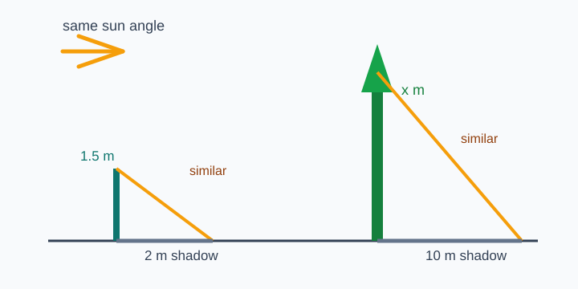
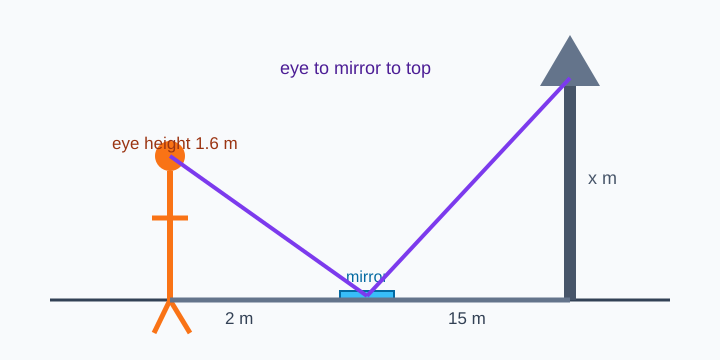
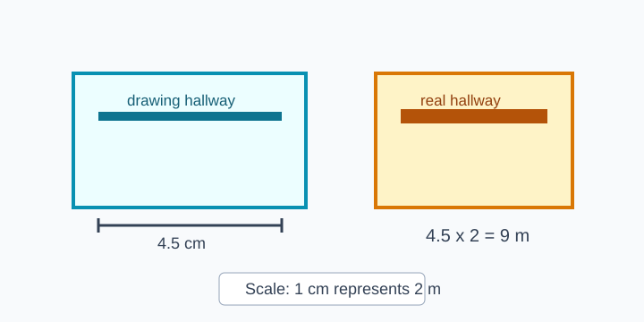
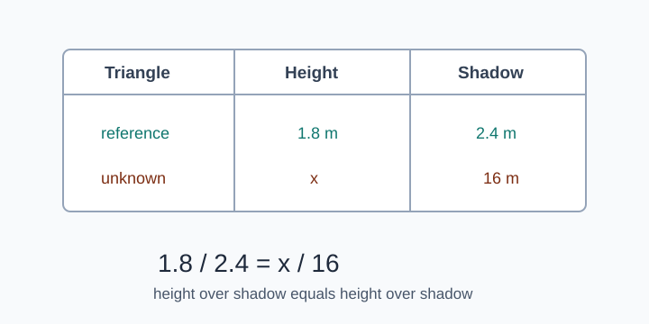
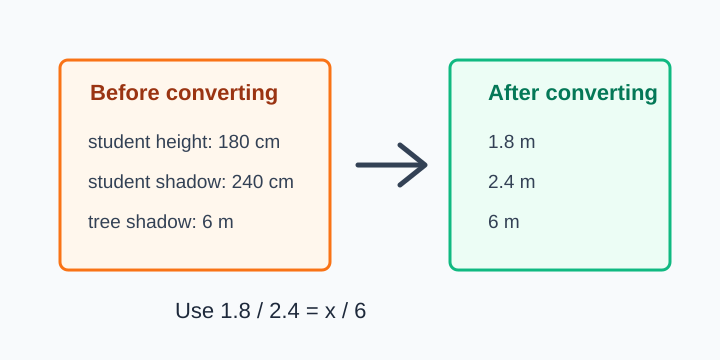
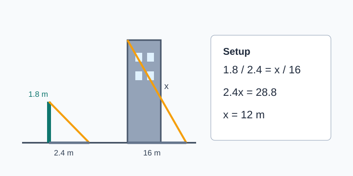

# Indirect Measurement

> [!GOAL] Learning Goal
>
> Use shadows, mirrors, and scale drawings to find measurements that are difficult to measure directly.

## Lesson Roadmap

| Part | Focus | You should be able to |
| --- | --- | --- |
| 1 | Shadow triangles | Match object height to shadow length |
| 2 | Mirror sightlines | Use eye height and distances from a mirror |
| 3 | Scale drawings | Convert drawing lengths to real lengths |
| 4 | Real-world checks | Keep units consistent and judge reasonableness |

## Quick Recall

Before starting, answer these mentally.

1. If two triangles are similar, what is true about their corresponding side ratios?
2. What does the proportion $\frac{a}{b}=\frac{c}{d}$ mean?
3. Why should centimeters and meters not be mixed in the same ratio?

> [!TARGET] Target Skill
>
> For each problem, decide which lengths correspond, write one proportion, solve, and label the answer with units.

## 1. Shadow Triangles

When two vertical objects stand on level ground at the same time, the sun creates the same angle of elevation for both shadows. That makes two similar right triangles.

Use this matching:

| Small triangle | Large triangle |
| --- | --- |
| known height | unknown height |
| known shadow | unknown shadow |

### Example 1: Find a Tree Height

A 1.5 m student casts a 2 m shadow. A tree casts a 10 m shadow at the same time.

Set up corresponding ratios:

$$
\frac{\text{student height}}{\text{student shadow}}=\frac{\text{tree height}}{\text{tree shadow}}
$$

$$
\frac{1.5}{2}=\frac{x}{10}
$$

Solve:

$$
2x=15
$$

$$
x=7.5
$$

The tree is **7.5 m tall**.

> [!TIP] Shadow Check
>
> If the taller object has the longer shadow, the answer should usually be taller than the reference object.

## 2. Mirror Sightlines

A mirror problem also uses similar triangles. The mirror sits on the ground. The learner stands where they can see the top of the object in the mirror.

The two triangles share the same mirror angle, so corresponding ratios can be written as:

$$
\frac{\text{eye height}}{\text{distance from person to mirror}}=\frac{\text{object height}}{\text{distance from object to mirror}}
$$

### Example 2: Mirror Method

A person's eye height is 1.6 m. The person is 2 m from a mirror. A flagpole is 15 m from the mirror.

$$
\frac{1.6}{2}=\frac{x}{15}
$$

$$
2x=24
$$

$$
x=12
$$

The flagpole is **12 m tall**.

> [!WARNING] Common Trap
>
> Do not add the two ground distances together in a mirror problem. Each triangle uses its own distance to the mirror.

## 3. Scale Drawings

A scale drawing is a smaller or larger model of a real object. The drawing and the real object are similar, so their corresponding lengths have equal ratios.

If the scale is **1 cm represents 3 m**, then every 1 cm on the drawing matches 3 m in the real situation.

### Example 3: Drawing to Real Length

A room wall is 4.5 cm long on a scale drawing. The scale is 1 cm : 2 m.

$$
4.5 \text{ cm}\times 2 \text{ m per cm}=9 \text{ m}
$$

The real wall is **9 m** long.

## 4. Set Up the Proportion Carefully

Most errors happen before the arithmetic. Keep the same order on both sides of the proportion.

Two safe formats are:

$$
\frac{\text{height}}{\text{shadow}}=\frac{\text{height}}{\text{shadow}}
$$

or

$$
\frac{\text{small height}}{\text{large height}}=\frac{\text{small shadow}}{\text{large shadow}}
$$

Both are valid if the corresponding parts stay matched.

> [!CHECK] Mini Check
>
> A 2 m pole has a 3 m shadow. A tower has an 18 m shadow. Use $\frac{2}{3}=\frac{x}{18}$. The tower height is 12 m.

## 5. Keep Units Consistent

Ratios compare measurements. Convert units before solving if the problem mixes units.

Example:

- 150 cm = 1.5 m
- 600 cm = 6 m
- 2.4 m = 240 cm

> [!IMPORTANT] Unit Rule
>
> Use the same unit within the same kind of measurement. Heights compared to heights should share a unit, and shadows compared to shadows should share a unit.

## 6. Worked Real-World Problem

A 1.8 m signpost casts a 2.4 m shadow. At the same time, a building casts a 16 m shadow. Find the building height.

Step 1: Identify corresponding sides.

| Signpost triangle | Building triangle |
| --- | --- |
| 1.8 m height | $x$ m height |
| 2.4 m shadow | 16 m shadow |

Step 2: Write the proportion.

$$
\frac{1.8}{2.4}=\frac{x}{16}
$$

Step 3: Solve.

$$
2.4x=28.8
$$

$$
x=12
$$

Step 4: State the answer.

The building is **12 m tall**.

## Final Checklist

Use this checklist before submitting practice or assessment answers.

- I identified the similar triangles or similar figures.
- I matched corresponding sides in the same order.
- I converted units when needed.
- I solved the proportion and included units.
- I checked whether the answer is reasonable for the situation.

> [!PRACTICE] Practice Plan
>
> Use the practice set for quick setup and computation. Use the assessment when you can solve real-world similarity problems without checking the examples.
