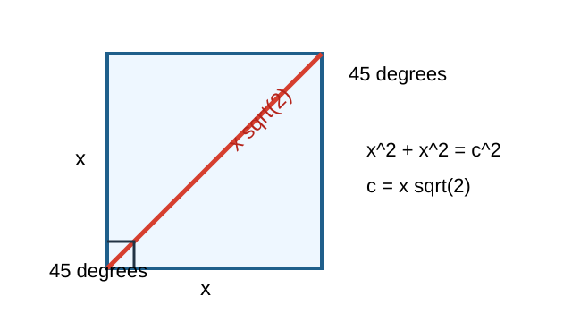
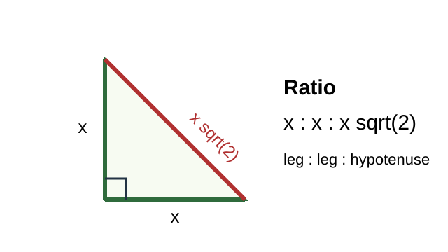
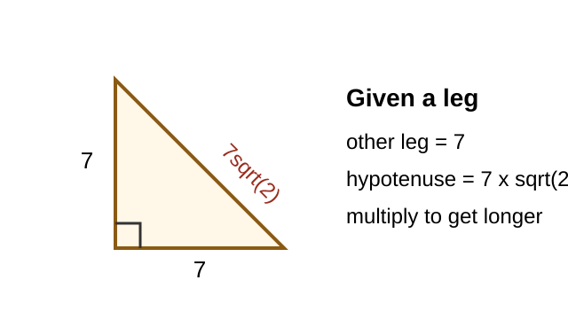
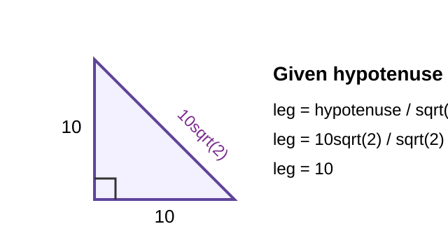
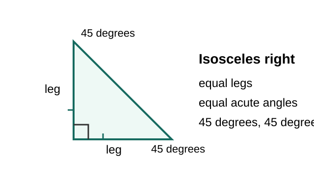
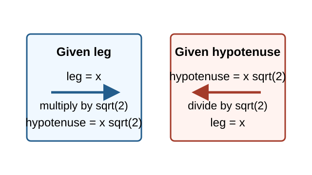

# 45-45-90 Triangles

> [!GOAL] Learning Goal
>
> Derive the 45-45-90 side relationship and use it to find missing sides quickly and accurately.

## Lesson Roadmap

| Part | Focus | You should be able to |
| --- | --- | --- |
| 1 | Square diagonal | See where the ratio comes from |
| 2 | Side ratio | Match legs and hypotenuse to x:x:x sqrt(2) |
| 3 | Given a leg | Multiply by sqrt(2) to find the hypotenuse |
| 4 | Given a hypotenuse | Divide by sqrt(2) to find each leg |
| 5 | Trap check | Choose the correct operation |

## Quick Recall

Answer these before studying the examples.

1. What is special about the two legs of an isosceles right triangle?
2. If a square has side length 5, what expression represents its diagonal by the Pythagorean Theorem?
3. Is the hypotenuse of a right triangle longer or shorter than each leg?

> [!TARGET] Target Skill
>
> When a 45-45-90 triangle gives one side, find the other sides using the ratio leg : leg : hypotenuse = x : x : x sqrt(2).

## 1. Derive the Relationship From a Square

A square has four equal sides and four right angles. Drawing one diagonal cuts the square into two congruent right triangles.

Each triangle has:

- one right angle from the corner of the square
- two equal legs from the square's equal sides
- two acute angles that must both be 45 degrees

If each leg has length x, the diagonal is the hypotenuse.

Use the Pythagorean Theorem:

$$
x^2+x^2=c^2
$$

$$
2x^2=c^2
$$

$$
c=x\sqrt{2}
$$

So a 45-45-90 triangle always has side lengths:

$$
x,\quad x,\quad x\sqrt{2}
$$

## 2. Know the Ratio

The two legs are equal. The hypotenuse is the length of one leg multiplied by sqrt(2).

| Side | Relationship |
| --- | --- |
| leg | x |
| other leg | x |
| hypotenuse | x sqrt(2) |

> [!IMPORTANT] Main Rule
>
> In a 45-45-90 triangle, the hypotenuse is always the leg times sqrt(2). The legs are always equal.

## 3. Given a Leg: Multiply

If one leg is known, the other leg is the same length. The hypotenuse is longer, so multiply by sqrt(2).

### Example 1: Leg Given

A 45-45-90 triangle has one leg of 7 cm. Find the other sides.

The other leg is also 7 cm.

The hypotenuse is:

$$
7\sqrt{2}\text{ cm}
$$

Answer: **7 cm, 7 cm, 7sqrt(2) cm**.

> [!TIP] Reasonableness Check
>
> The hypotenuse should be longer than 7. Since sqrt(2) is about 1.414, 7sqrt(2) is about 9.9.

## 4. Given the Hypotenuse: Divide

If the hypotenuse is known, each leg is shorter. Divide the hypotenuse by sqrt(2).

### Example 2: Hypotenuse Given

A 45-45-90 triangle has a hypotenuse of 10sqrt(2) units. Find each leg.

Use:

$$
\text{leg}=\frac{\text{hypotenuse}}{\sqrt{2}}
$$

$$
\text{leg}=\frac{10\sqrt{2}}{\sqrt{2}}=10
$$

Each leg is **10 units**.

### Example 3: Hypotenuse Without a Radical

A 45-45-90 triangle has a hypotenuse of 12 units.

$$
\text{leg}=\frac{12}{\sqrt{2}}
$$

Rationalize if exact simplified form is required:

$$
\frac{12}{\sqrt{2}}\cdot\frac{\sqrt{2}}{\sqrt{2}}=\frac{12\sqrt{2}}{2}=6\sqrt{2}
$$

Each leg is **6sqrt(2) units**.

## 5. Label the Isosceles Right Triangle

The phrase **isosceles right triangle** means the triangle is a 45-45-90 triangle.

Use these clues:

- Right triangle + equal legs means 45-45-90.
- Two angles of 45 degrees mean 45-45-90.
- One 45 degree angle in a right triangle forces the other acute angle to be 45 degrees.

> [!CHECK] Mini Check
>
> A right triangle has one acute angle of 45 degrees and a leg of 9. The other leg is 9, and the hypotenuse is 9sqrt(2).

## 6. Avoid the Multiply/Divide Trap

Most mistakes come from using sqrt(2) in the wrong direction.

| Given side | Missing side | Operation |
| --- | --- | --- |
| leg | hypotenuse | multiply by sqrt(2) |
| hypotenuse | leg | divide by sqrt(2) |

> [!WARNING] Common Trap
>
> Do not multiply the hypotenuse by sqrt(2) to find a leg. That would make the leg longer than the hypotenuse, which cannot happen in a right triangle.

## Worked Summary

### Problem A

A 45-45-90 triangle has a leg of 4 m. Find the hypotenuse.

$$
4\sqrt{2}\text{ m}
$$

### Problem B

A 45-45-90 triangle has a hypotenuse of 18 m. Find each leg.

$$
\frac{18}{\sqrt{2}}=9\sqrt{2}
$$

Each leg is **9sqrt(2) m**.

### Problem C

An isosceles right triangle has one leg of 11 cm. Find all side lengths.

The side lengths are:

$$
11,\quad 11,\quad 11\sqrt{2}
$$

## Final Checklist

Use this before starting the practice or assessment.

- I can recognize a 45-45-90 triangle from its angles or equal legs.
- I know the side ratio is x : x : x sqrt(2).
- I multiply by sqrt(2) when going from a leg to the hypotenuse.
- I divide by sqrt(2) when going from the hypotenuse to a leg.
- I check that the hypotenuse is the longest side.

> [!PRACTICE] Practice Plan
>
> Use the practice set to build speed with missing sides. Use the assessment when you can decide whether to multiply or divide without checking the examples.
