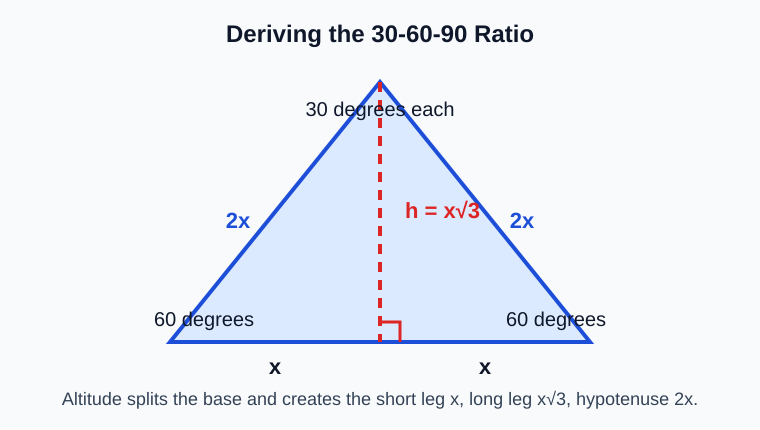
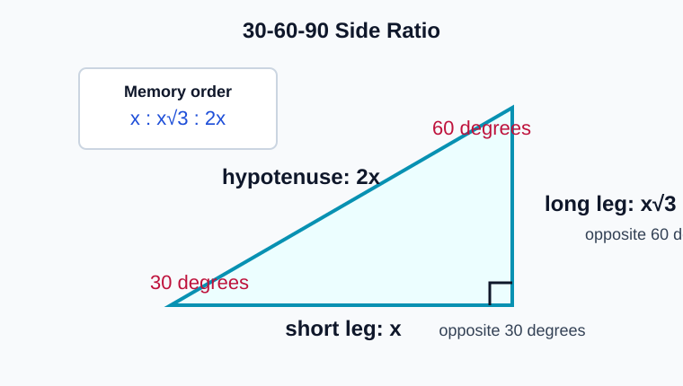
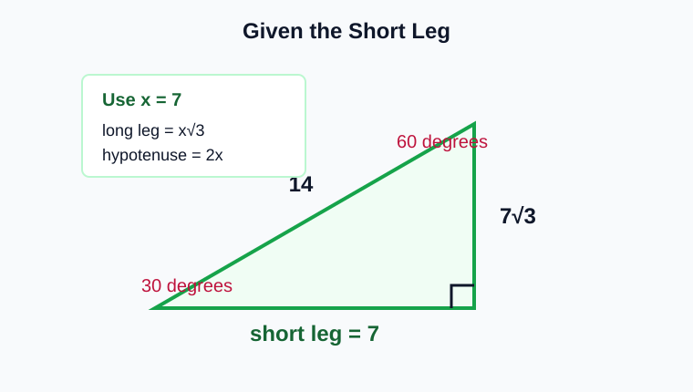
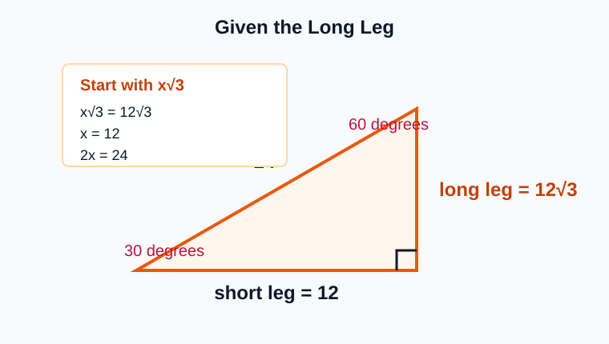
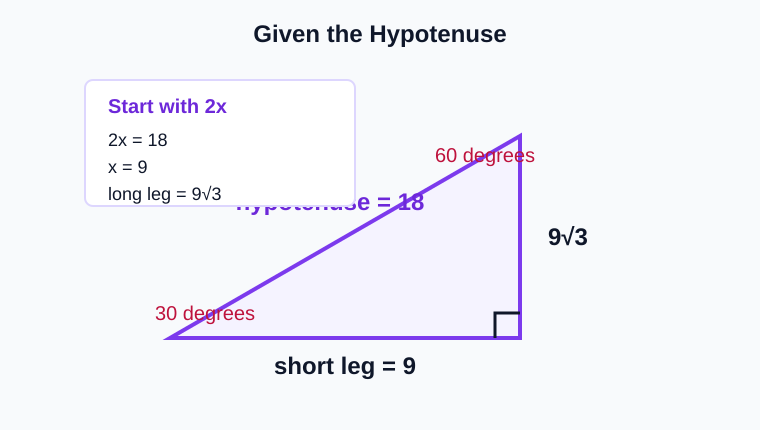
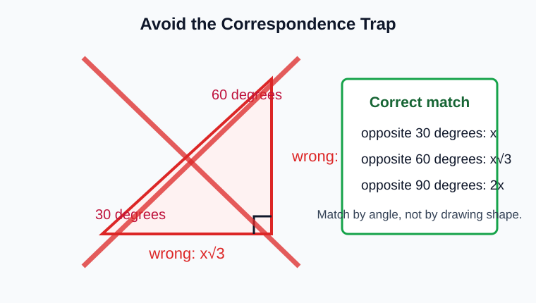

# 30-60-90 Triangles

> [!GOAL] Learning Goal
>
> Derive and apply the side relationships in a 30-60-90 triangle to find missing sides and angles.

## Lesson Roadmap

| Part | Focus | You should be able to |
| --- | --- | --- |
| 1 | Derivation | Explain where the ratio comes from |
| 2 | Ratio | Match short leg, long leg, and hypotenuse |
| 3 | Given one side | Find the other two sides |
| 4 | Traps | Avoid switching the short and long legs |

## Quick Recall

Before starting, answer these mentally.

1. What are the three angle measures in an equilateral triangle?
2. In a right triangle, which side is always the hypotenuse?
3. If a side has length $x$, what is double that length?
4. Which is larger: $x$ or $x\sqrt{3}$ when $x>0$?

> [!TARGET] Target Skill
>
> For each 30-60-90 triangle, identify the short leg first. Then use $x : x\sqrt{3} : 2x$ to find missing sides and angles.

## 1. Where the Ratio Comes From

Start with an equilateral triangle. Each angle is $60^\circ$. If an altitude is drawn from the top vertex to the base, it splits the triangle into two congruent right triangles.

The altitude does three things:

- creates a $90^\circ$ angle at the base
- splits the top $60^\circ$ angle into two $30^\circ$ angles
- cuts the base into two equal halves

If the original equilateral side is $2x$, then half the base is $x$. The hypotenuse of each right triangle is still $2x$.

Use the Pythagorean Theorem to find the altitude:

$$
x^2+h^2=(2x)^2
$$

$$
x^2+h^2=4x^2
$$

$$
h^2=3x^2
$$

$$
h=x\sqrt{3}
$$

So every 30-60-90 triangle has side lengths:

$$
x,\quad x\sqrt{3},\quad 2x
$$

## 2. The Side Ratio

The side lengths are always in this order:

| Side | Opposite angle | Length pattern |
| --- | --- | --- |
| Short leg | $30^\circ$ | $x$ |
| Long leg | $60^\circ$ | $x\sqrt{3}$ |
| Hypotenuse | $90^\circ$ | $2x$ |

> [!IMPORTANT] Anchor Fact
>
> The short leg is opposite $30^\circ$. Once you find the short leg, the long leg is short leg times $\sqrt{3}$, and the hypotenuse is short leg times $2$.

## 3. Given the Short Leg

This is the most direct case. If the short leg is already known, call it $x$.

### Example 1

A 30-60-90 triangle has short leg $7$. Find the long leg and hypotenuse.

Since $x=7$:

$$
\text{long leg}=x\sqrt{3}=7\sqrt{3}
$$

$$
\text{hypotenuse}=2x=14
$$

The missing sides are **$7\sqrt{3}$** and **14**.

> [!CHECK] Mini Check
>
> If the short leg is 5, the long leg is $5\sqrt{3}$ and the hypotenuse is 10.

## 4. Given the Long Leg

The long leg is $x\sqrt{3}$. To find the short leg, divide by $\sqrt{3}$.

### Example 2

A 30-60-90 triangle has long leg $12\sqrt{3}$. Find the short leg and hypotenuse.

$$
x\sqrt{3}=12\sqrt{3}
$$

$$
x=12
$$

Then:

$$
2x=24
$$

The short leg is **12**, and the hypotenuse is **24**.

If the long leg is not written as a multiple of $\sqrt{3}$, divide by $\sqrt{3}$ and simplify when needed.

## 5. Given the Hypotenuse

The hypotenuse is $2x$. To find the short leg, divide the hypotenuse by 2.

### Example 3

A 30-60-90 triangle has hypotenuse $18$. Find the legs.

$$
2x=18
$$

$$
x=9
$$

So:

$$
\text{short leg}=9
$$

$$
\text{long leg}=9\sqrt{3}
$$

The legs are **9** and **$9\sqrt{3}$**.

## 6. Angle and Correspondence Traps

A 30-60-90 triangle always has one right angle and two acute angles. If one acute angle is $30^\circ$, the other acute angle is $60^\circ$ because the acute angles in a right triangle add to $90^\circ$.

The most common mistake is putting $x\sqrt{3}$ across from $30^\circ$. That reverses the short and long legs.

> [!WARNING] Common Trap
>
> Do not choose sides by how the triangle looks on the page. Choose by angle: opposite $30^\circ$ is $x$, opposite $60^\circ$ is $x\sqrt{3}$, and opposite $90^\circ$ is $2x$.

## Worked Mixed Example

A right triangle has a $60^\circ$ angle. The side opposite the $60^\circ$ angle is $15\sqrt{3}$. Find the other acute angle, the short leg, and the hypotenuse.

Step 1: Find the missing angle.

$$
90^\circ-60^\circ=30^\circ
$$

Step 2: Match the given side.

The side opposite $60^\circ$ is the long leg, so:

$$
x\sqrt{3}=15\sqrt{3}
$$

$$
x=15
$$

Step 3: Find the hypotenuse.

$$
2x=30
$$

The other acute angle is **$30^\circ$**, the short leg is **15**, and the hypotenuse is **30**.

## Final Checklist

Use this checklist before submitting practice or assessment answers.

- I verified the triangle is a 30-60-90 triangle.
- I identified which side is opposite $30^\circ$, $60^\circ$, and $90^\circ$.
- I used $x$ for the short leg, $x\sqrt{3}$ for the long leg, and $2x$ for the hypotenuse.
- I divided by 2 when the hypotenuse was given.
- I divided by $\sqrt{3}$ when the long leg was given.
- I checked that the hypotenuse is the longest side.

> [!PRACTICE] Practice Plan
>
> Use the practice set for quick ratio recognition and missing-side drills. Use the assessment when you can identify the correct side relationship without relying on the diagrams.
