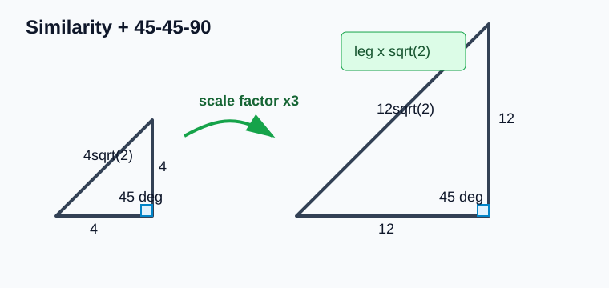
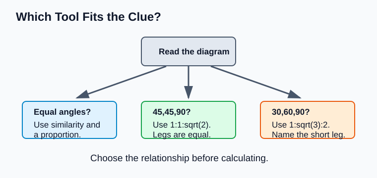
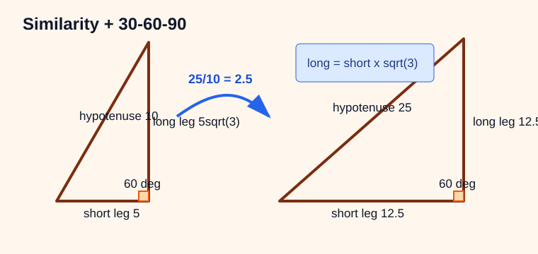
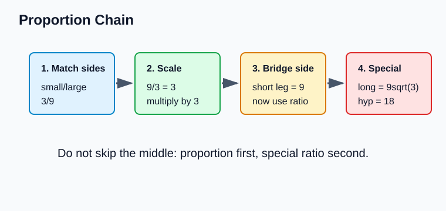
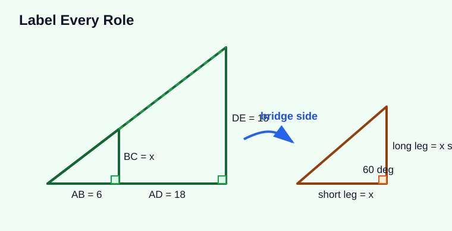
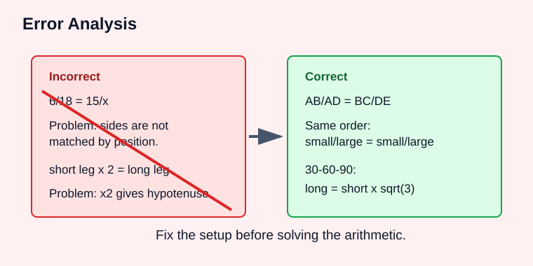

# Geometry - Lesson 9: Mixed Similarity and Special Triangle Problems

> [!GOAL] Learning Goal
>
> By the end of this lesson, you should be able to solve problems that combine **similar triangles**, **proportions**, and **special right triangle ratios**. Your final answers should come with complete written solutions, not only numbers.

**Content domain:** Measurement and Geometry  
**Estimated time:** 60 minutes  
**Difficulty:** Advanced  
**Target competency:** Combine proportions with special triangle ratios.  
**Assessment focus:** Write complete solutions.

---

## What You Should Already Know

This lesson combines several tools. Before starting, check that you can:

- match corresponding sides in similar triangles
- write and solve a proportion
- use the 45-45-90 ratio $1:1:\sqrt{2}$
- use the 30-60-90 ratio $1:\sqrt{3}:2$
- keep units and radical forms clear

> [!CHECK] Pre-Check
>
> 1. If two similar triangles have corresponding sides $6$ and $18$, what is the scale factor from small to large?
> 2. In a 45-45-90 triangle, if one leg is $7$, what is the hypotenuse?
> 3. In a 30-60-90 triangle, if the short leg is $5$, what is the long leg?
> 4. What should a complete solution include besides the final answer?
>
> Answers: $3$; $7\sqrt{2}$; $5\sqrt{3}$; setup, reason, calculation, and units when needed.

## Try Before You Read

Mixed diagrams usually look busy because they contain more than one clue. The key is to decide which clue starts the solution and which clue finishes it.

Ask yourself:

- Which triangles are similar?
- Which triangle is special?
- Which side connects the similar triangles to the special ratio?

---

## Key Vocabulary

| Term | Meaning |
| --- | --- |
| Similar triangles | Triangles with equal corresponding angles and proportional corresponding sides |
| Scale factor | The multiplier that connects corresponding side lengths of similar figures |
| 45-45-90 triangle | A right isosceles triangle with side ratio $1:1:\sqrt{2}$ |
| 30-60-90 triangle | A right triangle with side ratio $1:\sqrt{3}:2$ |
| Corresponding sides | Sides that match by position in similar triangles |
| Proportion chain | A sequence of ratios used to move from one known length to another |
| Complete solution | A written solution that states the reasoning, setup, work, and final answer |

## Visual Strategy

Use the diagram markings in this order:

1. **Similarity marks:** equal angles or parallel lines tell you which sides correspond.
2. **Special triangle marks:** $45^\circ$, $30^\circ$, $60^\circ$, and right angles tell you which ratio to use.
3. **Shared or transferred side:** find the side that appears in both parts of the reasoning.
4. **Final target:** answer the length or expression requested.

> [!IMPORTANT] Main Move
>
> Do not use every formula at once. First identify the relationship that creates a known side. Then use the next relationship to reach the unknown side.

---

## Formula Box

| Triangle type | Ratio | Useful wording |
| --- | --- | --- |
| Similar triangles | $\dfrac{\text{side}}{\text{matching side}}=\dfrac{\text{side}}{\text{matching side}}$ | Match positions before solving |
| 45-45-90 | leg : leg : hypotenuse = $1:1:\sqrt{2}$ | hypotenuse = leg $\sqrt{2}$ |
| 30-60-90 | short leg : long leg : hypotenuse = $1:\sqrt{3}:2$ | long leg = short leg $\sqrt{3}$; hypotenuse = $2$ short leg |

## Worked Example 1: Similarity Plus 45-45-90

In the diagram, the small right triangle is similar to the larger right triangle. The small triangle has a leg of $4$ that corresponds to a leg of $12$ in the larger triangle. The larger triangle is a 45-45-90 triangle. Find its hypotenuse.

**Step 1: Find the scale factor.**  
The corresponding legs are $4$ and $12$.

$$\text{scale factor}=\frac{12}{4}=3$$

**Step 2: Use the special triangle ratio.**  
A 45-45-90 triangle has equal legs, so the other large leg is also $12$.

**Step 3: Find the hypotenuse.**

$$h=12\sqrt{2}$$

**Complete answer:** The hypotenuse is $12\sqrt{2}$ units because the large triangle is a 45-45-90 triangle with leg length $12$.

> [!TIP] Bridge Side
>
> The side that comes from the proportion often becomes the leg or short leg needed for the special triangle ratio. Circle that bridge side in your work.

## Worked Example 2: Similarity Plus 30-60-90

A small 30-60-90 triangle is similar to a larger 30-60-90 triangle. The small hypotenuse is $10$, and the large hypotenuse is $25$. Find the large triangle's long leg.

**Step 1: Use similarity to find the scale factor.**

$$\frac{25}{10}=2.5$$

**Step 2: Find the small short leg.**  
In a 30-60-90 triangle, hypotenuse = $2$ short leg.

$$10=2s \quad \Rightarrow \quad s=5$$

**Step 3: Scale the short leg.**

$$5(2.5)=12.5$$

**Step 4: Use the 30-60-90 ratio for the large triangle.**

$$\text{long leg}=12.5\sqrt{3}$$

**Complete answer:** The large long leg is $12.5\sqrt{3}$ units.

---

## Proportion Chains

A chain helps when the problem has more than two moves.

Example chain:

$$\frac{\text{small leg}}{\text{large leg}}=\frac{3}{9}$$

So the large leg is $9$. If that large leg is the short leg of a 30-60-90 triangle, then:

$$\text{long leg}=9\sqrt{3}, \quad \text{hypotenuse}=18$$

> [!WARNING] Keep the Order
>
> A proportion can be written many ways, but the order must stay consistent. If the left ratio is small over large, the right ratio must also be small over large.

## Multi-Step Diagram Labels

Write labels directly in your solution. This prevents losing track of which side belongs to which triangle.

A good solution might say:

1. $\triangle ABC \sim \triangle ADE$ because their angles match.
2. $\dfrac{AB}{AD}=\dfrac{BC}{DE}$, so $\dfrac{6}{18}=\dfrac{BC}{15}$.
3. $18BC=90$, so $BC=5$.
4. Since $BC$ is the short leg of a 30-60-90 triangle, the long leg is $5\sqrt{3}$.

This is stronger than writing only "$5\sqrt{3}$" because it explains why the number is valid.

---

## Error Analysis

Common error:

$$\frac{6}{18}=\frac{15}{x}$$

This setup may be wrong if $15$ does not correspond to $6$ and $x$ does not correspond to $18$. Similarity depends on matching positions, not on using every number in the diagram.

Another common error is using the wrong 30-60-90 side:

- short leg to long leg: multiply by $\sqrt{3}$
- short leg to hypotenuse: multiply by $2$
- hypotenuse to short leg: divide by $2$
- long leg to short leg: divide by $\sqrt{3}$

> [!CHECK] Quick Check
>
> A 30-60-90 triangle has hypotenuse $14$. A similar larger triangle has hypotenuse $42$. What is the larger triangle's long leg?
>
> Answer: The small short leg is $7$. The scale factor is $3$, so the large short leg is $21$. The large long leg is $21\sqrt{3}$.

## Complete Solution Checklist

Before submitting an answer, check that your solution includes:

- the similarity statement or the reason triangles are similar
- a correct proportion with matching sides
- the special triangle ratio used
- arithmetic or algebra steps
- the final answer in simplest exact form, with units if the problem has units

> [!PRACTICE] Practice and Assessment
>
> Use the practice quiz to check the mechanics of proportions and special triangle ratios. Use the assessment when you can write each solution as a short chain of reasons.
