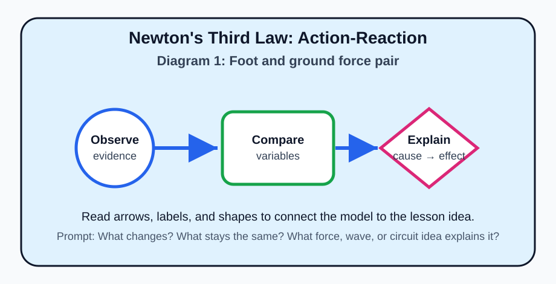
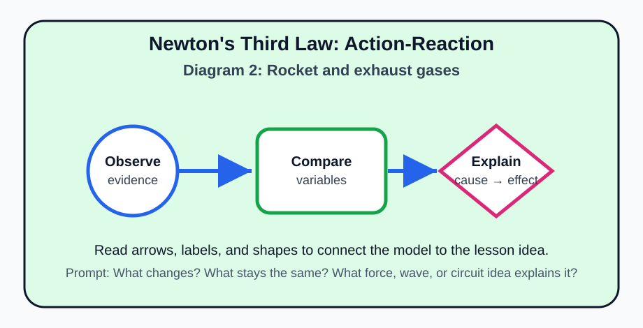
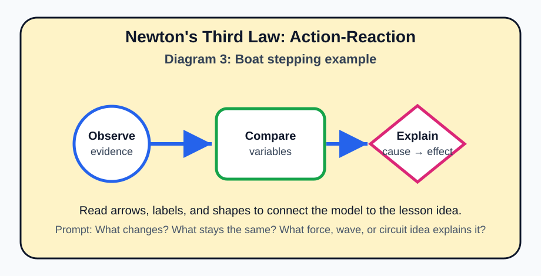
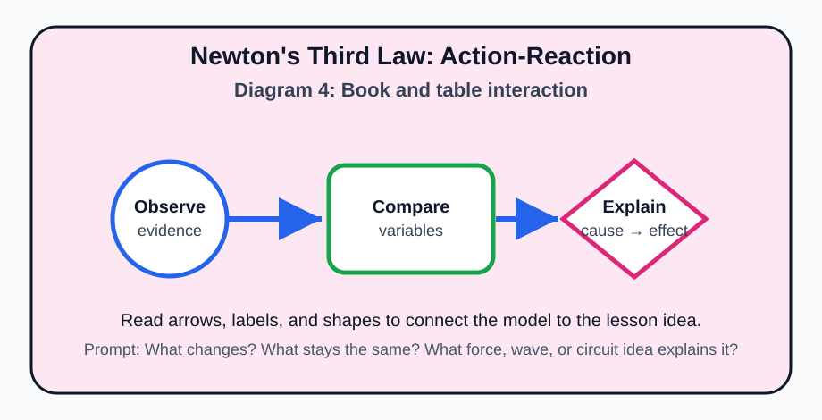
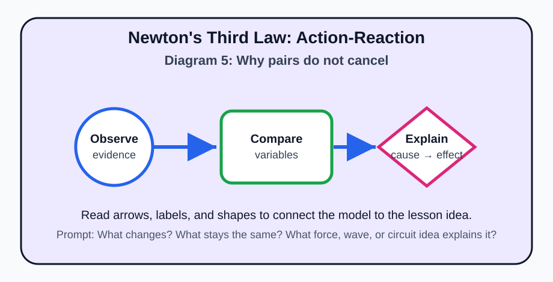

# Newton's Third Law: Action-Reaction

> [!GOAL]
> Build a clear Grade 9 understanding of **action-reaction pairs** using the MATATAG Quarter 1 Physics ideas: forces and motion, electricity, and electromagnetic waves.

## Estimated Time and Difficulty

- **Estimated time:** 50–60 minutes
- **Difficulty:** Intermediate
- **Materials:** notebook, pencil, and safe low-voltage circuit materials only when available. Never use household outlets for experiments.

## What You Should Already Know

- Balanced forces do not change an object's motion, while unbalanced forces can.
- Speed, direction, and motion can be described using words, numbers, arrows, and diagrams.
- Simple circuits need a source, conductors, and a complete path.
- Waves transfer energy from one place to another.

## Quick Readiness Check

1. If two equal forces pull in opposite directions on the same object, what is the net force?
2. What does an arrow usually show in a force or motion diagram?
3. Why is it safer to learn circuits using batteries instead of wall outlets?

## Key Vocabulary

| Term | Meaning |
|---|---|
| **interaction** | two objects exerting forces on each other |
| **action force** | one force in an interaction pair |
| **reaction force** | the equal opposite force in the pair |
| **force pair** | two forces equal in size and opposite in direction on different objects |
| **vector** | a quantity with size and direction |

## Predict Before You Read

Before reading the explanation, predict: **What variable or condition would most change the result in this lesson?** Write one sentence, then compare your idea with the diagrams and examples below.

## Visual Introduction

Use the five diagrams above as a visual map. The first diagram introduces the main model, the middle diagrams compare important variables, and the final diagram asks you to explain the cause-and-effect relationship in your own words.

## Main Concept Explanation

Newton's Third Law says that when object A exerts a force on object B, object B exerts an equal-size force in the opposite direction on object A. The forces do not cancel each other because they act on different objects. Motion still depends on the net force on each separate object.

### Learning Objectives

- State Newton's Third Law.
- Identify action-reaction pairs between two interacting objects.
- Explain why equal opposite forces do not cancel when they act on different objects.
- Apply action-reaction reasoning to rockets, walking, and boats.

> [!NOTE]
> **Key idea:** In Physics, do not only memorize words. Connect each word to a diagram, a cause, and an observable effect.

## Key Idea Box

> [!IMPORTANT]
> The most reliable Physics answer usually names the **system**, identifies the **interaction or wave/circuit condition**, and explains the **change in motion, energy, or signal**.

## Worked Examples

1. Your foot pushes the ground backward; the ground pushes your foot forward so you walk.
2. A rocket pushes gas downward; the gas pushes the rocket upward.
3. You push a wall; the wall pushes back on you with equal force even if the wall does not move.

## Guided Practice

Try these without looking at the answer key first.

1. Draw a simple labeled diagram for this lesson's main idea.
2. Circle the part of the diagram that shows the cause.
3. Underline the part that shows the effect.
4. Write one sentence using at least two vocabulary words from the table.

## Misconception Alerts

- **Common mistake:** Action-reaction forces are equal, but they are not balanced forces on one object. They act on two different objects.
- Do not confuse a description with an explanation. A description says what happens; an explanation says why it happens.
- Check whether forces act on the same object or on different objects before deciding if they cancel.

## Error Analysis

A learner says: “The biggest arrow or most energetic wave is always the correct answer.” This is incomplete. A good Physics explanation must match the **specific situation**. Ask: What object or wave is being studied? What quantity changed? What evidence supports the answer?

## Self-Explanation Prompts

- What would I draw first to explain this topic to someone younger?
- Which vocabulary term is easiest to mix up with another term?
- What everyday example in the Philippines or at home shows this idea?

## Extension Challenge

Design a one-page mini-poster that teaches **action-reaction pairs**. Include one labeled diagram, two vocabulary words, one everyday example, and one safety reminder if electricity or radiation is involved.

## Mastery Checklist

- [ ] I can define the key vocabulary without copying the table.
- [ ] I can interpret each diagram in the Visual Introduction.
- [ ] I can solve or explain a new example using the main idea.
- [ ] I can avoid the misconception listed above.
- [ ] I can answer practice questions before taking the assessment.

## Final Summary

Newton's Third Law: Action-Reaction is part of Grade 9 Quarter 1 Physics because it helps explain force, motion, electrical behavior, or electromagnetic energy. To master it, connect the vocabulary to diagrams and then explain the cause-and-effect relationship in complete sentences.

> [!PRACTICE]
> Complete `practice.json` first. Review every explanation, then take `assessment.json` when you can explain the diagrams without help.
