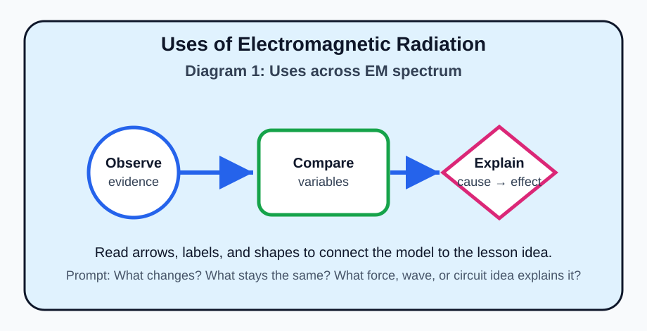
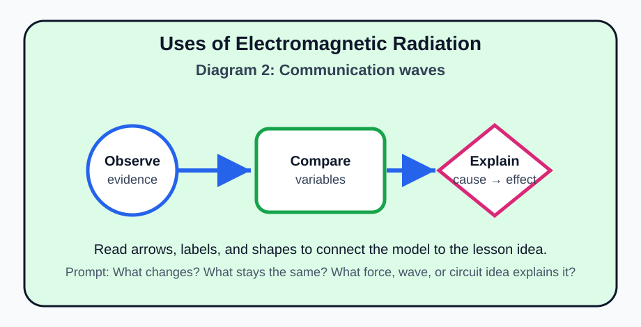
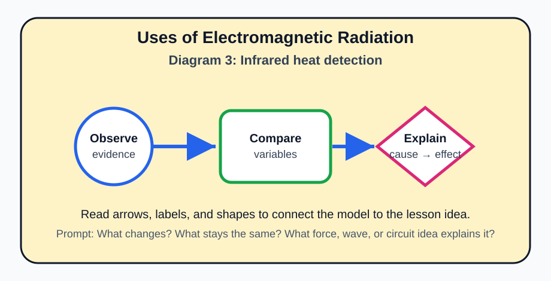
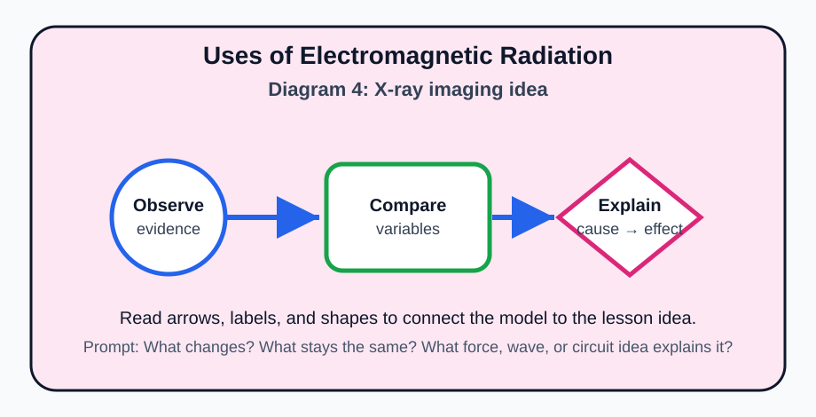
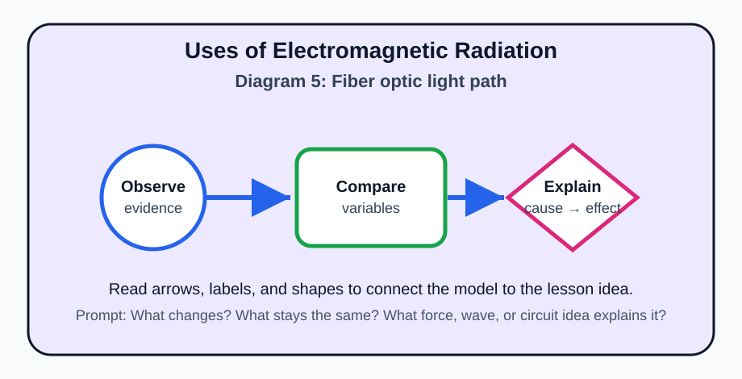

# Uses of Electromagnetic Radiation

> [!GOAL]
> Build a clear Grade 9 understanding of **uses of EM radiation** using the MATATAG Quarter 1 Physics ideas: forces and motion, electricity, and electromagnetic waves.

## Estimated Time and Difficulty

- **Estimated time:** 50–60 minutes
- **Difficulty:** Intermediate
- **Materials:** notebook, pencil, and safe low-voltage circuit materials only when available. Never use household outlets for experiments.

## What You Should Already Know

- Balanced forces do not change an object's motion, while unbalanced forces can.
- Speed, direction, and motion can be described using words, numbers, arrows, and diagrams.
- Simple circuits need a source, conductors, and a complete path.
- Waves transfer energy from one place to another.

## Quick Readiness Check

1. If two equal forces pull in opposite directions on the same object, what is the net force?
2. What does an arrow usually show in a force or motion diagram?
3. Why is it safer to learn circuits using batteries instead of wall outlets?

## Key Vocabulary

| Term | Meaning |
|---|---|
| **telecommunication** | sending information over distance |
| **radar** | using reflected radio or microwave signals to locate objects |
| **infrared** | EM radiation often associated with heat detection |
| **fiber optics** | technology that carries light signals through thin fibers |
| **medical imaging** | using waves such as X-rays to form images inside the body |

## Predict Before You Read

Before reading the explanation, predict: **What variable or condition would most change the result in this lesson?** Write one sentence, then compare your idea with the diagrams and examples below.

## Visual Introduction

Use the five diagrams above as a visual map. The first diagram introduces the main model, the middle diagrams compare important variables, and the final diagram asks you to explain the cause-and-effect relationship in your own words.

## Main Concept Explanation

Different parts of the EM spectrum are useful because they interact with matter in different ways. Radio waves travel long distances for broadcasting. Microwaves are useful for communication and heating food. Infrared can detect heat. Visible light helps us see and can carry information in fiber optics. X-rays can pass through soft tissue but are absorbed more by bone.

### Learning Objectives

- Match EM wave types to common technologies.
- Explain why different wavelengths suit different uses.
- Identify examples in communication, medicine, and daily life.
- Recognize benefits and limits of EM applications.

> [!NOTE]
> **Key idea:** In Physics, do not only memorize words. Connect each word to a diagram, a cause, and an observable effect.

## Key Idea Box

> [!IMPORTANT]
> The most reliable Physics answer usually names the **system**, identifies the **interaction or wave/circuit condition**, and explains the **change in motion, energy, or signal**.

## Worked Examples

1. Wi-Fi and mobile phones use radio/microwave bands to carry information.
2. Remote controls and thermal cameras use infrared.
3. Hospitals use X-rays for bone images and gamma rays in selected cancer treatments.

## Guided Practice

Try these without looking at the answer key first.

1. Draw a simple labeled diagram for this lesson's main idea.
2. Circle the part of the diagram that shows the cause.
3. Underline the part that shows the effect.
4. Write one sentence using at least two vocabulary words from the table.

## Misconception Alerts

- **Common mistake:** A technology is not safe or unsafe only because it is useful. The wave type, intensity, exposure time, and shielding all matter.
- Do not confuse a description with an explanation. A description says what happens; an explanation says why it happens.
- Check whether forces act on the same object or on different objects before deciding if they cancel.

## Error Analysis

A learner says: “The biggest arrow or most energetic wave is always the correct answer.” This is incomplete. A good Physics explanation must match the **specific situation**. Ask: What object or wave is being studied? What quantity changed? What evidence supports the answer?

## Self-Explanation Prompts

- What would I draw first to explain this topic to someone younger?
- Which vocabulary term is easiest to mix up with another term?
- What everyday example in the Philippines or at home shows this idea?

## Extension Challenge

Design a one-page mini-poster that teaches **uses of EM radiation**. Include one labeled diagram, two vocabulary words, one everyday example, and one safety reminder if electricity or radiation is involved.

## Mastery Checklist

- [ ] I can define the key vocabulary without copying the table.
- [ ] I can interpret each diagram in the Visual Introduction.
- [ ] I can solve or explain a new example using the main idea.
- [ ] I can avoid the misconception listed above.
- [ ] I can answer practice questions before taking the assessment.

## Final Summary

Uses of Electromagnetic Radiation is part of Grade 9 Quarter 1 Physics because it helps explain force, motion, electrical behavior, or electromagnetic energy. To master it, connect the vocabulary to diagrams and then explain the cause-and-effect relationship in complete sentences.

> [!PRACTICE]
> Complete `practice.json` first. Review every explanation, then take `assessment.json` when you can explain the diagrams without help.
