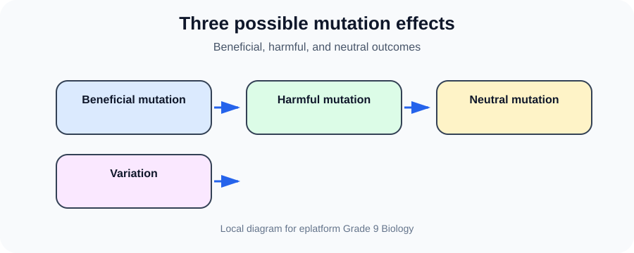
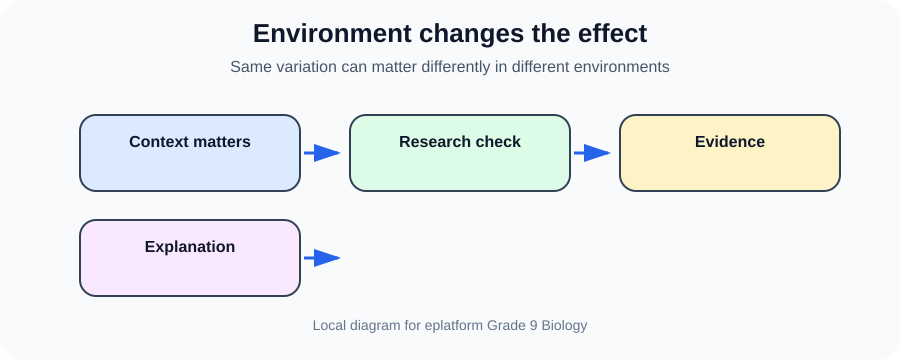
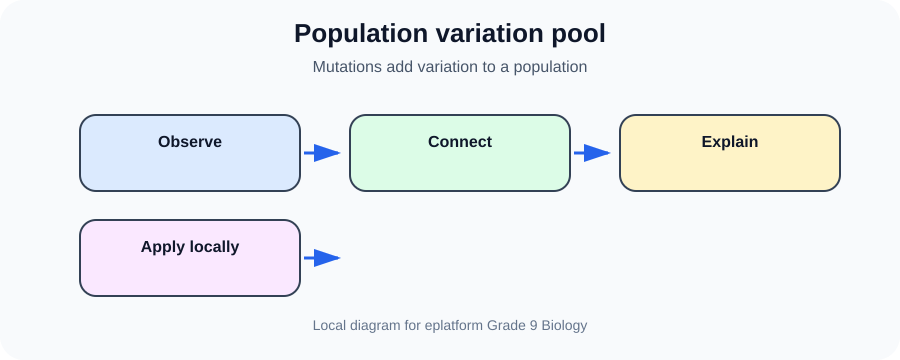

# Effects of Mutations

> [!GOAL] Learning Goal
>
> By the end of this lesson, you should be able to explain beneficial, harmful, and neutral effects of mutations using secondary sources.

## Estimated Time and Difficulty

| Estimated Time | Difficulty | Best Study Setup |
|---|---|---|
| 45-60 minutes | Grade 9 Life Science | Notebook, pen, and space to redraw the diagrams |

## What You Should Already Know

Before starting, recall these ideas from earlier science lessons:

- Offspring inherit genetic information from parents.
- Organisms interact with both living and non-living parts of ecosystems.
- Scientific explanations are stronger when they use models, evidence, and examples.
- Philippine ecosystems include forests, wetlands, mangroves, reefs, and human communities.

## Quick Readiness Check

Answer these in your notebook before reading the explanation.

| Prompt | Your Answer |
|---|---|
| What key word or phrase do you already associate with this topic? | |
| What is one biological or Philippine ecosystem example that may connect to it? | |
| Which diagram below do you think will help you most? | |

After the lesson, return to this table and revise any answer that changed.

## Key Vocabulary

| Term | Student-Friendly Meaning | Example |
|---|---|---|
| **Beneficial mutation** | a DNA change that helps survival or reproduction | A change that helps bacteria survive a chemical |
| **Harmful mutation** | a DNA change that reduces health or survival | A change linked to disease |
| **Neutral mutation** | a DNA change with no noticeable effect | A silent change in a DNA sequence |
| **Variation** | differences among individuals | Variation gives populations more possible responses to change |

## Predict Before You Read

Write a quick prediction for each statement.

1. This lesson can be explained with a labeled model or diagram.
2. Evidence matters more than simply memorizing the title.
3. A local Philippine example can help make the concept concrete.
4. A common misconception can be corrected by tracing cause and effect.

Keep your predictions. Revise them after the worked examples.

## Visual Introduction

*Beneficial, harmful, and neutral outcomes.*

*Same variation can matter differently in different environments.*

*Mutations add variation to a population.*

Use the diagrams actively: cover the labels, explain them aloud, then check whether your explanation matches the lesson vocabulary.

## Main Concept Explanation

Mutations can be beneficial, harmful, or neutral. Their effect depends on what changed, where it happened, and how the change affects survival or function in a particular environment.

The important study move is to connect the vocabulary to a clear relationship. Ask yourself: **What parts are involved? What changes or stays the same? What evidence would show that the idea is correct?**

> [!IMPORTANT] Key Idea Box
>
> Mutations can be beneficial, harmful, or neutral. Their effect depends on what changed, where it happened, and how the change affects survival or function in a particular environment. For this Grade 9 Biology lesson, a strong answer uses correct vocabulary, a labeled diagram, and a relevant example.

## Worked Examples

| Example | Biological Explanation |
|---|---|
| Context matters | A mutation useful in one environment may not help in another. |
| Research check | Use a reliable source to classify an example instead of guessing from the word mutation alone. |

### How to reason through an example

1. Identify the biological level: molecule, cell, organism, population, community, or ecosystem.
2. Identify the key parts or causes.
3. Use a diagram or table to show the relationship.
4. Explain the result using evidence from the situation.

## Guided Practice

Try these without looking back first.

1. Define **Beneficial mutation** in one student-friendly sentence.
2. Choose one diagram and explain what each label means.
3. Connect this lesson to one Philippine organism, ecosystem, or community issue.
4. Write one question you could answer with a reliable secondary source.

## Misconception Alerts

- Mutations are not automatically bad.
- A beneficial mutation is not a planned improvement; it is a change that happens to be useful in a context.

## Error Analysis

A student says: “I can answer this by memorizing only one word from the title.”

**What is wrong with that reasoning?** A one-word answer is not enough. A strong science response defines the term, connects it to a process or relationship, and supports it with a diagram or example.

Improved response frame:

> The key idea is **Beneficial mutation**. It matters because mutations can be beneficial, harmful, or neutral. One example is ________, where ________ leads to ________.

## Self-Explanation Prompts

Write 2-3 sentences for each prompt.

1. How do the three diagrams show different sides of the same lesson?
2. Which vocabulary term is easiest to confuse, and how will you remember it?
3. What local or Philippine example could make this lesson more concrete?

## Extension Challenge

Create your own fourth diagram for this lesson. It may be a flowchart, comparison table, labeled model, or local ecosystem map. Keep the labels short and include one sentence explaining the evidence behind it.

## Mastery Checklist

Before taking the practice exam, confirm that you can:

- [ ] state the main idea in your own words;
- [ ] correctly use at least three vocabulary terms;
- [ ] explain each of the three diagrams;
- [ ] apply the idea to a relevant biological or Philippine ecosystem example;
- [ ] avoid the misconception alerts listed above.

## Final Summary

Effects of Mutations helps you understand Grade 9 Life Science by connecting models, evidence, and local examples. The lesson is not just a vocabulary list: you should be able to explain the relationships shown in the diagrams and use them in a new situation.

## Practice and Assessment

> [!PRACTICE]
>
> Complete `practice.json` first to check your understanding. Then answer `assessment.json` when you can explain the diagrams without looking at the labels.
