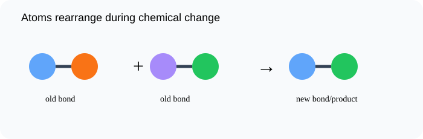

# Bonds and Chemical Change

> [!GOAL]
> Explain chemical change as the breaking of old bonds and the forming of new bonds that rearrange atoms into products.

## Estimated Time and Difficulty

- **Estimated time:** 45 minutes
- **Difficulty:** beginner
- **Module:** Grade 9 Science, Quarter 4 — Science of Materials: Chemical Bonding

## What You Should Already Know

- Atoms make up matter
- Chemical change forms new substances
- Particles can be rearranged

## Quick Readiness Check

Try these before reading. If one feels hard, slow down and use the examples carefully.

1. What is an atom?
2. What is an electron?
3. How can an observation become scientific evidence?

## Key Vocabulary

| Term | Meaning |
|---|---|
| chemical bond | An attraction that holds atoms together. |
| reactant | A starting substance in a chemical reaction. |
| product | A substance formed by a chemical reaction. |
| bond breaking | The separation of atoms that were previously bonded. |
| bond forming | The joining of atoms into a new arrangement. |

## Predict Before You Read

> [!CHECK]
> If atoms are the same before and after a reaction, how can the products have different properties? Predict before reading.

Write a one-sentence prediction in your notebook. Then compare it with the explanation below.

## Visual Introduction

Use the visual as a model. Identify what is being observed, counted, transferred, shared, or compared.

## Main Concept Explanation

### Idea 1: A chemical reaction is not magic

A chemical reaction is not magic. Atoms are rearranged.

### Idea 2: Bonds in reactants break

Bonds in reactants break. Then atoms form new bonds in products.

### Idea 3: Because the atoms are connected in new ways, the products can have properties very different from the reactants

Because the atoms are connected in new ways, the products can have properties very different from the reactants.

### Idea 4: The evidence from Lesson 1—cloudiness, precipitate formation, or gas formation—happens because new bonded structures are made

The evidence from Lesson 1—cloudiness, precipitate formation, or gas formation—happens because new bonded structures are made.

## Key Idea Box

> [!IMPORTANT]
> Explain chemical change as the breaking of old bonds and the forming of new bonds that rearrange atoms into products. In chemistry, strong answers connect **observable evidence** to **particles, electrons, bonds, or structure**.

## Worked Examples

### Simple model

If AB and CD react to form AD and CB, the atoms are conserved but their partners changed.

### Precipitate connection

Clear solutions can form a solid because ions rearrange into a new insoluble bonded structure.

## Guided Practice

Try these on your own before checking the explanations.

1. Name the most important particle, bond, or structure in this lesson.
2. Give one everyday example connected to the lesson.
3. Explain the example using the vocabulary above.

> [!TIP]
> A strong science explanation often follows this pattern: **claim → evidence → particle-level reason**.

## Misconception Alerts

- **Trap:** Atoms are not destroyed during ordinary chemical reactions.
- **Trap:** A product is different because bonds and arrangements change, not because entirely new atoms appear.
- **Trap:** Bond breaking alone is not the whole reaction; new bonds must also form.

## Error Analysis

> [!WARNING]
> A learner says, “The product is different because the atoms disappeared.” The correction: atoms were rearranged into new bonding patterns.

Correct the error by writing one sentence that uses a key vocabulary word.

## Self-Explanation Prompts

Answer these in your notebook:

- What is the main idea of this lesson in 20 words or fewer?
- What evidence, formula, or model supports the idea?
- What mistake should you avoid?
- How does this connect to chemical bonding or properties of materials?

## Extension Challenge

Find one safe household example related to this lesson, such as table salt, sugar, aluminum foil, copper wire, limewater in a demonstration video, or a formula on a product label. Describe what the example shows about particles, bonding, or properties. Do not taste or mix unknown substances.

## Mastery Checklist

Before opening the practice exam, check that you can:

- Explain that reactions involve breaking and forming bonds
- Connect atom rearrangement to new properties
- Use evidence to infer that products differ from reactants
- Explain your reasoning using evidence or a particle-level model.

## Final Summary

Bonds and Chemical Change helps explain the Grade 9 chemistry big idea: atoms form bonds and structures that determine how substances form and behave. To master the lesson, connect the vocabulary to the model, then use evidence or formulas to explain your answer.

## Practice and Assessment

> [!PRACTICE]
> Complete `practice.json` first for low-stakes feedback. Review every explanation, especially for missed questions. When you are ready, complete `assessment.json` as your checkpoint for Chemistry - Lesson 2: Bonds and Chemical Change.
