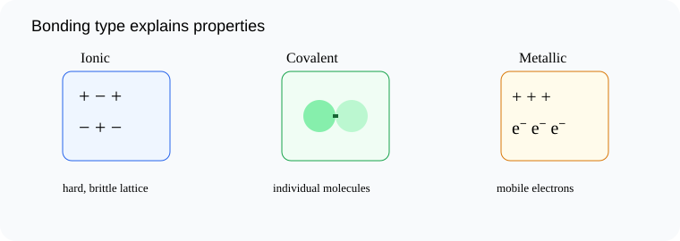

# Comparing the Properties of Ionic, Covalent, and Metallic Substances

> [!GOAL]
> Compare ionic, covalent, and metallic substances by connecting their properties to bonding and structure.

## Estimated Time and Difficulty

- **Estimated time:** 55 minutes
- **Difficulty:** intermediate
- **Module:** Grade 9 Science, Quarter 4 — Science of Materials: Chemical Bonding

## What You Should Already Know

- Ionic bonding and lattices
- Covalent molecules
- Metallic bonding and sea of electrons

## Quick Readiness Check

Try these before reading. If one feels hard, slow down and use the examples carefully.

1. What is an atom?
2. What is an electron?
3. How can an observation become scientific evidence?

## Key Vocabulary

| Term | Meaning |
|---|---|
| property | A characteristic used to describe or identify matter. |
| melting point | Temperature at which a solid becomes liquid. |
| brittle | Breaks or shatters rather than bending. |
| conductivity | Ability to transfer electricity or heat. |
| structure-property relationship | The idea that a substance’s structure explains its properties. |

## Predict Before You Read

> [!CHECK]
> A substance is shiny, bendable, and conducts electricity as a solid. Predict its bonding type.

Write a one-sentence prediction in your notebook. Then compare it with the explanation below.

## Visual Introduction

Use the visual as a model. Identify what is being observed, counted, transferred, shared, or compared.

## Main Concept Explanation

### Idea 1: Ionic substances often have high melting points because strong attractions hold many ions in a lattice

Ionic substances often have high melting points because strong attractions hold many ions in a lattice.

### Idea 2: Solid ionic substances do not conduct well because ions are locked in place

Solid ionic substances do not conduct well because ions are locked in place. When molten or dissolved, ions can move and carry charge.

### Idea 3: Small covalent molecules often have lower melting points and usually do not conduct electricity because they do not have mobile charged particles

Small covalent molecules often have lower melting points and usually do not conduct electricity because they do not have mobile charged particles.

### Idea 4: Metals conduct electricity and heat because electrons are mobile

Metals conduct electricity and heat because electrons are mobile. Metals are often malleable because layers of ions can slide while the electron sea holds them together.

### Idea 5: Everyday examples: table salt is ionic, sugar is covalent, and copper wire is metallic

Everyday examples: table salt is ionic, sugar is covalent, and copper wire is metallic.

## Key Idea Box

> [!IMPORTANT]
> Compare ionic, covalent, and metallic substances by connecting their properties to bonding and structure. In chemistry, strong answers connect **observable evidence** to **particles, electrons, bonds, or structure**.

## Worked Examples

### Salt water

Dissolved salt conducts better than solid salt because ions are free to move.

### Sugar

Sugar is made of covalent molecules and usually does not conduct electricity.

### Copper

Copper conducts as a solid because of mobile electrons.

## Guided Practice

Try these on your own before checking the explanations.

1. Name the most important particle, bond, or structure in this lesson.
2. Give one everyday example connected to the lesson.
3. Explain the example using the vocabulary above.

> [!TIP]
> A strong science explanation often follows this pattern: **claim → evidence → particle-level reason**.

## Misconception Alerts

- **Trap:** Solid salt not conducting does not mean ionic compounds never conduct; molten or dissolved ions can move.
- **Trap:** A low melting point does not automatically mean “weak atoms”; it often reflects weaker attractions between small molecules.
- **Trap:** Metals are not ionic just because they have positive ions; their mobile electron sea is the key.

## Error Analysis

> [!WARNING]
> A learner says solid salt should conduct because it contains ions. The correction: ions in solid salt are locked in place; charged particles must be mobile to conduct.

Correct the error by writing one sentence that uses a key vocabulary word.

## Self-Explanation Prompts

Answer these in your notebook:

- What is the main idea of this lesson in 20 words or fewer?
- What evidence, formula, or model supports the idea?
- What mistake should you avoid?
- How does this connect to chemical bonding or properties of materials?

## Extension Challenge

Find one safe household example related to this lesson, such as table salt, sugar, aluminum foil, copper wire, limewater in a demonstration video, or a formula on a product label. Describe what the example shows about particles, bonding, or properties. Do not taste or mix unknown substances.

## Mastery Checklist

Before opening the practice exam, check that you can:

- Compare properties of ionic, covalent, and metallic substances
- Explain conductivity patterns using particle movement
- Connect structure to melting point and brittleness
- Use evidence to identify likely bonding type
- Explain your reasoning using evidence or a particle-level model.

## Final Summary

Comparing the Properties of Ionic, Covalent, and Metallic Substances helps explain the Grade 9 chemistry big idea: atoms form bonds and structures that determine how substances form and behave. To master the lesson, connect the vocabulary to the model, then use evidence or formulas to explain your answer.

## Practice and Assessment

> [!PRACTICE]
> Complete `practice.json` first for low-stakes feedback. Review every explanation, especially for missed questions. When you are ready, complete `assessment.json` as your checkpoint for Chemistry - Lesson 10: Comparing the Properties of Ionic, Covalent, and Metallic Substances.
