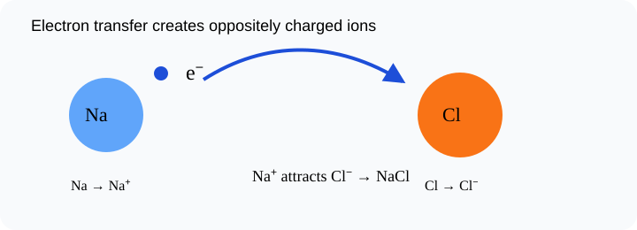

# Ionic Bonding: The Story of Sodium Chloride

> [!GOAL]
> Explain ionic bonding as electron transfer followed by attraction between oppositely charged ions.

## Estimated Time and Difficulty

- **Estimated time:** 50 minutes
- **Difficulty:** beginner
- **Module:** Grade 9 Science, Quarter 4 — Science of Materials: Chemical Bonding

## What You Should Already Know

- Valence electrons
- Cations and anions
- Basic periodic table groups

## Quick Readiness Check

Try these before reading. If one feels hard, slow down and use the examples carefully.

1. What is an atom?
2. What is an electron?
3. How can an observation become scientific evidence?

## Key Vocabulary

| Term | Meaning |
|---|---|
| ionic bond | Attraction between oppositely charged ions. |
| electron transfer | Movement of electrons from one atom to another. |
| sodium chloride | NaCl, common table salt. |
| metal | Element type that often loses electrons. |
| nonmetal | Element type that often gains electrons. |

## Predict Before You Read

> [!CHECK]
> Sodium has 1 valence electron and chlorine has 7. Predict what electron transfer would make both more stable.

Write a one-sentence prediction in your notebook. Then compare it with the explanation below.

## Visual Introduction

Use the visual as a model. Identify what is being observed, counted, transferred, shared, or compared.

## Main Concept Explanation

### Idea 1: An ionic bond begins with electron transfer

An ionic bond begins with electron transfer. A metal atom loses electron(s), and a nonmetal atom gains electron(s).

### Idea 2: In sodium chloride, sodium loses one valence electron and becomes Na⁺

In sodium chloride, sodium loses one valence electron and becomes Na⁺. Chlorine gains that electron and becomes Cl⁻.

### Idea 3: The positive and negative ions attract

The positive and negative ions attract. That electrical attraction is the ionic bond.

### Idea 4: Ionic compounds do not usually exist as one isolated pair only

Ionic compounds do not usually exist as one isolated pair only. They form repeating lattices of many ions.

## Key Idea Box

> [!IMPORTANT]
> Explain ionic bonding as electron transfer followed by attraction between oppositely charged ions. In chemistry, strong answers connect **observable evidence** to **particles, electrons, bonds, or structure**.

## Worked Examples

### NaCl

Na gives one electron to Cl. The resulting Na⁺ and Cl⁻ attract.

### Metal + nonmetal clue

Potassium and chlorine usually form ionic KCl because potassium is a metal and chlorine is a nonmetal.

## Guided Practice

Try these on your own before checking the explanations.

1. Name the most important particle, bond, or structure in this lesson.
2. Give one everyday example connected to the lesson.
3. Explain the example using the vocabulary above.

> [!TIP]
> A strong science explanation often follows this pattern: **claim → evidence → particle-level reason**.

## Misconception Alerts

- **Trap:** The electron is transferred, not shared equally.
- **Trap:** The bond is the attraction between ions, not the electron itself.
- **Trap:** NaCl is neutral overall because the charges balance.

## Error Analysis

> [!WARNING]
> A learner says sodium chloride forms because sodium and chlorine share one electron equally. The correction: NaCl is ionic because sodium transfers an electron to chlorine.

Correct the error by writing one sentence that uses a key vocabulary word.

## Self-Explanation Prompts

Answer these in your notebook:

- What is the main idea of this lesson in 20 words or fewer?
- What evidence, formula, or model supports the idea?
- What mistake should you avoid?
- How does this connect to chemical bonding or properties of materials?

## Extension Challenge

Find one safe household example related to this lesson, such as table salt, sugar, aluminum foil, copper wire, limewater in a demonstration video, or a formula on a product label. Describe what the example shows about particles, bonding, or properties. Do not taste or mix unknown substances.

## Mastery Checklist

Before opening the practice exam, check that you can:

- Describe electron transfer in ionic bonding
- Explain formation of Na⁺ and Cl⁻
- Explain why opposite charges attract
- Identify metal-nonmetal bonding as typically ionic
- Explain your reasoning using evidence or a particle-level model.

## Final Summary

Ionic Bonding: The Story of Sodium Chloride helps explain the Grade 9 chemistry big idea: atoms form bonds and structures that determine how substances form and behave. To master the lesson, connect the vocabulary to the model, then use evidence or formulas to explain your answer.

## Practice and Assessment

> [!PRACTICE]
> Complete `practice.json` first for low-stakes feedback. Review every explanation, especially for missed questions. When you are ready, complete `assessment.json` as your checkpoint for Chemistry - Lesson 5: Ionic Bonding: The Story of Sodium Chloride.
