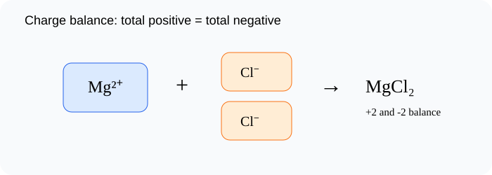

# Writing Formulas and Names of Ionic Compounds

> [!GOAL]
> Write and name simple ionic compounds by balancing ion charges to make a neutral formula.

## Estimated Time and Difficulty

- **Estimated time:** 55 minutes
- **Difficulty:** intermediate
- **Module:** Grade 9 Science, Quarter 4 — Science of Materials: Chemical Bonding

## What You Should Already Know

- Common ion charges
- Cations and anions
- Element symbols

## Quick Readiness Check

Try these before reading. If one feels hard, slow down and use the examples carefully.

1. What is an atom?
2. What is an electron?
3. How can an observation become scientific evidence?

## Key Vocabulary

| Term | Meaning |
|---|---|
| formula | A symbolic representation showing the ratio of atoms or ions. |
| subscript | A small number showing how many of a kind are present. |
| neutral | Having total positive charge equal total negative charge. |
| -ide ending | Naming change for the nonmetal in many binary ionic compounds. |
| ratio | A comparison of amounts, such as 1 Mg²⁺ for 2 Cl⁻. |

## Predict Before You Read

> [!CHECK]
> Magnesium forms Mg²⁺ and chlorine forms Cl⁻. Predict why the formula is MgCl₂ instead of MgCl.

Write a one-sentence prediction in your notebook. Then compare it with the explanation below.

## Visual Introduction

Use the visual as a model. Identify what is being observed, counted, transferred, shared, or compared.

## Main Concept Explanation

### Idea 1: An ionic compound formula shows the simplest whole-number ratio of ions that makes total charge zero

An ionic compound formula shows the simplest whole-number ratio of ions that makes total charge zero.

### Idea 2: Na⁺ and Cl⁻ balance 1-to-1, so the formula is NaCl

Na⁺ and Cl⁻ balance 1-to-1, so the formula is NaCl.

### Idea 3: Mg²⁺ and O²⁻ balance 1-to-1, so the formula is MgO

Mg²⁺ and O²⁻ balance 1-to-1, so the formula is MgO.

### Idea 4: Mg²⁺ needs two Cl⁻ ions to balance +2 with -2, so the formula is MgCl₂

Mg²⁺ needs two Cl⁻ ions to balance +2 with -2, so the formula is MgCl₂.

### Idea 5: For naming simple binary ionic compounds, write the metal name first, then change the nonmetal ending to -ide: magnesium chloride, sodium chloride, magnesium oxide

For naming simple binary ionic compounds, write the metal name first, then change the nonmetal ending to -ide: magnesium chloride, sodium chloride, magnesium oxide.

## Key Idea Box

> [!IMPORTANT]
> Write and name simple ionic compounds by balancing ion charges to make a neutral formula. In chemistry, strong answers connect **observable evidence** to **particles, electrons, bonds, or structure**.

## Worked Examples

### Magnesium chloride

Mg²⁺ plus two Cl⁻ gives MgCl₂.

### Magnesium oxide

Mg²⁺ plus O²⁻ gives MgO.

### Potassium chloride

K⁺ plus Cl⁻ gives KCl.

## Guided Practice

Try these on your own before checking the explanations.

1. Name the most important particle, bond, or structure in this lesson.
2. Give one everyday example connected to the lesson.
3. Explain the example using the vocabulary above.

> [!TIP]
> A strong science explanation often follows this pattern: **claim → evidence → particle-level reason**.

## Misconception Alerts

- **Trap:** Do not write charges in the final formula for a neutral compound.
- **Trap:** The subscript 2 in MgCl₂ applies only to chlorine.
- **Trap:** Do not change the metal name; change the nonmetal ending to -ide.

## Error Analysis

> [!WARNING]
> A learner writes MgCl because there is one magnesium and one chlorine name. The correction: formulas are based on charge balance, so Mg²⁺ needs two Cl⁻ ions.

Correct the error by writing one sentence that uses a key vocabulary word.

## Self-Explanation Prompts

Answer these in your notebook:

- What is the main idea of this lesson in 20 words or fewer?
- What evidence, formula, or model supports the idea?
- What mistake should you avoid?
- How does this connect to chemical bonding or properties of materials?

## Extension Challenge

Find one safe household example related to this lesson, such as table salt, sugar, aluminum foil, copper wire, limewater in a demonstration video, or a formula on a product label. Describe what the example shows about particles, bonding, or properties. Do not taste or mix unknown substances.

## Mastery Checklist

Before opening the practice exam, check that you can:

- Write simple ionic formulas from ion charges
- Explain why ionic formulas are neutral
- Name simple ionic compounds using metal name plus nonmetal -ide
- Interpret formulas such as NaCl, MgO, KCl, and MgCl₂
- Explain your reasoning using evidence or a particle-level model.

## Final Summary

Writing Formulas and Names of Ionic Compounds helps explain the Grade 9 chemistry big idea: atoms form bonds and structures that determine how substances form and behave. To master the lesson, connect the vocabulary to the model, then use evidence or formulas to explain your answer.

## Practice and Assessment

> [!PRACTICE]
> Complete `practice.json` first for low-stakes feedback. Review every explanation, especially for missed questions. When you are ready, complete `assessment.json` as your checkpoint for Chemistry - Lesson 6: Writing Formulas and Names of Ionic Compounds.
