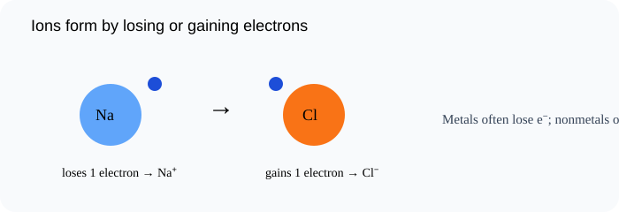

# Ions: Losing and Gaining Electrons

> [!GOAL]
> Predict whether atoms form positive or negative ions by losing or gaining electrons.

## Estimated Time and Difficulty

- **Estimated time:** 45 minutes
- **Difficulty:** beginner
- **Module:** Grade 9 Science, Quarter 4 — Science of Materials: Chemical Bonding

## What You Should Already Know

- Electrons are negatively charged
- Atoms have protons and electrons
- Valence electrons affect bonding

## Quick Readiness Check

Try these before reading. If one feels hard, slow down and use the examples carefully.

1. What is an atom?
2. What is an electron?
3. How can an observation become scientific evidence?

## Key Vocabulary

| Term | Meaning |
|---|---|
| ion | An atom or group of atoms with an electric charge. |
| cation | A positive ion formed when electrons are lost. |
| anion | A negative ion formed when electrons are gained. |
| electron transfer | Movement of electrons from one atom to another. |
| charge | The electrical imbalance caused by gaining or losing electrons. |

## Predict Before You Read

> [!CHECK]
> If a neutral atom loses two electrons, predict whether its charge becomes positive or negative.

Write a one-sentence prediction in your notebook. Then compare it with the explanation below.

## Visual Introduction

Use the visual as a model. Identify what is being observed, counted, transferred, shared, or compared.

## Main Concept Explanation

### Idea 1: An ion forms when an atom gains or loses electrons

An ion forms when an atom gains or loses electrons. Protons do not change in ordinary ion formation.

### Idea 2: Losing electrons leaves more protons than electrons, so the atom becomes positive

Losing electrons leaves more protons than electrons, so the atom becomes positive. This is a cation.

### Idea 3: Gaining electrons gives more electrons than protons, so the atom becomes negative

Gaining electrons gives more electrons than protons, so the atom becomes negative. This is an anion.

### Idea 4: Metals often lose electrons

Metals often lose electrons. Nonmetals often gain electrons. Both patterns can help atoms reach a stable outer shell.

## Key Idea Box

> [!IMPORTANT]
> Predict whether atoms form positive or negative ions by losing or gaining electrons. In chemistry, strong answers connect **observable evidence** to **particles, electrons, bonds, or structure**.

## Worked Examples

### Sodium

Na loses 1 electron to form Na⁺.

### Chlorine

Cl gains 1 electron to form Cl⁻.

### Magnesium

Mg loses 2 electrons to form Mg²⁺.

## Guided Practice

Try these on your own before checking the explanations.

1. Name the most important particle, bond, or structure in this lesson.
2. Give one everyday example connected to the lesson.
3. Explain the example using the vocabulary above.

> [!TIP]
> A strong science explanation often follows this pattern: **claim → evidence → particle-level reason**.

## Misconception Alerts

- **Trap:** Losing a negative electron makes an atom more positive, not more negative.
- **Trap:** Ions form by changing electron number, not proton number.
- **Trap:** A positive ion is not “missing atoms”; it has an electron imbalance.

## Error Analysis

> [!WARNING]
> A learner says an atom that loses electrons becomes negative. The correction: losing negative charges makes the ion positive.

Correct the error by writing one sentence that uses a key vocabulary word.

## Self-Explanation Prompts

Answer these in your notebook:

- What is the main idea of this lesson in 20 words or fewer?
- What evidence, formula, or model supports the idea?
- What mistake should you avoid?
- How does this connect to chemical bonding or properties of materials?

## Extension Challenge

Find one safe household example related to this lesson, such as table salt, sugar, aluminum foil, copper wire, limewater in a demonstration video, or a formula on a product label. Describe what the example shows about particles, bonding, or properties. Do not taste or mix unknown substances.

## Mastery Checklist

Before opening the practice exam, check that you can:

- Define ion, cation, and anion
- Explain how electron loss creates positive ions
- Explain how electron gain creates negative ions
- Predict common ion charges for simple metals and nonmetals
- Explain your reasoning using evidence or a particle-level model.

## Final Summary

Ions: Losing and Gaining Electrons helps explain the Grade 9 chemistry big idea: atoms form bonds and structures that determine how substances form and behave. To master the lesson, connect the vocabulary to the model, then use evidence or formulas to explain your answer.

## Practice and Assessment

> [!PRACTICE]
> Complete `practice.json` first for low-stakes feedback. Review every explanation, especially for missed questions. When you are ready, complete `assessment.json` as your checkpoint for Chemistry - Lesson 4: Ions: Losing and Gaining Electrons.
