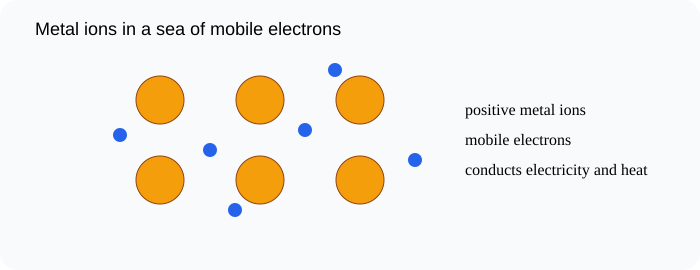

# Metallic Bonding and Structures

> [!GOAL]
> Use the sea of electrons model to explain metallic bonding, conductivity, and malleability.

## Estimated Time and Difficulty

- **Estimated time:** 50 minutes
- **Difficulty:** intermediate
- **Module:** Grade 9 Science, Quarter 4 — Science of Materials: Chemical Bonding

## What You Should Already Know

- Valence electrons
- Ions and lattices
- Covalent molecules

## Quick Readiness Check

Try these before reading. If one feels hard, slow down and use the examples carefully.

1. What is an atom?
2. What is an electron?
3. How can an observation become scientific evidence?

## Key Vocabulary

| Term | Meaning |
|---|---|
| metallic bond | Attraction between positive metal ions and mobile valence electrons. |
| sea of electrons | A shared pool of mobile electrons in a metal. |
| lattice | A repeating arrangement of particles. |
| conductivity | Ability to transfer electricity or heat. |
| malleable | Can be hammered or bent into shape without shattering. |

## Predict Before You Read

> [!CHECK]
> Copper wire conducts electricity even as a solid. Predict what must be mobile inside the metal.

Write a one-sentence prediction in your notebook. Then compare it with the explanation below.

## Visual Introduction

Use the visual as a model. Identify what is being observed, counted, transferred, shared, or compared.

## Main Concept Explanation

### Idea 1: In metallic bonding, metal atoms release valence electrons into a shared pool

In metallic bonding, metal atoms release valence electrons into a shared pool.

### Idea 2: The metal becomes a lattice of positive metal ions surrounded by mobile electrons

The metal becomes a lattice of positive metal ions surrounded by mobile electrons.

### Idea 3: The mobile electrons can move through the structure, explaining electrical and thermal conductivity

The mobile electrons can move through the structure, explaining electrical and thermal conductivity.

### Idea 4: Metal layers can slide while the electron sea continues to hold the ions together, explaining malleability

Metal layers can slide while the electron sea continues to hold the ions together, explaining malleability.

### Idea 5: Ionic compounds form crystalline lattices, covalent compounds often form individual molecules, and metals form lattices in a sea of electrons

Ionic compounds form crystalline lattices, covalent compounds often form individual molecules, and metals form lattices in a sea of electrons.

## Key Idea Box

> [!IMPORTANT]
> Use the sea of electrons model to explain metallic bonding, conductivity, and malleability. In chemistry, strong answers connect **observable evidence** to **particles, electrons, bonds, or structure**.

## Worked Examples

### Copper wire

Mobile electrons move through copper, allowing electric current.

### Aluminum foil

Layers of metal ions can shift, so aluminum can be shaped without shattering.

## Guided Practice

Try these on your own before checking the explanations.

1. Name the most important particle, bond, or structure in this lesson.
2. Give one everyday example connected to the lesson.
3. Explain the example using the vocabulary above.

> [!TIP]
> A strong science explanation often follows this pattern: **claim → evidence → particle-level reason**.

## Misconception Alerts

- **Trap:** Metals do not conduct because atoms fly through the wire; mobile electrons carry charge.
- **Trap:** Malleability does not mean weak bonding; the electron sea still holds the structure together.
- **Trap:** Metallic bonding is different from ionic and covalent bonding.

## Error Analysis

> [!WARNING]
> A learner says metals conduct because positive ions move freely through the solid. The correction: the mobile electrons move; the positive ions remain in a lattice.

Correct the error by writing one sentence that uses a key vocabulary word.

## Self-Explanation Prompts

Answer these in your notebook:

- What is the main idea of this lesson in 20 words or fewer?
- What evidence, formula, or model supports the idea?
- What mistake should you avoid?
- How does this connect to chemical bonding or properties of materials?

## Extension Challenge

Find one safe household example related to this lesson, such as table salt, sugar, aluminum foil, copper wire, limewater in a demonstration video, or a formula on a product label. Describe what the example shows about particles, bonding, or properties. Do not taste or mix unknown substances.

## Mastery Checklist

Before opening the practice exam, check that you can:

- Describe metallic bonding using the sea of electrons model
- Explain why metals conduct heat and electricity
- Explain why metals are malleable
- Compare metallic, ionic, and covalent structures
- Explain your reasoning using evidence or a particle-level model.

## Final Summary

Metallic Bonding and Structures helps explain the Grade 9 chemistry big idea: atoms form bonds and structures that determine how substances form and behave. To master the lesson, connect the vocabulary to the model, then use evidence or formulas to explain your answer.

## Practice and Assessment

> [!PRACTICE]
> Complete `practice.json` first for low-stakes feedback. Review every explanation, especially for missed questions. When you are ready, complete `assessment.json` as your checkpoint for Chemistry - Lesson 9: Metallic Bonding and Structures.
