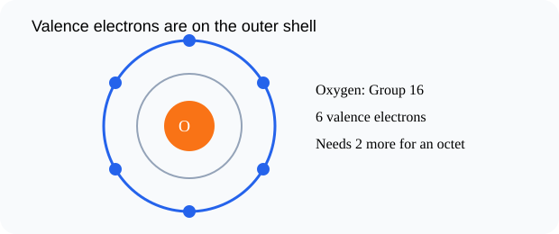

# Valence Electrons Revisited

> [!GOAL]
> Use valence electrons and periodic table groups to predict how atoms may form bonds.

## Estimated Time and Difficulty

- **Estimated time:** 45 minutes
- **Difficulty:** beginner
- **Module:** Grade 9 Science, Quarter 4 — Science of Materials: Chemical Bonding

## What You Should Already Know

- Atoms have electrons in shells
- The periodic table has groups and periods
- Elements in the same group often behave similarly

## Quick Readiness Check

Try these before reading. If one feels hard, slow down and use the examples carefully.

1. What is an atom?
2. What is an electron?
3. How can an observation become scientific evidence?

## Key Vocabulary

| Term | Meaning |
|---|---|
| valence electron | An electron in the outermost shell of an atom. |
| outer shell | The farthest occupied electron shell. |
| group | A vertical column in the periodic table. |
| octet | A stable arrangement with eight valence electrons for many atoms. |
| stable | Less likely to react because the outer shell is full or complete. |

## Predict Before You Read

> [!CHECK]
> Oxygen is in Group 16. Predict how many valence electrons it has and why that matters for bonding.

Write a one-sentence prediction in your notebook. Then compare it with the explanation below.

## Visual Introduction

Use the visual as a model. Identify what is being observed, counted, transferred, shared, or compared.

## Main Concept Explanation

### Idea 1: Valence electrons are the electrons in the outermost shell

Valence electrons are the electrons in the outermost shell. They are the electrons most involved in bonding.

### Idea 2: For many main-group elements, the group number helps identify valence electrons: Group 1 has 1, Group 2 has 2, Group 16 has 6, and Group 17 has 7

For many main-group elements, the group number helps identify valence electrons: Group 1 has 1, Group 2 has 2, Group 16 has 6, and Group 17 has 7.

### Idea 3: Atoms often form bonds to reach a more stable outer shell

Atoms often form bonds to reach a more stable outer shell. For many atoms, this means eight valence electrons, called an octet.

### Idea 4: Sodium has 1 valence electron and tends to lose it

Sodium has 1 valence electron and tends to lose it. Chlorine has 7 and tends to gain or share one.

## Key Idea Box

> [!IMPORTANT]
> Use valence electrons and periodic table groups to predict how atoms may form bonds. In chemistry, strong answers connect **observable evidence** to **particles, electrons, bonds, or structure**.

## Worked Examples

### Oxygen

Oxygen is in Group 16, so it has 6 valence electrons.

### Sodium and chlorine

Sodium has 1 valence electron; chlorine has 7. This sets up electron transfer in ionic bonding.

## Guided Practice

Try these on your own before checking the explanations.

1. Name the most important particle, bond, or structure in this lesson.
2. Give one everyday example connected to the lesson.
3. Explain the example using the vocabulary above.

> [!TIP]
> A strong science explanation often follows this pattern: **claim → evidence → particle-level reason**.

## Misconception Alerts

- **Trap:** All electrons do not participate equally in bonding; valence electrons matter most.
- **Trap:** The group number rule is most useful for main-group elements, not every transition metal detail.
- **Trap:** Atoms do not “want” like people; this is shorthand for becoming more stable.

## Error Analysis

> [!WARNING]
> A learner says oxygen has 16 valence electrons because it is Group 16. The correction: for main-group elements in Group 16, oxygen has 6 valence electrons.

Correct the error by writing one sentence that uses a key vocabulary word.

## Self-Explanation Prompts

Answer these in your notebook:

- What is the main idea of this lesson in 20 words or fewer?
- What evidence, formula, or model supports the idea?
- What mistake should you avoid?
- How does this connect to chemical bonding or properties of materials?

## Extension Challenge

Find one safe household example related to this lesson, such as table salt, sugar, aluminum foil, copper wire, limewater in a demonstration video, or a formula on a product label. Describe what the example shows about particles, bonding, or properties. Do not taste or mix unknown substances.

## Mastery Checklist

Before opening the practice exam, check that you can:

- Define valence electron
- Use main-group positions to infer valence electrons
- Explain why valence electrons matter in bonding
- Explain your reasoning using evidence or a particle-level model.

## Final Summary

Valence Electrons Revisited helps explain the Grade 9 chemistry big idea: atoms form bonds and structures that determine how substances form and behave. To master the lesson, connect the vocabulary to the model, then use evidence or formulas to explain your answer.

## Practice and Assessment

> [!PRACTICE]
> Complete `practice.json` first for low-stakes feedback. Review every explanation, especially for missed questions. When you are ready, complete `assessment.json` as your checkpoint for Chemistry - Lesson 3: Valence Electrons Revisited.
